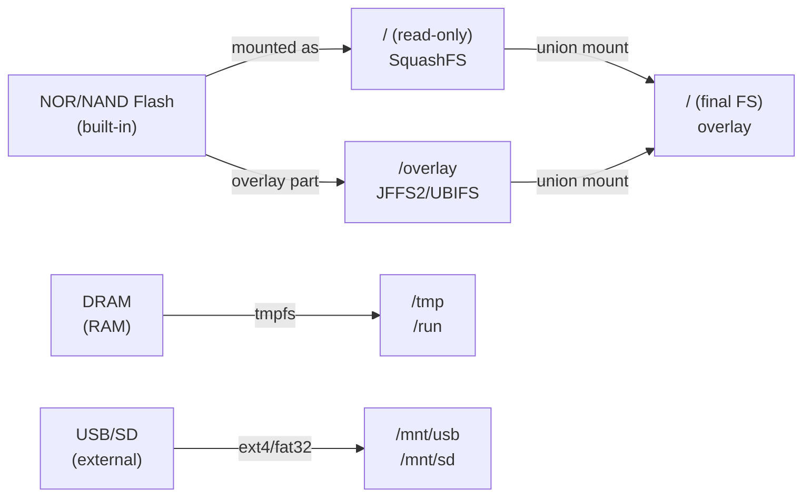

# Level 7: Persistence — Detailed Theory

## Introduction: The "Amnesia Broker" Problem

Imagine a smart home with a dozen sensors: temperature, humidity, motion, lock states.
All devices publish state via MQTT. You reboot the router running Mosquitto — and the
control panel shows empty values. Sensors only update when they send new data.
For a temperature sensor that publishes once a minute, that's 60 seconds of uncertainty.

This is the "amnesia broker" — a broker without persistence. It remembers nothing.

Persistence solves this by storing broker state in a file on disk. After restart, the broker
loads the saved state and continues as if nothing happened.

---

## 1. What is persistence and what gets saved

### The mosquitto.db file

Mosquitto uses its own binary format for storing the database. The `mosquitto.db` file
contains several types of data:

**Retained messages** — the main reason to use persistence. When a retained message is published,
Mosquitto saves it and sends it to every new subscriber. Without persistence, retained messages
disappear when the broker restarts.

```bash
# Publish a retained message
mosquitto_pub -t "home/temp" -m "22.5" -r

# Without persistence: after broker restart, the subscriber receives nothing
# With persistence: the subscriber immediately receives "22.5"
```

**Persistent client sessions** — a client connecting with `clean_session=false` creates
a "persistent session". The broker remembers its subscriptions and accumulates QoS 1/2 messages while
the client is offline. Upon reconnect, the client receives all accumulated messages.

**QoS 1/2 queues** — messages awaiting delivery confirmation. If a client disconnects
before receiving a QoS 1 message, the broker holds it in the queue. Without persistence, the queue disappears
on restart.

**Incomplete QoS 2 transactions** — QoS 2 uses a four-step handshake (PUBLISH →
PUBREC → PUBREL → PUBCOMP). Incomplete transactions are saved to guarantee exactly-once
delivery.

| Data Type | Persisted? | Reason |
|------------|:---:|---------|
| Retained messages | ✅ | Key function of persistence |
| QoS 1/2 subscriptions | ✅ | Part of persistent session |
| QoS 1/2 queues | ✅ | Guaranteed delivery |
| QoS 2 transactions | ✅ | Exactly-once guarantee |
| QoS 0 messages | ❌ | Fire-and-forget by definition |
| Active connections | ❌ | Re-established on reconnect |
| Statistics ($SYS) | ❌ | Recalculated after start |

---

## 2. Persistence configuration

### Minimal setup

```conf
# /etc/mosquitto/mosquitto.conf

persistence true
persistence_location /var/lib/mosquitto/
```

These two lines are enough for basic operation. Mosquitto will create the file
`/var/lib/mosquitto/mosquitto.db` and save it every 1800 seconds (30 minutes by default).

### Full configuration

```conf
persistence true
persistence_location /var/lib/mosquitto/

# Autosave interval in seconds
# 0 = save only on clean shutdown (mosquitto stop)
# 300 = every 5 minutes (recommended compromise)
autosave_interval 300

# Save on every retained/subscription change
# true = lots of disk writes (dangerous for flash!)
# false = conserve flash resources
autosave_on_changes false
```

### Directory initialization

```bash
# Create directory and set permissions
mkdir -p /var/lib/mosquitto
chown mosquitto:mosquitto /var/lib/mosquitto
chmod 750 /var/lib/mosquitto

# Verify
ls -la /var/lib/mosquitto/
```

---

## 3. Storage specifics on OpenWRT

### OpenWRT memory architecture



OpenWRT uses a union mount: a writable overlay (JFFS2 or UBIFS) sits on top of a read-only squashfs.
All filesystem changes (package installs, configs) are written to the overlay.

### /tmp — tmpfs

tmpfs stores data exclusively in RAM. After a reboot or power loss — data
disappears. Size is limited by the router's available memory.

```bash
df -h /tmp
# Filesystem      Size  Used Avail Use% Mounted on
# tmpfs            62M  1.1M   61M   2% /tmp
```

> ❌ Using `/tmp` as `persistence_location` is pointless. After reboot,
> `mosquitto.db` will disappear, and persistence won't fulfill its purpose.

### /overlay — JFFS2/UBIFS

JFFS2 (or UBIFS on NAND flash) is a journaling file system with wear-leveling. Data
survives reboots. However, flash memory has limited endurance.

**Wear-leveling** — an algorithm that distributes write operations evenly across all chip blocks.
Without it, some blocks would wear out faster than others. With wear-leveling, all blocks wear
approximately equally, maximizing chip lifespan.

**Typical router flash characteristics:**
- Capacity: 4-16 MB
- NAND endurance: ~100,000 write cycles per block
- NOR endurance: ~10,000 cycles (worse!)

**Wear calculation:**

Assume: `autosave_interval 300`, `mosquitto.db` size ~10 KB.
- Writes per day: 86400 / 300 = 288
- Data per day: 288 × 10 KB = 2880 KB ≈ 2.8 MB
- With 4 MB flash and wear-leveling: 100,000 × 4 MB / (2.8 MB × 365) ≈ **391 years**

With `autosave_on_changes true` under active use (1000 retained updates/day × 10 KB):
- 1000 × 10 KB = 10 MB/day
- 100,000 × 4 MB / (10 MB × 365) ≈ **110 years**

In both cases the endurance is sufficient, but to minimize risk it's still recommended to use
`autosave_on_changes false` and an interval of at least 300 seconds.

### /mnt/usb or /mnt/sd — external media

The best option for production: a USB flash drive or SD card with ext4 filesystem.

```bash
# Install USB storage support
opkg update
opkg install kmod-usb-storage kmod-usb2 block-mount kmod-fs-ext4 e2fsprogs

# Format USB as ext4 (do this once)
mkfs.ext4 /dev/sda1

# Configure automount
block detect > /etc/config/fstab
# Edit /etc/config/fstab — add option enabled '1'
# and option target '/mnt/usb' for the relevant device

uci commit fstab
/etc/init.d/fstab restart

# Create directory for Mosquitto
mkdir -p /mnt/usb/mosquitto
chown mosquitto:mosquitto /mnt/usb/mosquitto
```

```conf
# mosquitto.conf
persistence true
persistence_location /mnt/usb/mosquitto/
autosave_interval 300
```

---

## 4. Forced save: SIGUSR1

Mosquitto supports UNIX signals for management without restart:

| Signal | Action |
|--------|---------|
| `SIGUSR1` | Immediately save database to disk |
| `SIGUSR2` | Print statistics to log (if log_type all) |
| `SIGHUP` | Reload configuration (in Mosquitto 1.x) |
| `SIGTERM` | Clean shutdown with DB save |

```bash
# Method 1: via PID file
kill -USR1 $(cat /var/run/mosquitto.pid)

# Method 2: via pgrep
kill -USR1 $(pgrep -x mosquitto)

# Method 3: via mosquitto_ctrl (Mosquitto 2.x)
# mosquitto_ctrl does not support SIGUSR1 directly, use kill
```

> 💡 Always send SIGUSR1 before creating a backup! Mosquitto keeps some data in
> memory buffers and doesn't immediately write it to disk. SIGUSR1 guarantees a full flush.

---

## 5. Backup strategy

### What to include in backup

```
/var/lib/mosquitto/mosquitto.db   # Database
/etc/mosquitto/mosquitto.conf      # Main config
/etc/mosquitto/certs/              # TLS certificates
/etc/mosquitto/passwd              # Password file
/etc/mosquitto/acl                 # ACL rules
```

### Rotation strategy

Backups accumulate. For OpenWRT with limited space, it's reasonable to keep:
- 7 daily backups
- 4 weekly backups
- 3 monthly backups

```sh
# Keep only the last 7 backups
ls -t /mnt/usb/backups/mqtt_*.tar.gz | tail -n +8 | xargs rm -f
```

### Full backup script

```sh
#!/bin/sh
# /usr/bin/mqtt-backup.sh
# Usage: run manually or via cron

BACKUP_DIR="/mnt/usb/backups/mosquitto"
RETAIN_COUNT=7
DATE=$(date +%Y%m%d_%H%M%S)
BACKUP_FILE="$BACKUP_DIR/mosquitto_$DATE.tar.gz"

# Check mount point
if ! mountpoint -q /mnt/usb; then
  logger -t mqtt-backup "ERROR: /mnt/usb not mounted"
  exit 1
fi

mkdir -p "$BACKUP_DIR"

# Flush buffers to disk
MQTT_PID=$(cat /var/run/mosquitto.pid 2>/dev/null)
if [ -n "$MQTT_PID" ]; then
  kill -USR1 "$MQTT_PID"
  sleep 2
fi

# Create archive
tar czf "$BACKUP_FILE" \
  /var/lib/mosquitto/mosquitto.db \
  /etc/mosquitto/ 2>/dev/null

SIZE=$(du -h "$BACKUP_FILE" | cut -f1)
logger -t mqtt-backup "Created $BACKUP_FILE ($SIZE)"

# Rotation
ls -t "$BACKUP_DIR"/mosquitto_*.tar.gz | \
  tail -n +"$((RETAIN_COUNT + 1))" | \
  xargs -r rm -f
```

### Restore

```sh
#!/bin/sh
# /usr/bin/mqtt-restore.sh
BACKUP_FILE="$1"

if [ ! -f "$BACKUP_FILE" ]; then
  echo "File not found: $BACKUP_FILE"
  exit 1
fi

# Stop broker
service mosquitto stop

# Save current state (just in case)
SAFE_BACKUP="/tmp/mosquitto_pre_restore_$(date +%H%M%S).tar.gz"
tar czf "$SAFE_BACKUP" /var/lib/mosquitto/ /etc/mosquitto/ 2>/dev/null
echo "Previous state saved to $SAFE_BACKUP"

# Restore
tar xzf "$BACKUP_FILE" -C /
chown -R mosquitto:mosquitto /var/lib/mosquitto/
chown -R mosquitto:mosquitto /etc/mosquitto/

# Start
service mosquitto start
echo "Done. Check: logread | grep mosquitto"
```

---

## ⚠️ Common beginner mistakes

### 🐛 1. persistence_location points to /tmp

```conf
# ❌ Completely pointless!
persistence true
persistence_location /tmp/mosquitto/
```

> **Why this is a mistake:** /tmp is tmpfs (RAM). After reboot, the file disappears. Persistence
> loses all meaning — it's the same as not enabling it at all.

```conf
# ✅ Use persistent storage
persistence true
persistence_location /var/lib/mosquitto/
```

### 🐛 2. Directory not created beforehand

```
[1657891234] Error: Unable to open database file.
```

> **Why this is a mistake:** Mosquitto doesn't create the directory automatically. If it doesn't exist —
> it won't start with persistence enabled.

```bash
# ✅ Create before launch
mkdir -p /var/lib/mosquitto
chown mosquitto:mosquitto /var/lib/mosquitto
```

### 🐛 3. DB backup without SIGUSR1

```bash
# ❌ Copying DB "on the fly" without signal
cp /var/lib/mosquitto/mosquitto.db /tmp/backup.db
```

> **Why this is a mistake:** Mosquitto doesn't immediately write all changes to disk. The file on disk
> may contain stale data. SIGUSR1 forces the broker to flush buffers.

```bash
# ✅ Signal first, then backup
kill -USR1 $(cat /var/run/mosquitto.pid) && sleep 2
cp /var/lib/mosquitto/mosquitto.db /tmp/backup.db
```

### 🐛 4. autosave_on_changes true on flash without assessing load

```conf
# ❌ Can lead to tens of thousands of writes per day
persistence true
persistence_location /overlay/mosquitto/
autosave_on_changes true
```

> **Why this is a mistake:** with intensive use of retained topics (e.g., 100+
> devices publishing retained every minute) this means thousands of writes per day. Flash endurance
> is finite, though wear-leveling handles typical loads well.

```conf
# ✅ Controlled interval-based saving
autosave_interval 600
autosave_on_changes false
```

---

## 📌 Summary

| Parameter | Value | Purpose |
|----------|---------|-----------|
| `persistence true` | — | Enable disk persistence |
| `persistence_location` | `/var/lib/mosquitto/` | Directory for mosquitto.db |
| `autosave_interval` | `300` | Save every 5 minutes |
| `autosave_on_changes` | `false` | Conserve flash resources |

**Storage priority for OpenWRT:**
1. `/mnt/usb/mosquitto/` — USB/SD with ext4 (best option)
2. `/overlay/upper/mosquitto/` — built-in flash (acceptable)
3. `/tmp/` — never!

- ✅ Always use SIGUSR1 before backup
- ✅ Set up cron for daily automated backups
- ✅ Store backups on external media, not on the router
- ❌ Don't use persistence_location on tmpfs (/tmp)
