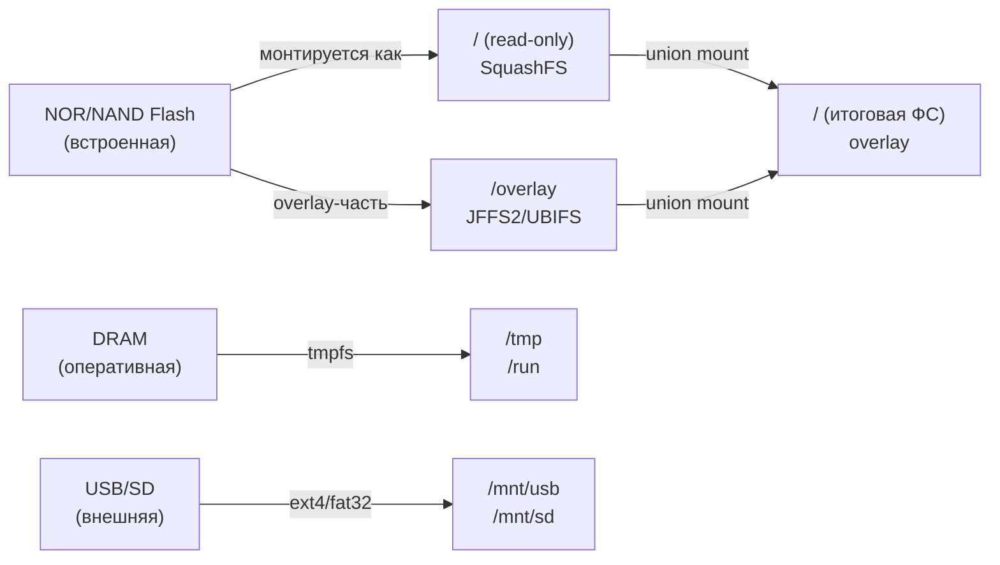

# Уровень 7: Persistence — подробная теория

## Введение: проблема "amnesia-брокера"

Представьте умный дом с десятком датчиков: температура, влажность, движение, состояние замков.
Все устройства публикуют состояние через MQTT. Вы перезагружаете роутер с Mosquitto — и панель
управления показывает пустые значения. Датчики обновляются только когда отправят новые данные.
Для датчика температуры, который публикует данные раз в минуту, это 60 секунд неопределённости.

Это и есть "amnesia-брокер" — брокер без persistence. Он не помнит ничего.

Persistence решает это хранением состояния брокера в файле на диске. После перезапуска брокер
загружает сохранённое состояние и продолжает работу, как будто ничего не произошло.

---

## 1. Что такое persistence и что сохраняется

### Файл mosquitto.db

Mosquitto использует собственный бинарный формат для хранения базы данных. Файл `mosquitto.db`
содержит несколько типов данных:

**Retained-сообщения** — главная причина использовать persistence. Когда публикуется retained-сообщение,
Mosquitto сохраняет его и отправляет каждому новому подписчику. Без persistence при перезапуске
брокера retained-сообщения исчезают.

```bash
# Публикуем retained-сообщение
mosquitto_pub -t "home/temp" -m "22.5" -r

# Без persistence: после перезапуска брокера подписчик не получит ничего
# С persistence: подписчик сразу получит "22.5"
```

**Persistent-сессии клиентов** — клиент, подключившийся с `clean_session=false`, создаёт
"persistent session". Broker запоминает его подписки и накапливает сообщения QoS 1/2, пока
клиент офлайн. При reconnect клиент получает накопленные сообщения.

**Очереди QoS 1/2** — сообщения, ожидающие подтверждения доставки. Если клиент отключился,
не получив сообщение QoS 1, broker держит его в очереди. Без persistence очередь исчезнет
при перезапуске.

**Незавершённые транзакции QoS 2** — QoS 2 использует четырёхэтапный handshake (PUBLISH →
PUBREC → PUBREL → PUBCOMP). Незавершённые транзакции сохраняются для гарантии ровно-однократной
доставки.

| Тип данных | Сохраняется? | Причина |
|------------|:---:|---------|
| Retained-сообщения | ✅ | Ключевая функция persistence |
| Подписки QoS 1/2 | ✅ | Часть persistent-сессии |
| Очереди QoS 1/2 | ✅ | Гарантированная доставка |
| QoS 2 транзакции | ✅ | exactly-once гарантия |
| QoS 0 сообщения | ❌ | fire-and-forget по определению |
| Активные соединения | ❌ | Восстанавливаются при реконнекте |
| Статистика ($SYS) | ❌ | Пересчитывается после старта |

---

## 2. Конфигурация persistence

### Минимальная настройка

```conf
# /etc/mosquitto/mosquitto.conf

persistence true
persistence_location /var/lib/mosquitto/
```

Этих двух строк достаточно для базовой работы. Mosquitto создаст файл
`/var/lib/mosquitto/mosquitto.db` и будет сохранять его каждые 1800 секунд (30 минут по умолчанию).

### Полная настройка

```conf
persistence true
persistence_location /var/lib/mosquitto/

# Интервал автосохранения в секундах
# 0 = сохранять только при корректном завершении (mosquitto stop)
# 300 = каждые 5 минут (рекомендуемый компромисс)
autosave_interval 300

# Сохранять при каждом изменении retained/подписок
# true = много записей на диск (опасно для flash!)
# false = экономим flash-ресурс
autosave_on_changes false
```

### Инициализация директории

```bash
# Создать директорию и назначить права
mkdir -p /var/lib/mosquitto
chown mosquitto:mosquitto /var/lib/mosquitto
chmod 750 /var/lib/mosquitto

# Проверить
ls -la /var/lib/mosquitto/
```

---

## 3. Специфика хранилищ на OpenWRT

### Архитектура памяти OpenWRT



OpenWRT использует union mount: поверх read-only squashfs лежит writable overlay (JFFS2 или UBIFS).
Все изменения файловой системы (установка пакетов, конфиги) записываются в overlay.

### /tmp — tmpfs

tmpfs хранит данные исключительно в RAM. После перезагрузки или отключения питания — данные
исчезают. Размер ограничен оперативной памятью роутера.

```bash
df -h /tmp
# Filesystem      Size  Used Avail Use% Mounted on
# tmpfs            62M  1.1M   61M   2% /tmp
```

> ❌ Использовать `/tmp` как `persistence_location` — бессмысленно. После перезагрузки
> `mosquitto.db` исчезнет, и persistence не выполнит свою функцию.

### /overlay — JFFS2/UBIFS

JFFS2 (или UBIFS на NAND-флеш) — журналируемая файловая система с wear-leveling. Данные
переживают перезагрузку. Однако flash-память имеет ограниченный ресурс.

**Wear-leveling** — алгоритм равномерного распределения операций записи по всем блокам чипа.
Без него одни блоки изнашивались бы быстрее других. С wear-leveling все блоки изнашиваются
примерно одинаково, что максимизирует срок жизни чипа.

**Типичные характеристики flash-памяти роутера:**
- Объём: 4-16 МБ
- Ресурс NAND: ~100 000 циклов записи на блок
- Ресурс NOR: ~10 000 циклов (хуже!)

**Расчёт износа:**

Предположим: `autosave_interval 300`, размер `mosquitto.db` ~10 КБ.
- Записей в сутки: 86400 / 300 = 288
- Данных в сутки: 288 × 10 КБ = 2880 КБ ≈ 2.8 МБ
- С 4 МБ flash и wear-leveling: 100 000 × 4 МБ / (2.8 МБ × 365) ≈ **391 год**

С `autosave_on_changes true` при активном использовании (1000 retained-updates/день × 10 КБ):
- 1000 × 10 КБ = 10 МБ/день
- 100 000 × 4 МБ / (10 МБ × 365) ≈ **110 лет**

В обоих случаях ресурс достаточен, но для минимизации риска всё равно рекомендуется
`autosave_on_changes false` и интервал не менее 300 секунд.

### /mnt/usb или /mnt/sd — внешний носитель

Лучший вариант для production: USB-флешка или SD-карта с файловой системой ext4.

```bash
# Установить поддержку USB-накопителей
opkg update
opkg install kmod-usb-storage kmod-usb2 block-mount kmod-fs-ext4 e2fsprogs

# Форматировать USB в ext4 (делать один раз)
mkfs.ext4 /dev/sda1

# Настроить автомонтирование
block detect > /etc/config/fstab
# Отредактировать /etc/config/fstab — добавить option enabled '1'
# и option target '/mnt/usb' для нужного устройства

uci commit fstab
/etc/init.d/fstab restart

# Создать директорию для Mosquitto
mkdir -p /mnt/usb/mosquitto
chown mosquitto:mosquitto /mnt/usb/mosquitto
```

```conf
# mosquitto.conf
persistence true
persistence_location /mnt/usb/mosquitto/
autosave_interval 300
```

---

## 4. Принудительное сохранение: SIGUSR1

Mosquitto поддерживает UNIX-сигналы для управления без перезапуска:

| Сигнал | Действие |
|--------|---------|
| `SIGUSR1` | Немедленно сохранить базу данных на диск |
| `SIGUSR2` | Напечатать статистику в лог (если log_type all) |
| `SIGHUP` | Перечитать конфигурацию (в Mosquitto 1.x) |
| `SIGTERM` | Корректное завершение с сохранением БД |

```bash
# Метод 1: через PID-файл
kill -USR1 $(cat /var/run/mosquitto.pid)

# Метод 2: через pgrep
kill -USR1 $(pgrep -x mosquitto)

# Метод 3: через mosquitto_ctrl (Mosquitto 2.x)
# mosquitto_ctrl не поддерживает SIGUSR1 напрямую, используйте kill
```

> 💡 Всегда отправляйте SIGUSR1 перед созданием бэкапа! Mosquitto держит часть данных в
> буферах памяти и не сразу записывает их на диск. SIGUSR1 гарантирует полный flush.

---

## 5. Стратегия бэкапа

### Что включать в бэкап

```
/var/lib/mosquitto/mosquitto.db   # База данных
/etc/mosquitto/mosquitto.conf      # Основной конфиг
/etc/mosquitto/certs/              # TLS-сертификаты
/etc/mosquitto/passwd              # Файл паролей
/etc/mosquitto/acl                 # ACL-правила
```

### Стратегия ротации

Бэкапы накапливаются. Для OpenWRT с ограниченным местом разумно хранить:
- 7 ежедневных бэкапов
- 4 еженедельных
- 3 ежемесячных

```sh
# Оставить только последние 7 бэкапов
ls -t /mnt/usb/backups/mqtt_*.tar.gz | tail -n +8 | xargs rm -f
```

### Полный скрипт бэкапа

```sh
#!/bin/sh
# /usr/bin/mqtt-backup.sh
# Использование: запустить вручную или через cron

BACKUP_DIR="/mnt/usb/backups/mosquitto"
RETAIN_COUNT=7
DATE=$(date +%Y%m%d_%H%M%S)
BACKUP_FILE="$BACKUP_DIR/mosquitto_$DATE.tar.gz"

# Проверить точку монтирования
if ! mountpoint -q /mnt/usb; then
  logger -t mqtt-backup "ERROR: /mnt/usb not mounted"
  exit 1
fi

mkdir -p "$BACKUP_DIR"

# Сбросить буферы на диск
MQTT_PID=$(cat /var/run/mosquitto.pid 2>/dev/null)
if [ -n "$MQTT_PID" ]; then
  kill -USR1 "$MQTT_PID"
  sleep 2
fi

# Создать архив
tar czf "$BACKUP_FILE" \
  /var/lib/mosquitto/mosquitto.db \
  /etc/mosquitto/ 2>/dev/null

SIZE=$(du -h "$BACKUP_FILE" | cut -f1)
logger -t mqtt-backup "Created $BACKUP_FILE ($SIZE)"

# Ротация
ls -t "$BACKUP_DIR"/mosquitto_*.tar.gz | \
  tail -n +"$((RETAIN_COUNT + 1))" | \
  xargs -r rm -f
```

### Восстановление

```sh
#!/bin/sh
# /usr/bin/mqtt-restore.sh
BACKUP_FILE="$1"

if [ ! -f "$BACKUP_FILE" ]; then
  echo "Файл не найден: $BACKUP_FILE"
  exit 1
fi

# Остановить брокер
service mosquitto stop

# Сохранить текущее состояние (на всякий случай)
SAFE_BACKUP="/tmp/mosquitto_pre_restore_$(date +%H%M%S).tar.gz"
tar czf "$SAFE_BACKUP" /var/lib/mosquitto/ /etc/mosquitto/ 2>/dev/null
echo "Предыдущее состояние сохранено в $SAFE_BACKUP"

# Восстановить
tar xzf "$BACKUP_FILE" -C /
chown -R mosquitto:mosquitto /var/lib/mosquitto/
chown -R mosquitto:mosquitto /etc/mosquitto/

# Запустить
service mosquitto start
echo "Готово. Проверьте: logread | grep mosquitto"
```

---

## ⚠️ Частые ошибки новичков

### 🐛 1. persistence_location указывает на /tmp

```conf
# ❌ Абсолютно бессмысленно!
persistence true
persistence_location /tmp/mosquitto/
```

> **Почему это ошибка:** /tmp — это tmpfs (RAM). После перезагрузки файл исчезнет. Persistence
> теряет весь смысл — это то же самое, что не включать её вообще.

```conf
# ✅ Используйте постоянное хранилище
persistence true
persistence_location /var/lib/mosquitto/
```

### 🐛 2. Директория не создана заранее

```
[1657891234] Error: Unable to open database file.
```

> **Почему это ошибка:** Mosquitto не создаёт директорию автоматически. Если её нет —
> он не стартует с включённой persistence.

```bash
# ✅ Создать до запуска
mkdir -p /var/lib/mosquitto
chown mosquitto:mosquitto /var/lib/mosquitto
```

### 🐛 3. Бэкап БД без SIGUSR1

```bash
# ❌ Копировать БД "на лету" без сигнала
cp /var/lib/mosquitto/mosquitto.db /tmp/backup.db
```

> **Почему это ошибка:** Mosquitto не сразу записывает все изменения на диск. Файл на диске
> может содержать устаревшие данные. SIGUSR1 заставляет broker сбросить буферы.

```bash
# ✅ Сначала сигнал, потом бэкап
kill -USR1 $(cat /var/run/mosquitto.pid) && sleep 2
cp /var/lib/mosquitto/mosquitto.db /tmp/backup.db
```

### 🐛 4. autosave_on_changes true на flash без оценки нагрузки

```conf
# ❌ Может привести к десяткам тысяч записей в сутки
persistence true
persistence_location /overlay/mosquitto/
autosave_on_changes true
```

> **Почему это ошибка:** при интенсивном использовании retained-топиков (например, 100+
> устройств публикуют retained каждую минуту) это тысячи записей в сутки. Flash ресурс
> конечен, хотя при типичной нагрузке wear-leveling справляется.

```conf
# ✅ Контролируемое сохранение по интервалу
autosave_interval 600
autosave_on_changes false
```

---

## 📌 Итоги

| Параметр | Значение | Назначение |
|----------|---------|-----------|
| `persistence true` | — | Включить сохранение на диск |
| `persistence_location` | `/var/lib/mosquitto/` | Директория для mosquitto.db |
| `autosave_interval` | `300` | Сохранять каждые 5 минут |
| `autosave_on_changes` | `false` | Экономить ресурс flash |

**Приоритет хранилищ для OpenWRT:**
1. `/mnt/usb/mosquitto/` — USB/SD с ext4 (лучший вариант)
2. `/overlay/upper/mosquitto/` — встроенная flash (допустимо)
3. `/tmp/` — никогда!

- ✅ Всегда используйте SIGUSR1 перед бэкапом
- ✅ Настройте cron для ежедневного автобэкапа
- ✅ Храните бэкапы на внешнем носителе, не на роутере
- ❌ Не используйте persistence_location на tmpfs (/tmp)
