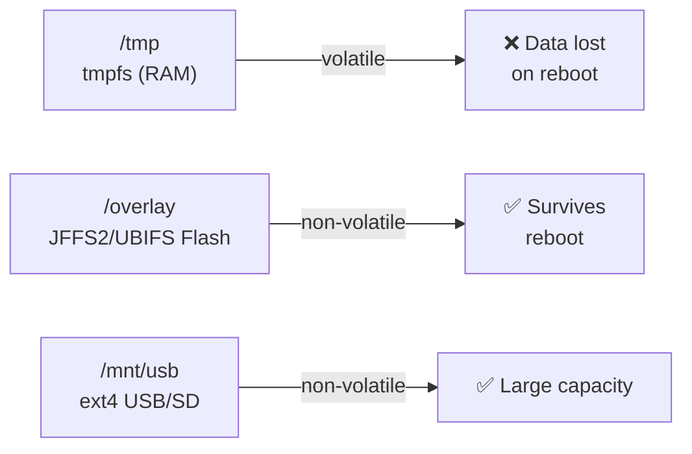

# Level 7: Persistence — Broker State Preservation

## Why is persistence needed?

Without persistence, Mosquitto is an "amnesia broker": on every restart, it forgets everything.
Retained messages disappear, clients lose their queues, sensors are forced to re-publish
their state.

With persistence, the broker remembers state between restarts:


## What is stored in mosquitto.db

| Data | Persisted? |
|--------|:---:|
| Retained messages | ✅ |
| Persistent client sessions | ✅ |
| QoS 1/2 queues | ✅ |
| Incomplete QoS 2 transactions | ✅ |
| QoS 0 messages | ❌ |

## Configuration

```conf
# /etc/mosquitto/mosquitto.conf

persistence true
persistence_location /var/lib/mosquitto/
autosave_interval 300       # Save every 5 minutes
autosave_on_changes false   # Don't save on every change
```

### Parameters

- **persistence** — enables/disables database writing
- **persistence_location** — directory for `mosquitto.db`
- **autosave_interval** — interval in seconds (`0` = on shutdown only)
- **autosave_on_changes** — save on every retained/subscription change

## Storage on OpenWRT: /tmp vs /overlay



### Flash memory wear

Built-in flash has a limited write endurance (~100,000 write cycles per block).
With `autosave_interval 60` and a 10 KB database — ~864 MB of writes per day. This is critical for small flash!

**Recommendation for /overlay:** `autosave_interval 600` or more.
**Best option:** USB flash drive or SD card at `/mnt/usb/mosquitto/`.

## Manual save: SIGUSR1

```bash
# Force database save (without restart)
kill -USR1 $(cat /var/run/mosquitto.pid)
```

Use before backup or scheduled power-off.

## Backup

```bash
#!/bin/sh
# /usr/bin/mqtt-backup.sh
BACKUP_DIR="/mnt/usb/backups"
DATE=$(date +%Y%m%d_%H%M%S)

# 1. Save DB
kill -USR1 $(cat /var/run/mosquitto.pid) && sleep 2

# 2. Archive
tar czf "$BACKUP_DIR/mqtt_$DATE.tar.gz" \
  /var/lib/mosquitto/mosquitto.db \
  /etc/mosquitto/

# 3. Keep only the last 7 backups
ls -t $BACKUP_DIR/mqtt_*.tar.gz | tail -n +8 | xargs rm -f
```

### Cron for automated backup

```sh
# /etc/crontabs/root — daily at 02:00
0 2 * * * /usr/bin/mqtt-backup.sh
```

## Restore

```bash
#!/bin/sh
BACKUP_FILE="$1"
service mosquitto stop
tar xzf "$BACKUP_FILE" -C /
service mosquitto start
```

## ⚠️ Common mistakes

| Mistake | Cause | Solution |
|--------|---------|---------|
| `persistence_location /tmp` | tmpfs — data lost on reboot | Use `/var/lib/mosquitto/` or `/mnt/usb/` |
| `autosave_on_changes true` on flash | Memory wear | Set `false`, use interval |
| Backup without SIGUSR1 | Buffers not flushed | Always send SIGUSR1 before backup |
| DB not created | Directory does not exist | `mkdir -p /var/lib/mosquitto; chown mosquitto:` |

## 📌 Summary

- ✅ `persistence true` + correct `persistence_location`
- ✅ For OpenWRT: `/overlay` (careful) or USB (`/mnt/usb/mosquitto/`)
- ✅ `autosave_on_changes false` — protects flash from wear
- ✅ SIGUSR1 before backup ensures data integrity
- ❌ Never use `/tmp` as persistence_location
