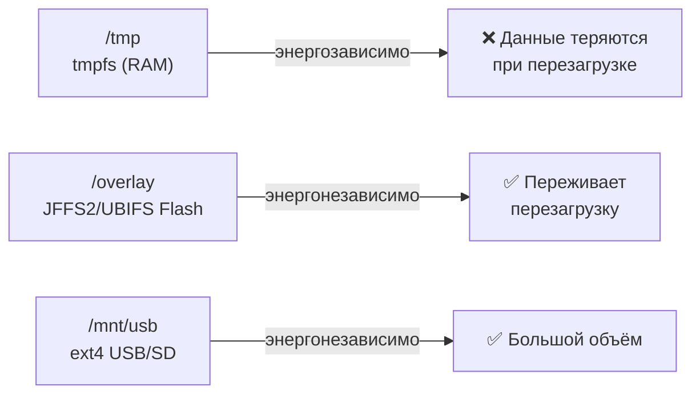

# Уровень 7: Persistence — сохранение состояния брокера

## Зачем нужна persistence?

Без persistence Mosquitto — это "amnesia-брокер": при каждом перезапуске он забывает всё.
Retained-сообщения исчезают, клиенты теряют свои очереди, датчики вынуждены повторно
публиковать своё состояние.

С persistence брокер помнит состояние между перезагрузками:


## Что хранится в mosquitto.db

| Данные | Сохраняется? |
|--------|:---:|
| Retained-сообщения | ✅ |
| Persistent-сессии клиентов | ✅ |
| Очереди QoS 1/2 | ✅ |
| Незавершённые транзакции QoS 2 | ✅ |
| QoS 0 сообщения | ❌ |

## Конфигурация

```conf
# /etc/mosquitto/mosquitto.conf

persistence true
persistence_location /var/lib/mosquitto/
autosave_interval 300       # Сохранять каждые 5 минут
autosave_on_changes false   # Не сохранять при каждом изменении
```

### Параметры

- **persistence** — включает/выключает запись базы данных
- **persistence_location** — директория для `mosquitto.db`
- **autosave_interval** — интервал в секундах (`0` = только при завершении)
- **autosave_on_changes** — сохранять при каждом изменении retained/подписок

## Хранилище на OpenWRT: /tmp vs /overlay



### Износ flash-памяти

Встроенная flash-память имеет ограниченный ресурс (~100 000 циклов записи на блок).
При `autosave_interval 60` и 10 КБ БД — ~864 МБ в день записи. Это критично для малых flash!

**Рекомендация для /overlay:** `autosave_interval 600` или больше.
**Лучший вариант:** USB-флешка или SD-карта в `/mnt/usb/mosquitto/`.

## Ручное сохранение: SIGUSR1

```bash
# Принудительное сохранение БД (без перезапуска)
kill -USR1 $(cat /var/run/mosquitto.pid)
```

Используйте перед бэкапом или плановым отключением питания.

## Бэкап

```bash
#!/bin/sh
# /usr/bin/mqtt-backup.sh
BACKUP_DIR="/mnt/usb/backups"
DATE=$(date +%Y%m%d_%H%M%S)

# 1. Сохранить БД
kill -USR1 $(cat /var/run/mosquitto.pid) && sleep 2

# 2. Архивировать
tar czf "$BACKUP_DIR/mqtt_$DATE.tar.gz" \
  /var/lib/mosquitto/mosquitto.db \
  /etc/mosquitto/

# 3. Оставить только 7 последних бэкапов
ls -t $BACKUP_DIR/mqtt_*.tar.gz | tail -n +8 | xargs rm -f
```

### Cron для автобэкапа

```sh
# /etc/crontabs/root — ежедневно в 02:00
0 2 * * * /usr/bin/mqtt-backup.sh
```

## Восстановление

```bash
#!/bin/sh
BACKUP_FILE="$1"
service mosquitto stop
tar xzf "$BACKUP_FILE" -C /
service mosquitto start
```

## ⚠️ Частые ошибки

| Ошибка | Причина | Решение |
|--------|---------|---------|
| `persistence_location /tmp` | tmpfs — данные теряются | Использовать `/var/lib/mosquitto/` или `/mnt/usb/` |
| `autosave_on_changes true` на flash | Износ памяти | Установить `false`, использовать интервал |
| Бэкап без SIGUSR1 | Буферы не сброшены | Всегда делать SIGUSR1 перед бэкапом |
| БД не создаётся | Директория не существует | `mkdir -p /var/lib/mosquitto; chown mosquitto:` |

## 📌 Итоги

- ✅ `persistence true` + правильный `persistence_location`
- ✅ Для OpenWRT: `/overlay` (осторожно) или USB (`/mnt/usb/mosquitto/`)
- ✅ `autosave_on_changes false` — защита flash от износа
- ✅ SIGUSR1 перед бэкапом гарантирует целостность данных
- ❌ Никогда не используйте `/tmp` как persistence_location
