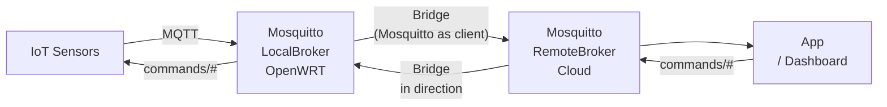
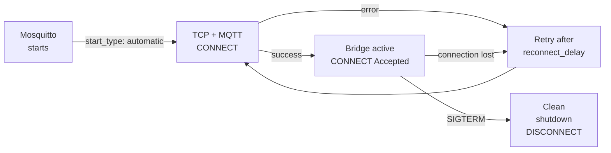

# Level 8: Bridge — Detailed Theory

## Introduction: Why link brokers

Imagine a smart home: an OpenWRT router with Mosquitto collects data from all sensors. Everything
works great — while you're at home. But you want to see the data from your phone when you're in another city.
Or you want notifications if a fire sensor triggers at night.

Options:
1. Open port 1883 to the internet — **bad idea** (security)
2. VPN to the router — works, but complex for mobile clients
3. **Bridge** — the local broker itself forwards the needed data to the cloud

A bridge is an elegant solution where devices keep working with the local broker,
completely unaware of the "outside world". The broker takes care of forwarding the right data outward.

---

## 1. How a bridge works under the hood

### Architecture



Key understanding: Mosquitto with a configured bridge **is itself an MQTT client** for the remote
broker. From the remote broker's perspective — it's a regular client with a client_id like
`mosquitto.bridge.<connection_name>.<hostname>`.

### Bridge connection lifecycle



### start_type: automatic vs lazy vs once

- **automatic** — Mosquitto immediately establishes the connection on startup and keeps it alive always.
  Best choice for permanent bridges.
- **lazy** — the connection is only established when there are messages to forward. For bridges
  with infrequent data and unstable internet.
- **once** — one-time connection. After sending all messages, the connection closes.
  Rarely used.

---

## 2. Full bridge configuration

### Minimal configuration

```conf
connection my-bridge
address remote-broker.example.com:1883
topic sensors/# out 0
```

### Full configuration with comments

```conf
# Connection name — unique for each bridge
connection bridge-to-cloud

# Remote broker address
# Format: hostname:port
# For multiple addresses (failover):
# address primary.cloud.com:1883 backup.cloud.com:1883
address mqtt.mycloud.com:8883

# Authentication on the remote broker
remote_username homebridge
remote_password S3cur3Pass!

# TLS for cloud connection
bridge_cafile /etc/mosquitto/certs/cloud-ca.crt
# For mTLS:
# bridge_certfile /etc/mosquitto/certs/bridge.crt
# bridge_keyfile  /etc/mosquitto/certs/bridge.key
bridge_tls_version tlsv1.2

# Topic forwarding rules
topic sensors/# out 0             # Sensor data → cloud
topic commands/# in 1             # Commands from cloud → local
topic alerts/# out 2              # Critical alerts with guaranteed delivery

# Keep-alive: ping every 60 seconds
keepalive_interval 60

# Reconnection strategy
start_type automatic
reconnect_delay 5            # First attempt after 5 sec
reconnect_delay_max 120      # Max interval 2 minutes

# Use clean session (recommended for bridges)
cleansession true

# QoS override for bridge forwarding (lower if needed)
# bridge_attempt_unsubscribe false
```

### Multiple bridges

You can configure multiple bridges in a single `mosquitto.conf`:

```conf
# Bridge to primary cloud
connection cloud-primary
address mqtt.primary-cloud.com:8883
topic sensors/# out 0

# Bridge to backup cloud
connection cloud-backup
address mqtt.backup-cloud.com:8883
topic alerts/# out 2

# Bridge to office broker
connection office-broker
address 10.0.1.5:1883
topic office/# both 1
```

---

## 3. Topic string format: detailed breakdown

The `topic` line is the key element of bridge configuration:

```
topic <pattern> <direction> <QoS> [local_prefix] [remote_prefix]
```

### Directions

| Direction | Meaning |
|-------------|---------|
| `out` | Local messages → remote broker |
| `in` | Remote broker messages → local |
| `both` | Bidirectional (watch out for loops!) |

### QoS in Bridge

QoS in the `topic` line sets the maximum QoS for forwarding. Actual QoS is the minimum of:
publisher QoS and QoS in the `topic` line.

### Prefix mapping

The last two parameters are local and remote prefixes:

```conf
# No mapping
topic sensors/# out 0
# sensors/temp → sensors/temp (on remote)

# With remote prefix
topic sensors/# out 0 "" home/
# sensors/temp → home/sensors/temp (on remote)

# Local prefix only
topic # in 0 remote/ ""
# remote/cmd → cmd (receive remote topic without prefix locally)

# With both prefixes
topic data out 0 local/ remote/
# local/data → remote/data
```

An empty string `""` means "no prefix". If the last two parameters are omitted —
topics are not transformed.

### Practical examples

```conf
# Smart home: forward sensor data to cloud with house identifier
topic sensors/# out 0 "" house-42/

# Bidirectional light control
topic light/# both 1

# Receive only alerts from another office
topic alert/office-B/# in 1

# Full topic synchronization with explicit mapping
topic status out 1 "" bridge/status
```

---

## 4. Message loops and how to prevent them

### What is a bridge loop

With `direction both`, there's a risk of a loop:
1. Broker A receives a message, forwards it to broker B
2. Broker B receives the message from A, forwards it back to A
3. Broker A receives the same message again...

### Mosquitto's loop protection

Mosquitto automatically adds a special attribute to publications through the bridge. The broker
does not forward messages that have already passed through the bridge in that direction. This works
correctly when `cleansession true` and the round-trip is from a single source.

But for complex topologies (triangle, star), loops are still possible.

### Recommendations

```conf
# 1. Prefer directed rules instead of both
topic sensors/# out 0     # Not "both" — only from local
topic commands/# in 1     # Only into local

# 2. Use cleansession true
cleansession true

# 3. For state synchronization — retained + both with caution
topic status both 1
```

---

## 5. Bridge with TLS

```conf
connection secure-cloud-bridge
address mqtt.cloud.example.com:8883

# TLS: CA only (verify the server)
bridge_cafile /etc/mosquitto/certs/cloud-ca.crt
bridge_tls_version tlsv1.2

# TLS: mTLS (server verifies us too)
bridge_certfile /etc/mosquitto/certs/bridge-client.crt
bridge_keyfile /etc/mosquitto/certs/bridge-client.key

topic sensors/# out 0
```

The `bridge-client.crt/key` certificates must be signed by a CA trusted by the remote broker.

---

## 6. Debugging Bridge

```bash
# Check if the remote broker port is reachable
nc -z mqtt.cloud.com 1883 && echo "reachable" || echo "unreachable"

# View Mosquitto logs
logread | grep mosquitto | grep -i bridge

# Enable verbose logging in config
log_type all
log_type debug

# Check status via $SYS topics
mosquitto_sub -t '$SYS/broker/connection/#' -v
# Output like:
# $SYS/broker/connection/bridge-to-cloud/state 1  (1=connected, 0=disconnected)
```

---

## ⚠️ Common beginner mistakes

### 🐛 1. Wrong address or port for the remote broker

```conf
# ❌ Port 1883 for a TLS broker
connection my-bridge
address cloud.mqtt.com:1883
bridge_cafile /etc/mosquitto/certs/ca.crt
```

> **Why this is a mistake:** TLS brokers usually listen on port 8883. Attempting a TLS handshake
> on a plain-text port will result in `ssl handshake failed`.

```conf
# ✅ Correct port for TLS
address cloud.mqtt.com:8883
```

### 🐛 2. Both brokers configured with direction both — loop

```conf
# ❌ Broker A
topic data both 1

# ❌ Broker B (mirror config)
topic data both 1
# Result: the message loops between brokers infinitely
```

> **Why this is a mistake:** with `both` on both ends, every message is forwarded back and
> forth. Mosquitto has built-in protection for simple cases, but with complex topologies
> loops are still possible.

```conf
# ✅ One end — out, the other — in (or both, but with topology awareness)
# Broker A (data source)
topic data out 1

# Broker B (receiver)
# No bridge config needed — it just receives data
```

### 🐛 3. Bridge connects, but messages don't arrive

```conf
# ❌ Wrong topic pattern
connection my-bridge
address remote:1883
topic /sensors/# out 0   # Extra leading slash!
```

> **Why this is a mistake:** topic `/sensors/temp` (with leading slash) is a different topic than
> `sensors/temp`. Devices publish to `sensors/temp`, but the rule filters `/sensors/#`.

```conf
# ✅ No leading slash
topic sensors/# out 0
```

### 🐛 4. Forgetting permissions for incoming messages

```conf
# Bridge config
topic commands/# in 1

# ❌ Forgot to add to ACL
# ACL allows local clients to read commands/#, but the bridge-client has no publish rights

# /etc/mosquitto/acl
# (empty or only user/pass - bridge_client not listed)
```

> **Why this is a mistake:** when the bridge receives a message from the cloud and publishes it locally,
> Mosquitto checks the bridge client's permissions. If ACL isn't configured — messages are rejected.

```conf
# ✅ Add ACL permissions for the bridge user
user bridge_user
topic write commands/#
topic read sensors/#
```

---

## 📌 Summary

| Parameter | Purpose |
|----------|-----------|
| `connection <name>` | Bridge name |
| `address host:port` | Remote broker |
| `topic # out 0` | All local topics → remote |
| `topic # in 0` | All remote topics → local |
| `topic # both 1` | Bidirectional synchronization |
| `bridge_cafile` | TLS CA for remote broker |
| `start_type automatic` | Automatically maintain connection |
| `cleansession true` | Clean session (protects against stale subscriptions) |

- ✅ Bridge = Mosquitto as MQTT client for another broker
- ✅ Use `out`/`in` instead of `both` when possible
- ✅ Watch for loops with `both`
- ✅ Add ACL permissions for the bridge user
- ❌ Don't open port 1883 to the internet — use Bridge via VPN or TLS
