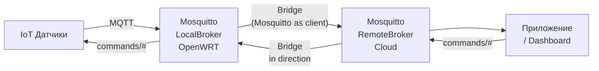
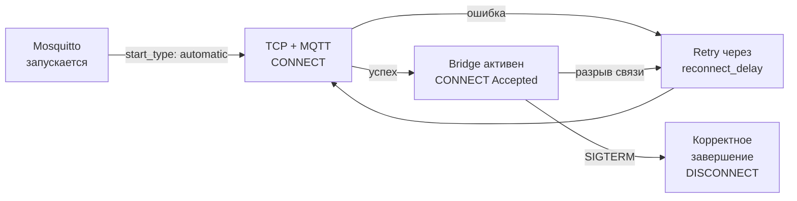

# Уровень 8: Bridge — подробная теория

## Введение: зачем связывать брокеры

Представьте умный дом: OpenWRT-роутер с Mosquitto собирает данные со всех датчиков. Всё
прекрасно — пока вы дома. Но вы хотите видеть данные с телефона когда вы в другом городе.
Или хотите получать уведомления, если датчик пожара сработал ночью.

Варианты решения:
1. Открыть порт 1883 в интернет — **плохая идея** (безопасность)
2. VPN до роутера — работает, но сложно для мобильных клиентов
3. **Bridge** — локальный брокер сам пересылает нужные данные в облако

Bridge — это элегантное решение, при котором устройства продолжают работать с локальным брокером,
никак не зная о "внешнем мире". Брокер сам заботится о передаче нужных данных наружу.

---

## 1. Как работает Bridge под капотом

### Архитектура



Ключевое понимание: Mosquitto с настроенным bridge **сам является MQTT-клиентом** для удалённого
брокера. С точки зрения удалённого брокера — это обычный клиент с client_id вида
`mosquitto.bridge.<имя_соединения>.<hostname>`.

### Жизненный цикл Bridge-соединения



### start_type: automatic vs lazy vs once

- **automatic** — Mosquitto сразу устанавливает соединение при старте и поддерживает его всегда.
  Лучший вариант для постоянных мостов.
- **lazy** — соединение устанавливается только когда есть сообщения для пересылки. Для мостов
  с редкими данными и нестабильным интернетом.
- **once** — одноразовое подключение. После отправки всех сообщений соединение закрывается.
  Редко используется.

---

## 2. Полная конфигурация Bridge

### Минимальная конфигурация

```conf
connection my-bridge
address remote-broker.example.com:1883
topic sensors/# out 0
```

### Полная конфигурация с пояснениями

```conf
# Имя соединения — уникальное для каждого моста
connection bridge-to-cloud

# Адрес удалённого брокера
# Формат: hostname:port
# Для нескольких адресов (резервирование):
# address primary.cloud.com:1883 backup.cloud.com:1883
address mqtt.mycloud.com:8883

# Аутентификация на удалённом брокере
remote_username homebridge
remote_password S3cur3Pass!

# TLS для подключения к облаку
bridge_cafile /etc/mosquitto/certs/cloud-ca.crt
# При mTLS:
# bridge_certfile /etc/mosquitto/certs/bridge.crt
# bridge_keyfile  /etc/mosquitto/certs/bridge.key
bridge_tls_version tlsv1.2

# Правила пересылки топиков
topic sensors/# out 0             # Данные датчиков → облако
topic commands/# in 1             # Команды из облака → локально
topic alerts/# out 2              # Критические оповещения с гарантией

# Keep-alive: каждые 60 секунд пинг
keepalive_interval 60

# Стратегия переподключения
start_type automatic
reconnect_delay 5            # Первая попытка через 5 сек
reconnect_delay_max 120      # Максимальный интервал 2 минуты

# Использовать clean session (рекомендуется для мостов)
cleansession true

# Вариант QoS для передачи через мост (понизить, если нужно)
# bridge_attempt_unsubscribe false
```

### Несколько мостов

В одном `mosquitto.conf` можно настроить несколько мостов:

```conf
# Мост к основному облаку
connection cloud-primary
address mqtt.primary-cloud.com:8883
topic sensors/# out 0

# Мост к резервному облаку
connection cloud-backup
address mqtt.backup-cloud.com:8883
topic alerts/# out 2

# Мост к офисному брокеру
connection office-broker
address 10.0.1.5:1883
topic office/# both 1
```

---

## 3. Формат строки topic: детальный разбор

Строка `topic` — это ключевой элемент конфигурации Bridge:

```
topic <паттерн> <направление> <QoS> [локальный_префикс] [удалённый_префикс]
```

### Направления

| Направление | Значение |
|-------------|---------|
| `out` | Локальные сообщения → удалённый брокер |
| `in` | Сообщения удалённого брокера → локальный |
| `both` | Двустороннее (аккуратно с петлями!) |

### QoS в Bridge

QoS в строке `topic` определяет максимальный QoS при пересылке. Реальный QoS — минимум из:
QoS публикатора и QoS в `topic`-строке.

### Маппинг префиксов

Последние два параметра — локальный и удалённый префиксы:

```conf
# Без маппинга
topic sensors/# out 0
# sensors/temp → sensors/temp (на удалённом)

# С удалённым префиксом
topic sensors/# out 0 "" home/
# sensors/temp → home/sensors/temp (на удалённом)

# Только с локальным префиксом
topic # in 0 remote/ ""
# remote/cmd → cmd (получаем удалённый топик без префикса локально)

# С обоими префиксами
topic data out 0 local/ remote/
# local/data → remote/data
```

Пустая строка `""` означает "без префикса". Если последние два параметра не указаны —
топики не преобразуются.

### Практические примеры

```conf
# Умный дом: пересылать данные датчиков в облако с указанием дома
topic sensors/# out 0 "" house-42/

# Двустороннее управление освещением
topic light/# both 1

# Получать только алерты из другого офиса
topic alert/office-B/# in 1

# Полная синхронизация топиков с явным маппингом
topic status out 1 "" bridge/status
```

---

## 4. Петли сообщений и их предотвращение

### Что такое bridge loop

При `direction both` возникает риск петли:
1. Брокер A получает сообщение, пересылает на брокер B
2. Брокер B получает сообщение от A, пересылает обратно на A
3. Брокер A получает то же сообщение снова...

### Защита Mosquitto от петель

Mosquitto автоматически добавляет к публикациям через Bridge специальный атрибут. Брокер
не пересылает сообщения, которые уже прошли через мост в этом направлении. Это работает
корректно, если `cleansession true` и `round_trip` (петля) из одного источника.

Но для сложных топологий (треугольник, звезда) петли всё равно возможны.

### Рекомендации

```conf
# 1. Предпочитайте направленные правила вместо both
topic sensors/# out 0     # Не "both" — только из локальной
topic commands/# in 1     # Только в локальную

# 2. Используйте cleansession true
cleansession true

# 3. Для синхронизации состояния — retained + both с осторожностью
topic status both 1
```

---

## 5. Мост с TLS

```conf
connection secure-cloud-bridge
address mqtt.cloud.example.com:8883

# TLS: только CA (проверяем сервер)
bridge_cafile /etc/mosquitto/certs/cloud-ca.crt
bridge_tls_version tlsv1.2

# TLS: mTLS (и сервер проверяет нас)
bridge_certfile /etc/mosquitto/certs/bridge-client.crt
bridge_keyfile /etc/mosquitto/certs/bridge-client.key

topic sensors/# out 0
```

Сертификаты `bridge-client.crt/key` должны быть подписаны CA, которому доверяет удалённый брокер.

---

## 6. Отладка Bridge

```bash
# Проверить, что порт удалённого брокера доступен
nc -z mqtt.cloud.com 1883 && echo "доступен" || echo "недоступен"

# Просмотр логов Mosquitto
logread | grep mosquitto | grep -i bridge

# Включить подробные логи в конфиге
log_type all
log_type debug

# Проверить статус через $SYS-топики
mosquitto_sub -t '$SYS/broker/connection/#' -v
# Вывод типа:
# $SYS/broker/connection/bridge-to-cloud/state 1  (1=подключён, 0=отключён)
```

---

## ⚠️ Частые ошибки новичков

### 🐛 1. Неверный адрес или порт удалённого брокера

```conf
# ❌ Порт 1883 при TLS-брокере
connection my-bridge
address cloud.mqtt.com:1883
bridge_cafile /etc/mosquitto/certs/ca.crt
```

> **Почему это ошибка:** TLS-брокер обычно слушает на порту 8883. Попытка TLS-handshake
> на plain-текстовом порту завершится ошибкой `ssl handshake failed`.

```conf
# ✅ Правильный порт для TLS
address cloud.mqtt.com:8883
```

### 🐛 2. Оба брокера настроены с direction both — петля

```conf
# ❌ Брокер A
topic data both 1

# ❌ Брокер B (зеркальная конфигурация)
topic data both 1
# Результат: сообщение гуляет между брокерами бесконечно
```

> **Почему это ошибка:** при `both` на обоих концах каждое сообщение пересылается туда и
> обратно. Mosquitto имеет встроенную защиту для простых случаев, но при сложных топологиях
> петли всё равно возможны.

```conf
# ✅ Один конец — out, другой — in (или оба, но с пониманием топологии)
# Брокер A (источник данных)
topic data out 1

# Брокер B (получатель)
# Не нужна конфигурация Bridge — он просто получает данные
```

### 🐛 3. Bridge подключается, но сообщения не приходят

```conf
# ❌ Неверный паттерн топика
connection my-bridge
address remote:1883
topic /sensors/# out 0   # Лишний слэш в начале!
```

> **Почему это ошибка:** топик `/sensors/temp` (с ведущим слэшем) — это другой топик, чем
> `sensors/temp`. Устройства публикуют в `sensors/temp`, а правило фильтрует `/sensors/#`.

```conf
# ✅ Без ведущего слэша
topic sensors/# out 0
```

### 🐛 4. Забыть о правах для входящих сообщений

```conf
# Конфиг Bridge
topic commands/# in 1

# ❌ Забыть добавить в ACL
# ACL разрешает local-клиентам читать commands/#, но bridge-client не имеет права публиковать

# /etc/mosquitto/acl
# (пусто или только user/pass - bridge_client не перечислен)
```

> **Почему это ошибка:** когда Bridge получает сообщение из облака и публикует его локально,
> Mosquitto проверяет права bridge-клиента. Если ACL не настроен — сообщения отклоняются.

```conf
# ✅ Добавить в ACL права для bridge-пользователя
user bridge_user
topic write commands/#
topic read sensors/#
```

---

## 📌 Итоги

| Параметр | Назначение |
|----------|-----------|
| `connection <name>` | Имя моста |
| `address host:port` | Удалённый брокер |
| `topic # out 0` | Все локальные топики → удалённый |
| `topic # in 0` | Все удалённые топики → локальный |
| `topic # both 1` | Двусторонняя синхронизация |
| `bridge_cafile` | TLS CA для удалённого брокера |
| `start_type automatic` | Автоматически поддерживать соединение |
| `cleansession true` | Чистая сессия (защита от устаревших подписок) |

- ✅ Bridge = Mosquitto как MQTT-клиент для другого брокера
- ✅ Используйте `out`/`in` вместо `both` когда это возможно
- ✅ Следите за петлями при `both`
- ✅ Добавьте права ACL для bridge-пользователя
- ❌ Не открывайте порт 1883 в интернет — используйте Bridge через VPN или TLS
