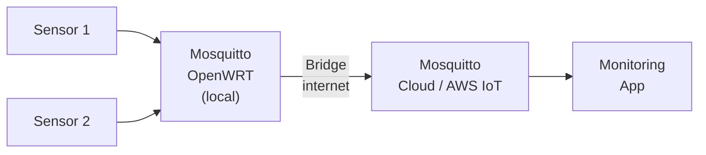
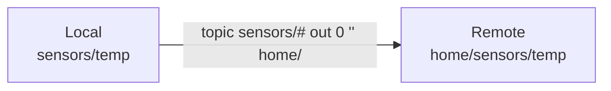

# Level 8: Bridge — Bridges Between Brokers

## What is a Bridge?

A bridge is a Mosquitto mechanism for connecting two brokers. One broker becomes an MQTT client
for the other: it connects to it and forwards messages in the desired directions.

Analogy: A bridge is a translator between two networks. Devices on each network talk to their
local broker, unaware of the second broker's existence. The bridge silently carries the needed messages.

## Why are bridges needed?



**Typical scenarios:**
- Local network → Cloud (smart home + cloud monitoring)
- Two offices/sites via VPN
- Hierarchy: multiple edge brokers → central broker

## Basic configuration

```conf
# /etc/mosquitto/mosquitto.conf

# Bridge to a remote broker
connection bridge-to-cloud
address mqtt.example.com:1883

# What to forward: topic, direction, QoS
topic sensors/# out 0
topic commands/# in 1
```

### Connection parameters

| Parameter | Description |
|----------|---------|
| `connection` | Unique bridge name |
| `address` | host:port of the remote broker |
| `topic` | Forwarding rule (see below) |
| `remote_username` | Username for the remote broker |
| `remote_password` | Password for the remote broker |
| `bridge_cafile` | CA certificate for TLS connection |
| `start_type` | automatic / lazy / once |
| `keepalive_interval` | Keepalive interval in seconds |

## Topic string format

```
topic <pattern> <direction> <QoS> [local_prefix] [remote_prefix]
```

**Directions:**
- `out` — publish to the remote broker
- `in` — receive from the remote broker
- `both` — bidirectional

**Examples:**

```conf
# Forward all sensor data to the cloud (QoS 0)
topic sensors/# out 0

# Receive commands from the cloud (QoS 1)
topic commands/# in 1

# Synchronize status both ways
topic status both 1

# With prefix mapping: local sensors/# → remote home/sensors/#
topic sensors/# out 0 "" home/
```

## Prefix mapping



The local topic `sensors/temp` will appear on the remote broker as `home/sensors/temp`.
An empty string `""` means "no local prefix".

## TLS in Bridge

```conf
connection secure-bridge
address mqtt.cloud.com:8883
bridge_cafile /etc/mosquitto/certs/cloud-ca.crt
bridge_certfile /etc/mosquitto/certs/bridge.crt
bridge_keyfile /etc/mosquitto/certs/bridge.key
topic sensors/# out 0
```

## ⚠️ Common mistakes

| Mistake | Cause | Solution |
|--------|---------|---------|
| Bridge won't connect | Wrong address or port | Check: `telnet mqtt.example.com 1883` |
| Messages flow one way | Wrong direction (in/out) | Check and fix direction |
| Message loop | both + both brokers forwarding back | Set `cleansession true` or use directed rules |
| Duplicate messages | Overlapping rules | Ensure patterns don't overlap |

## 📌 Summary

- ✅ Bridge = one broker acting as a client for another
- ✅ Format: `topic <pattern> <out|in|both> <QoS>`
- ✅ Prefix mapping: `topic t/# out 0 "" remote/` → `t/x` becomes `remote/t/x`
- ✅ For TLS: `bridge_cafile`, `bridge_certfile`, `bridge_keyfile`
- ❌ With `both`, watch out for message loops!
