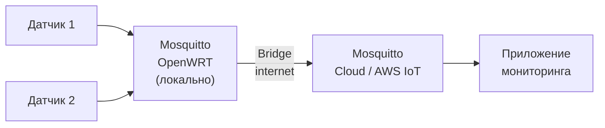
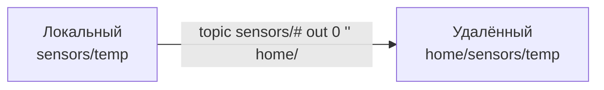

# Уровень 8: Bridge — мосты между брокерами

## Что такое Bridge?

Bridge (мост) — механизм Mosquitto для связи двух брокеров. Один брокер становится MQTT-клиентом
для другого: подключается к нему и пересылает сообщения в нужных направлениях.

Аналогия: Bridge — это переводчик между двумя сетями. Устройства каждой сети говорят со своим
локальным брокером, не зная о существовании второго. Bridge незаметно переносит нужные сообщения.

## Зачем нужны мосты?



**Типичные сценарии:**
- Локальная сеть → Облако (умный дом + облачный мониторинг)
- Два офиса/объекта через VPN
- Иерархия: несколько edge-брокеров → центральный брокер

## Базовая конфигурация

```conf
# /etc/mosquitto/mosquitto.conf

# Мост к удалённому брокеру
connection bridge-to-cloud
address mqtt.example.com:1883

# Что пересылать: топик, направление, QoS
topic sensors/# out 0
topic commands/# in 1
```

### Параметры connection

| Параметр | Описание |
|----------|---------|
| `connection` | Уникальное имя моста |
| `address` | host:port удалённого брокера |
| `topic` | Правило пересылки (см. ниже) |
| `remote_username` | Логин для удалённого брокера |
| `remote_password` | Пароль для удалённого брокера |
| `bridge_cafile` | CA-сертификат для TLS-подключения |
| `start_type` | automatic / lazy / once |
| `keepalive_interval` | Интервал keepalive в секундах |

## Формат строки topic

```
topic <паттерн> <направление> <QoS> [локальный_префикс] [удалённый_префикс]
```

**Направления:**
- `out` — публиковать на удалённый брокер
- `in` — получать с удалённого брокера
- `both` — двустороннее

**Примеры:**

```conf
# Пересылать все данные датчиков в облако (QoS 0)
topic sensors/# out 0

# Получать команды из облака (QoS 1)
topic commands/# in 1

# Синхронизировать статус в обе стороны
topic status both 1

# С маппингом префиксов: локальный sensors/# → удалённый home/sensors/#
topic sensors/# out 0 "" home/
```

## Маппинг префиксов



Локальный топик `sensors/temp` появится на удалённом брокере как `home/sensors/temp`.
Пустая строка `""` означает "без локального префикса".

## TLS в Bridge

```conf
connection secure-bridge
address mqtt.cloud.com:8883
bridge_cafile /etc/mosquitto/certs/cloud-ca.crt
bridge_certfile /etc/mosquitto/certs/bridge.crt
bridge_keyfile /etc/mosquitto/certs/bridge.key
topic sensors/# out 0
```

## ⚠️ Частые ошибки

| Ошибка | Причина | Решение |
|--------|---------|---------|
| Bridge не подключается | Неверный address или порт | Проверить: `telnet mqtt.example.com 1883` |
| Сообщения идут в одну сторону | Неверное направление (in/out) | Проверить и исправить direction |
| Петля сообщений (loop) | both + оба брокера пересылают обратно | Установить `cleansession true` или использовать направленные правила |
| Сообщения дублируются | Несколько правил перекрываются | Проверить, что паттерны не пересекаются |

## 📌 Итоги

- ✅ Bridge — это один брокер как клиент для другого
- ✅ Формат: `topic <паттерн> <out|in|both> <QoS>`
- ✅ Маппинг префиксов: `topic t/# out 0 "" remote/` → `t/x` стало `remote/t/x`
- ✅ Для TLS: `bridge_cafile`, `bridge_certfile`, `bridge_keyfile`
- ❌ При `both` следите за петлями сообщений!
