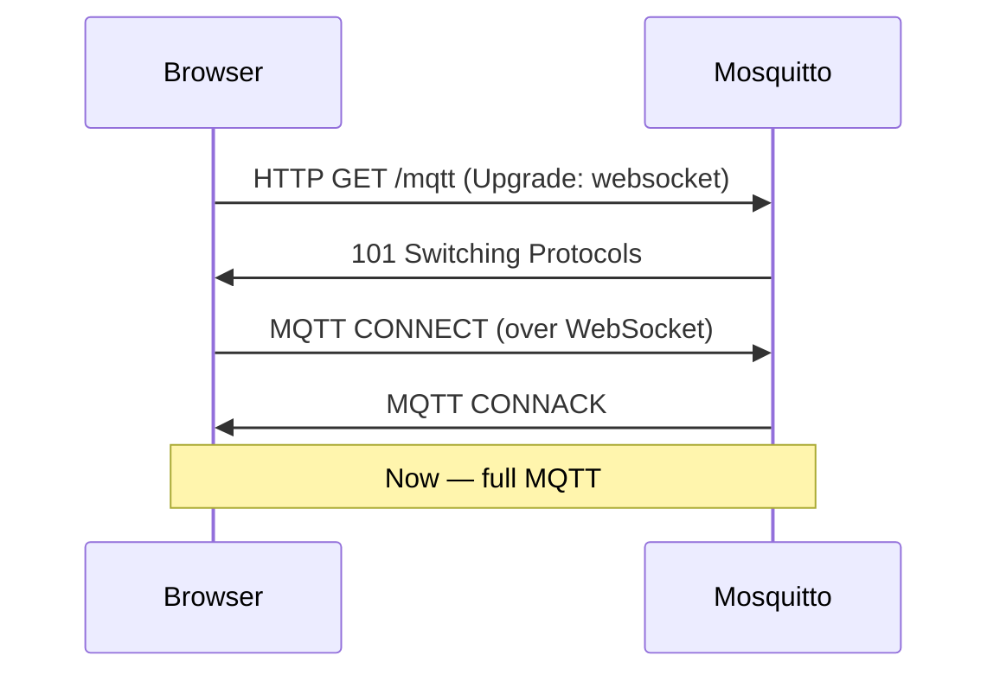
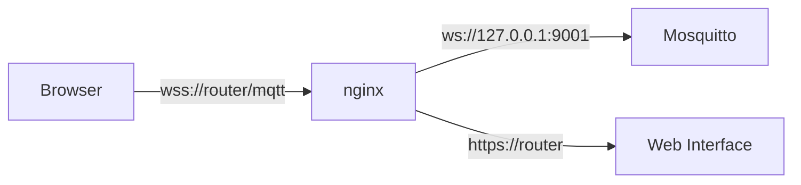
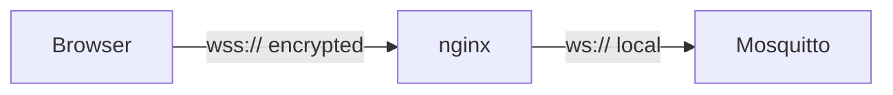

# Level 9: WebSockets in Mosquitto — Detailed Theory

## Why browsers can't work directly with MQTT

Imagine MQTT/TCP as a phone line. A browser is a guest in a hotel who is only allowed to use the hotel's internal phone system (HTTP/HTTPS). To call an outside line, the guest needs an adapter — and WebSocket plays exactly that role.

Technically: the browser runs in a "sandbox" and has no access to raw TCP sockets. The only way to establish a bidirectional channel is WebSocket, which starts as an HTTP request (GET + Upgrade) and switches to a persistent connection.



## How Mosquitto implements WebSocket

Mosquitto doesn't run a separate web server. Internally — libwebsockets, which can:
1. Accept an HTTP connection
2. Perform a WebSocket upgrade
3. Pass data to the MQTT stack as regular bytes

From the MQTT protocol perspective, nothing changes — the same CONNECT, PUBLISH, SUBSCRIBE packets, just wrapped in WebSocket frames.

## Listener configuration — detailed breakdown

```conf
# /etc/mosquitto/mosquitto.conf

# ============================================
# Listener 1: regular MQTT (for IoT devices)
# ============================================
listener 1883
protocol mqtt
# Bind to LAN interface only (more secure):
bind_address 192.168.1.1

# ============================================
# Listener 2: WebSocket (for browsers)
# ============================================
listener 9001
protocol websockets
# Can bind to localhost if nginx proxies:
# bind_address 127.0.0.1

# ============================================
# Common security settings
# ============================================
allow_anonymous false
password_file /etc/mosquitto/passwd
acl_file /etc/mosquitto/acl
```

### The `per_listener_settings` directive

By default, all listeners share one authentication configuration. If you need different rules:

```conf
per_listener_settings true

listener 1883
protocol mqtt
allow_anonymous true   # IoT devices without password (internal network)

listener 9001
protocol websockets
allow_anonymous false  # Browsers — password required
password_file /etc/mosquitto/passwd
```

> ⚠️ `per_listener_settings true` is a global directive and must appear before the first `listener`.

## WebSocket with TLS (WSS)

For production, WSS (`wss://`) is needed, otherwise passwords are transmitted in plain text:

```conf
listener 9002
protocol websockets
cafile /etc/mosquitto/ca.crt
certfile /etc/mosquitto/server.crt
keyfile /etc/mosquitto/server.key
tls_version tlsv1.2
```

On the client:
```javascript
const client = mqtt.connect('wss://192.168.1.1:9002', { ... })
```

## Reverse Proxy: why and when it's needed

Direct browser connection to `ws://router:9001` works, but has limitations:
- Need to open an extra port in the firewall
- No SSL termination in one place
- No rate limiting, access logging

The nginx approach:



### nginx — full configuration

```nginx
# /etc/nginx/nginx.conf
worker_processes 1;  # On OpenWRT — one worker

events { worker_connections 64; }

http {
  # Map for detecting WebSocket connections
  map $http_upgrade $connection_upgrade {
    default upgrade;
    ''      close;
  }

  server {
    listen 80;
    listen 443 ssl;
    server_name _;

    ssl_certificate     /etc/nginx/ssl/server.crt;
    ssl_certificate_key /etc/nginx/ssl/server.key;

    # HTTP -> HTTPS redirect
    if ($scheme = http) {
      return 301 https://$host$request_uri;
    }

    # MQTT WebSocket proxy
    location /mqtt {
      proxy_pass http://127.0.0.1:9001;
      proxy_http_version 1.1;
      proxy_set_header Upgrade $http_upgrade;
      proxy_set_header Connection $connection_upgrade;
      proxy_set_header Host $host;
      proxy_set_header X-Real-IP $remote_addr;

      # Long-lived connections (MQTT persistent session)
      proxy_read_timeout 86400s;
      proxy_send_timeout 86400s;
    }

    # LuCI web interface
    location / {
      proxy_pass http://127.0.0.1:80;
    }
  }
}
```

### uhttpd: limitations

uhttpd (OpenWRT's built-in web server) **does not support** WebSocket proxying. Options:
1. Install nginx: `opkg install nginx`
2. Connect to Mosquitto directly (open port in firewall)
3. Use stunnel for SSL termination

## MQTT.js — detailed breakdown

MQTT.js is the most popular JavaScript library. Works in browsers and Node.js.

```html
<!-- From CDN (recommended to pin the version) -->
<script src="https://unpkg.com/mqtt@5.0.5/dist/mqtt.min.js"></script>
```

### Basic connection

```javascript
const client = mqtt.connect('ws://192.168.1.1:9001', {
  // Unique client identifier (required)
  clientId: 'dashboard-' + Date.now(),

  // Authentication
  username: 'webuser',
  password: 'webpass',

  // Connection settings
  keepalive: 60,        // heartbeat every 60 seconds
  clean: true,          // don't store session after disconnect
  connectTimeout: 4000, // connection timeout

  // Auto-reconnect
  reconnectPeriod: 2000,   // attempt every 2 seconds
  reconnectPeriodMax: 30000 // maximum 30 seconds
})
```

### Handling events

```javascript
// Successful connection
client.on('connect', (connack) => {
  console.log('Connected, session present:', connack.sessionPresent)

  // Subscribe with callback
  client.subscribe([
    { topic: 'sensors/+/temperature', qos: 1 },
    { topic: 'home/+/+', qos: 0 },
  ], (err, granted) => {
    if (err) return console.error('Subscribe failed:', err)
    granted.forEach(({ topic, qos }) =>
      console.log(`Subscribed to ${topic} with QoS ${qos}`)
    )
  })
})

// Receiving messages
client.on('message', (topic, payload, packet) => {
  // payload is a Buffer, needs conversion
  const message = payload.toString()
  const retained = packet.retain
  const qos = packet.qos

  console.log(`[${topic}] ${message} (QoS ${qos}, retained: ${retained})`)
})

// Publishing
client.publish('home/cmd/light1', 'ON', {
  qos: 1,
  retain: false,
}, (err) => {
  if (err) console.error('Publish failed:', err)
})

// Disconnect client
client.end(false, () => console.log('Disconnected'))
```

### Pattern: dynamic dashboard

```javascript
// Wrapper class for convenient UI usage
class MqttDashboard {
  constructor(brokerUrl, options) {
    this.client = mqtt.connect(brokerUrl, options)
    this.handlers = new Map()

    this.client.on('message', (topic, payload) => {
      // Match topic with subscription patterns
      for (const [pattern, handler] of this.handlers) {
        if (this.matchTopic(pattern, topic)) {
          handler(topic, payload.toString())
        }
      }
    })
  }

  subscribe(topicPattern, handler) {
    this.client.subscribe(topicPattern, { qos: 1 })
    this.handlers.set(topicPattern, handler)
  }

  matchTopic(pattern, topic) {
    // Simple wildcard matching implementation
    const regexStr = pattern
      .replace(/\+/g, '[^/]+')
      .replace(/#/, '.+')
    return new RegExp('^' + regexStr + '$').test(topic)
  }
}

// Usage:
const dashboard = new MqttDashboard('ws://192.168.1.1:9001', {
  username: 'user', password: 'pass'
})

dashboard.subscribe('sensors/+/temperature', (topic, value) => {
  const room = topic.split('/')[1]
  updateTemperatureWidget(room, parseFloat(value))
})
```

## Eclipse Paho: comparison with MQTT.js

| Characteristic | MQTT.js | Eclipse Paho |
|---|---|---|
| Active development | Yes | Slow |
| MQTT v5 | Yes | No |
| TypeScript | Yes (built-in) | Weak |
| Size (minified) | ~50 KB | ~100 KB |
| Auto-reconnect | Yes | No (manual) |
| Recommended | Yes | For legacy |

## WebSocket MQTT security

### CORS for WebSocket

WebSocket is not subject to CORS in the classical sense, but the browser checks `Origin`. Mosquitto only checks the `Host` header, so use nginx for additional protection:

```nginx
location /mqtt {
  # Allow only from your domain
  if ($http_origin !~* "^https?://192\.168\.1\.") {
    return 403;
  }
  proxy_pass http://127.0.0.1:9001;
  ...
}
```

### Always use WSS in production



Inside the router, traffic travels in the clear (ws://), but this is safe since it's local. Encryption is only needed for the external channel.

## Troubleshooting

```bash
# 1. Is Mosquitto listening on the port?
netstat -tlnp | grep 9001
# Expect: tcp  0  0 0.0.0.0:9001  0.0.0.0:*  LISTEN

# 2. Does the firewall allow it?
iptables -L INPUT -n | grep 9001

# 3. Detailed Mosquitto log:
mosquitto -c /etc/mosquitto/mosquitto.conf -v
# Look for: "Opening websockets listen socket on port 9001."

# 4. Manual WebSocket handshake check:
curl -v -N -H "Upgrade: websocket" \
  -H "Connection: Upgrade" \
  -H "Sec-WebSocket-Key: dGhlIHNhbXBsZSBub25jZQ==" \
  -H "Sec-WebSocket-Version: 13" \
  http://192.168.1.1:9001/

# Expect: HTTP/1.1 101 Switching Protocols

# 5. nginx error log:
tail -f /var/log/nginx/error.log
```

## ⚠️ Common beginner mistakes

### Mistake 1: forgot to specify `protocol websockets`

```conf
# Wrong:
listener 9001
# Without protocol — this is MQTT/TCP, browser won't connect

# Correct:
listener 9001
protocol websockets
```

Symptom: `WebSocket connection failed: Error during WebSocket handshake`.

### Mistake 2: wrong URL in the client

```javascript
// Wrong — MQTT/TCP, not WebSocket:
mqtt.connect('mqtt://192.168.1.1:9001')

// Correct — WebSocket:
mqtt.connect('ws://192.168.1.1:9001')
// Or with TLS:
mqtt.connect('wss://192.168.1.1:9002')
```

### Mistake 3: nginx without proper headers

```nginx
# Wrong — no WebSocket upgrade:
location /mqtt {
  proxy_pass http://127.0.0.1:9001;
}

# Correct:
location /mqtt {
  proxy_pass http://127.0.0.1:9001;
  proxy_http_version 1.1;
  proxy_set_header Upgrade $http_upgrade;
  proxy_set_header Connection "upgrade";
}
```

Symptom: nginx returns 400 Bad Request or the connection drops immediately.

### Mistake 4: short proxy timeout

```nginx
# Wrong — nginx closes WS after 60 seconds:
# (default proxy_read_timeout = 60s)

# Correct:
proxy_read_timeout 3600s;   # 1 hour
proxy_send_timeout 3600s;
```

### Mistake 5: duplicate clientIds

```javascript
// Wrong — multiple tabs with the same ID:
clientId: 'my-dashboard'  // Second tab will kick the first!

// Correct:
clientId: 'dashboard-' + Math.random().toString(16).slice(2, 8)
```

## WebSocket performance on OpenWRT

WebSocket adds negligible overhead (~10 bytes per frame) compared to raw TCP. On OpenWRT, more important:

- Limit simultaneous WS connections: `max_connections 50`
- Use `clean: true` for browsers (no point storing sessions)
- Don't use QoS 2 from the browser — too many round-trips

```conf
# Limit for the WS listener:
listener 9001
protocol websockets
max_connections 20
```
