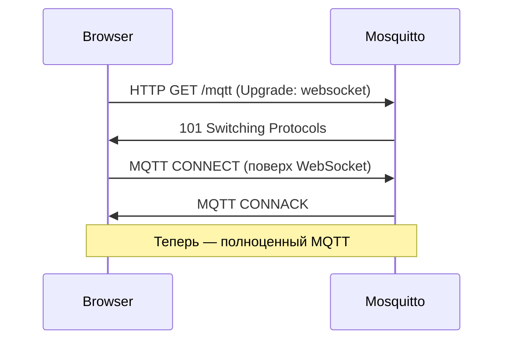
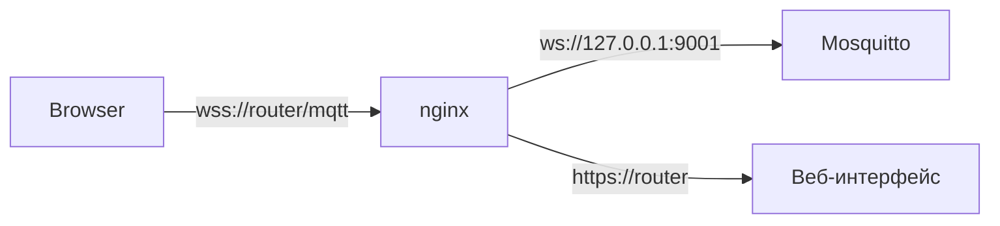
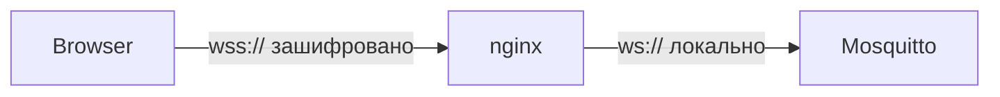

# Уровень 9: WebSockets в Mosquitto — Развёрнутая теория

## Почему браузер не может работать напрямую с MQTT

Представьте, что MQTT/TCP — это телефонная линия. Браузер — гость в отеле, которому разрешено пользоваться только внутренней телефонной системой отеля (HTTP/HTTPS). Чтобы гость позвонил на обычный телефон, нужен переходник — и WebSocket как раз играет роль такого переходника.

Технически: браузер работает в "песочнице" и не имеет доступа к raw TCP-сокетам. Единственный способ установить двунаправленный канал — WebSocket, который начинается как HTTP-запрос (GET + Upgrade) и переключается в постоянное соединение.



## Как Mosquitto реализует WebSocket

Mosquitto не запускает отдельный веб-сервер. Внутри — libwebsockets, которая умеет:
1. Принять HTTP-соединение
2. Сделать WebSocket upgrade
3. Передать данные в MQTT-стек как обычные байты

С точки зрения MQTT-протокола ничего не меняется — те же CONNECT, PUBLISH, SUBSCRIBE пакеты, просто завёрнутые в WebSocket-фреймы.

## Настройка listener — детальный разбор

```conf
# /etc/mosquitto/mosquitto.conf

# ============================================
# Слушатель 1: обычный MQTT (для IoT-устройств)
# ============================================
listener 1883
protocol mqtt
# Bind только на LAN-интерфейс (безопаснее):
bind_address 192.168.1.1

# ============================================
# Слушатель 2: WebSocket (для браузеров)
# ============================================
listener 9001
protocol websockets
# Можно bind на localhost, если nginx проксирует:
# bind_address 127.0.0.1

# ============================================
# Общие настройки безопасности
# ============================================
allow_anonymous false
password_file /etc/mosquitto/passwd
acl_file /etc/mosquitto/acl
```

### Директива `per_listener_settings`

По умолчанию все слушатели делят одну конфигурацию аутентификации. Если нужны разные правила:

```conf
per_listener_settings true

listener 1883
protocol mqtt
allow_anonymous true   # IoT-устройства без пароля (внутренняя сеть)

listener 9001
protocol websockets
allow_anonymous false  # Браузеры — только с паролем
password_file /etc/mosquitto/passwd
```

> ⚠️ `per_listener_settings true` — глобальная директива, должна быть до первого `listener`.

## WebSocket с TLS (WSS)

Для продакшена нужен WSS (`wss://`), иначе пароли передаются открытым текстом:

```conf
listener 9002
protocol websockets
cafile /etc/mosquitto/ca.crt
certfile /etc/mosquitto/server.crt
keyfile /etc/mosquitto/server.key
tls_version tlsv1.2
```

На клиенте:
```javascript
const client = mqtt.connect('wss://192.168.1.1:9002', { ... })
```

## Reverse Proxy: зачем и когда нужен

Прямое подключение браузера к `ws://router:9001` работает, но имеет ограничения:
- Нужно открывать лишний порт в firewall
- Нет SSL-терминации в одном месте
- Нет rate limiting, логирования доступа

Схема с nginx:



### nginx — полная конфигурация

```nginx
# /etc/nginx/nginx.conf
worker_processes 1;  # На OpenWRT — один воркер

events { worker_connections 64; }

http {
  # Карта для определения WebSocket-соединений
  map $http_upgrade $connection_upgrade {
    default upgrade;
    ''      close;
  }

  server {
    listen 80;
    listen 443 ssl;
    server_name _;

    ssl_certificate     /etc/nginx/ssl/server.crt;
    ssl_certificate_key /etc/nginx/ssl/server.key;

    # Редирект HTTP -> HTTPS
    if ($scheme = http) {
      return 301 https://$host$request_uri;
    }

    # MQTT WebSocket proxy
    location /mqtt {
      proxy_pass http://127.0.0.1:9001;
      proxy_http_version 1.1;
      proxy_set_header Upgrade $http_upgrade;
      proxy_set_header Connection $connection_upgrade;
      proxy_set_header Host $host;
      proxy_set_header X-Real-IP $remote_addr;

      # Долгоживущие соединения (MQTT persistent session)
      proxy_read_timeout 86400s;
      proxy_send_timeout 86400s;
    }

    # Веб-интерфейс LuCI
    location / {
      proxy_pass http://127.0.0.1:80;
    }
  }
}
```

### uhttpd: ограничения

uhttpd (встроенный веб-сервер OpenWRT) **не поддерживает** WebSocket проксирование. Варианты:
1. Установить nginx: `opkg install nginx`
2. Подключаться к Mosquitto напрямую (открыть порт в firewall)
3. Использовать stunnel для SSL-терминации

## MQTT.js — детальный разбор

MQTT.js — наиболее популярная JavaScript-библиотека. Работает в браузере и Node.js.

```html
<!-- Из CDN (рекомендуется зафиксировать версию) -->
<script src="https://unpkg.com/mqtt@5.0.5/dist/mqtt.min.js"></script>
```

### Базовое подключение

```javascript
const client = mqtt.connect('ws://192.168.1.1:9001', {
  // Уникальный идентификатор клиента (обязателен)
  clientId: 'dashboard-' + Date.now(),

  // Аутентификация
  username: 'webuser',
  password: 'webpass',

  // Настройки соединения
  keepalive: 60,        // heartbeat каждые 60 секунд
  clean: true,          // не хранить сессию после отключения
  connectTimeout: 4000, // таймаут подключения

  // Авто-переподключение
  reconnectPeriod: 2000,   // попытка каждые 2 секунды
  reconnectPeriodMax: 30000 // максимум 30 секунд
})
```

### Обработка событий

```javascript
// Успешное подключение
client.on('connect', (connack) => {
  console.log('Connected, session present:', connack.sessionPresent)
  
  // Подписка с callback
  client.subscribe([
    { topic: 'sensors/+/temperature', qos: 1 },
    { topic: 'home/+/+', qos: 0 },
  ], (err, granted) => {
    if (err) return console.error('Subscribe failed:', err)
    granted.forEach(({ topic, qos }) =>
      console.log(`Subscribed to ${topic} with QoS ${qos}`)
    )
  })
})

// Получение сообщений
client.on('message', (topic, payload, packet) => {
  // payload — Buffer, нужно конвертировать
  const message = payload.toString()
  const retained = packet.retain
  const qos = packet.qos
  
  console.log(`[${topic}] ${message} (QoS ${qos}, retained: ${retained})`)
})

// Публикация
client.publish('home/cmd/light1', 'ON', {
  qos: 1,
  retain: false,
}, (err) => {
  if (err) console.error('Publish failed:', err)
})

// Отключение клиента
client.end(false, () => console.log('Disconnected'))
```

### Паттерн: динамический дашборд

```javascript
// Класс-обёртка для удобного использования в UI
class MqttDashboard {
  constructor(brokerUrl, options) {
    this.client = mqtt.connect(brokerUrl, options)
    this.handlers = new Map()
    
    this.client.on('message', (topic, payload) => {
      // Матчим топик с паттернами подписок
      for (const [pattern, handler] of this.handlers) {
        if (this.matchTopic(pattern, topic)) {
          handler(topic, payload.toString())
        }
      }
    })
  }

  subscribe(topicPattern, handler) {
    this.client.subscribe(topicPattern, { qos: 1 })
    this.handlers.set(topicPattern, handler)
  }

  matchTopic(pattern, topic) {
    // Простая реализация wildcard matching
    const regexStr = pattern
      .replace(/\+/g, '[^/]+')
      .replace(/#/, '.+')
    return new RegExp('^' + regexStr + '$').test(topic)
  }
}

// Использование:
const dashboard = new MqttDashboard('ws://192.168.1.1:9001', {
  username: 'user', password: 'pass'
})

dashboard.subscribe('sensors/+/temperature', (topic, value) => {
  const room = topic.split('/')[1]
  updateTemperatureWidget(room, parseFloat(value))
})
```

## Eclipse Paho: сравнение с MQTT.js

| Характеристика | MQTT.js | Eclipse Paho |
|---|---|---|
| Активное развитие | Да | Медленно |
| MQTT v5 | Да | Нет |
| TypeScript | Да (встроен) | Слабо |
| Размер (minified) | ~50 KB | ~100 KB |
| Авто-переподключение | Да | Нет (нужно вручную) |
| Рекомендуется | Да | Для legacy |

## Безопасность WebSocket MQTT

### CORS для WebSocket

WebSocket не подвержен CORS в классическом смысле, но браузер проверяет `Origin`. Mosquitto проверяет только заголовок `Host`, поэтому для дополнительной защиты используйте nginx:

```nginx
location /mqtt {
  # Разрешить только с вашего домена
  if ($http_origin !~* "^https?://192\.168\.1\.") {
    return 403;
  }
  proxy_pass http://127.0.0.1:9001;
  ...
}
```

### Всегда WSS в продакшене



Внутри роутера трафик идёт в открытом виде (ws://), но это безопасно, т.к. локально. Шифрование нужно только для внешнего канала.

## Диагностика проблем

```bash
# 1. Mosquitto слушает на порту?
netstat -tlnp | grep 9001
# Ожидаем: tcp  0  0 0.0.0.0:9001  0.0.0.0:*  LISTEN

# 2. Firewall разрешает?
iptables -L INPUT -n | grep 9001

# 3. Детальный лог Mosquitto:
mosquitto -c /etc/mosquitto/mosquitto.conf -v
# Ищем: "Opening websockets listen socket on port 9001."

# 4. Ручная проверка WebSocket handshake:
curl -v -N -H "Upgrade: websocket" \
  -H "Connection: Upgrade" \
  -H "Sec-WebSocket-Key: dGhlIHNhbXBsZSBub25jZQ==" \
  -H "Sec-WebSocket-Version: 13" \
  http://192.168.1.1:9001/

# Ожидаем: HTTP/1.1 101 Switching Protocols

# 5. nginx лог ошибок:
tail -f /var/log/nginx/error.log
```

## ⚠️ Типичные ошибки начинающих

### Ошибка 1: забыли указать `protocol websockets`

```conf
# Неправильно:
listener 9001
# Без protocol — это MQTT/TCP, браузер не подключится

# Правильно:
listener 9001
protocol websockets
```

Симптом: `WebSocket connection failed: Error during WebSocket handshake`.

### Ошибка 2: неправильный URL в клиенте

```javascript
// Неправильно — MQTT/TCP, не WebSocket:
mqtt.connect('mqtt://192.168.1.1:9001')

// Правильно — WebSocket:
mqtt.connect('ws://192.168.1.1:9001')
// Или с TLS:
mqtt.connect('wss://192.168.1.1:9002')
```

### Ошибка 3: nginx без правильных заголовков

```nginx
# Неправильно — нет WebSocket upgrade:
location /mqtt {
  proxy_pass http://127.0.0.1:9001;
}

# Правильно:
location /mqtt {
  proxy_pass http://127.0.0.1:9001;
  proxy_http_version 1.1;
  proxy_set_header Upgrade $http_upgrade;
  proxy_set_header Connection "upgrade";
}
```

Симптом: nginx возвращает 400 Bad Request или соединение обрывается сразу.

### Ошибка 4: короткий таймаут proxy

```nginx
# Неправильно — nginx закрывает WS через 60 секунд:
# (по умолчанию proxy_read_timeout = 60s)

# Правильно:
proxy_read_timeout 3600s;   # 1 час
proxy_send_timeout 3600s;
```

### Ошибка 5: одинаковые clientId

```javascript
// Неправильно — несколько вкладок с одним ID:
clientId: 'my-dashboard'  // Вторая вкладка выбьет первую!

// Правильно:
clientId: 'dashboard-' + Math.random().toString(16).slice(2, 8)
```

## Производительность WebSocket на OpenWRT

WebSocket добавляет незначительный оверхед (~10 байт на фрейм) по сравнению с raw TCP. На OpenWRT важнее:

- Ограничьте количество одновременных WS-соединений: `max_connections 50`
- Используйте `clean: true` для браузеров (нет смысла хранить сессию)
- Не используйте QoS 2 из браузера — слишком много round-trip

```conf
# Лимит для WS-слушателя:
listener 9001
protocol websockets
max_connections 20
```
