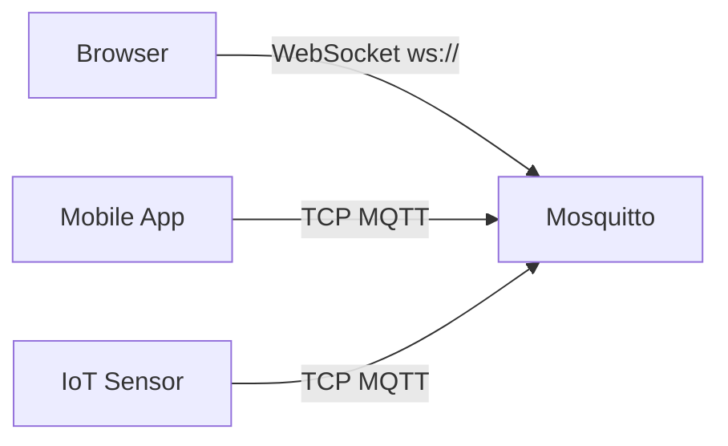

# Level 9: WebSockets in Mosquitto

## Why are WebSockets needed?

MQTT runs over TCP — browsers cannot open "raw" TCP connections. WebSocket is an HTTP connection that upgrades to a bidirectional channel. Mosquitto supports MQTT-over-WebSocket out of the box.



## Configuring the WebSocket listener

```conf
# /etc/mosquitto/mosquitto.conf

# Regular MQTT (TCP)
listener 1883
protocol mqtt

# WebSocket MQTT
listener 9001
protocol websockets

# General authentication
allow_anonymous false
password_file /etc/mosquitto/passwd
```

> 📌 Each `listener` inherits default authentication settings, or you can set `per_listener_settings true` for separate configurations.

## Ports

| Protocol | Port | Description |
|---|---|---|
| MQTT/TCP | 1883 | Regular MQTT |
| MQTT/TLS | 8883 | Encrypted MQTT |
| MQTT/WS | 9001 | WebSocket MQTT |
| MQTT/WSS | 9002 | WebSocket + TLS |

## Reverse proxy via nginx

If Mosquitto only listens on `127.0.0.1:9001`, nginx proxies external traffic:

```nginx
location /mqtt {
  proxy_pass http://127.0.0.1:9001;
  proxy_http_version 1.1;
  proxy_set_header Upgrade $http_upgrade;
  proxy_set_header Connection "upgrade";
  proxy_read_timeout 3600s;
}
```

> ⚠️ Without the `Upgrade` and `Connection` headers, the WebSocket handshake will fail.

## Web client with MQTT.js

```html
<script src="https://unpkg.com/mqtt/dist/mqtt.min.js"></script>
<script>
const client = mqtt.connect('ws://192.168.1.1:9001', {
  clientId: 'web-' + Math.random().toString(16).slice(2),
  username: 'user', password: 'pass',
})

client.on('connect', () => client.subscribe('sensors/#'))
client.on('message', (topic, msg) => console.log(topic, msg.toString()))
</script>
```

## Verifying operation

```bash
# Is the port listening?
netstat -tlnp | grep 9001

# WebSocket connection (websocat utility):
websocat ws://192.168.1.1:9001/

# Mosquitto log:
logread | grep mosquitto
```

## Common errors

| Error | Cause |
|---|---|
| `Connection refused` | Port not open or wrong `protocol` |
| 403 from nginx | Missing Upgrade/Connection headers |
| `Not authorized` | Authentication not configured for WS listener |
