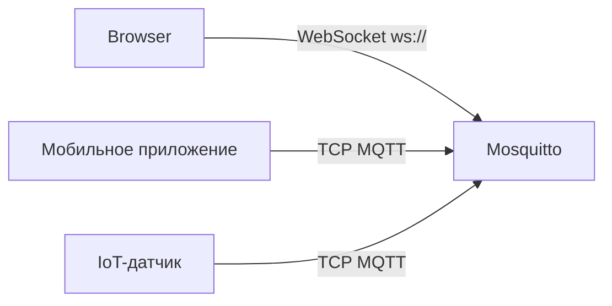

# Уровень 9: WebSockets в Mosquitto

## Зачем нужны WebSockets?

MQTT работает поверх TCP — браузеры не умеют открывать "голые" TCP-соединения. WebSocket — это HTTP-соединение, которое переключается в режим двунаправленного канала. Mosquitto поддерживает MQTT-over-WebSocket "из коробки".



## Настройка WebSocket-слушателя

```conf
# /etc/mosquitto/mosquitto.conf

# Обычный MQTT (TCP)
listener 1883
protocol mqtt

# WebSocket MQTT
listener 9001
protocol websockets

# Общая аутентификация
allow_anonymous false
password_file /etc/mosquitto/passwd
```

> 📌 Каждый `listener` наследует настройки аутентификации по умолчанию или можно задать `per_listener_settings true` для раздельных настроек.

## Порты

| Протокол | Порт | Описание |
|---|---|---|
| MQTT/TCP | 1883 | Обычный MQTT |
| MQTT/TLS | 8883 | MQTT с шифрованием |
| MQTT/WS | 9001 | WebSocket MQTT |
| MQTT/WSS | 9002 | WebSocket + TLS |

## Reverse proxy через nginx

Если Mosquitto слушает только на `127.0.0.1:9001`, nginx проксирует внешний трафик:

```nginx
location /mqtt {
  proxy_pass http://127.0.0.1:9001;
  proxy_http_version 1.1;
  proxy_set_header Upgrade $http_upgrade;
  proxy_set_header Connection "upgrade";
  proxy_read_timeout 3600s;
}
```

> ⚠️ Без заголовков `Upgrade` и `Connection` WebSocket-рукопожатие не пройдёт.

## Веб-клиент MQTT.js

```html
<script src="https://unpkg.com/mqtt/dist/mqtt.min.js"></script>
<script>
const client = mqtt.connect('ws://192.168.1.1:9001', {
  clientId: 'web-' + Math.random().toString(16).slice(2),
  username: 'user', password: 'pass',
})

client.on('connect', () => client.subscribe('sensors/#'))
client.on('message', (topic, msg) => console.log(topic, msg.toString()))
</script>
```

## Проверка работы

```bash
# Порт слушает?
netstat -tlnp | grep 9001

# WebSocket-соединение (утилита websocat):
websocat ws://192.168.1.1:9001/

# Лог Mosquitto:
logread | grep mosquitto
```

## Типичные ошибки

| Ошибка | Причина |
|---|---|
| `Connection refused` | Порт не открыт или неверный `protocol` |
| 403 от nginx | Нет заголовков Upgrade/Connection |
| `Not authorized` | Аутентификация не настроена для WS-слушателя |
