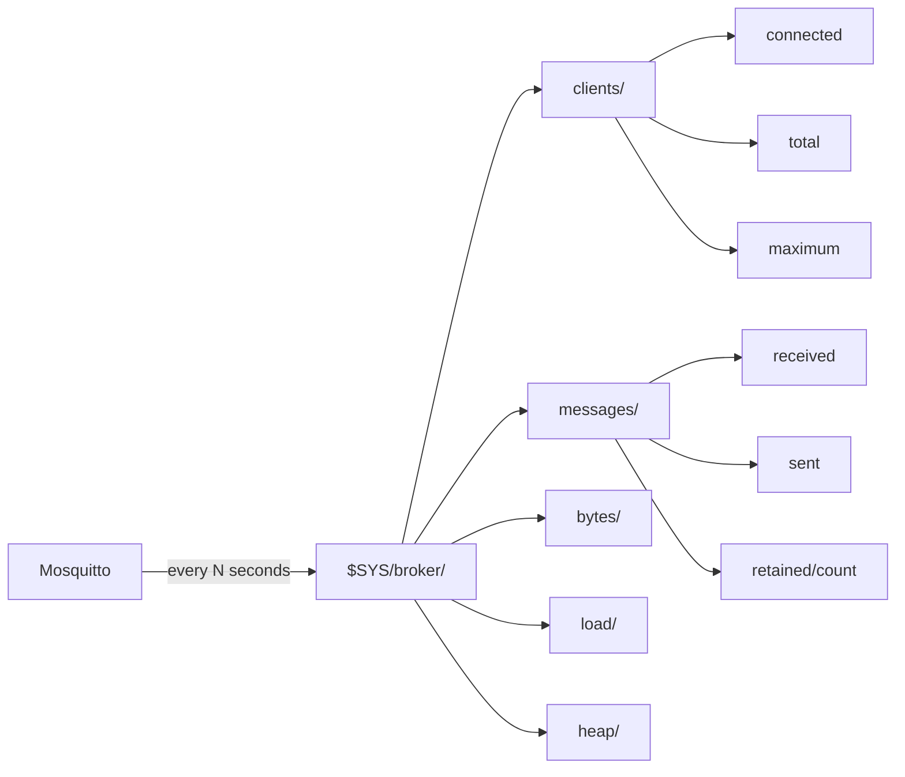
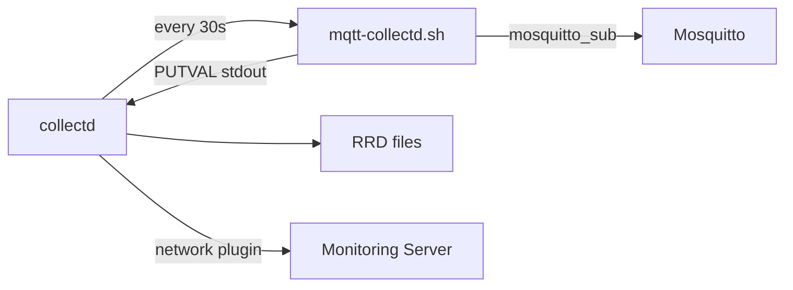

# Level 10: Mosquitto Monitoring — Detailed Theory

## Why monitoring is critical for embedded systems

An OpenWRT router is not a datacenter server. It has no swap, RAM is measured in megabytes, and flash memory wears out from frequent writes. Without monitoring, you risk:

- **OOM (Out of Memory)**: Mosquitto eats all free RAM → the router freezes
- **Flash wear**: too frequent persistence writes → flash dies within a year
- **Silent failures**: the broker stops accepting connections, but you don't know

Analogy: monitoring is a car's dashboard. You can drive without it, but when the warning light comes on — it may be too late.

## $SYS — broker's built-in telemetry

Mosquitto publishes metrics to the special `$SYS/broker/` topic from the very first start. This is not an "extra feature" — it's part of the MQTT standard (section A.2 of the specification).



### Configuring the publish interval

```conf
# /etc/mosquitto/mosquitto.conf
sys_interval 30   # seconds (default 10, 0 = disable)
```

On a router with 64 MB RAM, `sys_interval 30` or higher is recommended — each $SYS publication generates messages for all subscribers.

### $SYS access rights

By default, clients can subscribe to `$SYS/#`. If ACL is enabled:

```conf
# /etc/mosquitto/acl
# User monitor can read $SYS:
user monitor
topic read $SYS/#

# Regular users — no access:
user sensor1
topic readwrite sensors/#
```

## Complete metrics reference

### Group: Clients

```
$SYS/broker/clients/connected      — current connection count
$SYS/broker/clients/total          — total clients (incl. disconnected with persistent session)
$SYS/broker/clients/maximum        — maximum ever recorded
$SYS/broker/clients/disconnected   — clients with persistent session, currently offline
$SYS/broker/clients/expired        — expired persistent sessions (Mosquitto 2.x)
```

### Group: Messages

```
$SYS/broker/messages/received                — total received since start
$SYS/broker/messages/sent                    — total sent since start
$SYS/broker/messages/publish/received        — PUBLISH packets received
$SYS/broker/messages/publish/sent            — PUBLISH packets sent
$SYS/broker/messages/publish/dropped         — dropped (queue limit exceeded)
$SYS/broker/messages/retained/count         — retained messages in memory
$SYS/broker/messages/stored                  — messages in queues
```

> ⚠️ `messages/publish/dropped` is a critical metric. If not zero — the broker is overloaded.

### Group: Traffic

```
$SYS/broker/bytes/received           — bytes received
$SYS/broker/bytes/sent               — bytes sent
$SYS/broker/publish/bytes/received   — bytes in PUBLISH packets received
$SYS/broker/publish/bytes/sent       — bytes in outgoing PUBLISH packets
```

### Group: Load (moving averages)

```
$SYS/broker/load/messages/received/1min    — msg/min over the last minute
$SYS/broker/load/messages/received/5min    — msg/min over 5 minutes
$SYS/broker/load/messages/received/15min   — msg/min over 15 minutes
$SYS/broker/load/connections/1min          — connections/min over 1 minute
$SYS/broker/load/bytes/received/1min       — bytes/sec (over 1 minute)
```

### Group: Broker resources

```
$SYS/broker/heap/current       — current heap (bytes)
$SYS/broker/heap/maximum       — maximum heap ever
$SYS/broker/uptime             — "86400 seconds"
$SYS/broker/version            — "mosquitto version 2.0.18"
$SYS/broker/timestamp          — broker build time
```

### Group: Subscriptions

```
$SYS/broker/subscriptions/count    — active subscriptions
```

## Shell scripts: practical patterns

### Reading a single metric reliably

```sh
get_metric() {
  local topic="$1"
  local timeout="${2:-5}"

  mosquitto_sub \
    -h "$BROKER" \
    -u "$USER" \
    -P "$PASS" \
    -t "$topic" \
    -C 1 \           # Get 1 message and exit
    -W "$timeout" \  # Timeout in seconds
    --quiet \        # No service output
    2>/dev/null || echo "0"
}
```

> 💡 `-C 1` (count) is the key flag. Without it, the script will wait forever.

### Real-time monitoring (watch)

```sh
#!/bin/sh
# Update every 10 seconds:
while true; do
  clear
  echo "=== MQTT Monitor $(date) ==="
  echo "Clients:     $(get_metric '$SYS/broker/clients/connected')"
  echo "Messages/1m: $(get_metric '$SYS/broker/load/messages/received/1min')"
  echo "Heap:        $(get_metric '$SYS/broker/heap/current') bytes"
  echo "Dropped:     $(get_metric '$SYS/broker/messages/publish/dropped')"
  sleep 10
done
```

### Smart alert with deduplication

```sh
#!/bin/sh
# Don't spam the same alert repeatedly

ALERT_FILE="/tmp/mqtt-alert-state"
CLIENTS=$(get_metric '$SYS/broker/clients/connected')
PREV_ALERT=$(cat "$ALERT_FILE" 2>/dev/null || echo "0")

if [ "$CLIENTS" -gt 100 ]; then
  if [ "$PREV_ALERT" = "0" ]; then
    # First time — send alert
    mosquitto_pub -t 'system/alert' -m "Too many clients: $CLIENTS"
    echo "1" > "$ALERT_FILE"
  fi
else
  # Back to normal — reset state
  echo "0" > "$ALERT_FILE"
fi
```

### CSV logging for history

```sh
#!/bin/sh
LOG="/var/log/mqtt-metrics.csv"
HEADER="timestamp,clients,msg_rx,msg_tx,heap,retained,dropped"

[ ! -f "$LOG" ] && echo "$HEADER" > "$LOG"

TS=$(date +%s)
CLIENTS=$(get_metric '$SYS/broker/clients/connected')
MSG_RX=$(get_metric '$SYS/broker/messages/received')
MSG_TX=$(get_metric '$SYS/broker/messages/sent')
HEAP=$(get_metric '$SYS/broker/heap/current')
RETAINED=$(get_metric '$SYS/broker/messages/retained/count')
DROPPED=$(get_metric '$SYS/broker/messages/publish/dropped')

printf "%s,%s,%s,%s,%s,%s,%s\n" \
  "$TS" "$CLIENTS" "$MSG_RX" "$MSG_TX" "$HEAP" "$RETAINED" "$DROPPED" \
  >> "$LOG"

# Rotation: 7 days at 1 entry/minute = 10080 lines
LINES=$(wc -l < "$LOG")
[ "$LINES" -gt 10081 ] && tail -10081 "$LOG" > "$LOG.tmp" && mv "$LOG.tmp" "$LOG"
```

> ⚠️ On OpenWRT, don't write CSV to `/etc/` or `/overlay/` — flash wear. Use `/tmp/` (RAM) or an external USB drive.

## collectd: system-wide metrics view

collectd is a daemon that collects system metrics at a set interval and stores them in RRD files (Round Robin Database). For MQTT, the `exec` plugin is used.

### How it works



### Exec plugin output format

```
PUTVAL "hostname/plugin-instance/type-instance" interval:value
# Or with automatic time (N = now):
PUTVAL "hostname/plugin-instance/type-instance" N:value
```

Examples:
```
PUTVAL "router/mqtt-clients/gauge" N:42
PUTVAL "router/mqtt-messages/derive-rx" N:12847
PUTVAL "router/mqtt-memory/bytes" N:524288
```

Data types:
- `gauge` — instantaneous value (client count)
- `derive` — cumulative counter (total messages)
- `bytes` — same as derive, but for traffic

### Full collectd configuration

```conf
# /etc/collectd.conf

Hostname "openwrt-main"
FQDNLookup false
Interval 30
MaxReadInterval 86400

# Exec plugin — running external scripts
LoadPlugin exec
<Plugin exec>
  # Format: Exec "user" "script_path" [arguments]
  Exec "nobody" "/usr/local/bin/mqtt-collectd.sh"
</Plugin>

# RRD storage:
LoadPlugin rrdtool
<Plugin rrdtool>
  DataDir "/tmp/rrd"  # In RAM — no flash wear
  CacheTimeout 120
  CacheFlush 900
</Plugin>

# System metrics are useful too:
LoadPlugin cpu
LoadPlugin memory
LoadPlugin load

# Send to remote server (optional):
LoadPlugin network
<Plugin network>
  Server "192.168.1.100" "25826"
</Plugin>
```

### Script for the exec plugin

```sh
#!/bin/sh
# /usr/local/bin/mqtt-collectd.sh
# Must be executable: chmod +x

BROKER="localhost"
USER="monitor"
PASS="monpass"
HOST=$(hostname)

get() {
  mosquitto_sub -h "$BROKER" -u "$USER" -P "$PASS" -t "$1" -C 1 -W 3 2>/dev/null || echo "0"
}

CLIENTS=$(get '$SYS/broker/clients/connected')
MSG_RX=$(get '$SYS/broker/messages/received')
MSG_TX=$(get '$SYS/broker/messages/sent')
HEAP=$(get '$SYS/broker/heap/current')
RETAINED=$(get '$SYS/broker/messages/retained/count')
DROPPED=$(get '$SYS/broker/messages/publish/dropped')
SUBS=$(get '$SYS/broker/subscriptions/count')

echo "PUTVAL \"$HOST/mqtt-broker/gauge-clients\" N:$CLIENTS"
echo "PUTVAL \"$HOST/mqtt-broker/gauge-subscriptions\" N:$SUBS"
echo "PUTVAL \"$HOST/mqtt-broker/gauge-retained\" N:$RETAINED"
echo "PUTVAL \"$HOST/mqtt-broker/gauge-dropped\" N:$DROPPED"
echo "PUTVAL \"$HOST/mqtt-broker/derive-messages_rx\" N:$MSG_RX"
echo "PUTVAL \"$HOST/mqtt-broker/derive-messages_tx\" N:$MSG_TX"
echo "PUTVAL \"$HOST/mqtt-broker/bytes-heap\" N:$HEAP"
```

## Integration with external systems

On OpenWRT there's no room for Grafana or Prometheus. But you can:

1. **Send metrics to Influx/Prometheus via MQTT**: a publisher on a PC subscribes to `$SYS/#` and writes to a database
2. **collectd network** → central collectd → Grafana
3. **Simple HTTP API**: bash script publishes JSON to a webhook

```sh
# Send metrics to InfluxDB via HTTP (if curl is available):
CLIENTS=$(get_metric '$SYS/broker/clients/connected')
curl -s -XPOST "http://influx-server:8086/write?db=iot" \
  --data-binary "mqtt,host=router clients=$CLIENTS"
```

## ⚠️ Common beginner mistakes

### Mistake 1: subscribing to $SYS without permissions

```conf
# ACL blocks $SYS for regular users:
user monitor
# Forgot the line:
topic read $SYS/#
```

Symptom: `mosquitto_sub -t '$SYS/#'` returns nothing, but no error. Enable ACL denial logging:

```conf
# mosquitto.conf:
log_type all
```

### Mistake 2: script hangs

```sh
# Bad — no timeout:
mosquitto_sub -t '$SYS/broker/clients/connected' -C 1

# Good:
mosquitto_sub -t '$SYS/broker/clients/connected' -C 1 -W 5
```

### Mistake 3: writing CSV to flash

```sh
# Bad — OpenWRT flash is limited and wears out:
LOG="/etc/mqtt-metrics.csv"

# Good — in RAM:
LOG="/tmp/mqtt-metrics.csv"
# (data is lost on reboot, but flash lives longer)
```

### Mistake 4: collectd exec without chmod

```sh
# collectd exec requires an executable file:
# Bad:
touch /usr/local/bin/mqtt-collectd.sh
# cat ... > file
# Run — doesn't work

# Good:
chmod +x /usr/local/bin/mqtt-collectd.sh
```

### Mistake 5: ignoring messages/dropped

```
$SYS/broker/messages/publish/dropped = 0  — all good
$SYS/broker/messages/publish/dropped > 0  — broker is losing messages!
```

If dropped is growing — reduce load or increase `max_queued_messages` in mosquitto.conf.
