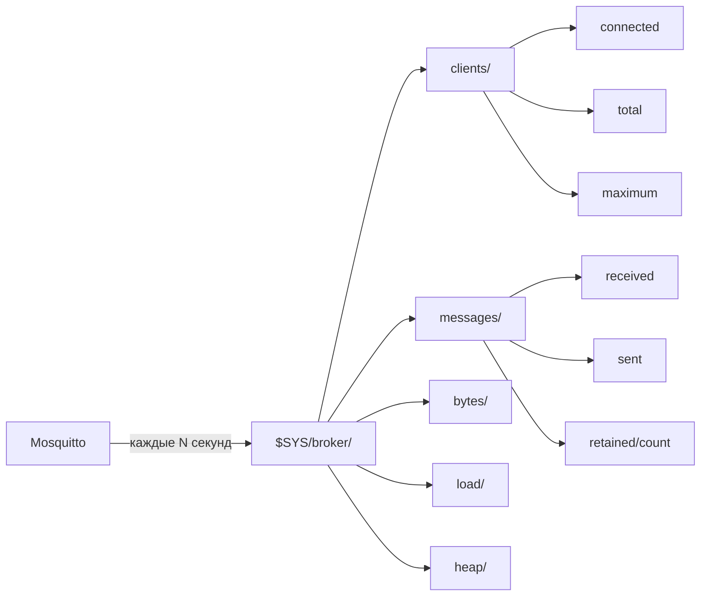
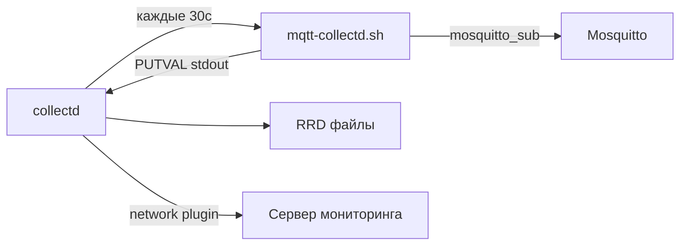

# Уровень 10: Мониторинг Mosquitto — Развёрнутая теория

## Почему мониторинг критичен для embedded-систем

Роутер с OpenWRT — это не сервер в датацентре. У него нет swap, RAM измеряется в мегабайтах, а flash-память изнашивается от частых записей. Без мониторинга вы рискуете:

- **OOM (Out of Memory)**: Mosquitto съест всю свободную память → роутер зависнет
- **Flash wear**: слишком частые записи в persistence → через год flash умрёт
- **Тихие отказы**: брокер перестал принимать соединения, но вы не знаете

Аналогия: мониторинг — это приборная панель автомобиля. Можно ехать без неё, но когда загорится лампочка — может быть уже поздно.

## $SYS — встроенная телеметрия брокера

Mosquitto с самого первого запуска публикует метрики в специальный топик `$SYS/broker/`. Это не "дополнительная фича" — это стандарт MQTT (раздел A.2 спецификации).



### Настройка интервала публикации

```conf
# /etc/mosquitto/mosquitto.conf
sys_interval 30   # секунды (по умолчанию 10, 0 = отключить)
```

На роутере с 64 MB RAM рекомендуется `sys_interval 30` или больше — каждая публикация в $SYS порождает сообщения для всех подписчиков.

### Права доступа к $SYS

По умолчанию клиенты могут подписываться на `$SYS/#`. Если включён ACL:

```conf
# /etc/mosquitto/acl
# Пользователь monitor может читать $SYS:
user monitor
topic read $SYS/#

# Обычные пользователи — нет:
user sensor1
topic readwrite sensors/#
```

## Полный справочник метрик

### Группа: Клиенты

```
$SYS/broker/clients/connected      — текущее число подключений
$SYS/broker/clients/total          — всего клиентов (вкл. отключённые с persistent session)
$SYS/broker/clients/maximum        — максимум за историю работы
$SYS/broker/clients/disconnected   — клиенты с persistent session, сейчас offline
$SYS/broker/clients/expired        — истёкшие persistent sessions (Mosquitto 2.x)
```

### Группа: Сообщения

```
$SYS/broker/messages/received                — всего получено с запуска
$SYS/broker/messages/sent                    — всего отправлено с запуска
$SYS/broker/messages/publish/received        — PUBLISH пакетов получено
$SYS/broker/messages/publish/sent            — PUBLISH пакетов отправлено
$SYS/broker/messages/publish/dropped         — отброшено (превышен лимит очереди)
$SYS/broker/messages/retained/count         — retained сообщений в памяти
$SYS/broker/messages/stored                  — сообщений в очередях
```

> ⚠️ `messages/publish/dropped` — критическая метрика. Если не ноль — брокер перегружен.

### Группа: Трафик

```
$SYS/broker/bytes/received           — байт получено
$SYS/broker/bytes/sent               — байт отправлено
$SYS/broker/publish/bytes/received   — байт в PUBLISH пакетах
$SYS/broker/publish/bytes/sent       — байт в PUBLISH пакетах исходящих
```

### Группа: Нагрузка (скользящие средние)

```
$SYS/broker/load/messages/received/1min    — msg/мин за последнюю минуту
$SYS/broker/load/messages/received/5min    — msg/мин за 5 минут
$SYS/broker/load/messages/received/15min   — msg/мин за 15 минут
$SYS/broker/load/connections/1min          — подключений/мин за 1 минуту
$SYS/broker/load/bytes/received/1min       — байт/с (за 1 минуту)
```

### Группа: Ресурсы брокера

```
$SYS/broker/heap/current       — текущий heap (байт)
$SYS/broker/heap/maximum       — максимальный heap за всё время
$SYS/broker/uptime             — "86400 seconds"
$SYS/broker/version            — "mosquitto version 2.0.18"
$SYS/broker/timestamp          — время сборки брокера
```

### Группа: Подписки

```
$SYS/broker/subscriptions/count    — активных подписок
```

## Shell-скрипты: практические паттерны

### Чтение одной метрики надёжным способом

```sh
get_metric() {
  local topic="$1"
  local timeout="${2:-5}"
  
  mosquitto_sub \
    -h "$BROKER" \
    -u "$USER" \
    -P "$PASS" \
    -t "$topic" \
    -C 1 \           # Получить 1 сообщение и выйти
    -W "$timeout" \  # Таймаут в секундах
    --quiet \        # Без служебного вывода
    2>/dev/null || echo "0"
}
```

> 💡 `-C 1` (count) — ключевой флаг. Без него скрипт будет ждать вечно.

### Мониторинг в реальном времени (watch)

```sh
#!/bin/sh
# Обновлять каждые 10 секунд:
while true; do
  clear
  echo "=== MQTT Monitor $(date) ==="
  echo "Clients:     $(get_metric '$SYS/broker/clients/connected')"
  echo "Messages/1m: $(get_metric '$SYS/broker/load/messages/received/1min')"
  echo "Heap:        $(get_metric '$SYS/broker/heap/current') bytes"
  echo "Dropped:     $(get_metric '$SYS/broker/messages/publish/dropped')"
  sleep 10
done
```

### Умный алерт с дедупликацией

```sh
#!/bin/sh
# Не спамить одним и тем же алертом

ALERT_FILE="/tmp/mqtt-alert-state"
CLIENTS=$(get_metric '$SYS/broker/clients/connected')
PREV_ALERT=$(cat "$ALERT_FILE" 2>/dev/null || echo "0")

if [ "$CLIENTS" -gt 100 ]; then
  if [ "$PREV_ALERT" = "0" ]; then
    # Первый раз — отправить алерт
    mosquitto_pub -t 'system/alert' -m "Too many clients: $CLIENTS"
    echo "1" > "$ALERT_FILE"
  fi
else
  # Вернулись в норму — сбросить состояние
  echo "0" > "$ALERT_FILE"
fi
```

### CSV-логирование для истории

```sh
#!/bin/sh
LOG="/var/log/mqtt-metrics.csv"
HEADER="timestamp,clients,msg_rx,msg_tx,heap,retained,dropped"

[ ! -f "$LOG" ] && echo "$HEADER" > "$LOG"

TS=$(date +%s)
CLIENTS=$(get_metric '$SYS/broker/clients/connected')
MSG_RX=$(get_metric '$SYS/broker/messages/received')
MSG_TX=$(get_metric '$SYS/broker/messages/sent')
HEAP=$(get_metric '$SYS/broker/heap/current')
RETAINED=$(get_metric '$SYS/broker/messages/retained/count')
DROPPED=$(get_metric '$SYS/broker/messages/publish/dropped')

printf "%s,%s,%s,%s,%s,%s,%s\n" \
  "$TS" "$CLIENTS" "$MSG_RX" "$MSG_TX" "$HEAP" "$RETAINED" "$DROPPED" \
  >> "$LOG"

# Ротация: 7 дней при 1 записи/минуту = 10080 строк
LINES=$(wc -l < "$LOG")
[ "$LINES" -gt 10081 ] && tail -10081 "$LOG" > "$LOG.tmp" && mv "$LOG.tmp" "$LOG"
```

> ⚠️ На OpenWRT не пишите CSV в `/etc/` или `/overlay/` — износ flash. Используйте `/tmp/` (RAM) или внешний USB-накопитель.

## collectd: системный взгляд на метрики

collectd — демон, который собирает системные метрики с заданным интервалом и хранит их в RRD-файлах (Round Robin Database). Для MQTT используется плагин `exec`.

### Схема работы



### Формат вывода exec-плагина

```
PUTVAL "hostname/plugin-instance/type-instance" interval:value
# Или с автоматическим временем (N = now):
PUTVAL "hostname/plugin-instance/type-instance" N:value
```

Примеры:
```
PUTVAL "router/mqtt-clients/gauge" N:42
PUTVAL "router/mqtt-messages/derive-rx" N:12847
PUTVAL "router/mqtt-memory/bytes" N:524288
```

Типы данных:
- `gauge` — мгновенное значение (количество клиентов)
- `derive` — нарастающий счётчик (количество сообщений всего)
- `bytes` — то же, что derive, но для трафика

### Полная конфигурация collectd

```conf
# /etc/collectd.conf

Hostname "openwrt-main"
FQDNLookup false
Interval 30
MaxReadInterval 86400

# Exec plugin — запуск внешних скриптов
LoadPlugin exec
<Plugin exec>
  # Формат: Exec "пользователь" "путь_к_скрипту" [аргументы]
  Exec "nobody" "/usr/local/bin/mqtt-collectd.sh"
</Plugin>

# RRD хранение:
LoadPlugin rrdtool
<Plugin rrdtool>
  DataDir "/tmp/rrd"  # В RAM — не изнашивает flash
  CacheTimeout 120
  CacheFlush 900
</Plugin>

# Системные метрики тоже полезны:
LoadPlugin cpu
LoadPlugin memory
LoadPlugin load

# Отправка на удалённый сервер (опционально):
LoadPlugin network
<Plugin network>
  Server "192.168.1.100" "25826"
</Plugin>
```

### Скрипт для exec-плагина

```sh
#!/bin/sh
# /usr/local/bin/mqtt-collectd.sh
# Должен быть исполняемым: chmod +x

BROKER="localhost"
USER="monitor"
PASS="monpass"
HOST=$(hostname)

get() {
  mosquitto_sub -h "$BROKER" -u "$USER" -P "$PASS" -t "$1" -C 1 -W 3 2>/dev/null || echo "0"
}

CLIENTS=$(get '$SYS/broker/clients/connected')
MSG_RX=$(get '$SYS/broker/messages/received')
MSG_TX=$(get '$SYS/broker/messages/sent')
HEAP=$(get '$SYS/broker/heap/current')
RETAINED=$(get '$SYS/broker/messages/retained/count')
DROPPED=$(get '$SYS/broker/messages/publish/dropped')
SUBS=$(get '$SYS/broker/subscriptions/count')

echo "PUTVAL \"$HOST/mqtt-broker/gauge-clients\" N:$CLIENTS"
echo "PUTVAL \"$HOST/mqtt-broker/gauge-subscriptions\" N:$SUBS"
echo "PUTVAL \"$HOST/mqtt-broker/gauge-retained\" N:$RETAINED"
echo "PUTVAL \"$HOST/mqtt-broker/gauge-dropped\" N:$DROPPED"
echo "PUTVAL \"$HOST/mqtt-broker/derive-messages_rx\" N:$MSG_RX"
echo "PUTVAL \"$HOST/mqtt-broker/derive-messages_tx\" N:$MSG_TX"
echo "PUTVAL \"$HOST/mqtt-broker/bytes-heap\" N:$HEAP"
```

## Интеграция с внешними системами

На OpenWRT нет места для Grafana или Prometheus. Но можно:

1. **Отправлять метрики на Influx/Prometheus через MQTT**: publisher на ПК подписывается на `$SYS/#` и пишет в базу данных
2. **collectd network** → центральный collectd → Grafana
3. **Простой HTTP API**: bash-скрипт публикует JSON в веб-хук

```sh
# Отправить метрики в InfluxDB через HTTP (если есть curl):
CLIENTS=$(get_metric '$SYS/broker/clients/connected')
curl -s -XPOST "http://influx-server:8086/write?db=iot" \
  --data-binary "mqtt,host=router clients=$CLIENTS"
```

## ⚠️ Типичные ошибки начинающих

### Ошибка 1: подписка на $SYS без прав

```conf
# ACL блокирует $SYS для обычных пользователей:
user monitor
# Забыли строку:
topic read $SYS/#
```

Симптом: `mosquitto_sub -t '$SYS/#'` ничего не возвращает, но нет ошибки. Нужно включить логирование ACL-отказов:

```conf
# mosquitto.conf:
log_type all
```

### Ошибка 2: скрипт зависает

```sh
# Плохо — без таймаута:
mosquitto_sub -t '$SYS/broker/clients/connected' -C 1

# Хорошо:
mosquitto_sub -t '$SYS/broker/clients/connected' -C 1 -W 5
```

### Ошибка 3: запись CSV во flash

```sh
# Плохо — Flash-память OpenWRT ограничена и изнашивается:
LOG="/etc/mqtt-metrics.csv"

# Хорошо — в RAM:
LOG="/tmp/mqtt-metrics.csv"
# (данные теряются при перезагрузке, но flash живёт дольше)
```

### Ошибка 4: collectd exec без chmod

```sh
# collectd exec требует исполняемый файл:
# Плохо:
touch /usr/local/bin/mqtt-collectd.sh
# cat ... > файл
# Запустить — не работает

# Хорошо:
chmod +x /usr/local/bin/mqtt-collectd.sh
```

### Ошибка 5: игнорировать messages/dropped

```
$SYS/broker/messages/publish/dropped = 0  — всё хорошо
$SYS/broker/messages/publish/dropped > 0  — брокер теряет сообщения!
```

Если dropped растёт — снижайте нагрузку или увеличивайте `max_queued_messages` в mosquitto.conf.
