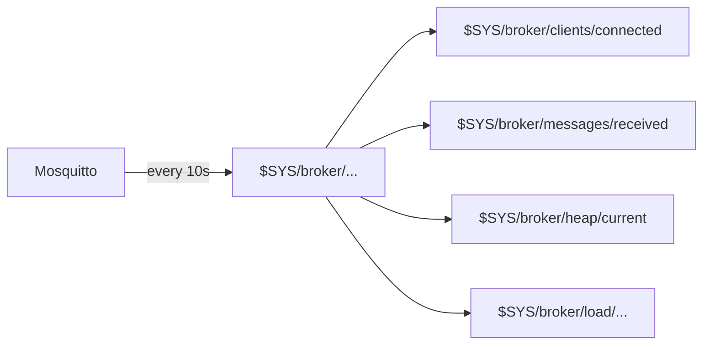

# Level 10: Mosquitto Monitoring

## Why monitor the broker?

A router with Mosquitto is part of the IoT infrastructure. Without monitoring, you won't know that:
- the number of clients is growing and memory will run out soon
- retained messages have clogged the storage
- the broker is overloaded and losing messages

## $SYS topics — built-in telemetry

Mosquitto automatically publishes metrics to the `$SYS/broker/...` topic every 10 seconds (configurable via `sys_interval`).

```bash
# View all metrics:
mosquitto_sub -h localhost -u admin -P pass -t '$SYS/#' -v
```



## Key metrics

| Topic | What it shows |
|---|---|
| `$SYS/broker/clients/connected` | Active clients |
| `$SYS/broker/messages/received` | Total messages received |
| `$SYS/broker/heap/current` | Memory (bytes) |
| `$SYS/broker/uptime` | Uptime |
| `$SYS/broker/subscriptions/count` | Active subscriptions |
| `$SYS/broker/messages/retained/count` | Retained messages |
| `$SYS/broker/load/messages/received/1min` | Messages per minute |

## Shell monitoring script

```sh
#!/bin/sh
get_metric() {
  mosquitto_sub -h localhost -u monitor -P pass \
    -t "$1" -C 1 -W 5 2>/dev/null || echo "N/A"
}

echo "Clients: $(get_metric '$SYS/broker/clients/connected')"
echo "Memory:   $(get_metric '$SYS/broker/heap/current') bytes"
echo "Uptime:   $(get_metric '$SYS/broker/uptime')"
```

> 💡 `-C 1` means "get one message and exit". `-W 5` — 5 second timeout.

## Configuring sys_interval

```conf
# /etc/mosquitto/mosquitto.conf
sys_interval 30  # Update $SYS every 30 seconds (default 10)
```

On weak routers, increase the interval — each $SYS publication creates load.

## collectd-mod-exec

collectd is a metrics collection daemon, available on OpenWRT:

```bash
opkg install collectd collectd-mod-exec
```

The exec plugin script outputs lines like:
```
PUTVAL "hostname/mqtt-clients/gauge" N:42
```

```conf
# /etc/collectd.conf
<Plugin exec>
  Exec "nobody" "/usr/local/bin/mqtt-collectd.sh"
</Plugin>
```

## Alerts via MQTT

The script can publish alerts directly to MQTT:

```sh
MAX_CLIENTS=100
CLIENTS=$(get_metric '$SYS/broker/clients/connected')
[ "$CLIENTS" -gt "$MAX_CLIENTS" ] && \
  mosquitto_pub -t 'system/alert' -m "Too many clients: $CLIENTS"
```

## ⚠️ Common errors

| Error | Solution |
|---|---|
| `$SYS` not published | Check `allow_anonymous` or ACL — subscriber must have access to `$SYS` |
| `-C 1` hangs | Broker unreachable or wrong password. Add `-W 5` |
| collectd exec won't start | Script path must be absolute, script must be executable (`chmod +x`) |
