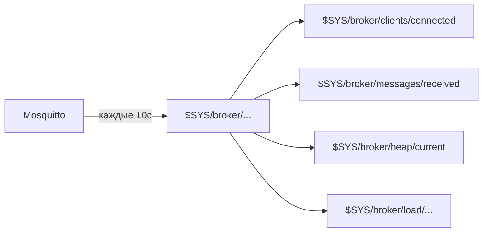

# Уровень 10: Мониторинг Mosquitto

## Зачем мониторить брокер?

Роутер с Mosquitto — часть IoT-инфраструктуры. Без мониторинга вы не узнаете, что:
- количество клиентов растёт и скоро закончится память
- retained-сообщения засорили хранилище
- брокер перегружен и теряет сообщения

## $SYS топики — встроенная телеметрия

Mosquitto автоматически публикует метрики в топик `$SYS/broker/...` каждые 10 секунд (настраивается через `sys_interval`).

```bash
# Просмотр всех метрик:
mosquitto_sub -h localhost -u admin -P pass -t '$SYS/#' -v
```



## Ключевые метрики

| Топик | Что показывает |
|---|---|
| `$SYS/broker/clients/connected` | Активных клиентов |
| `$SYS/broker/messages/received` | Всего сообщений получено |
| `$SYS/broker/heap/current` | Память (байт) |
| `$SYS/broker/uptime` | Время работы |
| `$SYS/broker/subscriptions/count` | Активных подписок |
| `$SYS/broker/messages/retained/count` | Retained сообщений |
| `$SYS/broker/load/messages/received/1min` | Сообщений в минуту |

## Shell-скрипт мониторинга

```sh
#!/bin/sh
get_metric() {
  mosquitto_sub -h localhost -u monitor -P pass \
    -t "$1" -C 1 -W 5 2>/dev/null || echo "N/A"
}

echo "Клиентов: $(get_metric '$SYS/broker/clients/connected')"
echo "Память:   $(get_metric '$SYS/broker/heap/current') bytes"
echo "Uptime:   $(get_metric '$SYS/broker/uptime')"
```

> 💡 `-C 1` означает "получить одно сообщение и выйти". `-W 5` — таймаут 5 секунд.

## Настройка sys_interval

```conf
# /etc/mosquitto/mosquitto.conf
sys_interval 30  # Обновление $SYS каждые 30 секунд (по умолчанию 10)
```

На слабых роутерах увеличьте интервал — каждая публикация в $SYS создаёт нагрузку.

## collectd-mod-exec

collectd — демон сбора метрик, доступен в OpenWRT:

```bash
opkg install collectd collectd-mod-exec
```

Скрипт для exec-плагина выводит строки вида:
```
PUTVAL "hostname/mqtt-clients/gauge" N:42
```

```conf
# /etc/collectd.conf
<Plugin exec>
  Exec "nobody" "/usr/local/bin/mqtt-collectd.sh"
</Plugin>
```

## Алерты через MQTT

Скрипт может сам публиковать алерт в MQTT:

```sh
MAX_CLIENTS=100
CLIENTS=$(get_metric '$SYS/broker/clients/connected')
[ "$CLIENTS" -gt "$MAX_CLIENTS" ] && \
  mosquitto_pub -t 'system/alert' -m "Too many clients: $CLIENTS"
```

## ⚠️ Типичные ошибки

| Ошибка | Решение |
|---|---|
| `$SYS` не публикуется | Проверьте `allow_anonymous` или ACL — подписчик должен иметь доступ к `$SYS` |
| `-C 1` зависает | Брокер недоступен или неверный пароль. Добавьте `-W 5` |
| collectd exec не запускается | Путь к скрипту должен быть абсолютным, скрипт — исполняемым (`chmod +x`) |
