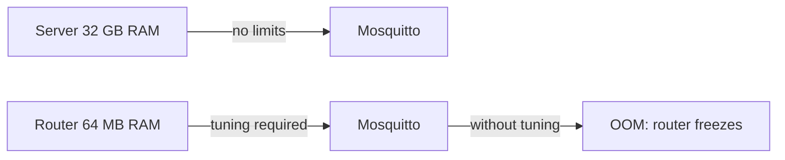
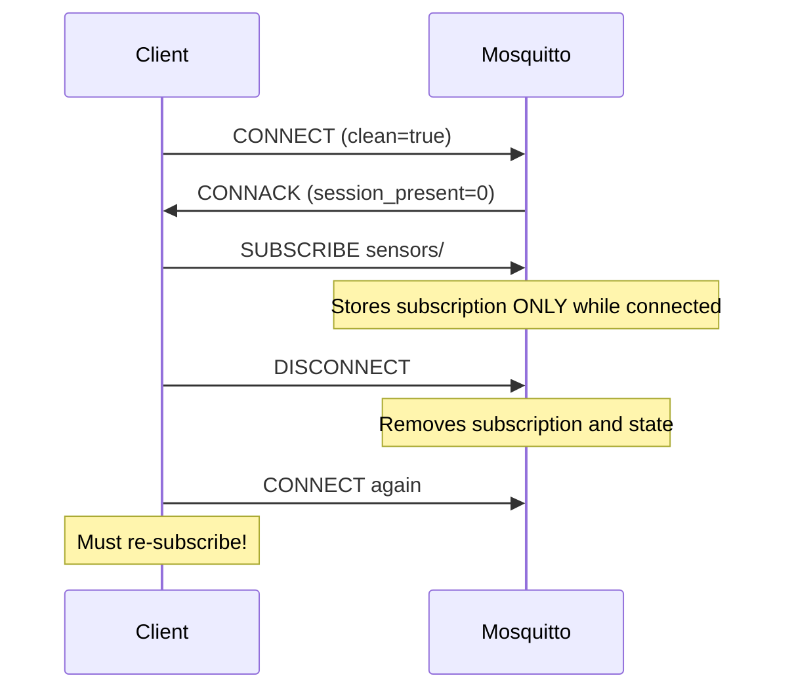
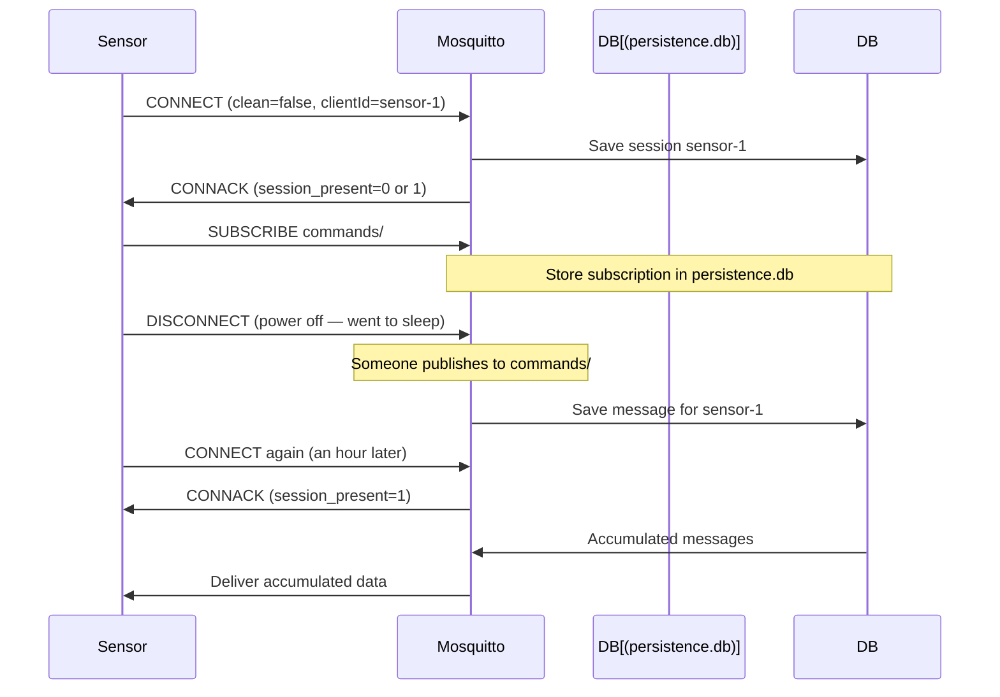

# Level 11: Mosquitto Optimization for OpenWRT — Detailed Theory

## Why embedded is a different world

When a developer first installs Mosquitto on a router, they're in for a surprise: an app that worked fine on a server freezes on the router within an hour. The reason — drastically different resource constraints.

Analogy: configuring Mosquitto for OpenWRT is like tuning a race car for off-road driving. It requires different thinking, different priorities.



## Memory consumption analysis

Mosquitto consists of several memory pools:

### 1. Base consumption
- Mosquitto process itself: **~2-3 MB** RSS at startup
- Config processing, TLS context (if enabled): **+1-5 MB**

### 2. Per connection
- TCP socket + kernel buffers: **~8-16 KB** (depends on OS)
- Client structure in Mosquitto: **~1-2 KB**
- Send/receive buffer: **~4-8 KB**

Total: **~15-30 KB per client**. 50 clients = 750 KB - 1.5 MB.

### 3. Message queues (QoS 1/2)
Each unread QoS 1/2 message is stored in memory:
- Message metadata: ~100 bytes
- Payload: size of payload

With 100 clients × 1000 messages in queue × 4 KB = **400 MB**. On a router, that's a disaster.

### 4. Retained messages
Each retained topic is stored in memory indefinitely:
- Structure: ~100 bytes metadata + payload
- 10,000 retained topics × 1 KB = **10 MB**

## Detailed parameter breakdown

### `max_connections N`

```conf
max_connections 50   # Recommended for 64 MB RAM
```

What happens when exceeded: new connection attempts are immediately rejected with code `0x05 (Connection Refused, not authorized)` or the connection simply drops.

How to calculate the limit:
- Available RAM for MQTT: `total_ram × 0.4` (no more than 40% of free)
- Divide by ~25 KB per client: `25 MB / 0.025 = 1000` (for 64 MB this is ~25 MB / 0.025 = ~1000, but that's theoretical max)
- Practically: for 64 MB RAM → `max_connections 30-50`

### `message_size_limit N`

```conf
message_size_limit 4096   # 4 KB — for most IoT
message_size_limit 65536  # 64 KB — if binary data needed
```

> ⚠️ Default limit = 268,435,455 bytes (256 MB)! One large message can kill a router.

Typical IoT message sizes:
- JSON with temperature: `{"t":22.5}` = ~12 bytes
- Sensor telemetry: ~100-500 bytes
- Camera image: > 100 KB (not recommended via MQTT on a router)

### `max_queued_messages N` and `max_queued_bytes N`

```conf
max_queued_messages 100    # No more than 100 messages per client queue
max_queued_bytes 524288    # No more than 512 KB per client (Mosquitto 2.x)
```

When queue limit is exceeded: messages are **dropped** (oldest first). The drop counter is visible in `$SYS/broker/messages/publish/dropped`.

### `memory_limit N`

```conf
memory_limit 25000000  # 25 MB — hard heap limit
```

When the limit is reached, Mosquitto starts rejecting new connections and refusing new messages. This protects against the OOM-killer, which would otherwise kill an arbitrary process (possibly the entire network stack).

**Calculation rule** for a router with `R` MB RAM:
```
memory_limit = min(R * 0.4 * 1000000, 64000000)
```

### `sys_interval N`

```conf
sys_interval 30   # Every 30 seconds instead of 10
sys_interval 0    # Fully disable $SYS (maximum savings)
```

Each $SYS publication creates load: Mosquitto must update ~20 topics and deliver them to all subscribers. On a weak CPU, this is noticeable.

## Clean Session vs Persistent Session: in detail

### Clean Session (clean: true)



Pros:
- No data accumulation in memory
- No disk persistence required
- Simple behavior

Cons:
- Client misses messages while disconnected
- Must re-subscribe after every reconnect

**When to use**: browsers, dashboards, any clients that are always online.

### Persistent Session (clean: false)



Pros:
- Sensor doesn't miss commands while sleeping
- Broker guarantees delivery (QoS 1/2)

Cons:
- Requires `persistence true` and disk space
- Dead sessions accumulate

```conf
# Required settings for persistent sessions:
persistence true
persistence_location /tmp/mosquitto/  # In RAM!
persistent_client_expiration 1d       # Remove after 1 day
```

**When to use**: battery-powered IoT sensors, infrequently connecting clients.

## Keepalive: connection loss detection

TCP doesn't always immediately detect a broken connection — especially through NAT/firewall, where connection state "stales". Keepalive solves this at the MQTT level.

### How it works:

1. Client sets `keepalive = 60` (seconds)
2. If no packet is sent within 60 seconds — client must send `PINGREQ`
3. Broker responds with `PINGRESP`
4. If no packet is received within `keepalive × 1.5 = 90` seconds — connection is dropped

```conf
# mosquitto.conf:
max_keepalive 300    # Client cannot set keepalive > 300 seconds
```

### Keepalive recommendations:

| Client type | Recommended keepalive | Why |
|---|---|---|
| Battery IoT sensor | 300-600 s | Infrequent PINGREQ saves energy |
| Wired sensor | 60-120 s | No power constraints |
| Web dashboard | 30-60 s | Quickly detect disconnections |
| Mobile app | 60 s | Battery/reliability balance |

> ⚠️ NAT tables in routers often remove entries after 60-120 seconds of inactivity. Client keepalive should be **less** than this value.

## Logging: compromise between debugging and performance

```conf
# Minimal logging (production):
log_type error warning
log_dest syslog

# Extended (for debugging):
log_type error warning notice information
log_dest file /tmp/mosquitto.log

# Full (temporary only!):
log_type all
```

> ⚠️ `log_type all` on an active broker — thousands of lines per second. Will quickly fill /tmp/ (RAM).

## Persistence on flash: wear danger

OpenWRT flash memory has limited endurance:
- NAND flash: 10,000 - 100,000 write cycles per block
- Mosquitto writes persistence every `autosave_interval` seconds by default

```conf
# DON'T DO THIS (flash wear):
persistence true
persistence_location /etc/mosquitto/  # on flash!

# CORRECT (in RAM):
persistence true
persistence_location /tmp/mosquitto/  # tmpfs

# Or disable persistence if not needed:
persistence false
```

If persistence with reboot survival is needed — use a USB flash drive or microSD (not built-in flash):

```conf
persistence_location /mnt/usb/mosquitto/
```

## Example optimal config for 128 MB RAM

```conf
# /etc/mosquitto/mosquitto.conf
# Optimized for router with 128 MB RAM, up to 50 IoT clients

listener 1883
protocol mqtt
bind_address 192.168.1.1  # LAN interface only

# Authentication
allow_anonymous false
password_file /etc/mosquitto/passwd
acl_file /etc/mosquitto/acl

# Memory and connection limits
max_connections 50
message_size_limit 8192         # 8 KB maximum
max_queued_messages 100
max_queued_bytes 524288          # 512 KB per client
memory_limit 32000000            # 32 MB heap limit

# Sessions
persistence true
persistence_location /tmp/mosquitto/
persistent_client_expiration 2d
autosave_interval 300            # Save every 5 minutes

# Keepalive
max_keepalive 300

# Monitoring
sys_interval 30

# Logging
log_type error warning
log_dest syslog
```

## ⚠️ Common beginner mistakes

### Mistake 1: leaving memory_limit at zero

```conf
# Bad (default):
# memory_limit not set = 0 = no limit

# Good:
memory_limit 25000000  # For 64 MB RAM
```

Without a limit, Mosquitto can use all router memory → OOM → freeze.

### Mistake 2: not limiting message_size_limit

```conf
# Bad — client can send 256 MB:
# message_size_limit not set

# Good:
message_size_limit 4096  # 4 KB
```

One large message can destroy everything accumulated: `max_queued_bytes` doesn't protect against a single large message.

### Mistake 3: persistent sessions without expiration limit

```conf
# Bad — dead sessions accumulate forever:
persistence true
# persistent_client_expiration not set

# Good:
persistence true
persistent_client_expiration 7d  # Remove after a week
```

After a month, persistence.db can grow to several MB.

### Mistake 4: keepalive longer than NAT timeout

```
Client sets keepalive=3600 (1 hour).
Router/provider closes NAT entry after 120 seconds.
Client "thinks" it's connected, broker also "thinks" — but packets don't pass.
```

Solution: `max_keepalive 120` in mosquitto.conf, so clients can't set a large keepalive.

### Mistake 5: writing logs to /tmp/ without rotation

```conf
# Bad — /tmp/ (tmpfs/RAM) will fill up:
log_dest file /tmp/mosquitto.log
# After a few days /tmp/ is full → errors everywhere

# Good — syslog with automatic rotation:
log_dest syslog
```
