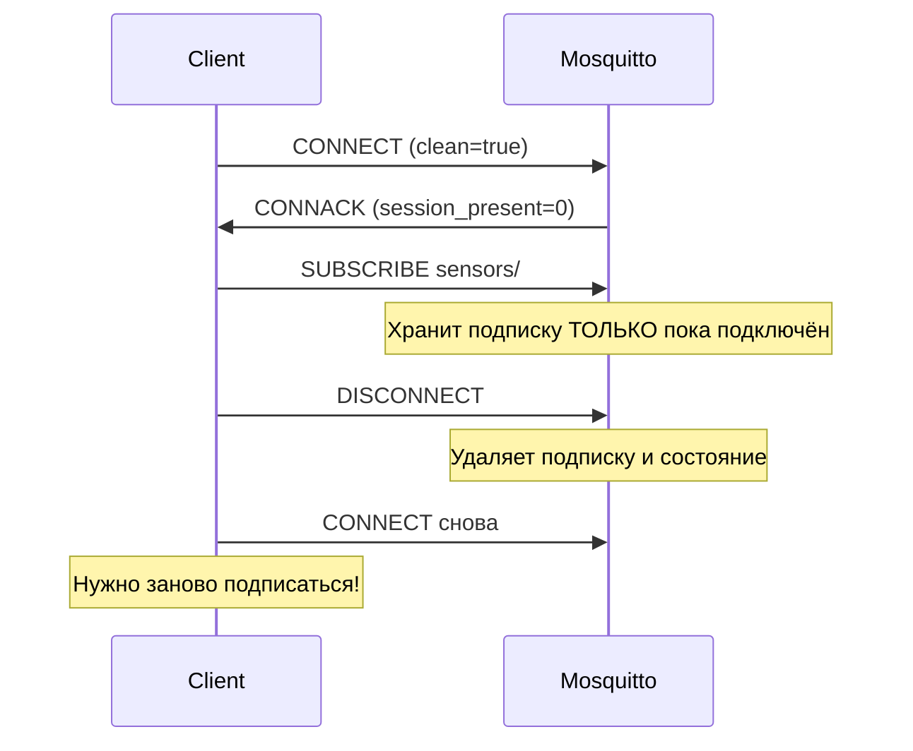
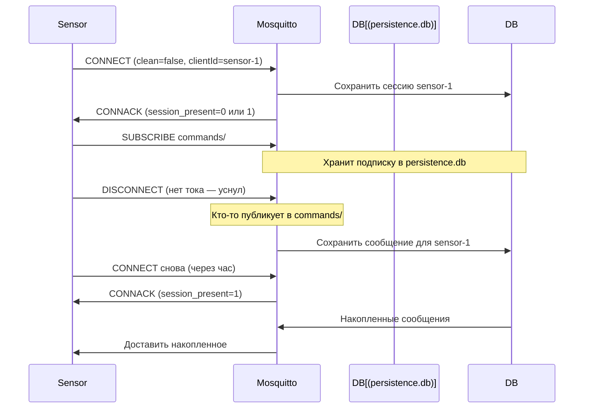

# Уровень 11: Оптимизация Mosquitto для OpenWRT — Развёрнутая теория

## Почему embedded — это другой мир

Когда разработчик впервые устанавливает Mosquitto на роутер, его ждёт сюрприз: приложение, которое на сервере работало без проблем, на роутере зависает через час. Причина — кардинально другие ограничения ресурсов.

Аналогия: настройка Mosquitto для OpenWRT — как настройка гоночного болида для езды по бездорожью. Нужно другое мышление, другие приоритеты.


## Анализ потребления памяти

Mosquitto состоит из нескольких пулов памяти:

### 1. Базовое потребление
- Сам процесс Mosquitto: **~2-3 MB** RSS при старте
- Обработка конфига, TLS-контекст (если включён): **+1-5 MB**

### 2. На каждое соединение
- TCP-сокет + буферы ядра: **~8-16 KB** (зависит от ОС)
- Структура клиента в Mosquitto: **~1-2 KB**
- Буфер отправки/приёма: **~4-8 KB**

Итого: **~15-30 KB на клиента**. 50 клиентов = 750 KB - 1.5 MB.

### 3. Очереди сообщений (QoS 1/2)
Каждое непрочитанное QoS 1/2 сообщение хранится в памяти:
- Метаданные сообщения: ~100 байт
- Полезная нагрузка: размер payload

При 100 клиентах × 1000 сообщений в очереди × 4 KB = **400 MB**. На роутере это катастрофа.

### 4. Retained сообщения
Каждый retained топик хранится в памяти бессрочно:
- Структура: ~100 байт метаданных + payload
- 10 000 retained топиков × 1 KB = **10 MB**

## Детальный разбор каждого параметра

### `max_connections N`

```conf
max_connections 50   # Рекомендуется для 64 MB RAM
```

Что происходит при превышении: новые попытки подключения немедленно отклоняются с кодом `0x05 (Connection Refused, not authorized)` или соединение просто обрывается.

Как рассчитать лимит:
- Доступная RAM для MQTT: `total_ram × 0.4` (не больше 40% от свободной)
- Делим на ~25 KB на клиента: `25 MB / 0.025 = 1000` (для 64 MB это ~25 MB / 0.025 = ~1000, но это теоретический максимум)
- Практически: для 64 MB RAM → `max_connections 30-50`

### `message_size_limit N`

```conf
message_size_limit 4096   # 4 KB — для большинства IoT
message_size_limit 65536  # 64 KB — если нужны бинарные данные
```

> ⚠️ По умолчанию лимит = 268 435 455 байт (256 MB)! Одно большое сообщение может убить роутер.

Типичные размеры IoT-сообщений:
- JSON с температурой: `{"t":22.5}` = ~12 байт
- Телеметрия датчика: ~100-500 байт
- Изображение с камеры: > 100 KB (не рекомендуется через MQTT на роутере)

### `max_queued_messages N` и `max_queued_bytes N`

```conf
max_queued_messages 100    # Не более 100 сообщений в очереди на клиента
max_queued_bytes 524288    # Не более 512 KB на клиента (Mosquitto 2.x)
```

При превышении лимита очереди: сообщения **отбрасываются** (oldest first). Счётчик отброшенных виден в `$SYS/broker/messages/publish/dropped`.

### `memory_limit N`

```conf
memory_limit 25000000  # 25 MB — жёсткий лимит heap
```

При достижении лимита Mosquitto начинает отклонять новые подключения и не принимает новые сообщения. Это защищает от OOM-killer'а, который иначе убьёт произвольный процесс (возможно, весь сетевой стек).

**Правило расчёта** для роутера с `R` MB RAM:
```
memory_limit = min(R * 0.4 * 1000000, 64000000)
```

### `sys_interval N`

```conf
sys_interval 30   # Каждые 30 секунд вместо 10
sys_interval 0    # Полностью отключить $SYS (максимальная экономия)
```

Каждая публикация в $SYS создаёт нагрузку: Mosquitto должен обновить ~20 топиков и доставить их всем подписчикам. На слабом CPU это заметно.

## Clean Session vs Persistent Session: детально

### Clean Session (clean: true)



Плюсы:
- Нет накопления данных в памяти
- Не требует persistence на диске
- Простое поведение

Минусы:
- Клиент пропускает сообщения, пока отключён
- Нужно переподписываться после каждого reconnect

**Когда использовать**: браузеры, дашборды, любые клиенты, которые постоянно онлайн.

### Persistent Session (clean: false)



Плюсы:
- Датчик не пропускает команды, пока спит
- Брокер гарантирует доставку (QoS 1/2)

Минусы:
- Требует `persistence true` и место на диске
- Мёртвые сессии накапливаются

```conf
# Обязательные настройки для persistent sessions:
persistence true
persistence_location /tmp/mosquitto/  # В RAM!
persistent_client_expiration 1d       # Удалять через 1 день
```

**Когда использовать**: IoT-датчики на батарейках, редко подключающиеся клиенты.

## Keepalive: механизм обнаружения обрыва

TCP не всегда сразу замечает обрыв соединения — особенно через NAT/firewall, где состояние соединения "протухает". Keepalive решает это через MQTT-уровень.

### Как работает:

1. Клиент устанавливает `keepalive = 60` (секунды)
2. Если за 60 секунд клиент не отправил ни одного пакета — он должен отправить `PINGREQ`
3. Брокер отвечает `PINGRESP`
4. Если брокер не получил пакета за `keepalive × 1.5 = 90` секунд — разрывает соединение

```conf
# mosquitto.conf:
max_keepalive 300    # Клиент не может установить keepalive > 300 секунд
```

### Рекомендации по keepalive:

| Тип клиента | Рекомендуемый keepalive | Почему |
|---|---|---|
| IoT-датчик с батареей | 300-600 с | Редкие PINGREQ экономят энергию |
| Проводной датчик | 60-120 с | Нет ограничений по энергии |
| Веб-дашборд | 30-60 с | Быстро обнаруживать обрыв |
| Мобильное приложение | 60 с | Баланс батарея/надёжность |

> ⚠️ NAT-таблицы в роутерах часто удаляют записи через 60-120 секунд простоя. Keepalive клиента должен быть **меньше** этого значения.

## Логирование: компромисс между отладкой и производительностью

```conf
# Минимальное логирование (продакшен):
log_type error warning
log_dest syslog

# Расширенное (для отладки):
log_type error warning notice information
log_dest file /tmp/mosquitto.log

# Полное (только временно!):
log_type all
```

> ⚠️ `log_type all` на активном брокере — тысячи строк в секунду. Быстро заполнит /tmp/ (RAM).

## Persistence на flash: опасность износа

Flash-память OpenWRT имеет ограниченный ресурс:
- NAND flash: 10 000 - 100 000 циклов записи на блок
- Mosquitto по умолчанию записывает persistence каждые `autosave_interval` секунд

```conf
# НЕ ДЕЛАЙТЕ ТАК (износ flash):
persistence true
persistence_location /etc/mosquitto/  # во flash!

# ПРАВИЛЬНО (в RAM):
persistence true
persistence_location /tmp/mosquitto/  # tmpfs

# Или отключить persistence совсем если не нужен:
persistence false
```

Если нужна persistence с сохранением после перезагрузки — используйте USB-флешку или microSD (не встроенный flash):

```conf
persistence_location /mnt/usb/mosquitto/
```

## Пример оптимального конфига для 128 MB RAM

```conf
# /etc/mosquitto/mosquitto.conf
# Оптимизирован для роутера с 128 MB RAM, до 50 IoT-клиентов

listener 1883
protocol mqtt
bind_address 192.168.1.1  # Только LAN-интерфейс

# Аутентификация
allow_anonymous false
password_file /etc/mosquitto/passwd
acl_file /etc/mosquitto/acl

# Лимиты памяти и соединений
max_connections 50
message_size_limit 8192         # 8 KB максимум
max_queued_messages 100
max_queued_bytes 524288          # 512 KB на клиента
memory_limit 32000000            # 32 MB heap limit

# Сессии
persistence true
persistence_location /tmp/mosquitto/
persistent_client_expiration 2d
autosave_interval 300            # Сохранять раз в 5 минут

# Keepalive
max_keepalive 300

# Мониторинг
sys_interval 30

# Логирование
log_type error warning
log_dest syslog
```

## ⚠️ Типичные ошибки начинающих

### Ошибка 1: оставить memory_limit на нуле

```conf
# Плохо (по умолчанию):
# memory_limit не задан = 0 = без лимита

# Хорошо:
memory_limit 25000000  # Для 64 MB RAM
```

Без лимита Mosquitto может использовать всю память роутера → OOM → зависание.

### Ошибка 2: не ограничить message_size_limit

```conf
# Плохо — клиент может отправить 256 MB:
# message_size_limit не задан

# Хорошо:
message_size_limit 4096  # 4 KB
```

Одно большое сообщение может уничтожить всё накопленное: `max_queued_bytes` не защищает от single large message.

### Ошибка 3: persistent sessions без ограничения expiration

```conf
# Плохо — мёртвые сессии копятся вечно:
persistence true
# persistent_client_expiration не задан

# Хорошо:
persistence true
persistent_client_expiration 7d  # Удалять через неделю
```

Через месяц persistence.db может вырасти до нескольких MB.

### Ошибка 4: keepalive больше времени NAT

```
Клиент устанавливает keepalive=3600 (1 час).
Роутер/провайдер закрывает NAT-запись через 120 секунд.
Клиент "думает" что подключён, брокер тоже "думает" — но пакеты не проходят.
```

Решение: `max_keepalive 120` в mosquitto.conf, чтобы клиенты не могли ставить большой keepalive.

### Ошибка 5: запись логов в /tmp/ без ротации

```conf
# Плохо — /tmp/ (tmpfs/RAM) будет заполнен:
log_dest file /tmp/mosquitto.log
# Через несколько дней /tmp/ полный → ошибки везде

# Хорошо — syslog с автоматической ротацией:
log_dest syslog
```
