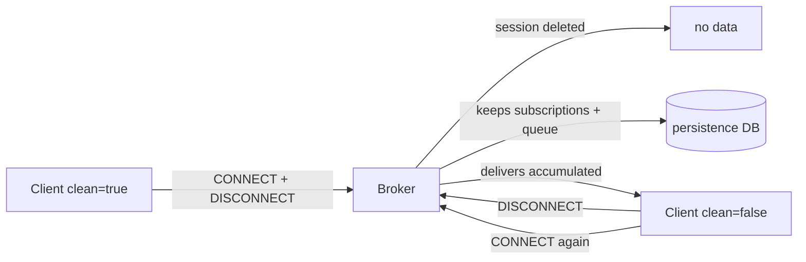

# Level 11: Mosquitto Optimization for OpenWRT

## The main problem: limited resources

A home router is not a server. Typical specs:

| Class | RAM | Flash | CPU |
|---|---|---|---|
| Budget | 32 MB | 4 MB | MIPS 560 MHz |
| Mid-range | 128 MB | 16 MB | MIPS 750 MHz |
| Powerful | 512 MB | 256 MB | ARM 1.3 GHz |

Mosquitto without tuning can use **all available memory**, causing the router to freeze.

## Key tuning parameters

### Memory limits

```conf
# Maximum heap for Mosquitto (bytes)
# For 64 MB RAM — allocate ~25 MB:
memory_limit 25000000

# Maximum single message size:
message_size_limit 4096  # 4 KB (default 268 MB!)

# Message queue per client (QoS 1/2):
max_queued_messages 100
max_queued_bytes 524288  # 512 KB
```

### Connection limits

```conf
max_connections 50  # Default is -1 (no limit!)
```

> ⚠️ Each connection consumes ~5-10 KB RAM. 100 connections = 1 MB minimum.

### System metrics

```conf
sys_interval 30  # Publish $SYS less often (default 10 sec)
```

## Clean vs Persistent Session



| Parameter | Clean Session | Persistent Session |
|---|---|---|
| Subscriptions saved | No | Yes |
| QoS 1/2 queue | No | Yes |
| Broker memory | Minimal | Grows |
| For whom | Browsers, dashboards | IoT sensors |

## Keepalive

Keepalive is the PINGREQ/PINGRESP packet interval. The broker closes the connection if no packets arrive within `keepalive × 1.5`.

```conf
# Limit the maximum client keepalive:
max_keepalive 300  # 5 minutes

# With keepalive=300: timeout = 450 seconds
```

| Scenario | Recommended keepalive |
|---|---|
| IoT sensor | 300-600 sec |
| Dashboard | 30-60 sec |
| Mobile app | 60-120 sec |

## Persistence on OpenWRT: careful with flash

```conf
# Store persistence in RAM, not flash:
persistence true
persistence_location /tmp/mosquitto/

# Clean dead sessions:
persistent_client_expiration 1d
```

> 💡 `/tmp/` on OpenWRT is tmpfs (RAM). Data is lost on reboot, but flash doesn't wear out.

## Minimal config for 64 MB RAM

```conf
listener 1883
protocol mqtt
allow_anonymous false
password_file /etc/mosquitto/passwd

max_connections 30
message_size_limit 4096
max_queued_messages 100
memory_limit 20000000
sys_interval 60
log_type error warning
log_dest syslog
```
