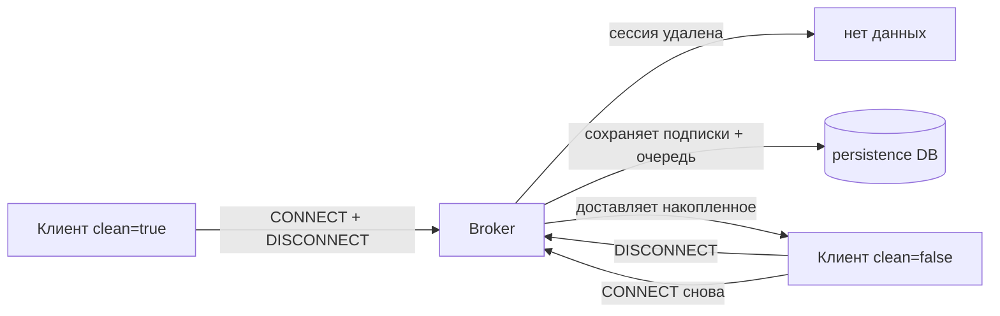

# Уровень 11: Оптимизация Mosquitto для OpenWRT

## Главная проблема: ресурсов мало

Домашний роутер — не сервер. Типичные характеристики:

| Класс | RAM | Flash | CPU |
|---|---|---|---|
| Бюджетный | 32 MB | 4 MB | MIPS 560 MHz |
| Средний | 128 MB | 16 MB | MIPS 750 MHz |
| Мощный | 512 MB | 256 MB | ARM 1.3 GHz |

Mosquitto без настроек может использовать **всю доступную память**, что приведёт к зависанию роутера.

## Ключевые параметры тюнинга

### Ограничение памяти

```conf
# Максимум heap для Mosquitto (байт)
# Для 64 MB RAM — выделяем ~25 MB:
memory_limit 25000000

# Максимум одного сообщения:
message_size_limit 4096  # 4 KB (по умолчанию 268 MB!)

# Очередь сообщений на клиента (QoS 1/2):
max_queued_messages 100
max_queued_bytes 524288  # 512 KB
```

### Лимит соединений

```conf
max_connections 50  # По умолчанию -1 (без лимита!)
```

> ⚠️ Каждое соединение потребляет ~5-10 KB RAM. 100 соединений = 1 MB минимум.

### Системные метрики

```conf
sys_interval 30  # Реже публиковать $SYS (по умолчанию 10 сек)
```

## Clean vs Persistent Session



| Параметр | Clean Session | Persistent Session |
|---|---|---|
| Подписки сохраняются | Нет | Да |
| Очередь QoS 1/2 | Нет | Да |
| Память брокера | Минимум | Растёт |
| Для кого | Браузеры, дашборды | IoT-датчики |

## Keepalive

Keepalive — интервал PINGREQ/PINGRESP-пакетов. Брокер закрывает соединение, если не было пакетов за `keepalive × 1.5`.

```conf
# Ограничить максимальный keepalive клиента:
max_keepalive 300  # 5 минут

# При keepalive=300: таймаут = 450 секунд
```

| Сценарий | Рекомендуемый keepalive |
|---|---|
| IoT-датчик | 300-600 сек |
| Дашборд | 30-60 сек |
| Мобильное приложение | 60-120 сек |

## Persistence на OpenWRT: осторожно с flash

```conf
# Хранить persistence в RAM, не во flash:
persistence true
persistence_location /tmp/mosquitto/

# Очищать мёртвые сессии:
persistent_client_expiration 1d
```

> 💡 `/tmp/` на OpenWRT — это tmpfs (RAM). Данные теряются при перезагрузке, зато flash не изнашивается.

## Минимальный конфиг для 64 MB RAM

```conf
listener 1883
protocol mqtt
allow_anonymous false
password_file /etc/mosquitto/passwd

max_connections 30
message_size_limit 4096
max_queued_messages 100
memory_limit 20000000
sys_interval 60
log_type error warning
log_dest syslog
```
