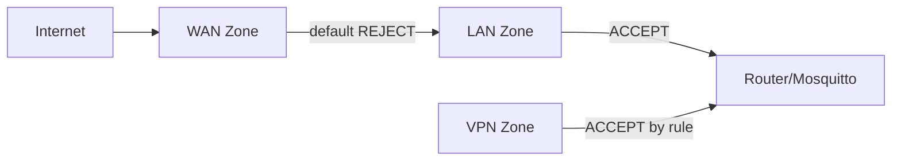

# Level 12: MQTT Security — Detailed Theory

## Why MQTT brokers get hacked

Shodan research shows tens of thousands of exposed MQTT brokers on the internet. Most of them have `allow_anonymous true` and no TLS. This is not a hypothetical threat: attackers actively scan port 1883.

What happens after a breach:
- The attacker reads all topics (data leak)
- Publishes commands to `home/cmd/...` (device control)
- Uses the broker as a pivot point to attack the rest of the network
- Shuts down the broker via DoS (entire IoT infrastructure goes down)

Analogy: MQTT without protection is like leaving your house key under the mat with a note saying "key is here".

## Firewall: multi-layered defense

### OpenWRT zones

OpenWRT works with firewall zone concepts:



Default rule: `INPUT = DROP` for WAN. This means port 1883 is already closed from the internet by default. But:
- Someone may have manually added an `ACCEPT` rule
- Port forwarding may have opened the port
- Other software may have changed the rules

### UCI — the proper way to manage firewall

```bash
# Explicitly block MQTT from WAN (additional protection):
uci add firewall rule
uci set firewall.@rule[-1].name='Block-MQTT-WAN'
uci set firewall.@rule[-1].src='wan'
uci set firewall.@rule[-1].dest_port='1883'
uci set firewall.@rule[-1].proto='tcp'
uci set firewall.@rule[-1].target='DROP'
uci commit firewall && /etc/init.d/firewall restart

# Verify rules:
iptables -L INPUT -n -v | grep 1883
```

### Bind Mosquitto to a specific interface

Instead of firewall blocking — don't listen on unwanted interfaces:

```conf
listener 1883
bind_address 192.168.1.1  # LAN interface only
protocol mqtt
```

This is the "principle of least privilege": the broker physically doesn't accept WAN connections, even if the firewall is misconfigured.

### nftables (OpenWRT 22.x+)

```nft
# /etc/nftables.d/99-mqtt.nft
table inet filter {
  chain input {
    type filter hook input priority 0;

    # MQTT only from LAN:
    iifname "br-lan" tcp dport { 1883, 8883, 9001 } accept

    # Rate limit new connections:
    iifname "br-lan" tcp dport 1883 \
      ct state new limit rate 5/minute accept

    # Everything else to MQTT ports — DROP:
    tcp dport { 1883, 8883, 9001 } drop
  }
}
```

## Rate Limiting: protection from bruteforce and DoS

### Types of MQTT attacks

1. **Credential stuffing** — login/password brute force via CONNECT packets
2. **Large message flood** — sending giant messages to exhaust memory
3. **Connection flood** — thousands of simultaneous connections (DoS)
4. **Subscribe flood** — thousands of subscriptions to create matching load

### iptables rate limiting

```bash
# Chain for rate limiting:
iptables -N MQTT_RATE
iptables -A MQTT_RATE -m state --state NEW \
  -m recent --name mqtt_new --update --seconds 60 --hitcount 10 \
  -j LOG --log-prefix "MQTT-RATELIMIT: " --log-level 4
iptables -A MQTT_RATE -m state --state NEW \
  -m recent --name mqtt_new --update --seconds 60 --hitcount 10 \
  -j DROP
iptables -A MQTT_RATE -m state --state NEW \
  -m recent --name mqtt_new --set -j ACCEPT
iptables -A MQTT_RATE -j RETURN

# Apply to MQTT ports:
iptables -I INPUT -p tcp --dport 1883 -j MQTT_RATE

# Check statistics:
iptables -L MQTT_RATE -n -v --line-numbers
```

What `-m recent` does:
- `--set`: on first packet — add IP to the list, counter = 1
- `--update --seconds 60 --hitcount 10`: if more than 10 packets in 60 seconds — condition met

### Mosquitto: per_listener_settings

```conf
per_listener_settings true

listener 1883
protocol mqtt
max_connections 50        # TCP connection limit for this listener
allow_anonymous false
password_file /etc/mosquitto/passwd

listener 9001
protocol websockets
max_connections 20        # Fewer browsers
allow_anonymous false
password_file /etc/mosquitto/passwd
```

### Automatic ban script

```sh
#!/bin/sh
# /usr/local/bin/mqtt-autoban.sh
# Run via cron every 5 minutes

THRESHOLD=5       # Ban IPs with >= 5 auth errors
WHITELIST="192.168.1.1 192.168.1.100"  # Don't ban these IPs
BAN_FILE="/tmp/mqtt-banned.txt"
touch "$BAN_FILE"

# Collect IPs with auth errors in the last 10 minutes:
OFFENDERS=$(logread | \
  grep "$(date -d '-10 minutes' '+%b %d %H:%M' 2>/dev/null || date '+%b %d')" | \
  grep -E "authentication failed|bad username or password" | \
  grep -oE '[0-9]+\.[0-9]+\.[0-9]+\.[0-9]+' | \
  sort | uniq -c | sort -rn | \
  awk -v thresh="$THRESHOLD" '$1 >= thresh {print $2}')

for IP in $OFFENDERS; do
  # Don't ban whitelist:
  echo "$WHITELIST" | grep -qw "$IP" && continue
  # Already banned?
  grep -qx "$IP" "$BAN_FILE" && continue

  # Ban:
  iptables -I INPUT -s "$IP" -j DROP
  echo "$IP" >> "$BAN_FILE"
  logger -t mqtt-autoban "Banned $IP (>= $THRESHOLD auth failures)"
done
```

## ACL: topic access control

Detailed ACL is a key internal defense:

```conf
# /etc/mosquitto/acl

# User admin — full access:
user admin
topic readwrite #

# Sensor temperature_sensor1:
user sensor_temp1
topic write sensors/room1/temperature
topic write sensors/room1/humidity
# NO access to other topics

# Dashboard — read only:
user dashboard
topic read sensors/#
topic read home/#
topic read $SYS/broker/clients/connected  # Only one $SYS metric

# Light controller:
user light_ctrl
topic write home/lights/+/cmd
topic read home/lights/+/status
topic read home/scenes/#

# %u pattern — username:
# Each client reads only "their own" topics:
user devices
topic readwrite devices/%u/#
# sensor1 → devices/sensor1/#
# sensor2 → devices/sensor2/#
```

> 💡 `%u` in ACL is replaced with the current user's name. A powerful pattern for scalable IoT systems.

## TLS: mandatory encryption

If traffic goes outside the trusted network (LAN), TLS is needed:

```conf
# /etc/mosquitto/mosquitto.conf

# MQTT/TLS (port 8883):
listener 8883
cafile   /etc/mosquitto/ca.crt
certfile /etc/mosquitto/server.crt
keyfile  /etc/mosquitto/server.key
tls_version tlsv1.2

# Disallow weak ciphers:
ciphers ECDHE-RSA-AES128-GCM-SHA256:ECDHE-RSA-AES256-GCM-SHA384

# Require client certificate (mTLS):
require_certificate true
use_subject_as_username true  # Username from certificate CN
```

### Minimal TLS without CA

If there's no certificate authority — a self-signed certificate is better than nothing:

```bash
# Self-signed certificate for the router:
openssl req -x509 -newkey rsa:2048 -keyout server.key -out server.crt \
  -days 365 -nodes -subj "/CN=192.168.1.1"

cp server.crt /etc/mosquitto/
cp server.key /etc/mosquitto/
chmod 640 /etc/mosquitto/server.key
chown mosquitto:mosquitto /etc/mosquitto/server.key
```

Client connects with certificate verification:
```bash
mosquitto_sub -h 192.168.1.1 -p 8883 \
  --cafile server.crt \
  -t 'sensors/#'
```

## Anomaly detection

### Monitoring failed connections

```sh
#!/bin/sh
# Show bruteforce statistics for the last hour:
echo "=== Suspicious activity ==="

echo "Failed connections by IP:"
logread | grep -E "auth|bad user|refused" | \
  grep -oE '[0-9]+\.[0-9]+\.[0-9]+\.[0-9]+' | \
  sort | uniq -c | sort -rn | head -10

echo ""
echo "Active connections from a single IP (top 5):"
netstat -tn 2>/dev/null | grep ':1883 ' | \
  awk '{print $5}' | cut -d: -f1 | \
  sort | uniq -c | sort -rn | head -5
```

### MQTT alert about suspicious activity

```sh
#!/bin/sh
THRESHOLD=3
FAILED=$(logread | grep "auth" | grep -c "failed")
[ "$FAILED" -ge "$THRESHOLD" ] && \
  mosquitto_pub -h localhost -u monitor -P pass \
    -t 'system/security/alert' \
    -m "{\"type\":\"auth_failure\",\"count\":$FAILED}" -q 1
```

## Final hardening checklist

### CRITICAL (without this — there's a hole)

```conf
# 1. No anonymous access:
allow_anonymous false

# 2. Authentication:
password_file /etc/mosquitto/passwd

# 3. ACL:
acl_file /etc/mosquitto/acl

# 4. Bind to LAN only:
listener 1883
bind_address 192.168.1.1

# 5. TLS for external access:
listener 8883
cafile /etc/mosquitto/ca.crt
certfile /etc/mosquitto/server.crt
keyfile /etc/mosquitto/server.key
tls_version tlsv1.2
```

### HIGH PRIORITY

```conf
# 6. Resource limits:
max_connections 50
message_size_limit 4096
memory_limit 25000000

# 7. Logging:
log_type error warning
log_dest syslog
```

### MEDIUM PRIORITY

```bash
# 8. Rate limiting via iptables (5 new connections per minute):
iptables -A INPUT -p tcp --dport 1883 --syn \
  -m recent --name mqtt --update --seconds 60 --hitcount 5 -j DROP

# 9. Automatic ban via cron:
*/5 * * * * /usr/local/bin/mqtt-autoban.sh
```

## ⚠️ Common security mistakes

### Mistake 1: allow_anonymous true in production

```conf
# NEVER in production:
allow_anonymous true

# Always:
allow_anonymous false
password_file /etc/mqosquitto/passwd
```

### Mistake 2: one user for all devices

```bash
# Bad:
mosquitto_passwd -b /etc/mosquitto/passwd iot secretpass
# All sensors use the same credentials

# Good — unique credentials:
mosquitto_passwd -b /etc/mosquitto/passwd sensor_temp1 pass1
mosquitto_passwd -b /etc/mosquitto/passwd sensor_hum1 pass2
mosquitto_passwd -b /etc/mosquitto/passwd dashboard passD
```

If one device is compromised — only that one is affected.

### Mistake 3: ACL allows `#` to regular users

```conf
# Bad — everyone can read everything:
user sensor1
topic readwrite #

# Good — only needed topics:
user sensor1
topic write sensors/room1/temperature
topic read home/cmd/sensor1
```

### Mistake 4: port 1883 open to the internet without TLS

```bash
# Check:
curl -s https://api.ipify.org  # Your external IP
nmap -p 1883 <your-IP>

# If open — close immediately:
uci add firewall rule
uci set firewall.@rule[-1].name='Block-MQTT-WAN'
uci set firewall.@rule[-1].src='wan'
uci set firewall.@rule[-1].dest_port='1883'
uci set firewall.@rule[-1].target='DROP'
uci commit firewall && /etc/init.d/firewall restart
```

### Mistake 5: weak TLS version

```conf
# Bad — old vulnerable protocols:
tls_version tlsv1   # Vulnerable to POODLE
tls_version tlsv1.1 # Deprecated

# Good:
tls_version tlsv1.2
# Or:
tls_version tlsv1.3  # If supported
```
