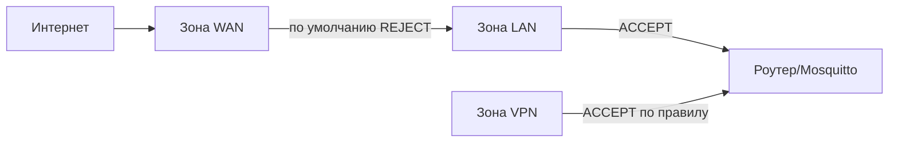

# Уровень 12: Безопасность MQTT — Развёрнутая теория

## Почему MQTT-брокеры взламывают

Исследования Shodan показывают десятки тысяч открытых MQTT-брокеров в интернете. Большинство из них — с `allow_anonymous true` и без TLS. Это не гипотетическая угроза: атакующие активно сканируют порт 1883.

Что происходит после взлома:
- Атакующий читает все топики (утечка данных)
- Публикует команды в `home/cmd/...` (управление устройствами)
- Использует брокер как pivot-точку для атаки на остальную сеть
- Закрывает брокер через DoS (отказ всей IoT-инфраструктуры)

Аналогия: MQTT без защиты — как оставить ключ от дома под ковриком с запиской "здесь ключ".

## Firewall: многоуровневая защита

### Зоны OpenWRT

OpenWRT работает с концепцией зон firewall:



Правило по умолчанию: `INPUT = DROP` для WAN. Это значит, порт 1883 уже закрыт от интернета по умолчанию. Но:
- Кто-то мог добавить правило `ACCEPT` вручную
- Port forwarding мог открыть порт
- Другое ПО могло изменить правила

### UCI — правильный способ управления firewall

```bash
# Явно заблокировать MQTT с WAN (дополнительная защита):
uci add firewall rule
uci set firewall.@rule[-1].name='Block-MQTT-WAN'
uci set firewall.@rule[-1].src='wan'
uci set firewall.@rule[-1].dest_port='1883'
uci set firewall.@rule[-1].proto='tcp'
uci set firewall.@rule[-1].target='DROP'
uci commit firewall && /etc/init.d/firewall restart

# Проверить правила:
iptables -L INPUT -n -v | grep 1883
```

### Bind Mosquitto на конкретный интерфейс

Вместо блокировки через firewall — не слушать на нужных интерфейсах:

```conf
listener 1883
bind_address 192.168.1.1  # Только LAN-интерфейс
protocol mqtt
```

Это "принцип наименьших привилегий": брокер физически не принимает подключения с WAN, даже если firewall некорректно настроен.

### nftables (OpenWRT 22.x+)

```nft
# /etc/nftables.d/99-mqtt.nft
table inet filter {
  chain input {
    type filter hook input priority 0;

    # MQTT только из LAN:
    iifname "br-lan" tcp dport { 1883, 8883, 9001 } accept

    # Rate limit новых соединений:
    iifname "br-lan" tcp dport 1883 \
      ct state new limit rate 5/minute accept

    # Всё остальное на MQTT-порты — DROP:
    tcp dport { 1883, 8883, 9001 } drop
  }
}
```

## Rate Limiting: защита от брутфорса и DoS

### Типы атак на MQTT

1. **Credential stuffing** — перебор логин/пароль через CONNECT пакеты
2. **Large message flood** — отправка гигантских сообщений для исчерпания памяти
3. **Connection flood** — тысячи одновременных подключений (DoS)
4. **Subscribe flood** — тысячи подписок для создания нагрузки на matching

### iptables rate limiting

```bash
# Цепочка для rate limiting:
iptables -N MQTT_RATE
iptables -A MQTT_RATE -m state --state NEW \
  -m recent --name mqtt_new --update --seconds 60 --hitcount 10 \
  -j LOG --log-prefix "MQTT-RATELIMIT: " --log-level 4
iptables -A MQTT_RATE -m state --state NEW \
  -m recent --name mqtt_new --update --seconds 60 --hitcount 10 \
  -j DROP
iptables -A MQTT_RATE -m state --state NEW \
  -m recent --name mqtt_new --set -j ACCEPT
iptables -A MQTT_RATE -j RETURN

# Применить к MQTT портам:
iptables -I INPUT -p tcp --dport 1883 -j MQTT_RATE

# Проверить статистику:
iptables -L MQTT_RATE -n -v --line-numbers
```

Что делает `-m recent`:
- `--set`: при первом пакете — добавить IP в список и счётчик = 1
- `--update --seconds 60 --hitcount 10`: если за 60 секунд больше 10 пакетов — условие выполнено

### Mosquitto: per_listener_settings

```conf
per_listener_settings true

listener 1883
protocol mqtt
max_connections 50        # Лимит TCP-соединений для этого listener
allow_anonymous false
password_file /etc/mosquitto/passwd

listener 9001
protocol websockets
max_connections 20        # Браузеров меньше
allow_anonymous false
password_file /etc/mosquitto/passwd
```

### Скрипт автоматического бана

```sh
#!/bin/sh
# /usr/local/bin/mqtt-autoban.sh
# Запускается через cron каждые 5 минут

THRESHOLD=5       # Блокировать IP с >= 5 ошибками аутентификации
WHITELIST="192.168.1.1 192.168.1.100"  # Не банить эти IP
BAN_FILE="/tmp/mqtt-banned.txt"
touch "$BAN_FILE"

# Собрать IP с ошибками аутентификации за последние 10 минут:
OFFENDERS=$(logread | \
  grep "$(date -d '-10 minutes' '+%b %d %H:%M' 2>/dev/null || date '+%b %d')" | \
  grep -E "authentication failed|bad username or password" | \
  grep -oE '[0-9]+\.[0-9]+\.[0-9]+\.[0-9]+' | \
  sort | uniq -c | sort -rn | \
  awk -v thresh="$THRESHOLD" '$1 >= thresh {print $2}')

for IP in $OFFENDERS; do
  # Не банить whitelist:
  echo "$WHITELIST" | grep -qw "$IP" && continue
  # Уже забанен?
  grep -qx "$IP" "$BAN_FILE" && continue

  # Банить:
  iptables -I INPUT -s "$IP" -j DROP
  echo "$IP" >> "$BAN_FILE"
  logger -t mqtt-autoban "Banned $IP (>= $THRESHOLD auth failures)"
done
```

## ACL: контроль доступа к топикам

Детальный ACL — ключевая защита изнутри:

```conf
# /etc/mosquitto/acl

# Пользователь admin — полный доступ:
user admin
topic readwrite #

# Датчик temperature_sensor1:
user sensor_temp1
topic write sensors/room1/temperature
topic write sensors/room1/humidity
# НЕТ доступа к другим топикам

# Дашборд — только чтение:
user dashboard
topic read sensors/#
topic read home/#
topic read $SYS/broker/clients/connected  # Только одну $SYS-метрику

# Контроллер освещения:
user light_ctrl
topic write home/lights/+/cmd
topic read home/lights/+/status
topic read home/scenes/#

# Паттерн %u — имя пользователя:
# Каждый клиент читает только "свои" топики:
user devices
topic readwrite devices/%u/#
# sensor1 → devices/sensor1/#
# sensor2 → devices/sensor2/#
```

> 💡 `%u` в ACL заменяется на имя текущего пользователя. Мощный паттерн для масштабируемых IoT-систем.

## TLS: шифрование в обязательном порядке

Если трафик выходит за пределы доверенной сети (LAN), нужен TLS:

```conf
# /etc/mosquitto/mosquitto.conf

# MQTT/TLS (порт 8883):
listener 8883
cafile   /etc/mosquitto/ca.crt
certfile /etc/mosquitto/server.crt
keyfile  /etc/mosquitto/server.key
tls_version tlsv1.2

# Запретить слабые шифры:
ciphers ECDHE-RSA-AES128-GCM-SHA256:ECDHE-RSA-AES256-GCM-SHA384

# Требовать клиентский сертификат (mTLS):
require_certificate true
use_subject_as_username true  # Имя пользователя из CN сертификата
```

### Минимальный TLS без CA

Если центра сертификации нет — самоподписанный сертификат лучше, чем ничего:

```bash
# Самоподписанный сертификат для роутера:
openssl req -x509 -newkey rsa:2048 -keyout server.key -out server.crt \
  -days 365 -nodes -subj "/CN=192.168.1.1"

cp server.crt /etc/mosquitto/
cp server.key /etc/mosquitto/
chmod 640 /etc/mosquitto/server.key
chown mosquitto:mosquitto /etc/mosquitto/server.key
```

Клиент подключается с проверкой сертификата:
```bash
mosquitto_sub -h 192.168.1.1 -p 8883 \
  --cafile server.crt \  # Используем сам сертификат как CA
  -t 'sensors/#'
```

## Обнаружение аномалий

### Мониторинг неудачных подключений

```sh
#!/bin/sh
# Вывести статистику брутфорса за последний час:
echo "=== Подозрительная активность ==="

echo "Неудачных подключений по IP:"
logread | grep -E "auth|bad user|refused" | \
  grep -oE '[0-9]+\.[0-9]+\.[0-9]+\.[0-9]+' | \
  sort | uniq -c | sort -rn | head -10

echo ""
echo "Активных подключений с одного IP (топ-5):"
netstat -tn 2>/dev/null | grep ':1883 ' | \
  awk '{print $5}' | cut -d: -f1 | \
  sort | uniq -c | sort -rn | head -5
```

### Алерт через MQTT о подозрительной активности

```sh
#!/bin/sh
THRESHOLD=3
FAILED=$(logread | grep "auth" | grep -c "failed")
[ "$FAILED" -ge "$THRESHOLD" ] && \
  mosquitto_pub -h localhost -u monitor -P pass \
    -t 'system/security/alert' \
    -m "{\"type\":\"auth_failure\",\"count\":$FAILED}" -q 1
```

## Итоговый hardening checklist

### КРИТИЧНО (без этого — дыра)

```conf
# 1. Без анонимного доступа:
allow_anonymous false

# 2. Аутентификация:
password_file /etc/mosquitto/passwd

# 3. ACL:
acl_file /etc/mosquitto/acl

# 4. Bind только на LAN:
listener 1883
bind_address 192.168.1.1

# 5. TLS для внешнего доступа:
listener 8883
cafile /etc/mosquitto/ca.crt
certfile /etc/mosquitto/server.crt
keyfile /etc/mosquitto/server.key
tls_version tlsv1.2
```

### ВЫСОКИЙ ПРИОРИТЕТ

```conf
# 6. Лимиты ресурсов:
max_connections 50
message_size_limit 4096
memory_limit 25000000

# 7. Логирование:
log_type error warning
log_dest syslog
```

### СРЕДНИЙ ПРИОРИТЕТ

```bash
# 8. Rate limiting через iptables (5 новых подключений в минуту):
iptables -A INPUT -p tcp --dport 1883 --syn \
  -m recent --name mqtt --update --seconds 60 --hitcount 5 -j DROP

# 9. Автоматический бан через cron:
*/5 * * * * /usr/local/bin/mqtt-autoban.sh
```

## ⚠️ Типичные ошибки безопасности

### Ошибка 1: allow_anonymous true в продакшене

```conf
# НИКОГДА в продакшене:
allow_anonymous true

# Всегда:
allow_anonymous false
password_file /etc/mosquitto/passwd
```

### Ошибка 2: один пользователь для всех устройств

```bash
# Плохо:
mosquitto_passwd -b /etc/mosquitto/passwd iot secretpass
# Все датчики используют одни логин/пароль

# Хорошо — уникальные учётные данные:
mosquitto_passwd -b /etc/mosquitto/passwd sensor_temp1 pass1
mosquitto_passwd -b /etc/mosquitto/passwd sensor_hum1 pass2
mosquitto_passwd -b /etc/mosquitto/passwd dashboard passD
```

При компрометации одного устройства — только оно пострадает.

### Ошибка 3: ACL разрешает `#` обычным пользователям

```conf
# Плохо — все могут всё читать:
user sensor1
topic readwrite #

# Хорошо — только нужные топики:
user sensor1
topic write sensors/room1/temperature
topic read home/cmd/sensor1
```

### Ошибка 4: порт 1883 открыт в интернет без TLS

```bash
# Проверьте:
curl -s https://api.ipify.org  # Ваш внешний IP
nmap -p 1883 <ваш-IP>

# Если open — срочно закрывайте:
uci add firewall rule
uci set firewall.@rule[-1].name='Block-MQTT-WAN'
uci set firewall.@rule[-1].src='wan'
uci set firewall.@rule[-1].dest_port='1883'
uci set firewall.@rule[-1].target='DROP'
uci commit firewall && /etc/init.d/firewall restart
```

### Ошибка 5: weak TLS версия

```conf
# Плохо — старые уязвимые протоколы:
tls_version tlsv1   # Уязвим к POODLE
tls_version tlsv1.1 # Устарел

# Хорошо:
tls_version tlsv1.2
# Или:
tls_version tlsv1.3  # Если поддерживается
```
