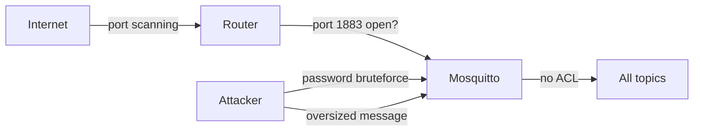

# Level 12: MQTT Security on OpenWRT

## Why this matters

MQTT without protection is an open door to your IoT network. An attacker can:
- Read all messages (temperature, lock states, cameras)
- Publish fake data (turn off heating, unlock doors)
- Block the broker via DoS

## Threat model



## Firewall: first line of defense

By default, OpenWRT blocks incoming WAN traffic. Make sure port 1883 is not open:

```bash
# Check open ports:
nmap -p 1883,8883,9001 <your-external-IP>
# All should be filtered or closed
```

If external access is needed — use only VPN or TLS:

```bash
# Allow only for LAN via UCI:
uci add firewall rule
uci set firewall.@rule[-1].name='Block-MQTT-WAN'
uci set firewall.@rule[-1].src='wan'
uci set firewall.@rule[-1].dest_port='1883 9001'
uci set firewall.@rule[-1].proto='tcp'
uci set firewall.@rule[-1].target='DROP'
uci commit firewall && /etc/init.d/firewall restart
```

## Rate limiting

```bash
# No more than 5 new connections per minute from a single IP:
iptables -A INPUT -p tcp --dport 1883 --syn \
  -m recent --name mqtt --update --seconds 60 --hitcount 5 -j DROP
iptables -A INPUT -p tcp --dport 1883 --syn \
  -m recent --name mqtt --set -j ACCEPT
```

## Mosquitto-level protection

```conf
# Limits (DoS protection):
max_connections 50
message_size_limit 4096
max_queued_messages 100
memory_limit 25000000

# Authentication:
allow_anonymous false
password_file /etc/mosquitto/passwd
acl_file /etc/mqosquitto/acl

# Bind to LAN only:
listener 1883
bind_address 192.168.1.1
```

## Security checklist (minimum)

| # | Item | Criticality |
|---|---|---|
| 1 | `allow_anonymous false` | CRITICAL |
| 2 | Port 1883 blocked from WAN | CRITICAL |
| 3 | TLS enabled (port 8883) | CRITICAL |
| 4 | ACL configured | High |
| 5 | `max_connections` set | High |
| 6 | `message_size_limit` set | Medium |
| 7 | Rate limiting via iptables | Medium |
| 8 | Connection monitoring | Low |

## Attack detection

```bash
# Watch failed connection attempts:
logread | grep -E "auth|password|refused"

# Active connections:
netstat -tnp | grep :1883

# Connection count per IP:
netstat -tn | grep :1883 | awk '{print $5}' | cut -d: -f1 | sort | uniq -c | sort -rn
```
