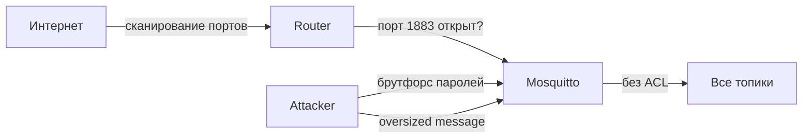

# Уровень 12: Безопасность MQTT на OpenWRT

## Зачем это важно

MQTT без защиты — открытая дверь в IoT-сеть. Атакующий может:
- Читать все сообщения (температура, состояние замков, камеры)
- Публиковать фейковые данные (отключить отопление, открыть замок)
- Заблокировать брокер через DoS

## Модель угроз



## Firewall: первый рубеж

По умолчанию OpenWRT блокирует входящий WAN-трафик. Убедитесь, что порт 1883 не открыт:

```bash
# Проверить открытые порты:
nmap -p 1883,8883,9001 <ваш-внешний-IP>
# Все должны быть filtered или closed
```

Если нужен доступ снаружи — только через VPN или с TLS:

```bash
# Открыть только для LAN через UCI:
uci add firewall rule
uci set firewall.@rule[-1].name='Block-MQTT-WAN'
uci set firewall.@rule[-1].src='wan'
uci set firewall.@rule[-1].dest_port='1883 9001'
uci set firewall.@rule[-1].proto='tcp'
uci set firewall.@rule[-1].target='DROP'
uci commit firewall && /etc/init.d/firewall restart
```

## Rate limiting

```bash
# Не более 5 новых подключений в минуту с одного IP:
iptables -A INPUT -p tcp --dport 1883 --syn \
  -m recent --name mqtt --update --seconds 60 --hitcount 5 -j DROP
iptables -A INPUT -p tcp --dport 1883 --syn \
  -m recent --name mqtt --set -j ACCEPT
```

## Защита на уровне Mosquitto

```conf
# Лимиты (защита от DoS):
max_connections 50
message_size_limit 4096
max_queued_messages 100
memory_limit 25000000

# Аутентификация:
allow_anonymous false
password_file /etc/mosquitto/passwd
acl_file /etc/mosquitto/acl

# Bind только на LAN:
listener 1883
bind_address 192.168.1.1
```

## Чеклист безопасности (минимум)

| # | Пункт | Критичность |
|---|---|---|
| 1 | `allow_anonymous false` | КРИТИЧНО |
| 2 | Порт 1883 закрыт от WAN | КРИТИЧНО |
| 3 | TLS включён (порт 8883) | КРИТИЧНО |
| 4 | ACL настроен | Высокая |
| 5 | `max_connections` задан | Высокая |
| 6 | `message_size_limit` задан | Средняя |
| 7 | Rate limiting через iptables | Средняя |
| 8 | Мониторинг подключений | Низкая |

## Обнаружение атак

```bash
# Смотреть неудачные подключения:
logread | grep -E "auth|password|refused"

# Активные подключения:
netstat -tnp | grep :1883

# Количество соединений с одного IP:
netstat -tn | grep :1883 | awk '{print $5}' | cut -d: -f1 | sort | uniq -c | sort -rn
```
