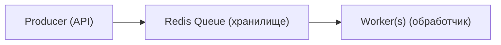

# 🔥 Уровень 14: Production-паттерны

## 🎯 Четыре паттерна

1. **BullMQ** -- очереди задач (email, обработка файлов, отчёты)
2. **Cron Jobs** -- периодические задачи (очистка, отчёты, бэкапы)
3. **Graceful Shutdown** -- корректное завершение (SIGTERM, draining, cleanup)
4. **GraphQL** -- Apollo Server (schema, resolvers, queries, mutations)

## 🔥 Зачем очереди задач

| Без очереди | С очередью |
|---|---|
| Email отправляется в обработчике запроса | Email добавляется в очередь, worker отправляет |
| Пользователь ждёт 3 секунды | Пользователь получает ответ мгновенно |
| Если email не отправился -- потерян | Retry с экспоненциальным backoff |
| Нагрузка на API = нагрузка на SMTP | Worker обрабатывает с rate limiting |

## 🔥 BullMQ

### Архитектура



### Producer и Worker

```typescript
import { Queue, Worker, QueueEvents } from 'bullmq'
import IORedis from 'ioredis'

const connection = new IORedis({
  host: 'localhost',
  port: 6379,
  maxRetriesPerRequest: null
})

// Создание очереди
const emailQueue = new Queue('email', { connection })

// Producer: добавление задач
await emailQueue.add('welcome', {
  to: 'alice@example.com',
  subject: 'Welcome!',
  template: 'welcome'
}, {
  attempts: 3,
  backoff: { type: 'exponential', delay: 2000 },
  removeOnComplete: { count: 1000 },
  removeOnFail: { age: 7 * 24 * 3600 }
})

// Delayed job
await emailQueue.add('reminder', { to: 'bob@example.com' }, {
  delay: 24 * 60 * 60 * 1000  // через 24 часа
})

// Worker: обработка задач
const worker = new Worker('email', async (job) => {
  const { to, subject, template } = job.data
  await job.updateProgress(50)
  await sendEmail(to, subject, template)
  await job.updateProgress(100)
  return { sent: true, timestamp: Date.now() }
}, {
  connection,
  concurrency: 5,
  limiter: { max: 100, duration: 60000 }  // 100 jobs/min
})
```

### События и мониторинг

```typescript
const queueEvents = new QueueEvents('email', { connection })

queueEvents.on('completed', ({ jobId, returnvalue }) => {
  console.log(`Job ${jobId} completed`)
})

queueEvents.on('failed', ({ jobId, failedReason }) => {
  console.log(`Job ${jobId} failed: ${failedReason}`)
})

// Метрики очереди
const counts = await emailQueue.getJobCounts()
// { waiting: 5, active: 2, completed: 150, failed: 3, delayed: 1 }

// Приоритеты
await emailQueue.add('urgent', data, { priority: 1 })
await emailQueue.add('normal', data, { priority: 10 })

// Repeatable (cron-like)
await emailQueue.add('daily-digest', {}, {
  repeat: { pattern: '0 9 * * *' }
})
```

### Bull Board (дашборд)

```typescript
import { createBullBoard } from '@bull-board/api'
import { BullMQAdapter } from '@bull-board/api/bullMQAdapter'
import { ExpressAdapter } from '@bull-board/express'

const serverAdapter = new ExpressAdapter()
createBullBoard({
  queues: [new BullMQAdapter(emailQueue)],
  serverAdapter
})
app.use('/admin/queues', serverAdapter.getRouter())
```

## 🔥 Cron Jobs

### node-cron

```typescript
import cron from 'node-cron'

// Формат: секунда(опц) минута час день месяц день_недели
// * * * * *        каждую минуту
// 0 9 * * *        ежедневно в 9:00
// 0 9 * * 1-5      будни в 9:00
// */5 * * * *      каждые 5 минут

const cleanupJob = cron.schedule('0 3 * * *', async () => {
  await db.sessions.deleteMany({ expiresAt: { $lt: new Date() } })
}, {
  scheduled: true,
  timezone: 'Europe/Moscow'
})
```

### Overlap Prevention

```typescript
let isRunning = false

cron.schedule('*/5 * * * *', async () => {
  if (isRunning) {
    console.log('Previous run still active, skipping')
    return
  }
  isRunning = true
  try {
    await generateReports()
  } finally {
    isRunning = false
  }
})
```

### Stop / Start

```typescript
cleanupJob.stop()   // пауза
cleanupJob.start()  // возобновление

process.on('SIGTERM', () => {
  cleanupJob.stop()
})
```

## 🔥 Graceful Shutdown

### Зачем

При `kill` или деплое Kubernetes отправляет SIGTERM. Без graceful shutdown:
- In-flight запросы обрываются (500 у клиентов)
- Соединения с БД не закрываются (connection leak)
- Задачи в worker теряются

### Реализация

```typescript
let isShuttingDown = false

// Health endpoint отражает состояние
app.get('/health', (req, res) => {
  if (isShuttingDown) {
    return res.status(503).json({ status: 'shutting_down' })
  }
  res.json({ status: 'ok' })
})

// Отклонение новых запросов
app.use((req, res, next) => {
  if (isShuttingDown) {
    res.setHeader('Connection', 'close')
    return res.status(503).json({ error: 'Server is shutting down' })
  }
  next()
})

const server = app.listen(3000)

async function gracefulShutdown(signal: string) {
  console.log(`[SHUTDOWN] Received ${signal}`)
  isShuttingDown = true

  // 1. Перестать принимать новые соединения
  server.close(() => {
    console.log('[SHUTDOWN] HTTP server closed')
  })

  // 2. Force timeout
  const forceTimeout = setTimeout(() => {
    console.error('[SHUTDOWN] Forced exit after timeout')
    process.exit(1)
  }, 30000)

  try {
    // 3. Закрыть все соединения
    await Promise.allSettled([
      pool.end(),
      redis.quit(),
      mongoose.disconnect(),
      worker.close()
    ])
    console.log('[SHUTDOWN] All connections closed')

    clearTimeout(forceTimeout)
    process.exit(0)
  } catch (err) {
    console.error('[SHUTDOWN] Error:', err)
    process.exit(1)
  }
}

process.on('SIGTERM', () => gracefulShutdown('SIGTERM'))
process.on('SIGINT', () => gracefulShutdown('SIGINT'))

process.on('unhandledRejection', (reason) => {
  console.error('[FATAL] Unhandled rejection:', reason)
  gracefulShutdown('unhandledRejection')
})
```

## 🔥 GraphQL (Apollo Server)

### Schema Definition

```typescript
import { ApolloServer } from '@apollo/server'
import { expressMiddleware } from '@apollo/server/express4'

const typeDefs = `#graphql
  type User {
    id: ID!
    name: String!
    email: String!
    posts: [Post!]!
  }

  type Post {
    id: ID!
    title: String!
    body: String!
    author: User!
  }

  type Query {
    users: [User!]!
    user(id: ID!): User
    posts(limit: Int, offset: Int): [Post!]!
  }

  type Mutation {
    createUser(name: String!, email: String!): User!
    createPost(title: String!, body: String!, authorId: ID!): Post!
    deletePost(id: ID!): Boolean!
  }
`
```

### Resolvers

```typescript
const resolvers = {
  Query: {
    users: async (_, __, { db }) => db.users.findMany(),
    user: async (_, { id }, { db }) => db.users.findUnique({ where: { id } })
  },
  Mutation: {
    createUser: async (_, { name, email }, { db }) => {
      return db.users.create({ data: { name, email } })
    }
  },
  // Field resolver (N+1 prevention с DataLoader)
  User: {
    posts: async (parent, _, { loaders }) => {
      return loaders.postsByUser.load(parent.id)
    }
  }
}
```

### Настройка сервера

```typescript
const server = new ApolloServer({ typeDefs, resolvers })
await server.start()

app.use('/graphql', expressMiddleware(server, {
  context: async ({ req }) => ({
    db: prisma,
    user: await getUser(req.headers.authorization),
    loaders: createLoaders()
  })
}))
```

## ⚠️ Частые ошибки новичков

### Ошибка 1: Тяжёлые задачи в request handler

```typescript
// ❌ Пользователь ждёт генерации PDF 30 секунд
app.post('/reports', async (req, res) => {
  const pdf = await generateHeavyReport(req.body) // 30 сек!
  res.send(pdf)
})

// ✅ Задача в очередь, ответ мгновенно
app.post('/reports', async (req, res) => {
  const job = await reportQueue.add('generate', req.body)
  res.json({ jobId: job.id, status: 'processing' })
})
```

### Ошибка 2: process.exit() без cleanup

```typescript
// ❌ Соединения не закрыты, данные потеряны
process.on('SIGTERM', () => process.exit(0))

// ✅ Graceful shutdown
process.on('SIGTERM', () => gracefulShutdown('SIGTERM'))
```

### Ошибка 3: Cron без overlap prevention

```typescript
// ❌ Два запуска одновременно -- дублирование данных
cron.schedule('*/5 * * * *', async () => {
  await generateReports() // Может выполняться > 5 мин
})

// ✅ Проверка isRunning
```

### Ошибка 4: GraphQL N+1 запросы

```typescript
// ❌ 1 запрос users + N запросов posts
// { users { posts { title } } }

// ✅ DataLoader для batch-загрузки
import DataLoader from 'dataloader'
const postsByUser = new DataLoader(async (userIds) => {
  const posts = await db.posts.findMany({ where: { authorId: { in: userIds } } })
  return userIds.map(id => posts.filter(p => p.authorId === id))
})
```

## 💡 Best Practices

1. **Очереди** -- для email, PDF, обработки изображений, уведомлений
2. **Retry с backoff** -- exponential backoff для временных ошибок
3. **Graceful shutdown** -- SIGTERM → stop accepting → drain → close → exit
4. **Force timeout** -- 30 секунд максимум, затем принудительный выход
5. **Cron overlap** -- всегда проверяйте isRunning
6. **DataLoader** -- обязательно для GraphQL, предотвращает N+1
7. **Bull Board** -- мониторинг очередей в production
