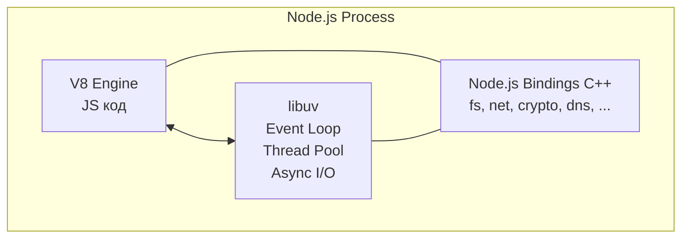
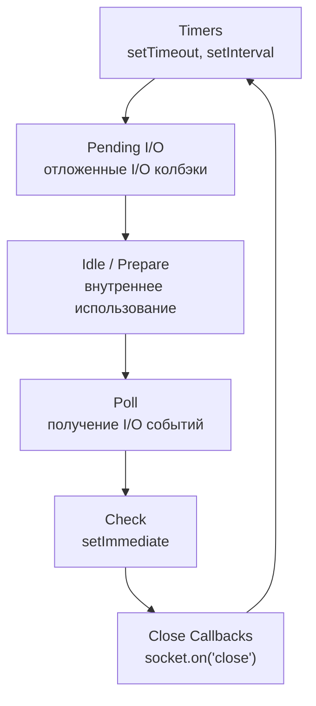

# 🔥 Уровень 0: Event Loop в Node.js

## 🎯 Зачем понимать Event Loop

Event Loop -- это сердце Node.js. Именно он позволяет Node.js быть однопоточным и при этом эффективно обрабатывать тысячи одновременных подключений. Без понимания Event Loop невозможно:

- Предсказать порядок выполнения асинхронного кода
- Диагностировать проблемы с производительностью
- Избежать блокировки основного потока
- Правильно использовать `setTimeout`, `setImmediate`, `process.nextTick`

## 📌 Архитектура Event Loop

Node.js построен на двух ключевых компонентах:

1. **V8** -- движок JavaScript (компиляция и выполнение JS)
2. **libuv** -- C-библиотека, реализующая Event Loop и асинхронный I/O



## 🔥 Фазы Event Loop

Event Loop в libuv состоит из 6 фаз. Каждая фаза имеет FIFO-очередь колбэков:



### 1. Timers

Выполняет колбэки `setTimeout()` и `setInterval()`, **чей порог задержки истёк**.

```js
// setTimeout с 0ms — не значит "выполни немедленно"
// Это значит "выполни как можно скорее, когда Timers фаза наступит"
setTimeout(() => console.log('timer'), 0)
```

⚠️ Фактическая задержка всегда >= указанной. Если вы указали `setTimeout(fn, 100)`, колбэк вызовется через 100 мс **или позже**, в зависимости от того, когда Event Loop дойдёт до фазы Timers.

### 2. Pending I/O Callbacks

Выполняет колбэки системных операций, отложенные с предыдущей итерации (например, ошибки TCP-соединения).

### 3. Idle / Prepare

Используется только внутри libuv. Не относится к пользовательскому коду.

### 4. Poll

Самая важная фаза. Здесь происходит:

1. Вычисление времени блокировки (сколько ждать новых I/O событий)
2. Обработка событий в poll-очереди

```js
// Колбэки fs.readFile попадают в Poll-фазу
const fs = require('fs')
fs.readFile('file.txt', (err, data) => {
  // Этот колбэк выполнится в Poll фазе
  console.log('file read')
})
```

Если poll-очередь пуста:
- Если есть `setImmediate` — переходит к Check фазе
- Если есть истёкшие таймеры — переходит к Timers фазе
- Иначе — блокируется, ожидая новые I/O события

### 5. Check

Выполняет колбэки `setImmediate()`. Эта фаза всегда идёт **сразу после Poll**.

```js
setImmediate(() => {
  console.log('immediate')
})
```

### 6. Close Callbacks

Выполняет колбэки событий `close`, например `socket.on('close', ...)`.

## 🔥 Microtask Queues

Между **каждой фазой** Event Loop дренируются две очереди микротасок:

1. **`process.nextTick` queue** — наивысший приоритет
2. **Promise microtask queue** — вторая по приоритету

```js
// Порядок: sync → nextTick → Promise → macrotask
console.log('1')                                    // sync
process.nextTick(() => console.log('2'))            // nextTick
Promise.resolve().then(() => console.log('3'))      // Promise
setTimeout(() => console.log('4'), 0)               // macrotask

// Вывод: 1, 2, 3, 4
```

📌 **Важно**: `process.nextTick` вызывается **ДО** Promise.then, хотя оба являются микротасками. У nextTick своя отдельная очередь с более высоким приоритетом.

## 📌 setTimeout vs setImmediate

Порядок `setTimeout(fn, 0)` и `setImmediate(fn)` **не определён** при вызове из главного модуля:

```js
// Из main module — порядок НЕ ГАРАНТИРОВАН
setTimeout(() => console.log('timeout'), 0)
setImmediate(() => console.log('immediate'))
// Может быть: timeout, immediate
// Может быть: immediate, timeout
```

Причина: `setTimeout(fn, 0)` на самом деле `setTimeout(fn, 1)` (минимальная задержка 1ms). Если Event Loop запустился быстрее 1ms — таймер ещё не истёк и setImmediate выполнится первым. Если медленнее — таймер уже истёк.

Но **внутри I/O колбэка** порядок гарантирован:

```js
const fs = require('fs')
fs.readFile('file.txt', () => {
  setTimeout(() => console.log('timeout'), 0)
  setImmediate(() => console.log('immediate'))
})
// Всегда: immediate, timeout
// Потому что: после Poll фазы идёт Check (setImmediate), а затем Timers
```

## 🔥 process.nextTick: мощный, но опасный

`process.nextTick()` выполняет колбэк **до** перехода к следующей фазе Event Loop:

```js
// Полезно для: исправления порядка в API
function MyEmitter() {
  // ❌ Плохо: emit до того, как пользователь подпишется
  this.emit('event')
}

function MyEmitter() {
  // ✅ Хорошо: emit после текущей операции
  process.nextTick(() => this.emit('event'))
}
```

### ⚠️ Опасность: Starvation

Рекурсивный `process.nextTick` блокирует Event Loop:

```js
// ❌ ОПАСНО: Event Loop никогда не продвинется дальше
function recurse() {
  process.nextTick(recurse)
}
recurse()
// setTimeout, setImmediate, I/O — ничего не выполнится!
```

✅ Используйте `setImmediate` для рекурсивных операций:

```js
// ✅ Безопасно: каждый вызов — новая итерация Event Loop
function recurse() {
  setImmediate(recurse)
}
```

## 📌 queueMicrotask

`queueMicrotask()` — стандартный способ добавить микротаск (аналог `Promise.resolve().then(fn)`):

```js
queueMicrotask(() => console.log('microtask'))
process.nextTick(() => console.log('nextTick'))

// Вывод: nextTick, microtask
// nextTick имеет приоритет над queueMicrotask
```

## 🔥 Практический пример: HTTP-сервер

```js
const http = require('http')

const server = http.createServer((req, res) => {
  // Этот колбэк выполняется в Poll фазе

  // Sync — блокирует Event Loop!
  const data = heavyComputation()

  // Async — не блокирует
  setImmediate(() => {
    const data = heavyComputation()
    res.end(data)
  })
})
```

## ⚠️ Частые ошибки начинающих

### Ошибка 1: Блокировка Event Loop синхронным кодом

```js
// ❌ Плохо: блокирует весь сервер на время вычисления
app.get('/heavy', (req, res) => {
  const result = fibonacci(45) // 5 секунд!
  res.json({ result })
})
```

Пока `fibonacci(45)` считается, **ни один другой запрос** не обрабатывается.

```js
// ✅ Хорошо: вынести в Worker Thread
const { Worker } = require('worker_threads')
app.get('/heavy', (req, res) => {
  const worker = new Worker('./fibonacci-worker.js', {
    workerData: { n: 45 }
  })
  worker.on('message', (result) => res.json({ result }))
})
```

### Ошибка 2: Предполагать точный порядок setTimeout(0) и setImmediate

```js
// ❌ Плохо: полагаться на порядок в main module
setTimeout(() => doFirst(), 0)
setImmediate(() => doSecond())
// Порядок НЕ гарантирован!
```

```js
// ✅ Хорошо: использовать явные зависимости
setTimeout(() => {
  doFirst()
  setImmediate(() => doSecond())
}, 0)
```

### Ошибка 3: Рекурсивный process.nextTick

```js
// ❌ Плохо: бесконечная рекурсия в nextTick
function processQueue(queue) {
  if (queue.length > 0) {
    const item = queue.shift()
    processItem(item)
    process.nextTick(() => processQueue(queue))
  }
}
```

```js
// ✅ Хорошо: использовать setImmediate
function processQueue(queue) {
  if (queue.length > 0) {
    const item = queue.shift()
    processItem(item)
    setImmediate(() => processQueue(queue))
  }
}
```

### Ошибка 4: Непонимание, что setTimeout(fn, 0) !== "немедленно"

```js
// ❌ Плохо: ожидать, что таймер сработает мгновенно
console.time('timer')
setTimeout(() => {
  console.timeEnd('timer') // ~1-4ms, НЕ 0ms!
}, 0)
```

Минимальная задержка setTimeout — 1ms в Node.js (4ms в браузерах после вложенности > 5).

## 💡 Best Practices

1. **Никогда не блокируйте Event Loop** — используйте Worker Threads для CPU-интенсивных задач
2. **Предпочитайте `setImmediate` над `process.nextTick`** для рекурсивных операций
3. **Используйте `process.nextTick` только для маленьких синхронных задач** (например, emit после return)
4. **Не полагайтесь на точный порядок** `setTimeout(0)` vs `setImmediate` вне I/O
5. **Мониторьте Event Loop lag** с помощью `monitorEventLoopDelay()` (Node.js 11.10+)
6. **Профилируйте** с помощью `--prof` и `--inspect` для обнаружения блокировок

```js
// Мониторинг Event Loop lag
const { monitorEventLoopDelay } = require('perf_hooks')
const h = monitorEventLoopDelay({ resolution: 20 })
h.enable()

setInterval(() => {
  console.log(`Event Loop p99: ${h.percentile(99) / 1e6}ms`)
  h.reset()
}, 5000)
```
