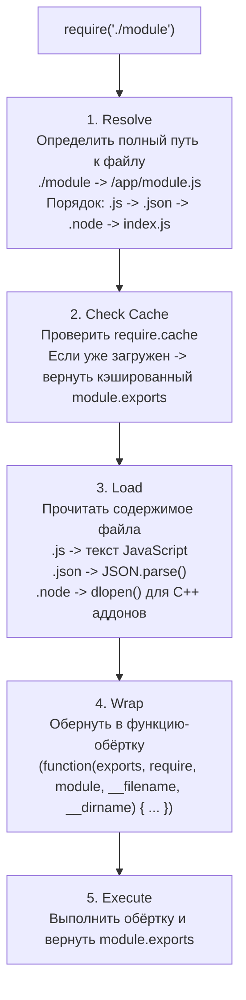

# 🔥 Уровень 1: Модульная система Node.js

## 🎯 Зачем разбираться в модулях

Модульная система -- фундамент любого Node.js-приложения. Node.js поддерживает **две** модульные системы: CommonJS (CJS) и ECMAScript Modules (ESM). Понимание обеих необходимо для:

- Правильной организации кода
- Работы с npm-пакетами (некоторые только CJS, некоторые только ESM)
- Создания библиотек с dual-package support
- Отладки проблем с circular dependencies

## 📌 CommonJS (CJS)

CommonJS -- исторически первая модульная система Node.js, появилась ещё до стандартизации ESM.

### Основные API

```js
// Экспорт
module.exports = { hello: 'world' }
// или
exports.hello = 'world'

// Импорт
const mod = require('./module')
const { hello } = require('./module')
const fs = require('fs')
```

### Как работает require()

Когда вы вызываете `require('./module')`, Node.js выполняет 5 шагов:



### Module Wrapper

Node.js оборачивает каждый модуль в функцию. Именно поэтому у вас есть доступ к `__filename`, `__dirname`, `require`, `module`, `exports`:

```js
// Это то, что Node.js реально выполняет:
(function(exports, require, module, __filename, __dirname) {
  // ваш код файла
  const fs = require('fs')
  module.exports = { ... }
})
```

⚠️ `exports` -- это просто ссылка на `module.exports`. Переприсвоение `exports = {...}` **не работает**:

```js
// ❌ Не работает!
exports = { hello: 'world' }
// exports теперь указывает на новый объект,
// но module.exports всё ещё пустой {}

// ✅ Работает
exports.hello = 'world'
// Добавляем свойство в тот же объект

// ✅ Работает
module.exports = { hello: 'world' }
// Заменяем весь объект
```

### Кэширование модулей

**Каждый модуль загружается и выполняется только один раз.** Повторные вызовы `require()` возвращают кэшированный `module.exports`:

```js
// counter.js
let count = 0
module.exports = {
  increment() { return ++count },
  getCount() { return count }
}

// app.js
const a = require('./counter')
const b = require('./counter')
a.increment() // 1
b.getCount()  // 1 — тот же объект!
a === b       // true
```

Кэш хранится в `require.cache`:

```js
// Посмотреть кэш
console.log(require.cache)

// Очистить кэш для конкретного модуля (⚠️ антипаттерн)
delete require.cache[require.resolve('./counter')]
```

## 📌 ECMAScript Modules (ESM)

ESM -- стандартная модульная система JavaScript, принятая в спецификации ES2015.

### Включение ESM

```json
// package.json — все .js файлы как ESM
{ "type": "module" }

// Или использовать расширение .mjs
// file.mjs — всегда ESM, независимо от package.json
```

### Синтаксис

```js
// Named export
export const PI = 3.14159
export function sum(a, b) { return a + b }

// Default export
export default class Calculator { }

// Named import
import { PI, sum } from './math.mjs'

// Default import
import Calculator from './math.mjs'

// Namespace import
import * as math from './math.mjs'

// Dynamic import (работает и в CJS!)
const mod = await import('./module.mjs')
```

### Ключевые отличия от CommonJS

| Характеристика | CommonJS | ESM |
|---|---|---|
| Загрузка | Синхронная | Асинхронная |
| Синтаксис | `require()` / `module.exports` | `import` / `export` |
| Анализ | Runtime (динамический) | Parse-time (статический) |
| Биндинги | Копии значений | Live bindings |
| Strict mode | Нет (по умолчанию) | Да (всегда) |
| Top-level await | Нет | Да |
| `__filename` | Есть | Нет (используйте `import.meta.url`) |
| Tree-shaking | Невозможно | Возможно (статический анализ) |

### Live Bindings

В ESM импорт -- это **живая ссылка** на экспортированное значение, а не копия:

```js
// counter.mjs
export let count = 0
export function increment() { count++ }

// app.mjs
import { count, increment } from './counter.mjs'
console.log(count) // 0
increment()
console.log(count) // 1 ← значение обновилось!
```

В CommonJS вы получаете **копию** на момент require:

```js
// counter.js
let count = 0
module.exports = { count, increment: () => ++count }

// app.js
const { count, increment } = require('./counter')
console.log(count) // 0
increment()
console.log(count) // 0 ← всё ещё 0! Это копия!
```

### Top-Level Await

ESM поддерживает `await` на верхнем уровне модуля:

```js
// config.mjs
const response = await fetch('https://api.example.com/config')
export const config = await response.json()

// Модуль-потребитель будет ждать, пока config загрузится
import { config } from './config.mjs'
```

### __filename и __dirname в ESM

```js
import { fileURLToPath } from 'url'
import { dirname } from 'path'

const __filename = fileURLToPath(import.meta.url)
const __dirname = dirname(__filename)

// Node.js 21.2+:
// import.meta.filename
// import.meta.dirname
```

## 🔥 Circular Dependencies (Циклические зависимости)

### Проблема

```js
// a.js
exports.loaded = false
const b = require('./b')     // ← запускает выполнение b.js
console.log('b.loaded:', b.loaded) // true
exports.loaded = true

// b.js
exports.loaded = false
const a = require('./a')     // ← возвращает ЧАСТИЧНЫЙ exports из a!
console.log('a.loaded:', a.loaded) // false ← модуль a ещё не завершил выполнение!
exports.loaded = true
```

Node.js **не зацикливается** — он возвращает **частично заполненный** `module.exports`. Это значит, что при циклической зависимости вы можете получить `undefined` для свойств, которые ещё не были экспортированы.

### Стратегии решения

**1. Рефакторинг: вынести общий код**

```js
// ❌ a.js ←→ b.js (цикл)
// ✅ a.js → shared.js ← b.js (нет цикла)
```

**2. Ленивый require**

```js
// Вместо top-level require
function getB() {
  return require('./b') // загружается только при вызове
}
```

**3. Dependency Injection**

```js
// module.js
module.exports = function createModule(dependency) {
  return { /* use dependency */ }
}
```

## 📌 Package.json exports

Поле `exports` (Node.js 12.7+) контролирует, что можно импортировать из пакета:

### Базовая exports map

```json
{
  "name": "my-lib",
  "exports": {
    ".": "./dist/index.js",
    "./utils": "./dist/utils.js"
  }
}
```

### Conditional Exports

```json
{
  "exports": {
    ".": {
      "types": "./dist/index.d.ts",
      "import": "./dist/esm/index.mjs",
      "require": "./dist/cjs/index.cjs",
      "default": "./dist/cjs/index.cjs"
    }
  }
}
```

### Subpath Patterns

```json
{
  "exports": {
    "./components/*": "./dist/components/*.js"
  }
}
```

```js
import Button from 'my-lib/components/Button'
// → ./dist/components/Button.js
```

## ⚠️ Частые ошибки начинающих

### Ошибка 1: Переприсвоение exports

```js
// ❌ Плохо
exports = { hello: 'world' }
// require() вернёт {} — пустой объект!
```

```js
// ✅ Хорошо
module.exports = { hello: 'world' }
```

### Ошибка 2: require() в ESM

```js
// ❌ В ESM-модуле require не определён
const fs = require('fs') // ReferenceError: require is not defined
```

```js
// ✅ Используйте import
import fs from 'fs'
// или createRequire для крайних случаев
import { createRequire } from 'module'
const require = createRequire(import.meta.url)
```

### Ошибка 3: Импорт без расширения в ESM

```js
// ❌ В ESM расширение обязательно
import { utils } from './utils' // ERR_MODULE_NOT_FOUND
```

```js
// ✅ Укажите расширение
import { utils } from './utils.mjs'
```

### Ошибка 4: Игнорирование циклических зависимостей

```js
// ❌ Плохо: полагаться на полностью загруженный модуль при цикле
const a = require('./a') // может быть частично загружен!
a.someMethod() // TypeError: a.someMethod is not a function
```

## 💡 Best Practices

1. **Выберите одну систему** для проекта: ESM предпочтительнее для новых проектов
2. **Используйте `exports` в package.json** для библиотек
3. **Избегайте циклических зависимостей** — это code smell
4. **Не очищайте `require.cache`** без крайней необходимости
5. **Для dual-package** используйте conditional exports с `import`/`require`
6. **Всегда указывайте `"types"`** в conditional exports для TypeScript
