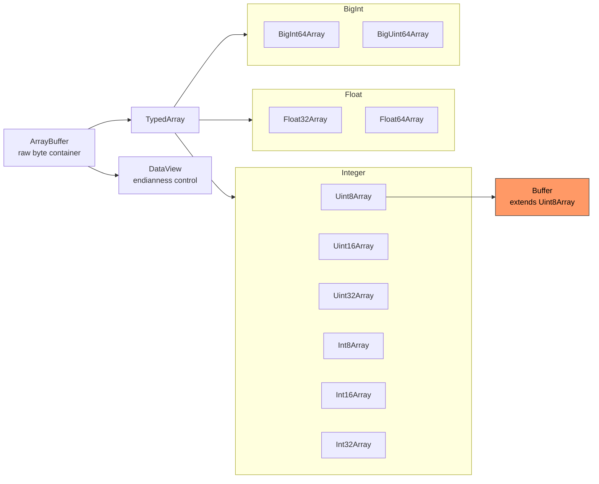

# 🔥 Level 3: Buffers and Encoding

## 🎯 Why Understanding Buffers Matters

JavaScript historically worked with text only. Node.js added `Buffer` for **binary data**: files, network packets, cryptography, images.

## 📌 What is a Buffer

`Buffer` is a Node.js class representing a fixed block of memory for binary data. It's a subclass of `Uint8Array`.

```js
const buf = Buffer.from('Hello')
// <Buffer 48 65 6c 6c 6f>
```

## 🔥 Creating Buffers

```js
Buffer.from('Hello')              // from string (UTF-8)
Buffer.from('48656c6c6f', 'hex')  // from hex
Buffer.from('SGVsbG8=', 'base64') // from base64
Buffer.alloc(1024)                // zeroed (safe)
Buffer.allocUnsafe(1024)          // uninitialized (fast, unsafe)
```

## 📌 Encodings

UTF-8 (default), ascii, latin1, hex, base64, base64url, utf16le.

**String length !== byte length**: Cyrillic = 2 bytes, emoji = 4 bytes in UTF-8.

## 🔥 TypedArray and ArrayBuffer

Buffer extends Uint8Array. ArrayBuffer is the raw container, TypedArrays are views.



DataView gives explicit endianness control: big-endian for network, little-endian for CPU.

## 📌 Binary Protocol Parsing

TLV (Type-Length-Value) format with `readUInt8`, `readUInt16BE`, `readUInt32BE` methods.

## ⚠️ Common Beginner Mistakes

1. Confusing string length with byte length
2. Using allocUnsafe without filling
3. slice() shares memory (not a copy)
4. Ignoring endianness

## 💡 Best Practices

1. Use `Buffer.alloc()` over `allocUnsafe()` by default
2. Use `Buffer.byteLength()` for byte size
3. Remember endianness for network protocols
4. Buffer.slice() shares memory — copy when needed
