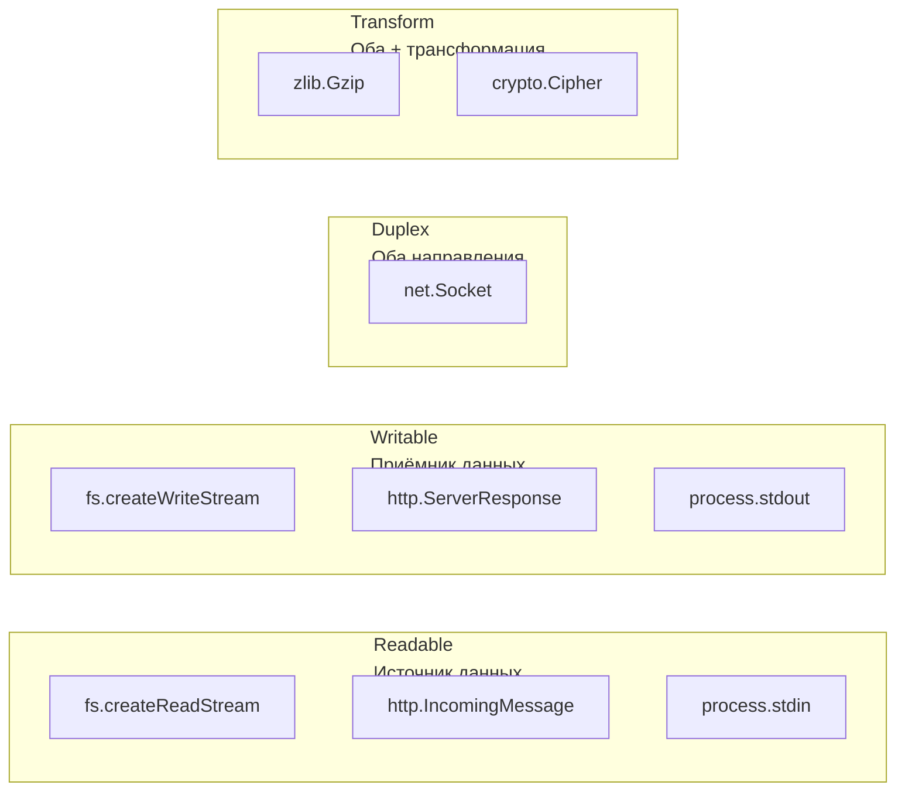
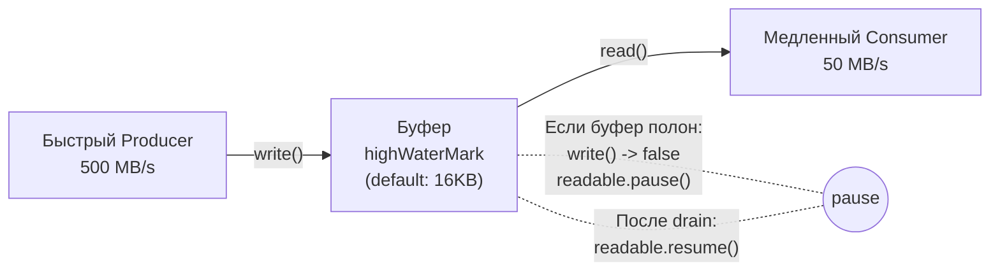

# 🔥 Уровень 5: Streams

## 🎯 Зачем нужны стримы

Стримы -- фундаментальная концепция Node.js для обработки данных по частям (чанками), без загрузки всего содержимого в память. Это критично при работе с большими файлами, сетевыми запросами и real-time данными.

```js
// ❌ Загружает ВЕСЬ файл в память (1GB файл = 1GB RAM)
const data = await fs.readFile('huge-file.csv', 'utf8')
processData(data)

// ✅ Обрабатывает по частям (1GB файл = ~64KB RAM)
const stream = fs.createReadStream('huge-file.csv')
for await (const chunk of stream) {
  processChunk(chunk)
}
```

## 📌 Четыре типа стримов



Все стримы наследуют от `EventEmitter`, поэтому работают через события.

## 🔥 Readable Streams

### Два режима работы

**Flowing mode** -- данные поступают автоматически через событие `data`:

```js
const readable = fs.createReadStream('file.txt', {
  encoding: 'utf8',
  highWaterMark: 64 * 1024 // размер чанка: 64KB
})

readable.on('data', (chunk) => {
  console.log('Chunk:', chunk.length, 'bytes')
})

readable.on('end', () => {
  console.log('Done reading')
})

readable.on('error', (err) => {
  console.error('Read error:', err.message)
})
```

**Paused mode** -- данные читаются вручную через `read()`:

```js
readable.on('readable', () => {
  let chunk
  while ((chunk = readable.read()) !== null) {
    console.log('Read:', chunk.length, 'bytes')
  }
})
```

### Async Iterator (рекомендуется)

```js
for await (const chunk of readable) {
  await processChunk(chunk)
}
// Автоматически обрабатывает end и error
```

## 🔥 Writable Streams

```js
const writable = fs.createWriteStream('output.txt')

// write() возвращает boolean
const canContinue = writable.write('Hello\n')
// true  — буфер не полон, можно писать ещё
// false — буфер полон, подождите drain!

if (!canContinue) {
  await new Promise(resolve => writable.once('drain', resolve))
}

// Завершение записи
writable.end('Last line\n')
writable.on('finish', () => console.log('All written'))
```

### cork() / uncork()

```js
// Буферизуем несколько write() и отправляем разом
writable.cork()
writable.write('line 1\n')
writable.write('line 2\n')
writable.write('line 3\n')
process.nextTick(() => writable.uncork())
// → один системный вызов вместо трёх
```

## 🔥 Transform Streams

Transform -- одновременно Readable и Writable. Принимает данные, преобразует и передаёт дальше.

```js
const { Transform } = require('stream')

const upperCase = new Transform({
  transform(chunk, encoding, callback) {
    this.push(chunk.toString().toUpperCase())
    callback()
  }
})

// Использование в цепочке
readable.pipe(upperCase).pipe(writable)
```

### objectMode

По умолчанию стримы работают с Buffer/string. С `objectMode` можно передавать любые JS-объекты:

```js
const filter = new Transform({
  objectMode: true,
  transform(user, encoding, callback) {
    if (user.age >= 18) {
      this.push(user)
    }
    callback()
  }
})
```

### flush()

Метод `flush()` вызывается после обработки всех данных -- идеально для финализации:

```js
const lineCounter = new Transform({
  transform(chunk, encoding, callback) {
    this.lines = (this.lines || 0) + chunk.toString().split('\n').length
    this.push(chunk)
    callback()
  },
  flush(callback) {
    this.push(`\n--- Total lines: ${this.lines} ---\n`)
    callback()
  }
})
```

## 🔥 Pipeline

### Проблема с .pipe()

```js
// ❌ pipe() не уничтожает стримы при ошибке
readable.pipe(transform).pipe(writable)
// Если transform упадёт — readable и writable останутся открыты!
```

### Решение: pipeline()

```js
const { pipeline } = require('stream/promises')

// ✅ Автоматически уничтожает все стримы при ошибке
await pipeline(
  fs.createReadStream('input.txt'),
  zlib.createGzip(),
  fs.createWriteStream('input.txt.gz')
)
```

### AbortSignal

```js
const ac = new AbortController()
setTimeout(() => ac.abort(), 5000)

try {
  await pipeline(readable, transform, writable, {
    signal: ac.signal
  })
} catch (err) {
  if (err.code === 'ABORT_ERR') {
    console.log('Pipeline aborted')
  }
}
```

## 🔥 Backpressure

Backpressure -- механизм, который замедляет producer когда consumer не успевает.



### Ручная обработка

```js
readable.on('data', (chunk) => {
  const ok = writable.write(chunk)
  if (!ok) readable.pause()
})

writable.on('drain', () => {
  readable.resume()
})
```

### pipe() и pipeline() обрабатывают автоматически

```js
// Backpressure "из коробки"
readable.pipe(writable)
await pipeline(readable, transform, writable)
```

### Диагностика

```js
writable.writableLength        // текущий буфер
writable.writableHighWaterMark // порог
readable.readableFlowing       // true/false/null
```

## ⚠️ Частые ошибки начинающих

### Ошибка 1: Чтение всего файла вместо стрима

```js
// ❌ 2GB файл = 2GB в памяти
const data = await fs.readFile('huge.log', 'utf8')
const lines = data.split('\n')
```

```js
// ✅ Построчная обработка через стрим
const rl = readline.createInterface({
  input: fs.createReadStream('huge.log')
})
for await (const line of rl) {
  processLine(line)
}
```

### Ошибка 2: Игнорирование backpressure

```js
// ❌ Не проверяем возврат write()
readable.on('data', (chunk) => {
  writable.write(chunk) // может вернуть false!
})
```

```js
// ✅ Обрабатываем backpressure
readable.on('data', (chunk) => {
  if (!writable.write(chunk)) {
    readable.pause()
  }
})
writable.on('drain', () => readable.resume())
```

### Ошибка 3: Использование .pipe() вместо pipeline()

```js
// ❌ Ошибка в середине цепочки = утечка ресурсов
a.pipe(b).pipe(c)
```

```js
// ✅ pipeline() уничтожает все стримы при ошибке
await pipeline(a, b, c)
```

### Ошибка 4: Не вызывать callback в transform

```js
// ❌ Стрим зависнет!
const t = new Transform({
  transform(chunk, enc, callback) {
    this.push(chunk.toString().toUpperCase())
    // callback() забыли!
  }
})
```

```js
// ✅ Всегда вызывайте callback
const t = new Transform({
  transform(chunk, enc, callback) {
    this.push(chunk.toString().toUpperCase())
    callback() // обязательно!
  }
})
```

### Ошибка 5: Не закрывать writable stream

```js
// ❌ Данные могут не записаться на диск
writable.write('data')
// process.exit() или конец скрипта
```

```js
// ✅ Вызвать end() и дождаться finish
writable.end()
writable.on('finish', () => {
  console.log('All data flushed to disk')
})
```

## 💡 Best Practices

1. **Используйте `pipeline()`** вместо `.pipe()` для безопасной обработки ошибок
2. **Используйте `for await...of`** для чтения Readable -- чистый, безопасный код
3. **Всегда обрабатывайте backpressure** -- проверяйте возврат `write()`
4. **Используйте `highWaterMark`** для настройки размера буфера под вашу задачу
5. **objectMode** для работы с объектами вместо буферов
6. **AbortController** для отмены длительных pipeline
7. **cork()/uncork()** для батчинга множества мелких записей
8. **readline** для построчного чтения текстовых файлов
