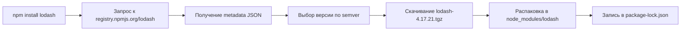
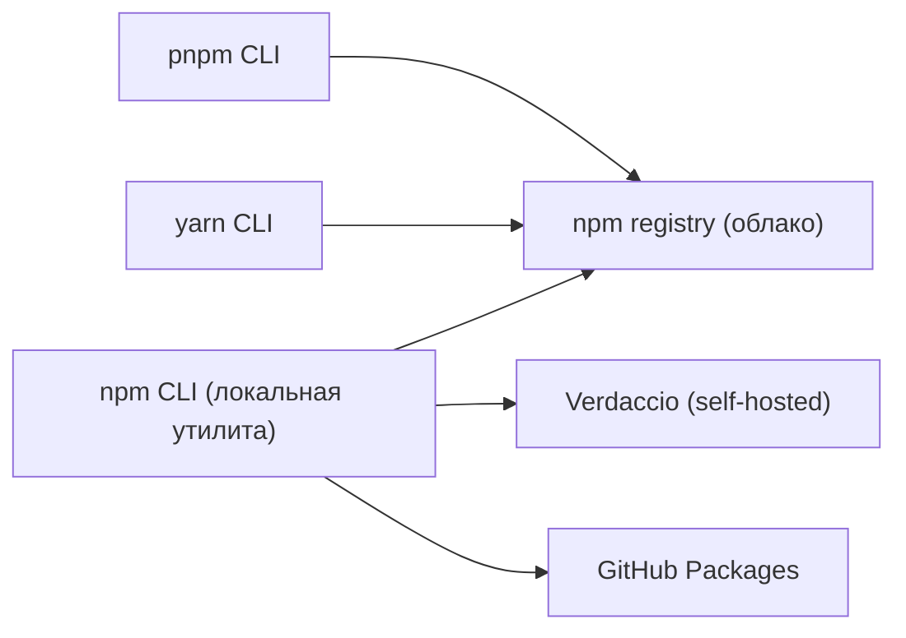

# Уровень 0 (подробно): Менеджеры пакетов — откуда берётся node_modules

## Аналогия: менеджер пакетов как «Яндекс.Маркет для кода»

Представьте: вам нужно починить кран. Вы не идёте добывать медь и лить трубы самостоятельно — вы заходите в магазин, выбираете подходящую деталь по артикулу, и вам привозят её домой.

Менеджер пакетов работает так же:

- **Каталог магазина** = npm registry (registry.npmjs.org)
- **Артикул детали** = имя пакета + версия (`lodash@4.17.21`)
- **Доставка** = скачивание и распаковка tarball в `node_modules`
- **Чек с гарантией** = `package-lock.json` (точно та же деталь завтра)

## Путь пакета от реестра до вашего кода



### Что происходит на каждом шаге

**1. Запрос метаданных.** npm обращается к `https://registry.npmjs.org/lodash`. Ответ — огромный JSON (packument) со списком всех версий, датами публикации, `dist`-объектами с URL tarball и sha512-хешем.

```
# Посмотреть метаданные пакета вручную:
npm view lodash versions --json
npm view lodash dist-tags
```

**2. Выбор версии.** Из `package.json` берётся диапазон (например, `^4.17.0`). npm выбирает максимальную версию, удовлетворяющую диапазону.

**3. Скачивание tarball.** `.tgz`-архив скачивается во временный каталог, проверяется по SHA-512 (поле `integrity` в lockfile), затем распаковывается.

**4. Рекурсивные зависимости.** Для каждой зависимости процесс повторяется. Дерево строится в памяти до того, как начнётся запись на диск.

## Структура npm-пакета изнутри

Распакуйте любой пакет и увидите:

```
lodash/
  package.json       ← манифест
  lodash.js          ← main entry point
  chunk/             ← модули
  ...
```

Ключевые поля `package.json` пакета:

```json
{
  "name": "lodash",
  "version": "4.17.21",
  "description": "Lodash modular utilities.",
  "main": "lodash.js",
  "exports": {
    ".": "./lodash.js",
    "./*": "./*.js"
  },
  "dependencies": {},
  "license": "MIT"
}
```

У lodash нет `dependencies` — он самодостаточен. Но у большинства пакетов они есть, и npm устанавливает их рекурсивно.

## node_modules: что туда попадает

```
project/
  node_modules/
    lodash/          ← прямая зависимость
    react/           ← прямая зависимость
    loose-envify/    ← транзитивная (нужна react)
    js-tokens/       ← транзитивная (нужна loose-envify)
    scheduler/       ← транзитивная (нужна react)
  package.json
  package-lock.json
```

Правило плоской структуры (npm v3+): npm старается «поднять» (hoist) транзитивные зависимости на верхний уровень, чтобы не дублировать одинаковые пакеты. Если версии конфликтуют — вложенная копия остаётся внутри пакета-потребителя.

### Пример транзитивного дерева

Ваш `package.json`:

```json
{ "dependencies": { "express": "^4.18.0" } }
```

После `npm install` в `node_modules` окажется ~60+ пакетов:

```
# Посмотреть полное дерево:
npm ls --all

# Только прямые зависимости:
npm ls --depth=0
```

Вывод `npm ls --depth=0`:

```
my-project@1.0.0
└── express@4.18.3
```

Вывод `npm ls --all` (фрагмент):

```
my-project@1.0.0
└── express@4.18.3
    ├── accepts@1.3.8
    │   ├── mime-types@2.1.35
    │   │   └── mime-db@1.52.0
    │   └── negotiator@0.6.3
    ├── body-parser@1.20.2
    ...
```

## Локальная установка: когда и почему

```bash
# Установить как зависимость проекта
npm install axios

# Установить только для разработки
npm install --save-dev jest

# Установить конкретную версию
npm install react@18.2.0
```

После установки в `package.json` появится запись, а папка `node_modules/axios` будет создана локально. Это значит:

- Проект A может использовать `axios@0.27`, проект B — `axios@1.6` — конфликта нет.
- CI-сервер выполнит `npm install` и получит те же версии благодаря lockfile.
- Нет необходимости коммитить `node_modules` — он полностью воспроизводится.

## Глобальная установка: когда уместна

```bash
# Глобальная установка CLI-инструмента
npm install -g @angular/cli

# Где хранятся глобальные пакеты
npm root -g         # /usr/local/lib/node_modules
npm bin -g          # /usr/local/bin  (симлинки на CLI)

# Список глобально установленных
npm ls -g --depth=0
```

Глобальные пакеты доступны как команды в терминале: `ng new my-app`. Но у них есть минус — версия «зашита» в систему, а не в проект.

Современный подход — использовать `npx` или поле `scripts` в `package.json`:

```bash
# npx скачивает пакет временно и запускает
npx create-react-app my-app

# Или зафиксировать версию в devDependencies + scripts
npm install --save-dev jest
# package.json: "scripts": { "test": "jest" }
npm test
```

## npm CLI vs npm registry: важное разграничение

Частая путаница: «обновить npm» и «поменять реестр» — разные действия.

```bash
# Обновить сам CLI
npm install -g npm@latest

# Проверить версию CLI
npm --version          # например, 10.8.1

# Проверить используемый реестр
npm config get registry   # https://registry.npmjs.org/

# Сменить реестр (например, на корпоративный)
npm config set registry https://my-company.artifactory.io/
```



## Краткое сравнение: npm, pnpm, yarn

| Критерий                     | npm                | pnpm                                  | yarn              |
| ---------------------------- | ------------------ | ------------------------------------- | ----------------- |
| Поставляется с Node.js       | Да                 | Нет                                   | Нет               |
| Алгоритм хранения            | Плоский hoisting   | Content-addressable store + hardlinks | PnP или плоский   |
| Скорость повторной установки | Средняя            | Высокая                               | Высокая           |
| Строгость изоляции           | Нет (phantom deps) | Строгая                               | Зависит от режима |
| Lockfile                     | package-lock.json  | pnpm-lock.yaml                        | yarn.lock         |

Все три CLI читают `package.json` из одного формата. Для начала достаточно npm.

## Частые ошибки новичков

**Коммит node_modules в git.** `node_modules` содержит тысячи файлов, полностью воспроизводимых из `package.json` + lockfile. Добавьте в `.gitignore`:

```
node_modules/
```

**Глобальная установка всего подряд.** Если инструмент используется только в одном проекте — ставьте его локально в devDependencies. Это делает зависимость видимой и воспроизводимой.

**Путаница npm версии Node.js.** npm поставляется с Node.js, но это отдельный пакет. Обновление Node.js не всегда обновляет npm до последней версии. Проверяйте оба:

```bash
node --version   # v20.11.0
npm --version    # 10.2.4
```
