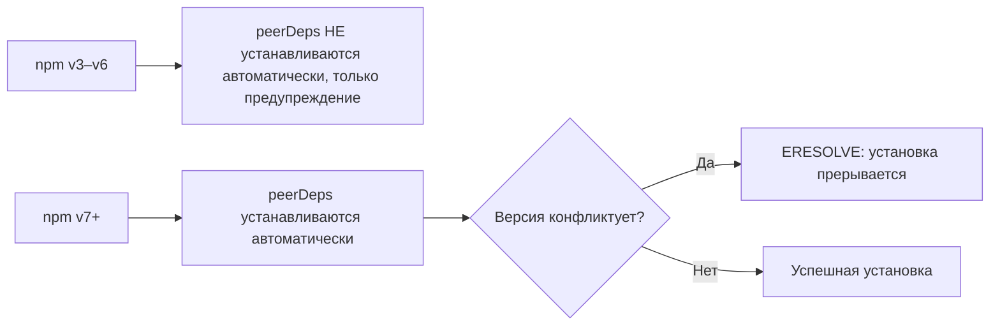

# Уровень 1 (подробно): Виды зависимостей — кто куда попадает и почему это важно

## Аналогия: ресторан и его поставщики

Представьте ресторан. У него есть:

- **Продукты для блюд** (нужны гостям прямо сейчас) = `dependencies`
- **Инструменты шеф-повара** (нужны на кухне, гости их не видят) = `devDependencies`
- **Поставщик, которого нет в меню, но без него блюдо не работает** (например, ресторан-франшиза требует определённые соусы от партнёра) = `peerDependencies`
- **Специи, которых может не быть — и ничего страшного** = `optionalDependencies`

## dependencies: runtime-зависимости

```json
{
  "dependencies": {
    "express": "^4.18.0",
    "axios": "^1.6.0",
    "lodash": "^4.17.21"
  }
}
```

Эти пакеты нужны, когда пользователь запускает ваше приложение. Без `express` сервер не запустится. Без `axios` HTTP-запросы сломаются.

```bash
# Установить и добавить в dependencies
npm install express

# Проверить, что попало туда
npm ls --depth=0
```

Вывод `npm ls --depth=0`:

```
my-app@1.0.0
└── express@4.18.3
```

**Когда вы публикуете пакет в npm-реестр**, пользователи вашей библиотеки получат `dependencies` автоматически при установке вашего пакета. `devDependencies` они не получат.

## devDependencies: инструменты разработчика

```json
{
  "devDependencies": {
    "jest": "^29.0.0",
    "typescript": "^5.0.0",
    "@types/node": "^20.0.0",
    "eslint": "^8.0.0",
    "vite": "^5.0.0"
  }
}
```

```bash
npm install --save-dev jest
# Или кратко:
npm install -D jest
```

### Что происходит при --omit=dev

```bash
# Продакшн-установка: devDependencies пропускаются
npm install --omit=dev

# Эквивалент в старых npm:
NODE_ENV=production npm install
```

Это важно для Docker-образов. Типичный многоэтапный Dockerfile:

```dockerfile
# Этап сборки: нужны devDeps (TypeScript, Vite)
FROM node:20 AS build
COPY package*.json ./
RUN npm install
COPY . .
RUN npm run build

# Продакшн-образ: только runtime-зависимости
FROM node:20-slim
COPY package*.json ./
RUN npm install --omit=dev
COPY --from=build /app/dist ./dist
```

Без `--omit=dev` продакшн-образ будет тащить jest, typescript, eslint — лишние сотни мегабайт.

## peerDependencies: «плагинный» контракт

```json
{
  "name": "eslint-plugin-react",
  "peerDependencies": {
    "eslint": ">=7.0.0"
  }
}
```

`eslint-plugin-react` не устанавливает `eslint` сам. Он говорит: «я работаю, только если в проекте уже есть eslint >= 7». Это логично: если каждый плагин тащил бы свою копию eslint, в проекте было бы несколько несовместимых версий.

### Поведение по версиям npm



### ERESOLVE и --legacy-peer-deps

Частая ошибка:

```
npm error code ERESOLVE
npm error ERESOLVE unable to resolve dependency tree
npm error
npm error While resolving: my-app@1.0.0
npm error Found: react@18.2.0
npm error node_modules/react
npm error   react@"^18.0.0" from the root project
npm error
npm error Could not resolve dependency:
npm error   peer react@"^17.0.0" from some-old-library@2.0.0
```

Это значит, что `some-old-library` ожидает React 17, а в проекте React 18. Три варианта решения:

```bash
# 1. Использовать старое поведение (npm v3-v6) — РИСКОВАННО
npm install --legacy-peer-deps

# 2. Принудительно проигнорировать конфликт — ЕЩЁ РИСКОВАННЕЕ
npm install --force

# 3. Найти версию библиотеки, совместимую с React 18 — ПРАВИЛЬНО
npm install some-old-library@3.0.0
```

### peerDependenciesMeta

Начиная с npm v7+ можно сделать peerDependency необязательной:

```json
{
  "peerDependencies": {
    "react": "^17 || ^18"
  },
  "peerDependenciesMeta": {
    "react": { "optional": true }
  }
}
```

## optionalDependencies: «если не получится — не страшно»

```json
{
  "optionalDependencies": {
    "fsevents": "^2.3.0"
  }
}
```

`fsevents` — нативный модуль macOS для file watching. На Linux или Windows он не установится, и это нормально: Webpack и Vite используют его, если доступен, иначе работают через polling.

```bash
npm install --save-optional fsevents
```

**Критично:** ваш код должен защищаться от отсутствия пакета:

```js
let fsevents
try {
  fsevents = require('fsevents')
} catch {
  // работаем без него
}
```

Если код безусловно делает `require('fsevents')` — он упадёт на Linux, несмотря на `optionalDependencies`.

Ещё один сценарий: пакет, требующий специфическую CUDA/GPU библиотеку — на машинах без GPU установка провалится, но CPU-режим работает.

## bundledDependencies: редкий, но полезный случай

```json
{
  "bundledDependencies": ["lodash", "axios"]
}
```

При `npm publish` npm включит папки `lodash` и `axios` из `node_modules` прямо в tarball. Сценарии использования:

- Компания с закрытым реестром хочет распространять «всё в одном» пакете
- Пакет должен работать полностью офлайн
- Зависимость не опубликована в публичном реестре

Важно: имена в массиве должны присутствовать в `dependencies` или `devDependencies`.

## Поле engines: совместимость с окружением

```json
{
  "engines": {
    "node": ">=18.0.0 <21.0.0",
    "npm": ">=9.0.0"
  }
}
```

```bash
# Посмотреть, какие engines требует пакет
npm view express engines

# При несовместимой версии Node.js npm выдаст:
# npm warn EBADENGINE Unsupported engine { ... }
```

Чтобы сделать проверку engines жёсткой (ошибка вместо предупреждения):

```bash
npm install --engine-strict
# Или в .npmrc:
engine-strict=true
```

## Полный пример package.json с комментариями

```json
{
  "name": "my-react-plugin",
  "version": "1.0.0",
  "dependencies": {
    "clsx": "^2.0.0"
  },
  "devDependencies": {
    "react": "^18.0.0",
    "typescript": "^5.0.0",
    "vite": "^5.0.0",
    "@types/react": "^18.0.0"
  },
  "peerDependencies": {
    "react": "^17.0.0 || ^18.0.0"
  },
  "peerDependenciesMeta": {
    "react": { "optional": false }
  },
  "optionalDependencies": {
    "fsevents": "^2.3.0"
  },
  "engines": {
    "node": ">=16.0.0"
  }
}
```

Обратите внимание: `react` в этом пакете стоит в `devDependencies` (для локальной разработки) И в `peerDependencies` (требование к хосту). Это стандартный паттерн для React-плагинов.

## Частые ошибки

**Положить runtime-зависимость в devDependencies.** Приложение работает локально, падает при деплое с `--omit=dev`. Проверяйте: если пакет нужен в `dist/` — он должен быть в `dependencies`.

**Не использовать peerDependencies для плагинов.** Если ваша библиотека-плагин указала React в `dependencies`, а не в `peerDependencies` — пользователь получит две копии React в бандле. Это ломает хуки (React проверяет, что все компоненты используют один экземпляр).

**Игнорировать ERESOLVE через --force.** `--force` говорит npm «я знаю, что делаю». Если вы не знаете — приложение упадёт в рантайме с непонятными ошибками.
