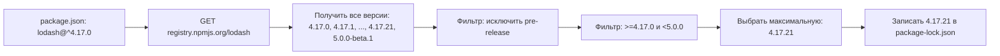

# Уровень 2 (подробно): Semver — как npm читает версии и что это значит на практике

## Аналогия: semver как договор между библиотекарем и читателем

Semver — это обещание автора библиотеки. «Если я меняю только PATCH — ваш код продолжит работать. Если меняю MINOR — появились новые возможности, но ничего не сломал. Если меняю MAJOR — читайте migration guide».

Операторы в package.json (`^`, `~`) — это ваш ответ: «я доверяю автору настолько, что приму его MINOR-обновления автоматически». Точная версия — «я вообще не доверяю, только эта и никакая другая».

## Анатомия версии

```
    1   .   2   .   3   -   beta  .  1   +  build.1
    │       │       │       │                │
  MAJOR   MINOR  PATCH   pre-release       build metadata
```

- **build metadata** (после `+`) полностью игнорируется при сравнении версий
- `1.0.0-alpha < 1.0.0-alpha.1 < 1.0.0-beta < 1.0.0-rc.1 < 1.0.0`

## Оператор ^ (caret) — глубокий разбор

Caret — самый популярный оператор и источник самых частых сюрпризов.

### Для стабильных версий (MAJOR >= 1)

```
^1.2.3  →  >=1.2.3 <2.0.0

Что разрешено:    1.2.3 ✅, 1.2.99 ✅, 1.99.0 ✅
Что запрещено:    1.2.2 ❌ (ниже начальной), 2.0.0 ❌ (другой major)
```

Логика: MAJOR-версия фиксирует API-контракт. Внутри одного MAJOR обновления совместимы.

### Ловушка: ^0.x.x

```
^0.2.3  →  >=0.2.3 <0.3.0  (НЕ <1.0.0!)
^0.0.3  →  >=0.0.3 <0.0.4  (только этот PATCH!)
```

Почему так? Версии `0.x` — нестабильные. Авторы могут вносить breaking changes в MINOR. Поэтому `^` для `0.x` ведёт себя осторожнее:

```
npx semver '0.3.0' -r '^0.2.3'   # пустой вывод — НЕ удовлетворяет!
npx semver '0.2.9' -r '^0.2.3'   # 0.2.9 — удовлетворяет
```

Это частая причина ошибок: разработчик думает, что `^0.2.3` покрывает `0.3.0`, но это не так.

## Оператор ~ (tilde) — только патчи

```
~1.2.3  →  >=1.2.3 <1.3.0
~1.2    →  >=1.2.0 <1.3.0
~1      →  >=1.0.0 <2.0.0   (для одной цифры ведёт себя как ^!)
```

Более консервативный выбор: вы доверяете только bagfix-обновлениям, но не новым функциям.

### Когда выбирать ~ вместо ^

- Критически важный пакет, где даже MINOR-изменение может что-то сломать
- Корпоративная среда с требованием явного тестирования каждого обновления
- Нативные модули или пакеты с частыми MINOR breaking-changes

## Точная версия и диапазоны

```json
{
  "dependencies": {
    "react": "18.2.0",
    "lodash": ">=4.0.0 <5.0.0",
    "some-lib": "^1.0.0 || ^2.0.0"
  }
}
```

Точная версия (`18.2.0` без операторов) — единственная принятая. npm не обновит её автоматически.

Диапазон с `||` — полезен при миграции: пакет совместим с двумя поколениями API.

## Как npm разрешает версию при установке



### npm view: проверить версии без установки

```bash
# Все версии пакета
npm view lodash versions --json

# Текущая latest-версия
npm view lodash version

# Что будет выбрано для диапазона
npm view lodash@'^4.17.0' version
# → 4.17.21 (максимальная в 4.x)

# dist-tags (метки, не версии)
npm view lodash dist-tags
# { latest: '4.17.21', ... }
```

## Pre-release: специальное поведение

```bash
# Эти версии НЕ будут выбраны для ^1.0.0:
# 1.1.0-beta.1, 1.1.0-alpha, 1.2.0-rc.1

# Почему: pre-release означает "нестабильно"
# npm защищает вас от случайной установки нестабильной версии

# Установить pre-release можно ТОЛЬКО явно:
npm install react@19.0.0-rc.0
npm install some-pkg@next            # если next — dist-tag на pre-release
```

### Pre-release порядок сравнения

```
1.0.0-alpha   < 1.0.0-alpha.1  < 1.0.0-alpha.beta
< 1.0.0-beta  < 1.0.0-beta.2   < 1.0.0-beta.11
< 1.0.0-rc.1  < 1.0.0
```

Числовые идентификаторы сравниваются числово (beta.11 > beta.2), строковые — лексикографически (beta > alpha).

## dist-tags: псевдонимы версий

```bash
npm install react              # → latest (стабильная)
npm install react@next         # → следующая (может быть pre-release)
npm install react@canary       # → экспериментальная

# Посмотреть все теги
npm view react dist-tags
# { latest: '18.3.1', next: '19.0.0-rc.1', canary: '19.1.0-canary.abc' }
```

`latest` — это тег по умолчанию. `npm install pkg` = `npm install pkg@latest`.

## npm semver: CLI для проверки

```bash
# Удовлетворяет ли версия диапазону?
npx semver 1.5.0 -r '>=1.2.0 <2.0.0'   # → 1.5.0

# Несколько версий против диапазона
npx semver 1.5.0 2.0.0 0.9.0 -r '^1.0.0'
# → 1.5.0 (только она удовлетворяет)

# Инкрементировать версию
npx semver 1.2.3 -i patch    # → 1.2.4
npx semver 1.2.3 -i minor    # → 1.3.0
npx semver 1.2.3 -i major    # → 2.0.0
npx semver 1.2.3 -i prerelease --preid beta   # → 1.2.4-beta.0
```

## npm outdated: что можно безопасно обновить

```bash
npm outdated
```

Вывод:

```
Package    Current  Wanted  Latest  Location
lodash      4.17.0  4.17.21 4.17.21 node_modules/lodash
react       17.0.2   17.0.2  18.3.1 node_modules/react
axios        0.27.2   0.27.2   1.7.2 node_modules/axios
```

- **Current** — установленная версия (из lockfile)
- **Wanted** — максимальная в рамках вашего диапазона (что даст `npm update`)
- **Latest** — последняя stable в реестре (требует ручного обновления в package.json)

`lodash` можно обновить через `npm update` (4.17.0 → 4.17.21 в рамках `^4.17.0`).
`react` обновить автоматически нельзя: `17.0.2` и `18.3.1` — разные MAJOR.
`axios` не обновится: `^0.27.2` ограничен `<0.28.0`, `1.7.2` вне диапазона.

## Частые ошибки

**Ожидать, что `^0.2.3` покрывает `0.3.0`.** Для нулевых MAJOR, `^` фиксирует MINOR. Это часто ломает установку, когда библиотека переходит с `0.x` на `0.(x+1)`.

**Использовать `*` в production package.json.** `*` означает «любая версия», включая major-обновления с breaking changes. Никогда не используйте `*` для продакшн-зависимостей.

**Путать `npm update` и ручное редактирование package.json.** `npm update` обновляет пакеты до максимальной Wanted-версии (в рамках текущих диапазонов). Изменить сам диапазон в package.json `npm update` не умеет.
