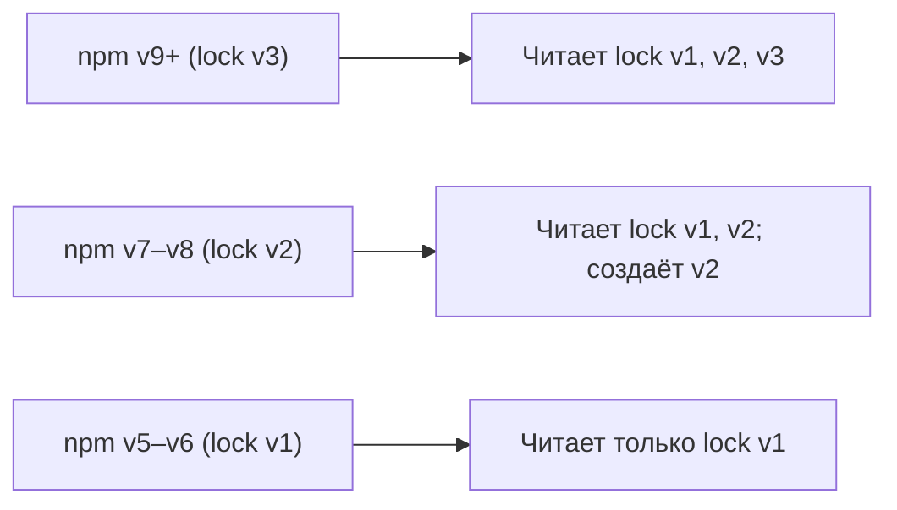

# Уровень 3 (подробно): package-lock.json — детерминизм и воспроизводимость

## Аналогия: рецепт vs список покупок с чеком

`package.json` — это рецепт: «нам нужна мука примерно 400–500 г». Сегодня вы купили 450 г, завтра — 480 г. Блюдо выйдет чуть разным.

`package-lock.json` — это чек из магазина: «куплено ровно 460 г муки, артикул №5821, производитель X, дата производства Y». Следующий повар возьмёт тот же чек и купит то же самое.

## Почему без lockfile возникают проблемы

```bash
# Четверг: разработчик запускает npm install
# Устанавливается axios@1.6.5

# Пятница: выходит axios@1.6.8 с фиксом бага в парсинге URL
# (тихое обновление, Breaking-change скрыт в PATCH)

# Понедельник: CI запускает npm install
# Устанавливается axios@1.6.8

# Результат: prod и dev ведут себя по-разному.
# Воспроизвести баг с пятницы невозможно.
```

Lockfile фиксирует: «в этом проекте используется именно axios@1.6.5 с этим конкретным tarball и этим хешем».

## Эволюция форматов lockfile

### lockfileVersion 1 (npm v5, v6)

```json
{
  "lockfileVersion": 1,
  "dependencies": {
    "axios": {
      "version": "1.6.5",
      "resolved": "https://registry.npmjs.org/axios/-/axios-1.6.5.tgz",
      "integrity": "sha512-...",
      "requires": {
        "follow-redirects": "^1.15.4"
      }
    },
    "follow-redirects": {
      "version": "1.15.6",
      "resolved": "...",
      "integrity": "sha512-..."
    }
  }
}
```

Плоская структура секции `dependencies`. Все пакеты на одном уровне.

### lockfileVersion 2 (npm v7, v8)

```json
{
  "lockfileVersion": 2,
  "packages": {
    "": {
      "name": "my-app",
      "version": "1.0.0",
      "license": "MIT",
      "dependencies": { "axios": "^1.6.0" }
    },
    "node_modules/axios": {
      "version": "1.6.8",
      "resolved": "https://registry.npmjs.org/axios/-/axios-1.6.8.tgz",
      "integrity": "sha512-...",
      "engines": { "node": ">= 0.8.0" },
      "dependencies": {
        "follow-redirects": "^1.15.6"
      }
    }
  },
  "dependencies": {
    "axios": { "version": "1.6.8", ... }
  }
}
```

Добавилась секция `packages` с путями `node_modules/...`. Секция `dependencies` сохранена для обратной совместимости с npm v6.

### lockfileVersion 3 (npm v9, v10)

```json
{
  "lockfileVersion": 3,
  "packages": {
    "": { ... },
    "node_modules/axios": {
      "version": "1.6.8",
      "resolved": "...",
      "integrity": "sha512-..."
    }
  }
}
```

Убрана legacy-секция `dependencies`. Только `packages`. Более компактный формат.

### Совместимость версий



Если в команде кто-то использует npm v6 с lock v3-проектом — он получит ошибку. Решение: зафиксировать версию npm в `engines.npm` или использовать `.npmrc` с `engine-strict=true`.

## Разбор ключевых полей lockfile

### `resolved` — источник пакета

```json
"resolved": "https://registry.npmjs.org/axios/-/axios-1.6.8.tgz"
```

URL tarball-архива. npm скачивает именно его. Если в вашем `.npmrc` указан другой реестр — URL будет другим:

```
"resolved": "https://my-company.artifactory.io/axios/-/axios-1.6.8.tgz"
```

Это важно при переходе между реестрами: lockfile нужно регенерировать.

### `integrity` — криптографическая проверка

```json
"integrity": "sha512-HhLCFgDpz5gar6vMDpRtPfVW1pmkpGFEgLRKsYMHgqSMRqo3Ubo4aUTquQlgXB/3MxiBCqD3EwMmEXnr7Q=="
```

SHA-512 хеш tarball-архива, закодированный в base64 с префиксом `sha512-`. npm проверяет этот хеш при каждой установке. Если tarball подменили в реестре или CDN — npm откажется его использовать и выдаст ошибку:

```
npm error Integrity check failed for axios@1.6.8
```

Это ключевая защита от атаки supply chain (подмена пакета в реестре).

### `dev: true` — пометка devDependencies

В lockfileVersion 2/3 пакеты, нужные только для разработки, помечаются:

```json
"node_modules/jest": {
  "version": "29.7.0",
  "dev": true,
  ...
}
```

Это позволяет `npm install --omit=dev` пропустить их без полного перерасчёта дерева.

## npm install vs npm ci: подробный разбор

### npm install

```bash
npm install
```

1. Читает `package.json`
2. Если lockfile существует — использует его как подсказку, но может обновить
3. Если нашёл более новую версию в рамках диапазона — обновляет lockfile
4. Не удаляет существующий `node_modules` — инкрементальная установка

**Сценарий, когда install изменит lockfile:**

- Новый разработчик добавил зависимость в `package.json` без запуска `npm install`
- Вышла новая PATCH-версия, npm нашёл её и обновил
- Конфликт версий в дереве требует нового решения

### npm ci

```bash
npm ci
```

1. Требует наличия `package-lock.json` (или `npm-shrinkwrap.json`) — иначе ошибка
2. **Удаляет `node_modules` целиком** перед установкой
3. Читает lockfile, устанавливает точные зафиксированные версии
4. Если `package.json` и lockfile расходятся — **ошибка**, установка не происходит
5. **Не изменяет** lockfile

### Почему npm ci быстрее в CI

`npm install` при наличии актуального lockfile делает лишнюю работу: проверяет реестр на наличие новых версий. `npm ci` этого не делает — он знает точно, что нужно установить.

Разница ощутима на больших проектах: `npm install` — 30-60 секунд, `npm ci` — 10-20 секунд (при наличии кеша).

## Обнаружение рассинхрона

```bash
# Проверить, синхронны ли package.json и lockfile
npm install --dry-run
# Если выведет изменения — lockfile устарел

# npm ci сразу покажет ошибку
npm ci
# npm error `npm ci` can only install packages when your
# package.json and package-lock.json are in sync.
# Please update your lock file with `npm install`
# before continuing.
```

### Частые причины рассинхрона

1. Разработчик вручную добавил строку в `package.json` и не запустил `npm install`
2. Конфликт при merge двух веток, каждая из которых добавляла зависимость
3. Автоматические обновления (Dependabot) обновили `package.json`, но не запустили `npm install`

## Когда НЕ коммитить lockfile

Для публикуемых библиотек lockfile коммитить не нужно:

```
# .gitignore для npm-библиотеки
node_modules/
package-lock.json
```

Причина: когда пользователь устанавливает вашу библиотеку, npm игнорирует lockfile вложенных пакетов. lockfile в реестре занимает место в tarball, но не используется. Зависимости библиотеки разрешаются в контексте проекта пользователя.

Исключение: монорепозитории с приложениями — там lockfile коммитится для каждого workspaces.

## npm-shrinkwrap.json: альтернатива

`npm shrinkwrap` создаёт `npm-shrinkwrap.json` — функционально идентичный `package-lock.json`, но с одним отличием: он **включается в npm-публикацию** (в tarball пакета).

Использование: пакеты-CLI, которые устанавливаются глобально и где воспроизводимость критична. Если вы публикуете инструмент `my-cli`, пользователи при `npm install -g my-cli` получат ровно те зависимости, которые вы протестировали.

```bash
# Создать shrinkwrap из существующего lockfile
npm shrinkwrap
# Создаёт npm-shrinkwrap.json (переименовывает или копирует lockfile)
```

## Практика: аудит lockfile

```bash
# Проверить целостность установленных пакетов
npm audit

# Обновить все пакеты до Wanted (в рамках диапазонов)
npm update

# Полная пересборка дерева с нуля
rm -rf node_modules package-lock.json
npm install

# Посмотреть историю изменений lockfile в git
git log --oneline -- package-lock.json
```
