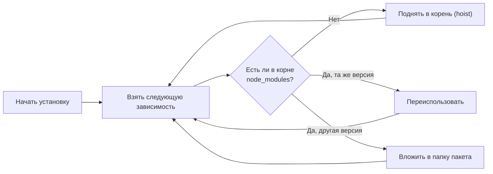

# Уровень 4 (подробно): Устройство node_modules

## Аналогия: склад с полками

Представьте склад интернет-магазина. В старой модели (npm v1/v2) каждый товар хранился в собственной коробке со всеми своими комплектующими внутри — даже если те же комплектующие уже лежали в другой коробке. Полки разрастались вглубь, и чтобы достать нужное, приходилось раскрывать коробку внутри коробки внутри коробки.

npm v3 переосмыслил подход: все комплектующие **выкладываются на общую полку** в начале склада. Каждая коробка-пакет просто ссылается на нужное. Если двум коробкам нужна одна деталь — они берут одну копию. Только при несовместимости деталь кладётся отдельно в конкретную коробку.

## История: почему npm v2 стал проблемой

```
# npm v2: адский лес вложенности
node_modules/
  express/
    node_modules/
      accepts/
        node_modules/
          mime-types/
            node_modules/
              mime-db/
  body-parser/
    node_modules/
      accepts/          ← дубликат!
        node_modules/
          mime-types/   ← ещё дубликат!
```

Это порождало:

- **Дублирование кода** — одна и та же библиотека занимала место много раз
- **Проблему Windows** — путь к файлу мог превышать 260 символов (ограничение NTFS)
- **Медленную установку** — одни и те же пакеты скачивались несколько раз

## Алгоритм hoisting в npm v3+



Npm просматривает всё дерево зависимостей и применяет этот алгоритм к каждому пакету. В результате большинство пакетов оказываются на верхнем уровне.

## Демонстрация: что вы увидите после npm install

```bash
$ npm install express

# Структура node_modules (упрощённо):
node_modules/
  .bin/
    express -> ../express/bin/express          # симлинк
  accepts/           ← транзитивная зависимость express, поднята наверх
  body-parser/
  bytes/
  content-type/
  cookie/
  depd/
  destroy/
  encodeurl/
  escape-html/
  express/           ← сам express
  finalhandler/
  forwarded/
  fresh/
  http-errors/
  iconv-lite/
  ...
```

Вы установили один пакет, а получили ~50 — это нормально для express. Все они плоско лежат в `node_modules`.

## Конфликт версий: когда hoisting не работает

Рассмотрим реальный сценарий:

```json
// package.json вашего проекта
{
  "dependencies": {
    "package-a": "^1.0.0",
    "package-b": "^1.0.0"
  }
}

// package-a/package.json
{
  "dependencies": {
    "lodash": "^4.17.0"
  }
}

// package-b/package.json
{
  "dependencies": {
    "lodash": "^3.10.0"
  }
}
```

Итоговая структура:

```
node_modules/
  package-a/
  package-b/
    node_modules/
      lodash/     ← версия 3.10.x (вложена, не совместима с 4.x)
  lodash/         ← версия 4.17.x (поднята как первая встреченная)
```

📌 Важно: **какая версия поднимется, а какая уйдёт вглубь, зависит от порядка обработки** (обычно алфавитного порядка в `package.json`). Это один из источников недетерминизма без lockfile.

## Подробнее о .bin

```bash
$ ls -la node_modules/.bin/ | head -10
lrwxr-xr-x  typescript -> ../typescript/bin/tsc
lrwxr-xr-x  tsc -> ../typescript/bin/tsc
lrwxr-xr-x  tsserver -> ../typescript/bin/tsserver
lrwxr-xr-x  jest -> ../jest/bin/jest.js
lrwxr-xr-x  eslint -> ../eslint/bin/eslint.js
```

Когда npm выполняет скрипт из `package.json`, он временно добавляет `./node_modules/.bin` в `PATH`. Поэтому работает:

```json
{
  "scripts": {
    "build": "tsc --build",
    "lint": "eslint src/"
  }
}
```

Без этого пришлось бы писать `./node_modules/.bin/tsc --build`.

## Дедупликация в деталях

`npm dedupe` (или `npm ddp`) пересчитывает дерево:

```bash
$ npm dedupe

# Вывод:
removed 3 packages, changed 2 packages, and audited 847 packages in 2.1s
```

Когда dedupe помогает: оба пакета требуют `"lodash": "^4.0.0"`, но получили разные патч-версии. Dedupe оставит только одну — максимальную совместимую.

Когда не помогает: принципиально несовместимые мажорные версии — обе копии останутся.

```bash
# Проверить дубликаты в дереве:
$ npm ls lodash

my-project@1.0.0
├── package-a@1.0.0
│   └── lodash@4.17.21
└── package-b@1.0.0
    └── lodash@3.10.1   ← вложенная копия, dedupe не уберёт
```

## Фантомные зависимости: разбор сценария

Это одна из самых коварных проблем npm с плоской структурой.

**Ситуация:**

```
# package.json вашего проекта
{
  "dependencies": {
    "some-framework": "^2.0.0"
  }
}

# some-framework внутренне использует chalk@4
# После npm install:
node_modules/
  some-framework/
  chalk/           ← поднялся из транзитивных зависимостей
```

**Ваш код:**

```js
// src/logger.js — ПЛОХО
const chalk = require('chalk') // работает... пока
console.log(chalk.green('Done!'))
```

**Что произойдёт при обновлении:**

```bash
$ npm update some-framework
# some-framework@3.0.0 теперь использует chalk@5 через другой механизм
# или вовсе убрал chalk из своих зависимостей

# Ваш код падает:
Error: Cannot find module 'chalk'
```

**Правильное решение:**

```bash
# Явно добавить chalk в зависимости
$ npm install chalk
```

```json
{
  "dependencies": {
    "some-framework": "^2.0.0",
    "chalk": "^4.0.0" // ← теперь явная зависимость
  }
}
```

## .package-lock.json (скрытый файл внутри node_modules)

Не путайте с `package-lock.json` в корне проекта. Файл `node_modules/.package-lock.json` — внутренний файл npm Arborist, который хранит метаданные об установленных пакетах для ускорения последующих операций. Он обновляется автоматически и **не предназначен для коммита**.

```bash
$ cat node_modules/.package-lock.json | head -20
{
  "name": "my-project",
  "version": "1.0.0",
  "lockfileVersion": 3,
  "packages": {
    "node_modules/accepts": {
      "version": "1.3.8",
      "resolved": "https://registry.npmjs.org/accepts/-/accepts-1.3.8.tgz",
      "integrity": "sha512-...",
      ...
    }
  }
}
```

## Почему pnpm подходит к проблеме иначе

pnpm не делает плоскую структуру. Вместо этого он использует:

1. **Глобальный контент-адресуемый кеш** — каждый файл хранится один раз на диске
2. **Жёсткие ссылки (hardlinks)** — файлы в `node_modules` — это hardlinks на кеш
3. **Символические ссылки** — пакет видит только свои прямые зависимости

Это полностью исключает фантомные зависимости. Подробнее — в уровне 15.

## ⚠️ Распространённые ошибки начинающих

❌ **Импорт без объявления в package.json**

```js
// Пакет поднялся транзитивно — сейчас работает
const dayjs = require('dayjs')
```

Почему проблема: при любом изменении дерева зависимостей код может сломаться.

✅ Правильно: `npm install dayjs` перед использованием.

---

❌ **Ручное редактирование node_modules**

```bash
# Никогда не делайте:
nano node_modules/some-package/index.js
```

Почему проблема: любой `npm install` перезапишет изменения. Используйте `patch-package` или `npm patch` (npm v8.5+).

✅ Правильно: создать патч через `npm patch some-package`.

---

❌ **Удаление node_modules вручную для "починки"**

```bash
rm -rf node_modules && npm install
```

Почему это часто не помогает: проблема может быть в `package-lock.json`.

✅ Правильно: `rm -rf node_modules package-lock.json && npm install` — если хотите полный сброс.

## 💡 Практические советы

- Запустите `npm ls --all 2>/dev/null | grep -E "UNMET|invalid"` — увидите проблемные зависимости
- `du -sh node_modules` — покажет, сколько места занимает папка
- Инструмент `npm-why` / `npm explain <pkg>` — покажет, почему пакет в дереве (уровень 7)
- Добавьте `node_modules/` в `.gitignore` — это обязательно
