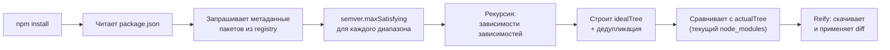

# Уровень 5 (подробно): Алгоритм разрешения зависимостей

## Аналогия: шеф-повар и цепочка поставщиков

Представьте шеф-повара (npm), которому нужно приготовить блюдо (собрать проект). Список ингредиентов — это `package.json`. Некоторые ингредиенты сами по себе состоят из других: мясной бульон = мясо + овощи + специи. Шеф-повар сначала составляет полный список всего необходимого (idealTree), убеждается, что нет дублирования, и только потом отправляет закупщика (reify).

Без списка-шпаргалки (lockfile) закупщик каждый раз получал бы немного разный товар — поставщики обновляют продукты. С lockfile — строго по фиксированному списку.

## Полный алгоритм npm install: шаг за шагом



Если есть `package-lock.json`, шаги C–E заменяются прямым чтением из lockfile.

## Как работает semver.maxSatisfying

Функция `semver.maxSatisfying(versions, range)` из пакета `semver` — основа алгоритма выбора версии.

```js
const semver = require('semver')

// Какие версии доступны в реестре (упрощённо):
const available = ['1.0.0', '1.2.3', '1.5.0', '1.9.1', '2.0.0', '2.1.0']

// Что выберет npm для разных диапазонов:
semver.maxSatisfying(available, '^1.2.3') // → '1.9.1'
semver.maxSatisfying(available, '~1.2.3') // → '1.2.3'
semver.maxSatisfying(available, '>=1.5.0 <2.0.0') // → '1.9.1'
semver.maxSatisfying(available, '2.x') // → '2.1.0'
```

Для диапазона `^1.2.3` npm берёт самую свежую версию в пределах мажора `1`. На следующий день в реестре может появиться `1.9.2` — и `npm install` без lockfile выберет уже её.

## Дерево зависимостей: реальный пример

Допустим, ваш `package.json`:

```json
{
  "dependencies": {
    "express": "^4.18.0",
    "compression": "^1.7.0"
  }
}
```

После разворачивания дерево выглядит примерно так (упрощённо):

```
my-app@1.0.0
├── express@4.18.2
│   ├── accepts@1.3.8
│   │   ├── mime-types@2.1.35
│   │   └── negotiator@0.6.3
│   ├── body-parser@1.20.1
│   │   ├── bytes@3.1.2
│   │   ├── content-type@1.0.5
│   │   └── ...
│   └── ...
└── compression@1.7.4
    ├── accepts@1.3.8  ← тот же пакет! dedupe сохранит одну копию
    ├── bytes@3.1.2    ← тот же! тоже дедуплицируется
    └── ...
```

Без дедупликации `accepts` и `bytes` установились бы дважды. idealTree строится так, чтобы в корне `node_modules` каждый пакет был в единственном числе (если версии совместимы).

## idealTree и actualTree: что делает Arborist

Arborist — это движок npm, управляющий деревом зависимостей с npm v7.

```
idealTree    — то, что ДОЛЖНО быть (по package.json/lockfile)
actualTree   — то, что ЕСТЬ СЕЙЧАС в node_modules
              ↓
         diff(ideal, actual)
              ↓
         reify: добавить/удалить/обновить только изменившиеся пакеты
```

Это делает `npm install` инкрементальным — если `node_modules` уже содержит правильные версии, npm почти ничего не делает:

```bash
$ npm install
# Ничего не изменилось:
up to date, audited 847 packages in 1.2s
```

## Разрешение при конфликте: детальный разбор

Сценарий: три пакета требуют разные версии `debug`:

```
my-app
  ├── express@4.18    → требует debug@2.6.9
  ├── mocha@10.0      → требует debug@4.3.4
  └── koa@2.14        → требует debug@4.3.4
```

Алгоритм idealTree:

1. Обнаруживает `debug@2.6.9` и `debug@4.3.4`
2. Версии несовместимы (разные мажоры: 2 vs 4)
3. Поднимает `debug@4.3.4` в корень (как более распространённую)
4. Вкладывает `debug@2.6.9` внутрь express

Результат:

```
node_modules/
  debug/           ← версия 4.3.4 (для mocha и koa)
  express/
    node_modules/
      debug/       ← версия 2.6.9 (только для express)
  mocha/
  koa/
```

## Как Node.js находит нужную версию

Node.js разрешает `require('debug')` по алгоритму:

1. Ищет в `./node_modules/debug`
2. Если нет — ищет в `../node_modules/debug`
3. Продолжает вверх до корня файловой системы

Express, находясь в `node_modules/express/`, сначала смотрит в `node_modules/express/node_modules/debug` — находит версию 2.6.9. Mocha, находясь в `node_modules/mocha/`, смотрит в `node_modules/mocha/node_modules/` — не находит, затем смотрит в корень `node_modules/debug` — находит 4.3.4.

## Детерминизм: с lockfile и без

```bash
# 1 января:
npm install axios  # ставит axios@1.6.0 (последняя на тот момент)

# 15 января (новый разработчик, нет lockfile):
npm install        # ставит axios@1.6.2 (вышла 10 января)
# Разные версии → возможны разные баги!
```

```bash
# С package-lock.json:
npm ci             # строго по lockfile → axios@1.6.0 везде
```

Lockfile хранит **точные версии** всего дерева (не только прямых зависимостей) и хеши для верификации целостности.

## Overrides: принудительная замена версии (тизер)

Поле `overrides` появилось в npm v8.3:

```json
{
  "overrides": {
    "lodash": "4.17.21"
  }
}
```

Это заставляет npm использовать lodash@4.17.21 **во всём дереве**, игнорируя требования транзитивных зависимостей. Полезно для срочных патчей CVE. Подробно — в уровне 9.

## Peer dependencies и их влияние на разрешение

Peer dependencies (`peerDependencies`) не устанавливаются автоматически — они говорят: «я ожидаю, что в хосте уже есть этот пакет определённой версии». Если версии не совпадают, npm v7+ выдаёт предупреждение (или ошибку).

```bash
$ npm install react-beautiful-dnd
npm WARN ERESOLVE overriding peer dependency
npm WARN Found: react@18.2.0
npm WARN node_modules/react
npm WARN   react@"^18.2.0" from the root project
npm WARN
npm WARN Could not resolve dependency:
npm WARN   peer react@"^16.8.5 || ^17.0.0" from react-beautiful-dnd@13.1.1
```

## ⚠️ Распространённые ошибки начинающих

❌ **Не коммитить package-lock.json**

```bash
# .gitignore — ПЛОХО:
package-lock.json
node_modules/
```

Почему проблема: без lockfile каждый разработчик и CI получают потенциально разные версии транзитивных зависимостей.

✅ Правильно: коммитить `package-lock.json`, игнорировать только `node_modules/`.

---

❌ **Удалять package-lock.json при конфликтах**

```bash
rm package-lock.json  # "починить" конфликт при merge
npm install
```

Почему проблема: это сбрасывает все зафиксированные версии. При следующем `npm install` дерево может измениться.

✅ Правильно: разрешить конфликт в lockfile вручную или принять одну из версий файла через `git checkout --ours/--theirs package-lock.json`, затем `npm install`.

---

❌ **Думать, что `npm install <pkg>` = `npm ci`**

Почему разница важна: `npm install` обновляет lockfile, `npm ci` строго следует ему. В CI/CD всегда используйте `npm ci`.
