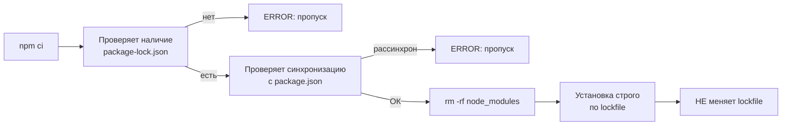

# Уровень 6 (подробно): Команды установки и обновления

## Аналогия: менеджер склада

Представьте, что `package.json` — это заявка на товары, `package-lock.json` — подробный инвентарный список с серийными номерами, а `node_modules` — сам склад.

- `npm install` — пополняет склад по заявке, но может немного скорректировать инвентарный список
- `npm ci` — полностью очищает склад и заполняет строго по инвентарному списку
- `npm update` — заменяет товары на более свежие версии в рамках допустимого
- `npm outdated` — сводка: что устарело и насколько
- `npm prune` — убирает лишнее, что попало на склад случайно

## npm install: детальный разбор

### Без аргументов

```bash
$ npm install
```

npm читает `package.json`, строит idealTree, сравнивает с текущим `node_modules`, скачивает недостающее. **Может обновить `package-lock.json`**, если он устарел.

```bash
# Вывод типичной установки:
added 237 packages, and audited 238 packages in 12s

35 packages are looking for funding
  run `npm fund` for details

found 0 vulnerabilities
```

### Установка конкретного пакета

```bash
# Добавить в dependencies (по умолчанию):
npm install axios

# Добавить в devDependencies:
npm install --save-dev jest
npm install -D jest          # короткий флаг

# Установить точную версию (без ^ или ~):
npm install --save-exact react@18.2.0
npm install -E react@18.2.0

# Указать конкретную версию или диапазон:
npm install lodash@4.17.0
npm install "lodash@>=4.0.0 <5.0.0"

# Без изменения package.json:
npm install --no-save some-temp-tool
```

После `npm install axios` в `package.json` появится:

```json
{
  "dependencies": {
    "axios": "^1.6.0"   ← каретка добавляется автоматически
  }
}
```

## npm ci: для CI/CD и воспроизводимых сборок

```bash
$ npm ci
```

### Что происходит:



### Практический пример: CI конфигурация

```yaml
# GitHub Actions:
- name: Install dependencies
  run: npm ci

# НЕ ДЕЛАЙТЕ:
- name: Install dependencies
  run: npm install # обновит lockfile, сломает детерминизм
```

### Когда npm ci завершается ошибкой:

```bash
# Ситуация: package.json изменили, но не обновили lockfile
$ npm ci
npm error `npm ci` can only install packages when your package.json
npm error and package-lock.json are in sync.
npm error
npm error Missing: some-package@1.0.0 from lock file
```

Решение: `npm install` (обновит lockfile), затем снова коммит.

## npm update: что обновляется, а что нет

```bash
$ npm update            # обновить все в пределах диапазонов
$ npm update lodash     # только lodash
$ npm update --save     # обновить и записать новые диапазоны в package.json
```

### Граница обновления:

```
package.json:  "react": "^17.0.0"
Доступно:      17.0.1, 17.0.2, 18.0.0, 18.2.0

npm update выберёт: 17.0.2   ← максимум в пределах ^17.x
НЕ перейдёт на: 18.2.0       ← мажорное обновление

Чтобы перейти на 18:
npm install react@latest      ← или
npx npm-check-updates -u && npm install
```

### Таблица: какую версию выберет npm update

| В package.json  | Current | Доступные    | После update       |
| --------------- | ------- | ------------ | ------------------ |
| `^1.0.0`        | 1.0.0   | 1.2.3, 2.0.0 | 1.2.3              |
| `~1.0.0`        | 1.0.0   | 1.0.5, 1.1.0 | 1.0.5              |
| `1.0.0` (exact) | 1.0.0   | 1.0.1        | 1.0.0 (не обновит) |
| `*`             | 1.0.0   | 2.0.0, 3.0.0 | 3.0.0              |

## npm outdated: читаем таблицу

```bash
$ npm outdated

Package          Current  Wanted   Latest  Location          Depended by
@types/node       18.0.0  18.19.0  20.11.5  node_modules/...  my-project
eslint             8.0.0   8.57.0   9.0.0  node_modules/...  my-project
react             17.0.2  17.0.2   18.2.0  node_modules/...  my-project
typescript         4.9.5   4.9.5    5.4.2  node_modules/...  my-project
```

Разбор столбцов:

- **Current** — что сейчас в `node_modules`
- **Wanted** — максимум по диапазону в `package.json` (то, что даст `npm update`)
- **Latest** — последняя версия в реестре (может требовать изменения диапазона в `package.json`)

Строка `react`: Current=17.0.2, Wanted=17.0.2 (уже максимум для ^17), Latest=18.2.0. `npm update` не поможет — нужен `npm install react@latest`.

Строка `eslint`: Current=8.0.0, Wanted=8.57.0, Latest=9.0.0. `npm update eslint` обновит до 8.57.0. До 9.0.0 нужна отдельная работа.

## npm prune: уборка лишнего

```bash
$ npm prune

# Вывод:
removed 5 packages, and audited 312 packages in 1.8s
```

### Когда полезен prune:

1. После `git pull` — кто-то удалил зависимость из `package.json`, но в вашем `node_modules` она осталась
2. После ручных манипуляций с `package.json`
3. Для production-сборки: `npm prune --omit=dev` удаляет devDependencies

```bash
# Типичный production pipeline:
npm ci --omit=dev     # сразу без dev
# или:
npm ci
npm prune --omit=dev  # убрать dev после сборки
```

## npm dedupe: оптимизация дерева

```bash
$ npm dedupe

removed 12 packages, changed 3 packages, and audited 512 packages in 3.2s
```

Когда запускать: после серии `npm install` для разных пакетов, когда `node_modules` разросся. Автоматически вызывается при некоторых операциях в новых версиях npm.

## --save-exact: когда фиксировать точные версии

```bash
npm install --save-exact some-cli-tool
```

Результат в `package.json`:

```json
{
  "dependencies": {
    "some-cli-tool": "1.5.2" // без ^ или ~
  }
}
```

Используйте для инструментов, где любое обновление может сломать пайплайн (генераторы кода, линтеры в команде, критические production-зависимости).

## Флаг --omit=dev: production-установка

```bash
npm install --omit=dev    # установить только dependencies, без devDependencies
npm ci --omit=dev         # то же, но строго по lockfile
```

Старый эквивалент: `npm install --production` (устарел, но работает).

## ⚠️ Распространённые ошибки начинающих

❌ **Смешивание npm install и npm ci в CI**

```yaml
# Плохо — один разработчик использует install, другой ci:
- run: npm install # в CI pipeline
```

Почему проблема: `npm install` может тихо изменить lockfile, что нарушает воспроизводимость.

✅ Правильно: в CI всегда `npm ci`. Локально — `npm install`.

---

❌ **Ожидать, что npm update обновит мажорные версии**

```bash
npm update react  # ожидание: перейдёт с 17 на 18
# Реальность: останется на 17.x (последний патч)
```

✅ Для мажорных обновлений: `npm install react@18` или `npx npm-check-updates -u`.

---

❌ **Путать значения в npm outdated**

Студент видит `Wanted: 1.5.0` и думает «мне нужно вручную установить 1.5.0».

✅ Правильно: `npm update` автоматически подтянет всё до значений в столбце Wanted. Если нужен Latest — меняйте диапазон в `package.json`.

---

❌ **Не запускать npm prune после удаления зависимости**

```bash
# Удалили из package.json вручную, но не запустили prune
# Пакет всё ещё в node_modules → занимает место, может создавать путаницу
```

✅ После ручного удаления из `package.json`: `npm prune` или `npm install`.
