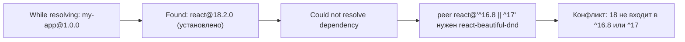
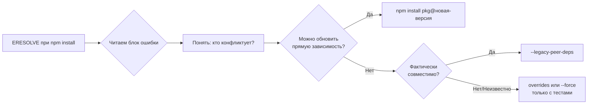

# Уровень 8 (подробно): Разрешение ошибок установки npm

## Аналогия: npm как строгий логист

Представьте, что вы собираете мебель из ИКЕА, и часть деталей поставляется из разных коробок. Мастер-логист (npm) обязан убедиться: все детали подходят друг другу. Если в коробке A шурупы M6, а в коробке B требуются шурупы M8 — логист останавливает сборку и кричит «ERESOLVE». Это не баг, это защита от того, чтобы вы не собрали шкаф, который развалится при первом открытии дверцы.

---

## Анатомия ошибки ERESOLVE: читаем вывод

ERESOLVE — самая часто встречаемая ошибка при переходе с npm v6 на npm v7+. npm v7 стал строго проверять `peerDependencies`, v6 просто молча их пропускал.

### Реальный пример: конфликт React

Вы пытаетесь установить `react-beautiful-dnd@13` в проект на React 18:

```
npm ERR! code ERESOLVE
npm ERR! ERESOLVE unable to resolve dependency tree
npm ERR!
npm ERR! While resolving: my-app@1.0.0
npm ERR! Found: react@18.2.0
npm ERR! node_modules/react
npm ERR!   react@"^18.2.0" from the root project
npm ERR!
npm ERR! Could not resolve dependency:
npm ERR! peer react@"^16.8.0 || ^17.0.0" from react-beautiful-dnd@13.1.1
npm ERR! node_modules/react-beautiful-dnd
npm ERR!   react-beautiful-dnd@"^13.1.1" from the root project
npm ERR!
npm ERR! Fix the upstream dependency conflict, or retry
npm ERR! this command with --force or --legacy-peer-deps.
```

### Как читать этот блок — пошаговый разбор



**Шаг 1.** «While resolving» — npm разрешает дерево вашего проекта.
**Шаг 2.** «Found: react@18.2.0» — в корне уже стоит react 18.
**Шаг 3.** «Could not resolve dependency» — дальше описывается, что именно не вписывается.
**Шаг 4.** «peer react@"^16.8.0 || ^17.0.0"» — `react-beautiful-dnd` объявил: мне нужен React 16 или 17.
**Шаг 5.** React 18 не входит ни в `^16.8.0`, ни в `^17.0.0` — конфликт.

### Вложенный конфликт: когда ошибка глубже

Иногда конфликт возникает не с вашей прямой зависимостью, а внутри дерева:

```
npm ERR! code ERESOLVE
npm ERR! ERESOLVE unable to resolve dependency tree
npm ERR!
npm ERR! While resolving: my-app@1.0.0
npm ERR! Found: eslint@8.57.0
npm ERR! node_modules/eslint
npm ERR!   eslint@"^8.0.0" from the root project
npm ERR!
npm ERR! Could not resolve dependency:
npm ERR! peer eslint@"^7.0.0" from eslint-plugin-react@7.33.2
npm ERR! node_modules/eslint-plugin-react
npm ERR!   eslint-plugin-react@"^7.33.2" from the root project
npm ERR!
npm ERR! Conflicting peer dependency: eslint@7.32.0
npm ERR! node_modules/eslint
npm ERR!   peer eslint@"^7.0.0" from eslint-plugin-react@7.33.2
```

Строка «**Conflicting peer dependency**» — ключ. Она говорит: «вот конкретная версия, которую хочет конфликтующий пакет». npm нашёл кандидата (`eslint@7.32.0`), но он несовместим с вашим `eslint@8`.

---

## Полный справочник кодов ошибок

### ETARGET — нет нужной версии

```bash
npm install lodash@99.0.0
```

```
npm ERR! code ETARGET
npm ERR! notarget No matching version found for lodash@99.0.0.
npm ERR! notarget In most cases you or one of your dependencies are
npm ERR! requesting a package version that doesn't exist.
```

**Диагностика:**

```bash
# Проверить существующие версии
npm view lodash versions --json

# Проверить dist-tags (latest, next, beta)
npm view lodash dist-tags
```

Частая причина: опечатка в версии, или вы пытаетесь установить `@next` пакет, которого ещё нет.

### E404 — пакет не найден

```
npm ERR! code E404
npm ERR! 404 Not Found - GET https://registry.npmjs.org/@company%2finternal-utils
npm ERR! 404  '@company/internal-utils@latest' is not in this registry.
```

Сценарии:

1. Опечатка в имени пакета
2. Приватный scoped-пакет — нужна аутентификация (`npm login`)
3. Реестр не настроен для скоупа — проверьте `.npmrc`:

```
@company:registry=https://npm.company.com/
```

### EACCES / EPERM — права доступа

```
npm ERR! code EACCES
npm ERR! syscall mkdir
npm ERR! path /usr/local/lib/node_modules/typescript
npm ERR!  { [Error: EACCES: permission denied, mkdir '/usr/local/lib/node_modules'] errno: -13 }
```

**Правильное решение — настроить личный глобальный каталог:**

```bash
# Создать директорию для глобальных пакетов
mkdir ~/.npm-global

# Настроить npm
npm config set prefix '~/.npm-global'

# Добавить в PATH (~/.zshrc или ~/.bash_profile)
export PATH=~/.npm-global/bin:$PATH
```

**Никогда не делайте:** `sudo npm install -g` — это создаёт файлы с root-владельцем и ломает права в каталоге.

### ENOENT — файл не найден

```
npm ERR! code ENOENT
npm ERR! enoent ENOENT: no such file or directory, open '/Users/user/myproject/package.json'
```

Вы запустили npm-команду вне папки проекта. Или `package.json` не создан — исправьте: `npm init -y`.

### ELIFECYCLE — ошибка скрипта установки

```
npm ERR! code ELIFECYCLE
npm ERR! errno 1
npm ERR! node-sass@4.14.1 install: `node scripts/install.js`
npm ERR! Exit status 1
npm ERR!
npm ERR! Failed at the node-sass@4.14.1 install script.
```

`node-sass` — классический пример: он компилирует нативный бинарник при установке. Если нет Python, node-gyp или нативных инструментов — скрипт падает.

**Диагностика:**

```bash
# Запустить установку с подробным выводом
npm install --loglevel verbose

# Посмотреть полный лог
cat ~/.npm/_logs/*.log | tail -100
```

### EINTEGRITY — нарушена целостность архива

```
npm ERR! code EINTEGRITY
npm ERR! sha512-abc123...xyz integrity checksum failed when using sha512:
npm ERR!   wanted: sha512-AAAA...
npm ERR!    found: sha512-BBBB...
```

SHA-512 скачанного файла не совпадает с записью в `package-lock.json`. Возможные причины:

- Повреждённый кеш npm
- Пакет переиздан с тем же номером версии (редко, но бывает при отзыве версии)

```bash
# Сброс кеша и повтор
npm cache clean --force
npm install
```

---

## Флаги обхода конфликтов: детальный разбор

### --legacy-peer-deps

```bash
npm install some-lib --legacy-peer-deps
```

**Что происходит внутри:** npm переключается в режим «не валидируй peer-зависимости при разрешении». Поведение идентично npm v6. Сами peer-зависимости устанавливаются только если они ещё не установлены в нужной версии.

**Когда это безопасно:**

- Библиотека объявила старый диапазон peer-зависимостей, но фактически работает с новой версией
- Вы подтвердили совместимость тестами
- Это инструмент разработки (eslint-плагин, storybook-аддон)

**Когда НЕ стоит использовать:**

- Production-библиотека, которая использует peer-зависимость в runtime с breaking-изменениями

### --force

```bash
npm install some-lib --force
```

**Что происходит внутри:** npm обходит все проверки совместимости. Устанавливает запрошенную версию, даже если это нарушает зависимости. Может записать `_invalid: true` в lockfile.

**Риски:**

- Два пакета получат разные несовместимые версии одной библиотеки
- Runtime-ошибки вместо build-time предупреждений
- Lockfile становится «шумным» — содержит конфликтные маркеры



---

## Чтение лог-файла: практика

При каждой ошибке npm оставляет лог:

```
npm ERR! A complete log of this run can be found in:
npm ERR!     /Users/user/.npm/_logs/2024-03-15T09_30_00_000Z-debug-0.log
```

### Структура лог-файла

```
0 verbose cli [ '/usr/local/bin/node', '/usr/local/bin/npm', 'install' ]
1 info using npm@10.2.4
2 info using node@20.11.0
...
150 http fetch GET 200 https://registry.npmjs.org/react/-/react-18.2.0.tgz
...
600 error code ERESOLVE
601 error ERESOLVE unable to resolve dependency tree
```

**Как читать:** каждая строка начинается с порядкового номера и уровня (`verbose`, `info`, `http`, `error`). Ищите строки с `error` — обычно они в конце. Первая `error`-строка — начало проблемы.

```bash
# Быстро найти ошибки в логе
grep "^[0-9]* error" ~/.npm/_logs/*.log

# Последние 50 строк последнего лога
tail -50 $(ls -t ~/.npm/_logs/*.log | head -1)
```

---

## Пошаговый алгоритм разрешения ошибок

### Шаг 1: Идентифицировать код

Первая строка после `npm ERR! code` — ваш ориентир.

### Шаг 2: Прочитать контекст

Для ERESOLVE — читать весь блок до «Fix the upstream». Для E404 — проверить написание пакета. Для EACCES — понять, куда npm пытается писать.

### Шаг 3: Действовать по ошибке

| Код ошибки | Первое действие                                                          |
| ---------- | ------------------------------------------------------------------------ |
| ERESOLVE   | Обновить конфликтующую зависимость или использовать `--legacy-peer-deps` |
| ETARGET    | Проверить `npm view <pkg> versions`                                      |
| E404       | Проверить имя пакета, настроить `.npmrc` для scope                       |
| EACCES     | Настроить глобальный каталог npm, не использовать sudo                   |
| ENOENT     | Убедиться, что вы в нужной директории, создать `package.json`            |
| ELIFECYCLE | Запустить с `--loglevel verbose`, проверить системные зависимости        |
| EINTEGRITY | `npm cache clean --force` и повтор                                       |

---

## ⚠️ Типичные ошибки новичков

❌ `sudo npm install -g` при EACCES

```bash
# Плохо:
sudo npm install -g @angular/cli
# Хорошо:
npm config set prefix '~/.npm-global'
npm install -g @angular/cli
```

**Почему плохо:** sudo создаёт файлы с root-правами, последующие npm-команды без sudo не смогут их модифицировать.

❌ Игнорировать ERESOLVE флагом `--force` без понимания

```bash
# Опасно без тестов:
npm install --force
# Результат: возможны runtime-падения, сложно диагностируемые
```

❌ Не читать полный блок ERESOLVE, видеть только первую строку ошибки  
✅ Прокрутить вверх и найти «While resolving» — там начинается история конфликта

❌ Повторно запускать `npm install` без изменений при EINTEGRITY  
✅ `npm cache clean --force` решает большинство случаев EINTEGRITY
