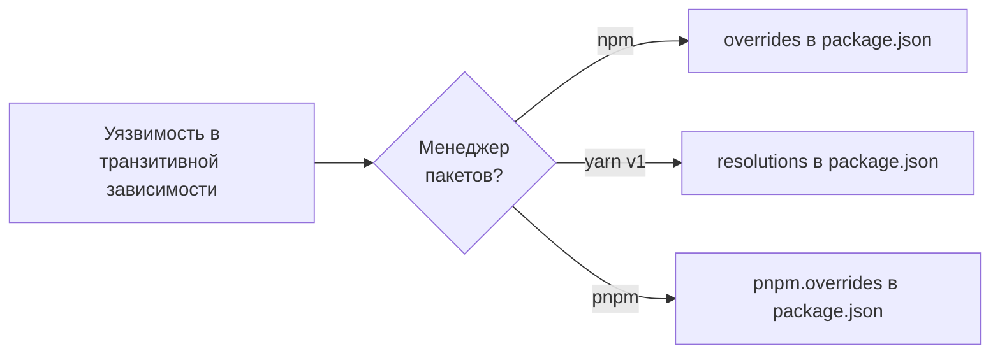

# Уровень 9 (подробно): overrides — хирургическое вмешательство в дерево зависимостей

## Аналогия: вы — подрядчик, не производитель

Представьте: вы строите дом (ваш проект). Подрядчик A поставляет окна (пакет A), а для производства окон использует стекло марки B (транзитивная зависимость B). Вы узнали, что стекло марки B имеет дефект — оно трескается на морозе. Производитель стекла выпустил новую версию B без дефекта, но подрядчик A ещё не обновил свои закупки.

Обычный путь: ждать, пока A обновится. Но дом нужен сейчас.

`overrides` — это ваше право как заказчика сказать: «Для этого подрядчика использовать стекло марки B версии 2.0, несмотря на его спецификации».

---

## Почему overrides появился в npm v7/v8

До npm v7 `peerDependencies` не проверялись строго, и конфликты версий иногда решались «сами» (за счёт установки нескольких копий). Но это создавало другие проблемы — дублирование, несовместимость singleton-библиотек.

npm v7 ужесточил проверку, и вместе с этим в npm v8.3 появился `overrides` — инструмент для разработчика, чтобы он мог контролировать то, что раньше npm решал самостоятельно.

---

## Полная анатомия overrides: все формы

### Форма 1: Простая замена для всего дерева

```json
{
  "overrides": {
    "minimist": "1.2.6"
  }
}
```

После `npm install` **все** пакеты в дереве, которые требовали `minimist` любой версии, получат `minimist@1.2.6`. Это наиболее агрессивная форма.

**Пример использования:** минизист имел уязвимость в версиях < 1.2.6 (прототипное загрязнение). Если ваше дерево тянет старый minimist через 10 разных зависимостей — одна строка в overrides закрывает все.

### Форма 2: Вложенный (scoped) override

```json
{
  "overrides": {
    "package-a": {
      "lodash": "4.17.21"
    }
  }
}
```

Здесь lodash заменяется на 4.17.21 **только** когда он является (прямой или транзитивной) зависимостью `package-a`. В других пакетах lodash остаётся прежним.

Это более хирургическое решение: вы точно знаете, что конфликт в одном поддереве.

### Форма 3: Ключ "." — замена самого пакета в контексте родителя

```json
{
  "overrides": {
    "package-a": {
      ".": "2.1.0"
    }
  }
}
```

Ключ `"."` означает: заменить сам `package-a` на версию `2.1.0` при разрешении. Полезно когда `package-a@1.x` и `package-a@2.x` несовместимы, но вам нужна 2.x.

Вложенный + ключ точки:

```json
{
  "overrides": {
    "package-a": {
      ".": "2.1.0",
      "lodash": "4.17.21"
    }
  }
}
```

`package-a` принудительно заменяется на `2.1.0`, а lodash внутри него — на `4.17.21`.

### Форма 4: Ссылка на прямую зависимость через $

```json
{
  "dependencies": {
    "react": "^18.2.0",
    "react-dom": "^18.2.0"
  },
  "overrides": {
    "react": "$react",
    "react-dom": "$react-dom"
  }
}
```

Синтаксис `$react` означает: «взять версию из поля `dependencies.react`». После разрешения это преобразуется в конкретную версию.

**Главный use-case:** React должен существовать в единственном экземпляре. Если разные пакеты тянут `react@18.0.0` и `react@18.2.0`, могут возникнуть ошибки «Invalid hook call» (несколько копий React в памяти). `$`-ссылка гарантирует: все используют ровно ту версию, что в вашем `dependencies`.

---

## Как overrides взаимодействует с lockfile

После добавления overrides выполните:

```bash
npm install
```

npm пересчитает дерево с учётом overrides и обновит `package-lock.json`. Версии в lockfile будут содержать принудительные замены.

Проверить результат:

```bash
# Проверить, какая версия minimist установлена
npm ls minimist

# Убедиться, что нет старых версий
npm ls minimist --all
```

Если override корректно применён — в выводе должна быть только одна версия.

---

## Реальный сценарий: фиксация уязвимости через overrides

Допустим, `npm audit` сообщает:

```
# npm audit report

nth-check  <2.0.1
Severity: high
Inefficient Regular Expression Complexity in nth-check
fix available via `npm audit fix --force`
node_modules/svgo/node_modules/nth-check
  svgo  1.0.0 - 2.1.0
    Depends on vulnerable versions of nth-check
    node_modules/svgo
      @svgr/webpack  <=5.5.0
        Depends on vulnerable versions of svgo
```

`nth-check` — глубоко транзитивная зависимость: ваш проект → @svgr/webpack → svgo → nth-check. Прямой зависимости нет.

`npm audit fix` не поможет, потому что `@svgr/webpack@5` зависит от `svgo@1-2`, а новый svgo несовместим.

**Решение через overrides:**

```json
{
  "overrides": {
    "nth-check": "^2.0.1"
  }
}
```

```bash
npm install
npm audit
# 0 vulnerabilities
```

Это классический и правильный сценарий применения overrides.

---

## Сравнение: npm overrides vs yarn resolutions vs pnpm.overrides



### npm overrides (v8.3+)

```json
{
  "overrides": {
    "vulnerable-pkg": "2.0.0",
    "parent-pkg": {
      "vulnerable-pkg": "2.0.0"
    }
  }
}
```

### yarn v1 resolutions

```json
{
  "resolutions": {
    "vulnerable-pkg": "2.0.0",
    "**/vulnerable-pkg": "2.0.0"
  }
}
```

yarn v1 поддерживает glob-пути: `"parent-pkg/vulnerable-pkg"` или `"**/vulnerable-pkg"`. Это более гибко для точечных замен.

### pnpm overrides

```json
{
  "pnpm": {
    "overrides": {
      "vulnerable-pkg": "2.0.0",
      "parent-pkg>vulnerable-pkg": "2.0.0"
    }
  }
}
```

pnpm использует `>` для разделения пути: `parent>child`. Поле находится внутри ключа `"pnpm"`.

### Ключевые отличия

| Аспект              | npm overrides   | yarn resolutions   | pnpm overrides                 |
| ------------------- | --------------- | ------------------ | ------------------------------ |
| Поле в package.json | `"overrides"`   | `"resolutions"`    | `"pnpm": { "overrides": ... }` |
| Glob-пути           | Нет             | Да (`**/pkg`)      | Да (`pkg>dep`)                 |
| Доступно с версии   | npm v8.3 (2022) | yarn v1 изначально | pnpm v6+                       |
| Работает в monorepo | Только корневой | Только корневой    | Только корневой                |

---

## Связь overrides и npm audit fix

`npm audit fix` пытается поднять версии уязвимых пакетов в рамках semver-совместимости. Когда это невозможно (breaking change в пути к фиксу), `npm audit fix` предлагает `--force`.

Альтернативный путь: вместо `--force` используйте overrides для точечной замены только уязвимого пакета без риска сломать весь граф зависимостей.

```bash
# npm audit показывает проблему
npm audit

# Вместо рискованного:
npm audit fix --force

# Безопаснее: добавить overrides в package.json, затем:
npm install
npm audit
```

---

## Когда overrides — правильный инструмент, а когда — нет

### Правильные случаи применения

**Уязвимость в транзитивной зависимости**, когда:

- Фикс уже есть в новой версии пакета
- Maintainer прямой зависимости ещё не обновился
- Вы временно решаете проблему до выхода обновления

**Обеспечение единственного экземпляра** singleton-библиотек (React, MobX, RxJS) в monorepo или при конфликтах версий.

**Временный откат регрессии** — один из пакетов выпустил баг, вы фиксируете предыдущую версию пока ждёте патч.

### Когда overrides — не решение

**Постоянный костыль:** overrides должны быть временными. Создайте задачу на удаление override когда выйдет настоящий фикс.

**Вместо обновления прямой зависимости:** если `package-a@2.0.0` уже работает с новым пакетом, просто обновите `package-a` — это чище.

**В пакете-библиотеке:** overrides в `node_modules/your-lib/package.json` игнорируются npm у потребителей. Это корневая-только функция.

---

## ⚠️ Типичные ошибки

❌ Объявлять overrides в `package.json` библиотеки:

```json
// node_modules/my-lib/package.json — НЕ РАБОТАЕТ у потребителей!
{
  "overrides": {
    "lodash": "4.17.21"
  }
}
```

✅ overrides работают только из корневого `package.json` приложения.

❌ Использовать override как постоянное решение без задачи на удаление:

```json
// Это висит в package.json уже 2 года...
{
  "overrides": {
    "minimist": "1.2.6"
  }
}
```

✅ Добавьте комментарий (в README или прямо рядом) о причине и условии удаления.

❌ Устанавливать версию, API которой несовместимо с ожидающим пакетом:

```json
// Опасно: если package-a ожидает API lodash v3, а мы ставим v4 с breaking changes
{
  "overrides": {
    "lodash": "4.17.21"
  }
}
```

✅ Проверяйте changelog уязвимого пакета — совместимы ли API старой и новой версий.

❌ Путать синтаксис npm overrides и yarn resolutions:

```json
// В npm НЕ работает glob-синтаксис yarn:
{
  "overrides": {
    "**/lodash": "4.17.21"
  }
}
```

✅ В npm используется вложенная структура объектов, не glob-пути.
