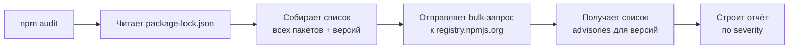

# Уровень 10 (подробно): Безопасность и npm audit

## Аналогия: технический осмотр автомобиля

`npm audit` — это как технический осмотр автомобиля. Механик (npm) проверяет детали (пакеты) по базе известных дефектов (advisory database) и выдаёт отчёт: «тормозные колодки изношены — критично», «фара немного мутная — некритично». Ваша задача — понять, с чем ехать можно, а что требует немедленного ремонта.

---

## Как работает npm audit изнутри



npm не скачивает пакеты повторно — он работает с уже существующим lockfile. Это быстрая операция: один HTTP-запрос к API реестра со списком пакетов.

---

## Читаем отчёт npm audit

### Краткий вывод

```
found 3 vulnerabilities (1 moderate, 1 high, 1 critical)
```

### Полный отчёт (пример)

```
# npm audit report

nth-check  <2.0.1
Severity: high
Inefficient Regular Expression Complexity in nth-check
fix available via `npm audit fix --force`
Will install react-scripts@3.0.1, which is a breaking change
node_modules/svgo/node_modules/nth-check
  svgo  1.0.0 - 2.1.0
    Depends on vulnerable versions of nth-check
    node_modules/svgo
      @svgr/webpack  <=5.5.0
        Depends on vulnerable versions of svgo
        node_modules/@svgr/webpack
          react-scripts  >=2.1.4
            Depends on vulnerable versions of @svgr/webpack
            node_modules/react-scripts

loader-utils  1.0.0 - 1.4.1
Severity: critical
Prototype Pollution in loader-utils
fix available via `npm audit fix --force`
node_modules/loader-utils

2 vulnerabilities require semver-major dependency updates.
```

### Что читать в этом отчёте

**Строка 1:** имя уязвимого пакета + диапазон уязвимых версий (`nth-check <2.0.1`).
**Severity:** уровень серьёзности.
**Путь:** цепочка зависимостей от вашего проекта до уязвимого пакета.
**fix available via:** как исправить. Если написано «breaking change» — осторожно.

---

## Уровни severity: как принимать решения

### critical

```
loader-utils  1.0.0 - 1.4.1
Severity: critical
Prototype Pollution in loader-utils
```

**Действие:** немедленно. Prototype pollution, RCE (Remote Code Execution), SQL injection — такие вещи дают атакующему контроль над системой.

### high

```
nth-check  <2.0.1
Severity: high
Inefficient Regular Expression Complexity
```

**Действие:** приоритетно. ReDoS (регулярные выражения с экспоненциальной сложностью) могут положить сервер при определённых входных данных.

### moderate

```
Severity: moderate
Open redirect vulnerability
```

**Действие:** при следующем плановом обновлении. Умеренный риск — утечка данных, редирект на вредоносный URL.

### low

**Действие:** можно отложить. Теоретические уязвимости с ограниченным вектором атаки.

---

## npm audit fix: что происходит под капотом

```bash
npm audit fix
```

npm audit fix выполняет следующую логику:

1. Получает список уязвимостей из отчёта
2. Для каждой уязвимости проверяет: есть ли исправленная версия в рамках текущих semver-диапазонов?
3. Если да — обновляет пакет (это как `npm update` для уязвимых)
4. Если нет — сообщает «require semver-major dependency updates»

```
added 3 packages, removed 2 packages, changed 5 packages
fixed 2 of 3 vulnerabilities

1 vulnerability requires semver-major dependency updates.
To address all issues, run:
  npm audit fix --force
```

---

## npm audit fix --force: риски и альтернативы

```bash
npm audit fix --force
```

«Force» означает: npm обновит пакеты до мажорных версий, игнорируя semver-ограничения.

### Что может пойти не так

```
# До --force:
react-scripts@5.0.1 → реагирует на webpack@5

# После --force:
react-scripts@3.0.1 (даунгрейд!) → webpack@4
```

npm иногда делает даунгрейд, чтобы найти дерево без уязвимостей. Это контринтуитивно и опасно.

### Безопасная альтернатива: overrides

Вместо `npm audit fix --force` добавьте точечный override:

```json
{
  "overrides": {
    "nth-check": "^2.0.1"
  }
}
```

```bash
npm install
npm audit
```

Это устраняет конкретную уязвимость без риска сломать прямые зависимости.

---

## Полная практика: полный цикл работы с audit

### Сценарий: production-деплой

```bash
# 1. Проверить перед деплоем — только production, только критичные
npm audit --omit=dev --audit-level=critical

# 2. Если есть — попробовать автофикс
npm audit fix

# 3. Проверить снова
npm audit --omit=dev --audit-level=critical

# 4. Если остались — добавить overrides и повторить
# ... отредактировать package.json ...
npm install
npm audit --omit=dev --audit-level=critical
```

### Сценарий: CI-пайплайн

```yaml
# GitHub Actions
- name: Security audit
  run: npm audit --audit-level=high --omit=dev
```

Этот шаг завершится с кодом 1 (ошибка), если найдены уязвимости уровня high или critical — и pipeline остановится.

---

## --omit=dev: когда dev-уязвимости не критичны

```bash
npm audit --omit=dev
```

Многие audit-предупреждения касаются devDependencies — инструментов разработки, которые не попадают в production-сборку.

**Пример:** уязвимость в `jest-circus` или `webpack-dev-server` реальна только в dev-среде. В production-контейнере этих пакетов нет.

Использование `--omit=dev` даёт более реалистичную картину рисков:

```bash
# Полный отчёт: 47 vulnerabilities
npm audit

# Только production: 3 vulnerabilities
npm audit --omit=dev
```

---

## npm audit signatures

```bash
npm audit signatures
```

Команда, появившаяся в npm v8.5: проверяет криптографические подписи пакетов. Убеждается, что пакеты подписаны ключами, зарегистрированными в реестре.

Это защита от supply chain атак — когда злоумышленник подменяет пакет в реестре. Особенно актуально после инцидентов типа event-stream (2018).

```
audited 512 packages in 3s

512 packages have verified registry signatures
```

---

## Ложные срабатывания: контекст эксплуатируемости

Не каждая уязвимость реально опасна для вашего проекта. Задайте себе вопросы:

**1. Уязвимый код вообще вызывается?**

Уязвимость в библиотеке для парсинга XML не актуальна, если вы не парсите XML. Но `npm audit` не знает о вашем коде — он видит только граф зависимостей.

**2. Пакет используется только в build-time?**

webpack, babel, eslint — эти пакеты не запускаются на сервере. Уязвимость в них опасна только если злоумышленник имеет доступ к вашей build-системе.

**3. Вектор атаки реален в вашей инфраструктуре?**

ReDoS опасен для веб-серверов с пользовательским вводом. Для CLI-инструмента, который запускает только разработчик, — риск минимален.

### Документирование осознанного принятия риска

Если вы сознательно решаете не исправлять уязвимость:

```json
{
  "scripts": {
    "audit": "npm audit --omit=dev --audit-level=high"
  }
}
```

Зафиксируйте решение в README или в задаче трекера: почему, когда пересмотреть.

---

## Дополнительные инструменты

`npm audit` покрывает advisory database npm, но не все источники. Для полного покрытия:

- **Snyk** (`snyk test`) — более широкая база, интеграция с GitHub, автоматические PR
- **socket.dev** — анализ поведения пакетов (не только CVE, но и suspicious code)
- **GitHub Dependabot** — автоматические PR с обновлениями при обнаружении уязвимостей

---

## ⚠️ Типичные ошибки

❌ Слепое `npm audit fix --force` в production:

```bash
# Так можно сделать даунгрейд и сломать приложение:
npm audit fix --force
# Лучше:
npm audit fix
# Если не помогло — точечный override
```

❌ Игнорировать audit потому что «CI зелёный»:

```bash
# CI может быть настроен с --audit-level=critical, а high остаются незамеченными
# Регулярно запускайте полный audit вручную
npm audit
```

❌ Считать, что 0 уязвимостей = полная безопасность:

```bash
# npm audit знает только о CVE в advisory database
# Не покрывает: typosquatting, malicious code, supply chain attacks
# Дополняйте: npm audit signatures, snyk, socket.dev
```

❌ Добавлять транзитивные зависимости в прямые вместо overrides:

```bash
# Плохо: создаёт скрытую зависимость от транзитивного пакета
npm install nth-check@^2.0.1
# Хорошо: точечный override
# "overrides": { "nth-check": "^2.0.1" }
```
