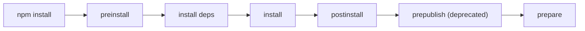
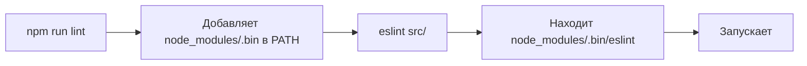
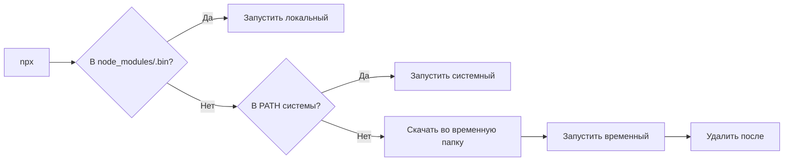

# Уровень 11: npm scripts и lifecycle — подробная теория

## Зачем нужны scripts?

Представьте, что у вас на кухне есть несколько рецептов: один для завтрака, один для ужина, один для праздника. `scripts` в package.json — это именно такая книга рецептов для вашего проекта. Вместо того чтобы каждый раз помнить длинную команду `./node_modules/.bin/jest --coverage --testPathPattern=src`, вы пишете `npm test`.

## Поле `scripts` — детально

```json
{
  "scripts": {
    "build": "tsc -p tsconfig.build.json",
    "dev": "ts-node-dev --respawn src/index.ts",
    "test": "jest --coverage",
    "lint": "eslint src/ --ext .ts,.tsx",
    "format": "prettier --write \"src/**/*.ts\"",
    "clean": "rimraf dist"
  }
}
```

Запуск:

```bash
npm run build
npm run dev
npm test        # сокращение, не нужен 'run'
npm start       # сокращение
npm run lint
```

Вывод `npm run` без аргументов покажет все доступные скрипты:

```
Lifecycle scripts included in my-app:
  test
    jest --coverage
  start
    node dist/index.js

available via `npm run-script`:
  build
    tsc -p tsconfig.build.json
  dev
    ts-node-dev --respawn src/index.ts
  lint
    eslint src/ --ext .ts,.tsx
```

## Pre/post-хуки — конвейер сборки

Хуки работают как middleware: они оборачивают основной скрипт.

```json
{
  "scripts": {
    "pretest": "eslint src/",
    "test": "jest",
    "posttest": "npm run coverage-report"
  }
}
```

```bash
npm test
# Выполняется:
# 1. pretest → eslint src/
# 2. test    → jest
# 3. posttest → npm run coverage-report
```

Если `pretest` завершился с кодом > 0 — `test` и `posttest` не запустятся. Это удобно для "входного контроля".

### Пример для сборки

```json
{
  "scripts": {
    "prebuild": "node scripts/check-env.js && rimraf dist",
    "build": "tsc && webpack",
    "postbuild": "node scripts/copy-assets.js && npm run sentry:upload"
  }
}
```

```
> prebuild
> node scripts/check-env.js && rimraf dist
Checking env... OK
Cleaning dist... done

> build
> tsc && webpack
webpack 5.88.0 compiled successfully in 4210 ms

> postbuild
> node scripts/copy-assets.js && npm run sentry:upload
Assets copied: 12 files
Uploading sourcemaps to Sentry...
```

## Lifecycle-скрипты установки — полный порядок



Важно понимать: эти скрипты вызываются не только для вашего пакета, но и для каждого устанавливаемого пакета из `node_modules`.

### `prepare` — ключевой скрипт для библиотек

`prepare` — самый важный lifecycle-скрипт для авторов пакетов. Он запускается:

1. После `npm install` (если есть зависимости для сборки)
2. Перед `npm publish`
3. При клонировании репозитория через `npm install` (для локальной разработки)

```json
{
  "scripts": {
    "prepare": "tsc",
    "prepublishOnly": "npm test && npm run lint"
  }
}
```

Типичный сценарий: вы написали TypeScript-библиотеку. При клонировании репо и запуске `npm install` — `prepare` автоматически скомпилирует TypeScript в JavaScript, и локальная ссылка через `npm link` сразу заработает.

### `prepublishOnly` vs `prepare`

|                   | `prepare` | `prepublishOnly` |
| ----------------- | --------- | ---------------- |
| При `npm install` | ✅        | ❌               |
| При `npm publish` | ✅        | ✅               |
| При `npm pack`    | ✅        | ✅               |
| Назначение        | Сборка    | Тесты + проверки |

Хорошая практика:

```json
{
  "scripts": {
    "prepare": "tsc",
    "prepublishOnly": "npm test"
  }
}
```

## Риск безопасности: postinstall как вектор атаки

Это один из самых критичных аспектов безопасности npm-экосистемы.

### Как это работает

Когда вы запускаете `npm install lodash`, npm:

1. Скачивает пакет
2. Распаковывает его
3. Запускает `postinstall` скрипт ЭТОГО ПАКЕТА с вашими правами

Злоумышленник может опубликовать пакет с таким `postinstall`:

```json
{
  "scripts": {
    "postinstall": "node steal-credentials.js"
  }
}
```

И `steal-credentials.js` получит доступ к файловой системе, переменным окружения (включая токены CI/CD), сети.

### Реальные инциденты

- `event-stream` (2018): злоумышленник добавил вредоносный код в транзитивную зависимость
- `node-ipc` (2022): намеренное уничтожение файлов у пользователей с определёнными IP
- `colors`/`faker` (2022): автор сломал собственные пакеты

### Защита через `--ignore-scripts`

```bash
# Установка без выполнения lifecycle-скриптов
npm install --ignore-scripts

# Или в .npmrc:
ignore-scripts=true
```

Последствие: нативные модули (bcrypt, sharp, canvas) не скомпилируются — их нужно будет собирать отдельно. В CI-окружениях это приемлемый компромисс.

## Переменные окружения в скриптах

npm автоматически экспортирует переменные из package.json перед запуском скриптов:

```json
{
  "name": "my-app",
  "version": "2.1.0",
  "config": {
    "port": "3000"
  }
}
```

Доступно в скриптах:

```bash
# Имя и версия
echo $npm_package_name        # my-app
echo $npm_package_version     # 2.1.0

# Произвольные поля через config
echo $npm_package_config_port # 3000

# Конфигурация npm
echo $npm_config_loglevel     # warn
echo $npm_config_registry     # https://registry.npmjs.org/
```

Использование в скрипте:

```json
{
  "scripts": {
    "start": "PORT=$npm_package_config_port node dist/index.js"
  }
}
```

## PATH и `node_modules/.bin`

Когда npm запускает скрипт, он добавляет `node_modules/.bin` в начало PATH. Это позволяет вызывать локально установленные инструменты без полного пути:

```json
{
  "devDependencies": {
    "eslint": "^8.0.0",
    "typescript": "^5.0.0"
  },
  "scripts": {
    "lint": "eslint src/",
    "build": "tsc"
  }
}
```

Без этого механизма пришлось бы писать `./node_modules/.bin/eslint src/`.



## npx — детали работы

`npx` (Node Package Execute) решает задачу: запустить бинарник, который может быть или не быть установлен.

### Алгоритм поиска



### Примеры использования

```bash
# Запустить create-react-app без установки
npx create-react-app my-app

# Запустить конкретную версию
npx typescript@4.9 tsc --version

# Запустить из GitHub напрямую
npx github:username/my-tool

# Принудительно скачать свежую версию (игнорировать кэш)
npx --yes create-next-app@latest my-app
```

### npx vs npm exec

`npm exec` (npm v7+) — официальная замена `npx` с более явным поведением:

```bash
# npx (неявный)
npx jest --coverage

# npm exec (явный, --) обязателен если передаёте аргументы с --
npm exec -- jest --coverage

# Запустить из конкретного пакета
npm exec --package=typescript -- tsc --version
```

Разница: `npm exec` не имеет режима "скачай и запусти по умолчанию" без `--yes`, что безопаснее в CI.

## Передача аргументов в скрипты

```bash
# -- передаёт аргументы напрямую в скрипт
npm test -- --coverage --watch

# Эквивалентно: jest --coverage --watch
```

## Параллельный запуск скриптов

npm сам по себе не поддерживает параллельный запуск. Используют инструменты:

```json
{
  "scripts": {
    "dev": "concurrently \"npm run server\" \"npm run client\"",
    "dev:alt": "npm run server & npm run client"
  }
}
```

## Пограничные случаи

### Pre/post для пользовательских скриптов — только один уровень

```json
{
  "scripts": {
    "predeploy": "npm run build",
    "deploy": "...",
    "prepredeploy": "..." // НЕ РАБОТАЕТ — нет рекурсивных хуков
  }
}
```

### `prepare` и `npm ci`

`npm ci` также запускает `prepare` — это важно знать при отладке CI-сборок, когда `npm ci` неожиданно запускает компиляцию.

### Скрипты в зависимостях при `npm install --ignore-scripts`

`--ignore-scripts` не является наследуемым — дочерние `npm install` внутри скриптов ВЫПОЛНЯТ свои скрипты, если только не передать флаг явно.
