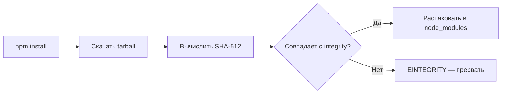
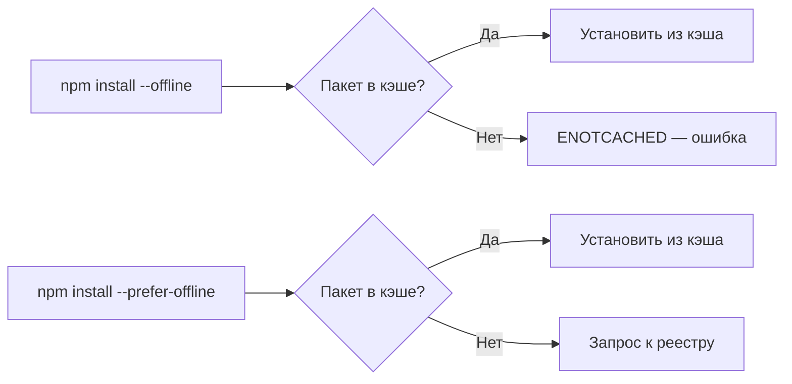
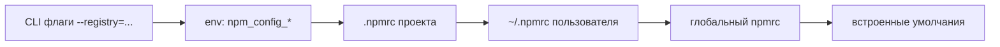

# Уровень 12: Кэш, integrity и .npmrc — подробная теория

## Кэш как склад с адресацией по содержимому

Представьте склад, где каждая коробка подписана не по имени владельца, а по слепку содержимого. Если две разные компании заказали одинаковые болты — они хранятся в одной коробке. Это и есть content-addressable storage (CAS).

Кэш npm работает именно так. Библиотека `cacache` хранит tarball'ы пакетов по их хэшу SHA512:

```
~/.npm/_cacache/
├── content-v2/
│   └── sha512/
│       ├── 00/
│       │   └── a3f7b2c... (бинарные данные пакета)
│       └── ff/
│           └── 9e21d4c...
├── index-v5/
│   └── registry.npmjs.org/
│       └── lodash/
│           └── ... (маппинг версии → хэш)
└── tmp/
```

Один и тот же tarball (например, React 18.2.0 в двух разных проектах) хранится один раз. Это экономит место и ускоряет повторные установки.

## Поле `integrity` — криптографический контракт

```json
{
  "node_modules/react": {
    "version": "18.2.0",
    "resolved": "https://registry.npmjs.org/react/-/react-18.2.0.tgz",
    "integrity": "sha512-/3IjMdb2L9QbBdWiW5e3P2/npwMBaU9mHCSCUzNln0ZCYbcfTsGbTJrU/kGemdH2IWmB2ioZ+zkxtmq6g09fGQ=="
  }
}
```

Стандарт SRI (Subresource Integrity) — тот же, что используется в HTML для `<script integrity="...">`. Формат: `<алгоритм>-<base64-хэш>`. npm v7+ всегда использует sha512.

### Как происходит проверка



### Ошибка EINTEGRITY — диагностика

```bash
npm ERR! code EINTEGRITY
npm ERR! sha512-v2kDEe57lecTulaDIuNTPy3Ry4gLGJ6Z1O3vE1krgXZNrsQ+...
npm ERR! integrity checksum failed when using sha512:
npm ERR!   wanted: sha512-v2kDEe57l...
npm ERR!   got:    sha512-ABCdef123...
```

Причины:

1. Повреждён кэш (неполная загрузка, сбой диска)
2. Ручное редактирование `package-lock.json`
3. Пакет подменён в реестре (теоретически — supply chain атака)
4. Зеркало реестра вернуло другую версию файла

Решение:

```bash
# Шаг 1: очистить кэш
npm cache clean --force

# Шаг 2: удалить lockfile и node_modules
rm -rf node_modules package-lock.json

# Шаг 3: переустановить
npm install
```

## npm cache verify — умная очистка

В отличие от `npm cache clean --force`, `npm cache verify` не удаляет всё подряд:

```bash
$ npm cache verify
Cache verified and compressed (~/.npm/_cacache):
Content verified: 1847 (234.82 MB)
Content garbage-collected: 23 (12.4 MB)
Index entries: 4821
Finished in 8.432s
```

Команда:

- Проверяет целостность каждого файла в кэше
- Удаляет повреждённые записи
- Сжимает содержимое
- Удаляет "сироты" (файлы без индекса)

Рекомендуется запускать при подозрительном поведении, а не сразу `clean --force`.

## Офлайн-режимы — практика



Сценарии использования:

- `--offline` — в CI без доступа к интернету (предварительно прогретый кэш)
- `--prefer-offline` — ноутбук в самолёте: ставить то, что есть, а что нет — подождать

```bash
# Прогрев кэша перед CI
npm install --prefer-online

# В CI-контейнере без интернета
npm install --offline
```

## `.npmrc` — полное руководство

`.npmrc` — INI-файл, который npm читает при каждом запуске. Несколько уровней образуют иерархию.

### Приоритет уровней (от высшего к низшему)



Это важно: если `.npmrc` проекта задаёт `registry=https://my-corp.com/`, а пользователь использует `NPM_CONFIG_REGISTRY=https://registry.npmjs.org/` — переменная окружения победит.

### Полезные ключи

```ini
# Реестр по умолчанию (без завершающего слэша!)
registry=https://registry.npmjs.org/

# При npm install без версии — сохранять точную версию (1.2.3 вместо ^1.2.3)
save-exact=true

# Завершать с ошибкой при несоответствии engines (node version)
engine-strict=true

# Реестр для конкретного scope (@mycompany/*)
@mycompany:registry=https://npm.mycompany.internal/

# Всегда передавать authToken для корпоративного реестра
//npm.mycompany.internal/:_authToken=${MYCOMPANY_NPM_TOKEN}

# Разрешить несовместимые peerDependencies (временный workaround)
legacy-peer-deps=true

# Уровень логирования
loglevel=warn

# Установить только production-зависимости
omit=dev

# Кэш-директория
cache=/custom/cache/path
```

### Безопасность: `_authToken`

Токен в `~/.npmrc` НЕ должен быть в `.npmrc` проекта (не коммитить!). Вместо этого — переменная окружения:

```ini
# В .npmrc проекта (безопасно — берёт из окружения)
//registry.npmjs.org/:_authToken=${NPM_TOKEN}
```

```bash
# В CI/CD
export NPM_TOKEN=npm_xxxxxxxxxxxxxxxxxxxx
npm publish
```

### `.npmrc` для scoped-пакетов — практический пример

Корпоративная среда: публичные пакеты через npmjs.org, внутренние через Nexus:

```ini
# .npmrc в корне проекта
registry=https://registry.npmjs.org/

# Внутренние пакеты — через Nexus
@acme:registry=https://nexus.acme.corp/repository/npm-internal/
@shared:registry=https://nexus.acme.corp/repository/npm-internal/

# Токены (значения из переменных окружения)
//nexus.acme.corp/repository/npm-internal/:_authToken=${NEXUS_TOKEN}
```

## Переменные `npm_config_*` — динамическая конфигурация

Каждый ключ `.npmrc` можно задать через переменную окружения, прибавив префикс `npm_config_` и заменив дефисы подчёркиваниями:

```bash
# Эквивалент registry=https://my-registry.com в .npmrc
export npm_config_registry=https://my-registry.com

# Эквивалент save-exact=true
export npm_config_save_exact=true

# Эквивалент legacy-peer-deps=true
export npm_config_legacy_peer_deps=true
```

Это особенно полезно в CI/CD, где настройки не хочется хранить в файлах:

```yaml
# .github/workflows/deploy.yml
env:
  npm_config_registry: https://nexus.acme.corp/repository/npm/
  npm_config_engine_strict: 'true'
  NPM_TOKEN: ${{ secrets.NPM_TOKEN }}
```

## Пограничные случаи

### `resolved` и зеркала реестров

Поле `resolved` в lockfile указывает точный URL tarball'а. Если вы переключили реестр на зеркало (Verdaccio, Nexus), старые `resolved`-ссылки могут указывать на оригинальный npm-реестр. Это не ошибка — npm проверяет `integrity`, а не URL.

Но при `npm ci` с недоступным оригинальным URL — установка упадёт. Решение: `npm install` с новым реестром пересоздаст lockfile с актуальными URL.

### `npm cache verify` в Docker-сборках

В многослойных Docker-образах кэш npm часто живёт в отдельном слое для инвалидации по `package.json`. `npm cache verify` в Dockerfile может излишне замедлить сборку — лучше его не вызывать в CI, а полагаться на `npm ci` с встроенной проверкой integrity.

### `save-exact=true` и обновления безопасности

Если `save-exact=true`, то `npm install lodash` зафиксирует точную версию (`"lodash": "4.17.21"` без `^`). С одной стороны — воспроизводимость. С другой — `npm update` не обновит до патч-версии с исправлением безопасности без явного указания версии. Взвешивайте компромисс.
