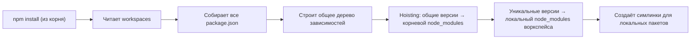
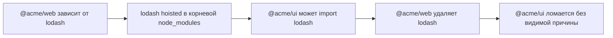

# Уровень 13: Workspaces и монорепо — подробная теория

## Зачем нужны монорепо?

Представьте компанию, выпускающую линейку продуктов: веб-приложение, мобильное приложение и дизайн-систему. Все три используют одну и ту же утилитную библиотеку. Без монорепо изменение в утилитной библиотеке требует: изменить библиотеку → опубликовать новую версию → обновить зависимость в трёх репозиториях → сделать три PR → дождаться CI. С монорепо: изменить библиотеку → запустить тесты всего монорепо → один PR.

Workspaces в npm — это встроенный механизм для монорепо без дополнительных инструментов.

## Поле `workspaces` — детали

```json
{
  "name": "my-monorepo",
  "private": true,
  "workspaces": ["packages/*", "apps/web", "apps/api", "tools/scripts"]
}
```

Поддерживаются:

- Глобы (`packages/*` — все директории в packages/)
- Конкретные пути (`apps/web`)
- Вложенные глобы (`packages/*/*`)

Директория считается воркспейсом только если в ней есть `package.json` с полем `name`.

`"private": true` в корне — обязательно! Иначе npm может попытаться опубликовать корневой пакет как общедоступный.

## Как работает установка



После установки структура:

```
node_modules/
├── react/                    ← одна копия для всех (hoisted)
├── lodash/                   ← hoisted
├── @acme/
│   ├── ui -> ../../../packages/ui      ← симлинк
│   └── utils -> ../../../packages/utils ← симлинк
packages/
├── ui/
│   └── node_modules/
│       └── some-conflict-dep/  ← только если версия конфликтует
└── utils/
apps/
└── web/
    └── node_modules/
        └── another-conflict/
```

## Симлинки — магия под капотом

```bash
$ ls -la node_modules/@acme/
total 0
lrwxr-xr-x  ui -> ../../../packages/ui
lrwxr-xr-x  utils -> ../../../packages/utils
```

Это означает, что при разработке изменения в `packages/ui/src/` мгновенно видны в `apps/web` без повторной установки или сборки. Никакого `npm link` вручную не нужно.

## Флаги `-w` и `--workspaces` — практика

### Установка зависимостей

```bash
# Установить lodash только в @acme/ui
npm install lodash -w packages/ui
# или через имя пакета (если name = @acme/ui)
npm install lodash -w @acme/ui

# Установить devDependency
npm install --save-dev typescript -w packages/ui

# Установить во все воркспейсы одновременно
npm install jest --save-dev --workspaces
```

### Запуск скриптов

```bash
# Тест во всём монорепо
npm run test --workspaces

# Тест только в ui
npm run test -w @acme/ui

# Сборка всего монорепо
npm run build --workspaces

# Пропускать воркспейсы без нужного скрипта
npm run build --workspaces --if-present
```

Флаг `--if-present` очень важен: без него, если у какого-то воркспейса нет скрипта `build`, npm завершится с ошибкой. С `--if-present` — молча пропустит.

### Порядок выполнения

npm v8+ по умолчанию запускает скрипты в воркспейсах ПОСЛЕДОВАТЕЛЬНО в порядке топологической сортировки (зависимые пакеты собираются после своих зависимостей). Для параллельного запуска используют `--workspaces` совместно с инструментами типа `turbo` или `nx`.

## Единый lockfile — преимущества

```
my-monorepo/
└── package-lock.json  ← ОДИН файл на всё монорепо
```

Преимущества:

- Детерминированная установка всего монорепо одной командой
- Один `npm audit` проверяет безопасность всех пакетов
- Атомарные обновления: `npm update react --workspaces` обновляет react везде согласованно
- PR-ревью видит все изменения зависимостей в одном файле

## Межпакетные зависимости

### Протокол `*`

```json
{
  "name": "@acme/web",
  "dependencies": {
    "@acme/ui": "*",
    "@acme/utils": "*"
  }
}
```

`"*"` — специальное значение для workspace-пакетов. npm резолвит его как симлинк на локальный воркспейс. Если `@acme/ui` не является воркспейсом — npm попытается найти его в реестре.

### Протокол `workspace:`

Более явный синтаксис (поддерживается в pnpm, yarn berry, и частично в npm v9+):

```json
{
  "dependencies": {
    "@acme/ui": "workspace:*",
    "@acme/utils": "workspace:^1.0.0"
  }
}
```

`workspace:*` — всегда использовать локальную версию. При публикации npm/pnpm заменяют `workspace:*` на реальную версию.

## Фантомные зависимости — детально

Это главная проблема плоской структуры `node_modules` в монорепо.

### Пример

```
monorepo/
├── node_modules/
│   └── lodash@4.17.21  ← установлен как зависимость @acme/web
└── packages/
    └── ui/
        └── package.json  ← dependencies: {} (lodash НЕ указан!)
```

```typescript
// packages/ui/src/utils.ts
import _ from 'lodash' // РАБОТАЕТ, но это фантомная зависимость!

export const chunk = _.chunk
```

Почему это опасно:

1. Сейчас работает — lodash есть в корневом node_modules
2. Если @acme/web удалит lodash — packages/ui сломается без очевидной причины
3. Если опубликовать @acme/ui в npm — пользователи получат broken package (у них нет lodash в корне)



### Решение

Явно добавить lodash в зависимости packages/ui:

```bash
npm install lodash -w packages/ui
```

Инструменты типа `pnpm` и `yarn berry` решают эту проблему на уровне архитектуры через `--shamefully-hoist=false` и изолированные `node_modules`.

## Команда `npm workspaces` — диагностика

```bash
# Список всех воркспейсов
npm query .workspace

# Версии всех воркспейсов
npm ls --workspaces --depth=0

# Граф зависимостей между воркспейсами
npm ls @acme/ui --workspaces
```

## Пограничные случаи

### `npm ci` в монорепо

`npm ci` в корне монорепо устанавливает ВСЕ зависимости всех воркспейсов атомарно из lockfile. Это правильное поведение для CI.

### Публикация воркспейсов

```bash
# Опубликовать конкретный воркспейс
npm publish -w packages/ui

# Опубликовать все публичные воркспейсы
npm publish --workspaces
```

Перед публикацией убедитесь, что в `package.json` воркспейса нет `"private": true`.

### Версионирование

npm workspaces не управляют версионированием автоматически (в отличие от Lerna или Changesets). Версии нужно обновлять вручную или с помощью инструментов типа:

- `changesets` — классический вариант для npm монорепо
- `lerna version` — с поддержкой workspaces

### Проблема с `npm install` в подпапке воркспейса

Не запускайте `npm install` из директории воркспейса (`packages/ui/`). npm создаст отдельный `package-lock.json` и `node_modules` внутри воркспейса, нарушив монорепо-структуру. Всегда устанавливайте из корня.
