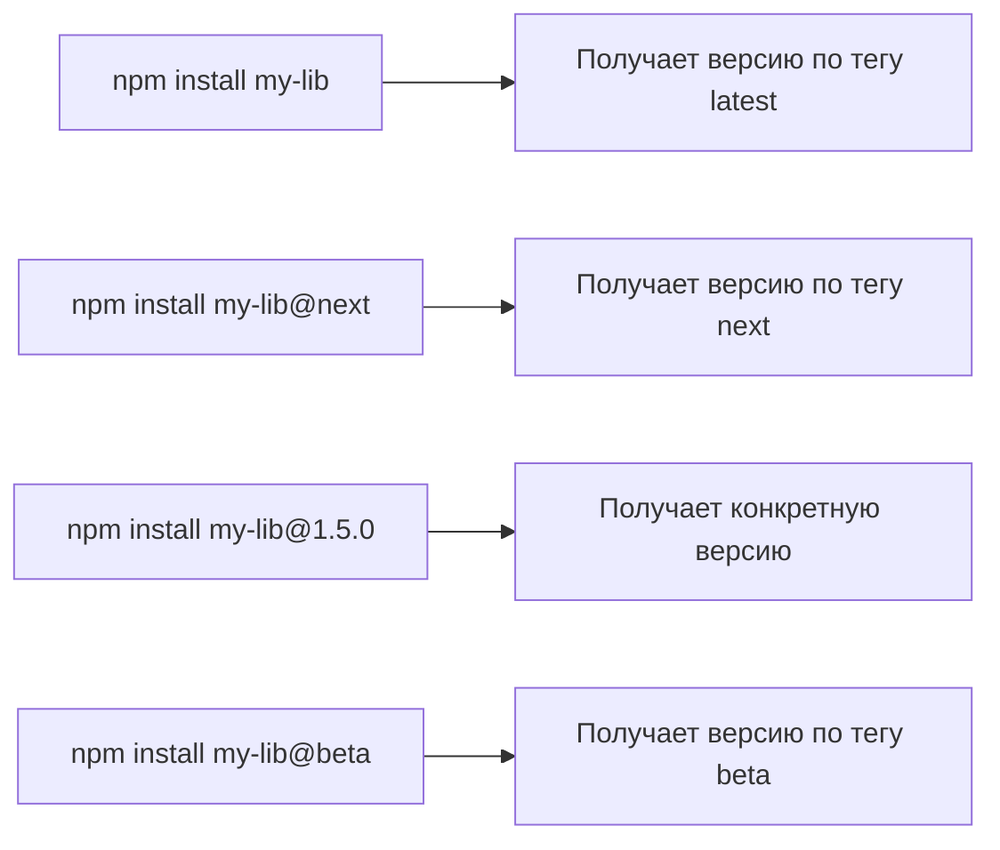
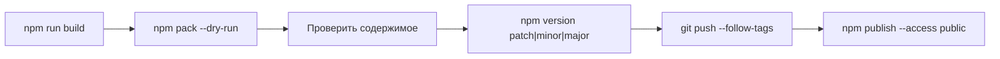

# Уровень 14: Публикация пакетов — подробная теория

## Публикация как выпуск продукта

Публикация npm-пакета — это как выпуск продукта в магазин. Вы определяете что попадёт на полки (поле `files`), клеите ценник (`version`), ставите метки «новинка» или «бета» (`dist-tags`), и убеждаетесь что товар качественный (`prepublishOnly`). После того как продукт ушёл на полку — изменить его сложно (политика unpublish). Поэтому готовимся заранее.

## npm publish — что происходит под капотом

```bash
npm publish
```

Последовательность:

1. Запускается `prepublishOnly` (тесты, линтинг)
2. Запускается `prepare` (сборка)
3. Создаётся tarball (как при `npm pack`)
4. Tarball загружается в реестр
5. Реестр обновляет метаданные пакета

```bash
# Вывод успешной публикации:
npm notice
npm notice package: my-lib@1.2.3
npm notice === Tarball Contents ===
npm notice 234B  package.json
npm notice 12kB  dist/index.js
npm notice 1.5kB dist/index.d.ts
npm notice 2.1kB README.md
npm notice === Tarball Details ===
npm notice name:          my-lib
npm notice version:       1.2.3
npm notice filename:      my-lib-1.2.3.tgz
npm notice package size:  6.2 kB
npm notice unpacked size: 15.9 kB
npm notice shasum:        a1b2c3d4...
npm notice integrity:     sha512-ABC...
npm notice total files:   4
npm notice
+ my-lib@1.2.3
```

## npm version — полное руководство

### Бамп версии

```bash
npm version patch   # 1.2.3 → 1.2.4  (bugfix)
npm version minor   # 1.2.3 → 1.3.0  (новая функциональность)
npm version major   # 1.2.3 → 2.0.0  (breaking change)

# Pre-release версии
npm version prerelease --preid=alpha   # 1.2.3 → 1.2.4-alpha.0
npm version prerelease                 # 1.2.4-alpha.0 → 1.2.4-alpha.1
npm version prepatch --preid=rc        # 1.2.3 → 1.2.4-rc.0
npm version preminor --preid=beta      # 1.2.3 → 1.3.0-beta.0
npm version premajor --preid=beta      # 1.2.3 → 2.0.0-beta.0
```

### Что делает npm version

1. Обновляет `version` в `package.json`
2. Коммитит изменения: `git commit -m "v1.2.4"`
3. Создаёт git-тег: `git tag v1.2.4`

```bash
$ npm version patch
v1.2.4

$ git log --oneline -3
a1b2c3d (HEAD -> main, tag: v1.2.4) v1.2.4
9f8e7d6 feat: add new feature
...

$ git tag
v1.0.0
v1.1.0
v1.2.0
v1.2.1
v1.2.2
v1.2.3
v1.2.4
```

### Отключить коммит и тег

```bash
npm version patch --no-git-tag-version
# Только обновляет package.json, без git-операций
```

## Scopes и access — детали

### Scoped vs unscoped пакеты

```
my-lib              ← unscoped: публичный по умолчанию
@mycompany/my-lib   ← scoped: restricted (приватный) по умолчанию
```

```bash
# Unscoped: публикуется как публичный
npm publish

# Scoped: ОБЯЗАТЕЛЬНО указывать --access public для публичного пакета
npm publish --access public

# Scoped приватный (платный аккаунт или org)
npm publish --access restricted
```

### Почему scoped ограничены по умолчанию?

Исторически scoped-пакеты создавались как инструмент для организаций, публикующих приватный код. Бесплатные аккаунты не могут иметь приватные пакеты, поэтому для открытых scoped-пакетов нужен явный `--access public`.

## dist-tags — система каналов

Представьте dist-tags как "каналы обновлений" — стабильный, бета, экспериментальный.



### Управление тегами

```bash
# Опубликовать релиз-кандидат без изменения latest
npm publish --tag next

# Проверить текущие теги
$ npm dist-tag ls my-lib
beta: 2.0.0-beta.3
latest: 1.9.5
next: 2.0.0-rc.1

# Продвинуть rc в latest после тестирования
npm dist-tag add my-lib@2.0.0-rc.1 latest

# Убрать тег next
npm dist-tag rm my-lib next
```

### Важно: latest и установка по умолчанию

`latest` — специальный тег. Именно он используется при `npm install my-lib`. Если вы публикуете 2.0.0-beta.0 без `--tag`, то `latest` переключится на бету — и все пользователи `npm install my-lib` получат нестабильную версию.

Правило: **pre-release версии всегда публиковать с `--tag`**.

## Контроль содержимого — детально

### Поле `files` — что включать

```json
{
  "name": "my-lib",
  "main": "dist/index.js",
  "types": "dist/index.d.ts",
  "files": ["dist", "README.md"]
}
```

Что ВСЕГДА включается независимо от `files`:

- `package.json`
- `README*` (README.md, README.txt и т.д.)
- `LICENSE*`
- `CHANGELOG*`
- Файл из поля `main`
- Файл из поля `types`/`typings`

Что ВСЕГДА исключается:

- `node_modules/`
- `.git/`
- `.npmrc`
- `npm-debug.log`
- Файлы из `.gitignore` (если нет `.npmignore`)

### `.npmignore` vs поле `files`

|                     | `files`                | `.npmignore`            |
| ------------------- | ---------------------- | ----------------------- |
| Подход              | Белый список (include) | Чёрный список (exclude) |
| Предпочтителен      | Да                     | Нет                     |
| Ошибка по умолчанию | Пакет пустой           | Включает лишнее         |

Поле `files` предпочтительнее: вы явно указываете что должно быть в пакете. С `.npmignore` легко забыть исключить что-то важное (тесты, конфиги, `.env`-файлы).

### npm pack — обязательная проверка

```bash
$ npm pack --dry-run
npm notice
npm notice === Tarball Contents ===
npm notice 12kB  dist/index.js
npm notice 1.5kB dist/index.d.ts
npm notice 234B  package.json
npm notice 2.1kB README.md
npm notice === Tarball Details ===
npm notice name:     my-lib
npm notice version:  1.2.3
npm notice total files: 4
```

`--dry-run` показывает содержимое без создания файла. Перед каждым `npm publish` запускайте `npm pack --dry-run` и проверяйте:

- Попали ли скомпилированные файлы из `dist/`?
- Не попали ли исходники TypeScript `src/`?
- Не попали ли тесты, конфиги, секреты?

## Аутентификация — безопасные практики

### Токен доступа

```bash
# Создать токен на npmjs.com и сохранить
npm login
# Или вручную в ~/.npmrc:
# //registry.npmjs.org/:_authToken=npm_xxxxxxxx
```

### В CI/CD (GitHub Actions)

```yaml
# .github/workflows/publish.yml
jobs:
  publish:
    steps:
      - uses: actions/setup-node@v4
        with:
          node-version: '20'
          registry-url: 'https://registry.npmjs.org'
      - run: npm publish --access public
        env:
          NODE_AUTH_TOKEN: ${{ secrets.NPM_TOKEN }}
```

```ini
# .npmrc проекта (коммитить безопасно)
//registry.npmjs.org/:_authToken=${NODE_AUTH_TOKEN}
```

### 2FA (двухфакторная аутентификация)

npm поддерживает 2FA для публикации. При включённом 2FA нужен одноразовый код:

```bash
npm publish --otp=123456
```

В CI используют automation-токены, которые не требуют 2FA для публикации.

## npm deprecate vs unpublish

### deprecate — мягкое устаревание

```bash
npm deprecate my-lib@"< 2.0.0" "Use v2+, v1 has security vulnerabilities"
```

Пакет остаётся в реестре, но при установке показывается предупреждение:

```
npm WARN deprecated my-lib@1.9.5: Use v2+, v1 has security vulnerabilities
```

Это предпочтительный способ: не ломает проекты, использующие старые версии, но предупреждает о переходе.

### unpublish — жёсткое удаление

```bash
npm unpublish my-lib@1.0.0      # конкретная версия
npm unpublish my-lib --force    # весь пакет
```

Ограничения:

- Версия: можно удалить в течение 72 часов после публикации
- Пакет: только если от него ничего не зависит в реестре

Это правило появилось после инцидента `left-pad` в 2016 году.

### Инцидент left-pad

Разработчик Azer Koçulu удалил свои пакеты из npm в знак протеста. Один из них — `left-pad` (11 строк кода) — был транзитивной зависимостью тысяч пакетов, включая Babel и React. Тысячи CI-сборок по всему миру сломались. npm восстановил пакет, ввёл политику 72 часов и ограничения на unpublish.

## Приватные и корпоративные реестры

```bash
# Verdaccio (открытый self-hosted реестр)
npm publish --registry https://verdaccio.mycompany.com/

# GitHub Packages
npm publish --registry https://npm.pkg.github.com/

# GitLab Package Registry
npm publish --registry https://gitlab.com/api/v4/projects/<id>/packages/npm/
```

Для постоянного использования — в `.npmrc`:

```ini
@mycompany:registry=https://npm.mycompany.com/
//npm.mycompany.com/:_authToken=${COMPANY_NPM_TOKEN}
```

## Рабочий процесс публикации



Или через CI при создании git-тега:

```yaml
on:
  push:
    tags: ['v*']
```
