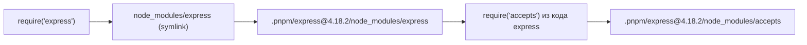
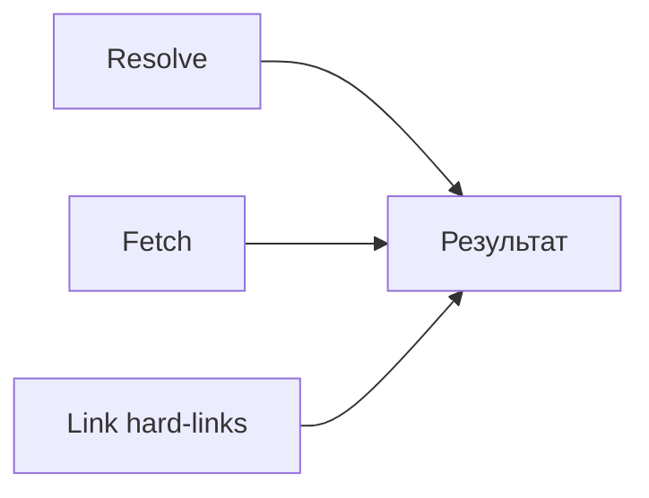

# Уровень 15 (подробно): pnpm — устройство и отличия

## Зачем ещё один пакетный менеджер?

Представьте библиотеку. У npm-подхода библиотека работает так: каждый студент берёт книгу домой и **копирует её от корки до корки** перед каждым занятием. У pnpm — книга одна, она хранится на полке, а каждому студенту выдаётся **закладка (ярлык)**, указывающая на оригинал.

Именно так работает content-addressable store с hard links: физических копий нет, ссылок — сколько угодно.

---

## Content-addressable store: как устроено хранилище

```
~/.local/share/pnpm/store/v3/
  files/
    00/
      1a2b3c...  ← файл пакета (идентифицирован хешем содержимого)
    01/
      ab4f5e...
    ...
  metadata/
    registry.npmjs.org/
      express/
        4.18.2.json  ← метаданные версии
```

**Content-addressable** означает: адрес файла — это хеш его содержимого. Если два пакета содержат файл с одинаковым содержимым (например, `LICENSE` от MIT), он хранится **единожды**.

Путь к store можно посмотреть командой:

```bash
pnpm store path
# /home/user/.local/share/pnpm/store/v3
```

Для очистки неиспользуемых пакетов:

```bash
pnpm store prune
```

---

## Hard links vs копии

| Подход   | Что происходит                                                 | Размер на диске            |
| -------- | -------------------------------------------------------------- | -------------------------- |
| npm/yarn | Файлы копируются в каждый `node_modules`                       | N проектов × размер пакета |
| pnpm     | Создаётся hard link (дополнительная точка входа в те же inode) | 1 × размер пакета          |

Hard link — это не ярлык (symlink), а полноценная ссылка на блок данных. Удалить файл из хранилища нельзя, пока хоть одна hard-ссылка существует. Это гарантирует целостность.

**Практический результат:** 10 проектов, каждый использует React 18.2 (≈100 KB) — npm занимает ~1 MB, pnpm — ~100 KB.

---

## Структура node_modules: разбор по косточкам

Возьмём проект с одной зависимостью `express`, которая сама тянет `accepts`, `debug`, и другие пакеты.

```
node_modules/
  .pnpm/                                       ← виртуальный store (все пакеты)
    express@4.18.2/
      node_modules/
        express/          ← hard link → store
        accepts@1.3.8/    ← hard link → store
        debug@2.6.9/      ← hard link → store
    accepts@1.3.8/
      node_modules/
        accepts/          ← hard link → store
        mime-types/       ← hard link → store
  .modules.yaml           ← мета-информация pnpm
  express/                ← симлинк → .pnpm/express@4.18.2/node_modules/express
```

В корне `node_modules` — **только симлинки на прямые зависимости**.

Когда Node.js резолвит `require('express')`:

1. Находит симлинк `node_modules/express`
2. Переходит по нему в `.pnpm/express@4.18.2/node_modules/express/`
3. `express` сам вызывает `require('accepts')` — и находит его рядом, в `.pnpm/express@4.18.2/node_modules/accepts/`



---

## Фантомные зависимости: проблема и решение

### Что такое фантомная зависимость

```json
// package.json
{
  "dependencies": {
    "express": "^4.18.2"
  }
}
```

```js
// src/index.js
const debug = require('debug') // ← debug НЕ указан в package.json!
```

С npm это **случайно работает**: `debug` — зависимость express, и при плоском `node_modules` он поднимается в корень. Но:

- При обновлении express может смениться версия debug (без вашего ведома)
- express может перестать использовать debug в следующей версии — и ваш код сломается
- Другие разработчики не видят реальных зависимостей проекта

### Почему pnpm решает эту проблему

```
node_modules/
  express/  ← симлинк (есть в package.json — OK)
  debug/    ← НЕТ (не указан в package.json)
```

`require('debug')` из вашего кода → `MODULE_NOT_FOUND`. Это **правильное поведение** — pnpm заставляет вас явно декларировать все зависимости.

---

## pnpm-lock.yaml: формат и содержимое

```yaml
lockfileVersion: '6.0'

settings:
  autoInstallPeers: true
  excludeLinksFromLockfile: false

dependencies:
  express:
    specifier: ^4.18.2
    version: 4.18.2

packages:
  /express@4.18.2:
    resolution:
      integrity: sha512-...
    engines:
      node: '>= 0.10.0'
    dependencies:
      accepts: 1.3.8
      debug: 2.6.9
    dev: false
```

Поле `integrity` содержит SHA-512 хеш архива пакета — при установке pnpm проверяет его.

---

## Обработка peer-зависимостей

pnpm v8+ автоматически устанавливает peer-зависимости (`autoInstallPeers: true` по умолчанию). Если peer-конфликт неизбежен — pnpm создаёт несколько «виртуальных» копий пакета в `.pnpm/`:

```
.pnpm/
  react-dom@18.2.0_react@18.2.0/   ← версия для react 18
  react-dom@18.2.0_react@17.0.2/   ← версия для react 17
```

Это решает проблему «одна версия на весь проект» при несовместимых peer-зависимостях.

---

## pnpm.overrides: принудительные версии

```json
{
  "pnpm": {
    "overrides": {
      "lodash": "4.17.21",
      "debug": ">=4.0.0",
      "express>debug": "4.3.4"
    }
  }
}
```

Синтаксис `express>debug` — заменить `debug` только там, где его тянет `express`. Это точечнее, чем глобальная замена.

---

## Основные команды pnpm

```bash
# Установка
pnpm install                    # установить все зависимости
pnpm install --frozen-lockfile  # строго из lockfile (для CI)

# Управление пакетами
pnpm add express                 # production зависимость
pnpm add -D typescript           # dev зависимость
pnpm add -g pnpm                 # глобальная установка
pnpm remove express              # удалить пакет
pnpm update express              # обновить до последней совместимой
pnpm update express --latest     # обновить до абсолютно последней

# Выполнение
pnpm run build                   # запустить скрипт
pnpm build                       # можно без run
pnpm dlx create-react-app my-app # запустить без установки (аналог npx)

# Диагностика
pnpm list                        # список установленных пакетов
pnpm why express                 # почему установлен пакет
pnpm store path                  # путь к global store
pnpm store prune                 # удалить неиспользуемые пакеты из store
```

---

## Сравнение структуры node_modules

```
npm / yarn classic (плоский):        pnpm (симлинк-структура):
node_modules/                        node_modules/
  express/          ← прямая         .pnpm/
  debug/            ← транзитивная    express@4.18.2/
  accepts/          ← транзитивная      node_modules/
  body-parser/      ← транзитивная        express/
  ...много всего                          debug/
                                          accepts/
                                    express/  ← симлинк
```

---

## Производительность

Три фазы установки у pnpm выполняются параллельно (в отличие от npm, где они последовательны по пакету):



Результат: pnpm в среднем в 2–3 раза быстрее npm при холодной установке и в 5–10 раз быстрее при повторной (всё уже в store).

---

## ⚠️ Частые ошибки начинающих

**❌ Оставить node_modules от npm и запустить pnpm install**

Плоская структура npm конфликтует с симлинк-структурой pnpm. Результат непредсказуем.

✅ Всегда:

```bash
rm -rf node_modules package-lock.json
pnpm install
```

**❌ Использовать phantom dependency после миграции на pnpm**

```js
// ❌ Ломается с pnpm (если debug не в package.json)
const debug = require('debug')
```

✅ Добавить явно:

```bash
pnpm add debug
```

**❌ Коммитить pnpm-lock.yaml, но игнорировать при установке**

Если разработчики запускают `pnpm install` вместо `pnpm install --frozen-lockfile` в CI — lockfile может обновиться незаметно.

✅ В CI всегда использовать `pnpm install --frozen-lockfile`.

---

## 💡 Советы

- `pnpm` совместим с `npm`-реестром — все пакеты доступны без изменений
- Для монорепо pnpm workspaces — один из лучших вариантов (за счёт строгой изоляции и экономии диска)
- Если проект опирается на phantom deps (код импортирует незадекларированные пакеты), pnpm найдёт эти проблемы немедленно — это особенность, а не баг
