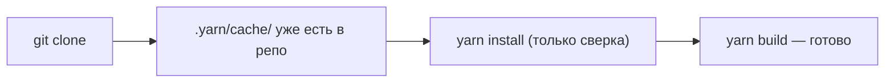
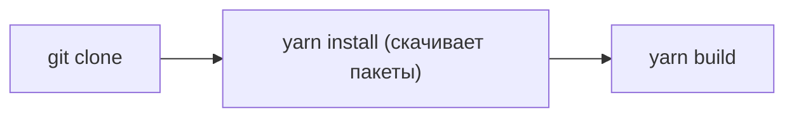

# Уровень 16 (подробно): Yarn — classic, berry, Plug'n'Play

## Краткая история: зачем появился Yarn

В 2016 году npm не имел lockfile (появился только в npm v5 в 2017), установки были медленными и недетерминированными. Facebook, Google и Exponent создали Yarn как замену с тремя ключевыми улучшениями:

1. `yarn.lock` — каждый пакет зафиксирован до конкретной версии
2. Параллельные загрузки — npm загружал пакеты один за другим
3. Офлайн-кэш — установленные пакеты кэшируются и повторно используются

Сегодня npm v9/v10 ликвидировал большинство этих преимуществ, но Yarn продолжает развиваться в другом направлении — через Yarn Berry.

---

## Yarn Classic (v1): устройство

### yarn.lock

```
# THIS IS AN AUTOGENERATED FILE. DO NOT EDIT THIS FILE DIRECTLY.
# yarn lockfile v1

express@^4.18.2:
  version "4.18.2"
  resolved "https://registry.yarnpkg.com/express/-/express-4.18.2.tgz#3fabe08296e931c46dd1..."
  integrity sha512-...
  dependencies:
    accepts "~1.3.8"
    debug "2.6.9"
```

Формат: человекочитаемый текст, один блок на версию пакета. Менее подробный, чем `package-lock.json` npm.

### Структура node_modules у Yarn Classic

Полностью аналогична npm: плоский `node_modules` с подъёмом (hoisting) транзитивных зависимостей.

```
node_modules/
  express/       ← прямая зависимость
  debug/         ← транзитивная, поднята в корень
  accepts/       ← транзитивная, поднята в корень
  ...
```

Это значит: фантомные зависимости так же возможны, как в npm.

### Поле resolutions

```json
{
  "resolutions": {
    "lodash": "4.17.21",
    "**/@types/react": "18.2.0",
    "react-scripts/**/typescript": "5.0.4"
  }
}
```

Паттерны:

- `"lodash"` — заменить все вхождения
- `"**/typescript"` — заменить везде в дереве
- `"react-scripts/**/typescript"` — только в зависимостях react-scripts

### Основные команды Yarn Classic

```bash
yarn                     # yarn install
yarn add express         # добавить production зависимость
yarn add -D typescript   # добавить dev зависимость
yarn remove express      # удалить пакет
yarn upgrade express     # обновить пакет
yarn global add nodemon  # глобальная установка
```

---

## Yarn Berry (v2+): революция в подходе

### Зачем понадобился Berry

Yarn Berry решает принципиально другую задачу: устранение `node_modules` как архитектурной проблемы.

`node_modules` — это директория, которая:

- Может содержать десятки тысяч файлов (medianный проект: 150 000+ файлов)
- Медленно копируется и просматривается на filesystems (особенно macOS HFS+)
- Не может быть закоммичена в git эффективно

Yarn Berry предлагает другой контракт: **пакеты — это zip-архивы, а node_modules не нужен**.

### Plug'n'Play: механизм резолюции

Когда Node.js выполняет `require('express')`, происходит следующее:

**Без PnP (традиционно):**

```
require('express')
→ ищет node_modules/express/
→ читает package.json → main
→ загружает файл
```

**С PnP:**

```
require('express')
→ .pnp.cjs перехватывает вызов (patch загружен при старте)
→ смотрит в карту: express@4.18.2 → .yarn/cache/express-npm-4.18.2.zip/node_modules/express/
→ читает файл из ZIP без распаковки
```

`.pnp.cjs` — это сгенерированный JavaScript-файл со встроенной картой:

```js
// .pnp.cjs (упрощённо)
const packageLocatorsByLocations = new Map([
  ['node_modules/express/', { name: 'express', reference: '4.18.2' }],
  // ...
])

const packageInformationStores = new Map([
  [
    'express',
    new Map([
      [
        '4.18.2',
        {
          packageLocation: '.yarn/cache/express-npm-4.18.2-abc.zip/node_modules/express/',
          packageDependencies: new Map([
            ['accepts', '1.3.8'],
            ['debug', '2.6.9'],
          ]),
        },
      ],
    ]),
  ],
])
```

### Структура проекта с Yarn Berry PnP

```
project/
  .pnp.cjs                         ← патч require() + карта резолюции
  .pnp.loader.mjs                  ← для ESM-модулей
  .yarn/
    cache/
      express-npm-4.18.2-a1b2c3.zip
      debug-npm-4.3.4-d4e5f6.zip
      accepts-npm-1.3.8-a7b8c9.zip
    releases/
      yarn-4.0.1.cjs               ← сам Yarn Berry
    sdks/                          ← интеграции для IDE (TypeScript, ESLint)
  .yarnrc.yml                      ← конфиг Yarn Berry
  package.json
  yarn.lock
```

---

## Zero-installs: CI без фазы установки



Без zero-installs:



**Компромисс:** `.yarn/cache/` добавляет размер репозитория (обычно 50–500 MB в zip-архивах). Взамен — нет зависимости от скорости интернета и npmjs.com в CI.

`.gitignore` при zero-installs:

```gitignore
# Включить в репо:
# .yarn/cache
# .pnp.cjs
# yarn.lock

# Исключить:
.yarn/unplugged
.yarn/build-state.yml
.yarn/install-state.gz
node_modules
```

---

## nodeLinker: когда PnP не подходит

```yaml
# .yarnrc.yml

# Вариант 1: классический node_modules (совместимость)
nodeLinker: node-modules

# Вариант 2: PnP (по умолчанию в Yarn Berry)
nodeLinker: pnp

# Вариант 3: pnpm-style (симлинки, как в pnpm)
nodeLinker: pnpm
```

Инструменты с известными проблемами совместимости с PnP:

- Create React App (устаревший)
- Некоторые Webpack-плагины с прямым чтением fs
- Нативные аддоны (`.node` файлы)

Для таких случаев `nodeLinker: node-modules` — прагматичный выбор, позволяющий использовать Yarn Berry без PnP.

---

## Плагины Yarn Berry

Yarn Berry расширяется через плагины:

```bash
yarn plugin import typescript     # автоматическое добавление @types/*
yarn plugin import interactive-tools  # интерактивное обновление зависимостей
yarn plugin import workspace-tools   # инструменты для монорепо
```

Список подключённых плагинов хранится в `.yarnrc.yml`:

```yaml
plugins:
  - path: .yarn/plugins/@yarnpkg/plugin-typescript.cjs
    spec: '@yarnpkg/plugin-typescript'
```

---

## yarn dlx: запуск без установки

```bash
# Yarn Berry
yarn dlx create-react-app my-app
yarn dlx prettier --write .

# Аналог npx (npm)
npx create-react-app my-app

# Аналог pnpm dlx
pnpm dlx create-react-app my-app
```

`dlx` = Download and eXecute. Пакет скачивается во временное место и запускается. После завершения — удаляется.

---

## Сравнение Classic vs Berry

| Характеристика        | Yarn Classic (v1)  | Yarn Berry (v2+)          |
| --------------------- | ------------------ | ------------------------- |
| node_modules          | Плоский (hoisting) | Нет (PnP) или опционально |
| Lockfile              | yarn.lock          | yarn.lock (новый формат)  |
| Фантомные зависимости | Допускает          | Не допускает (PnP)        |
| Zero-installs         | Нет                | Да                        |
| Плагины               | Нет                | Да                        |
| Совместимость         | Высокая            | Требует проверки          |
| Конфигурация          | `package.json`     | `.yarnrc.yml`             |

---

## Как определить версию Yarn в проекте

```json
// package.json (Yarn Berry 4+)
{
  "packageManager": "yarn@4.0.1"
}
```

```yaml
# .yarnrc.yml
yarnPath: .yarn/releases/yarn-4.0.1.cjs
```

```bash
yarn --version  # посмотреть текущую версию
```

---

## ⚠️ Частые ошибки начинающих

**❌ Смешивать команды Yarn Classic и Berry**

В Berry нет `yarn global add` (используется `yarn dlx` или системный пакетный менеджер). В Classic нет `yarn dlx`.

✅ Проверяйте версию Yarn командой `yarn --version`.

**❌ Забыть про IDE-интеграцию при использовании PnP**

TypeScript и ESLint не видят типы, если не установлены SDK для PnP:

```bash
yarn dlx @yarnpkg/sdks vscode  # установить SDK для VS Code
```

✅ После настройки PnP всегда запускайте генерацию SDK.

**❌ Коммитить node_modules вместо .yarn/cache/**

Если используется zero-installs, коммитить нужно `.yarn/cache/` (zip-архивы), а не `node_modules`.

✅ Следите за `.gitignore` согласно документации Yarn Berry.
