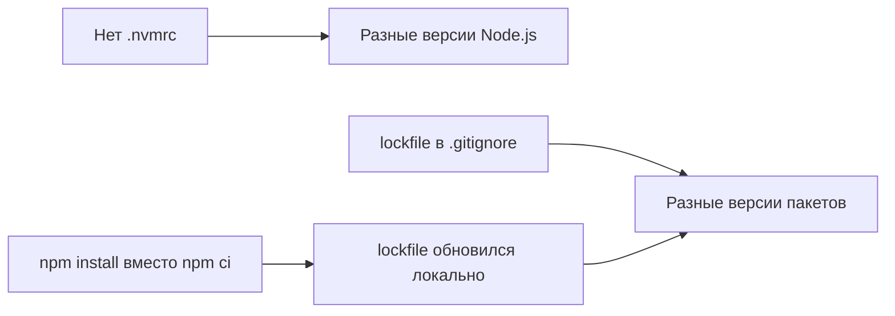

# Уровень 18 (подробно): Миграция и устранение неполадок

## Почему миграция — это риск

Смена пакетного менеджера кажется простой: удалил node_modules, поставил заново. На практике миграция вскрывает скрытые проблемы, которые накапливались годами:

- Phantom dependencies (код использует незадекларированные пакеты)
- Несовместимые peer-зависимости, которые npm молча игнорировал
- Скрипты, опирающиеся на конкретную структуру node_modules
- Hardcoded пути вида `require('../../node_modules/lodash')`

Каждая из этих проблем «работала» с npm из-за мягкой изоляции и безобидно ломается с pnpm или Yarn Berry PnP.

---

## Миграция npm → pnpm: шаг за шагом

### Шаг 1: Импорт lockfile

```bash
# В корне проекта
pnpm import
# Читает package-lock.json или yarn.lock
# Создаёт pnpm-lock.yaml с теми же версиями
```

Импорт гарантирует, что версии пакетов не изменятся при переходе — только структура node_modules.

### Шаг 2: Установка

```bash
rm -rf node_modules
pnpm install
```

### Шаг 3: Выявление phantom dependencies

После установки запустите тесты и приложение. Ошибки вида:

```
Error: Cannot find module 'lodash'
Require stack:
- /app/src/utils/format.js
```

Означают: `lodash` импортируется, но не задекларирован в `package.json`. При npm он работал через hoisting.

```bash
# Найти все проблемные импорты автоматически (примерно)
grep -r "require\|from '" src/ | grep -v node_modules | \
  awk -F"['\"]" '{print $2}' | \
  grep -v '^\.' | \
  sort -u
# Сравнить с npm ls --depth=0
```

Быстрое решение: добавить пакет явно:

```bash
pnpm add lodash
pnpm add -D @types/lodash  # если TypeScript
```

### Шаг 4: Проверка скриптов

Проверить `package.json → scripts` на наличие жёстко прописанных путей:

```json
// ❌ Сломается при смене структуры node_modules
"scripts": {
  "lint": "node ./node_modules/.bin/eslint src/"
}

// ✅ Работает с любым менеджером
"scripts": {
  "lint": "eslint src/"
}
```

---

## Миграция npm → Yarn Berry: особенности

```bash
# Установить Yarn Berry
npm install -g yarn
cd my-project
yarn set version berry   # или yarn set version stable

# Убрать package-lock.json
rm package-lock.json

# Установить
yarn install
```

При использовании PnP дополнительно:

```bash
# Настроить IDE
yarn dlx @yarnpkg/sdks vscode

# Если инструменты не поддерживают PnP
# добавить в .yarnrc.yml:
# nodeLinker: node-modules
```

---

## Разбор ошибок установки

### ERESOLVE: конфликт peer-зависимостей

```
npm ERR! code ERESOLVE
npm ERR! ERESOLVE unable to resolve dependency tree
npm ERR!
npm ERR! While resolving: my-project@1.0.0
npm ERR! Found: react@17.0.2
npm ERR! node_modules/react
npm ERR!   react@"17.0.2" from the root project
npm ERR!
npm ERR! Could not resolve dependency:
npm ERR! peer react@">=18.0.0" from @some/package@2.0.0
npm ERR! node_modules/@some/package
```

**Читаем сообщение:**

- «Found: react@17.0.2» — в проекте установлен React 17
- «Could not resolve: peer react@>=18.0.0» — пакет `@some/package@2.0.0` требует React 18+

**Варианты решения:**

```bash
# Вариант 1: обновить react до совместимой версии
npm install react@18 react-dom@18

# Вариант 2: понизить версию конфликтующего пакета
npm install @some/package@1.x

# Вариант 3: обойти как npm v6 (если уверены в совместимости)
npm install --legacy-peer-deps

# ❌ Не делать это без понимания последствий:
npm install --force
```

### EINTEGRITY: битый кэш или повреждённый lockfile

```
npm ERR! code EINTEGRITY
npm ERR! sha512-... integrity checksum failed when using sha512
npm ERR! Expected: sha512-AAAA...
npm ERR! Got:      sha512-BBBB...
```

**Причины:**

- Файл в кэше повреждён
- lockfile был вручную отредактирован
- Пакет обновился в реестре без смены версии (редкость, но бывает)

**Решение:**

```bash
npm cache clean --force
npm install

# Если не помогло — удалить lockfile и переустановить
rm package-lock.json
npm install
git add package-lock.json
```

### EACCES / EPERM: проблемы с правами

```
npm ERR! code EACCES
npm ERR! syscall mkdir
npm ERR! path /usr/local/lib/node_modules
```

**Никогда не использовать `sudo npm install -g`** — это меняет права на системных файлах.

**Правильное решение:**

```bash
# Переместить глобальный prefix в домашнюю директорию
npm config set prefix '~/.npm-global'
echo 'export PATH=~/.npm-global/bin:$PATH' >> ~/.bashrc
source ~/.bashrc

# Теперь глобальные пакеты устанавливаются без sudo
npm install -g typescript
```

### EBADENGINE: версия Node.js не подходит

```
npm WARN EBADENGINE Unsupported engine {
npm WARN EBADENGINE   package: 'some-package@3.0.0',
npm WARN EBADENGINE   required: { node: '>=18.0.0' },
npm WARN EBADENGINE   current: { node: 'v16.20.0' }
```

**Решение:**

```bash
node --version           # текущая версия
cat .nvmrc               # требуемая (если файл есть)
nvm install 18           # установить нужную версию
nvm use 18               # переключить
node --version           # проверить
```

---

## Дрейф версий: диагностика и профилактика

### Симптом

«У меня работает, у Васи — нет» при одинаковом коде.

### Диагностика

```bash
# Проверить версии установленных пакетов
npm ls --depth=0

# Проверить версию конкретного пакета
npm ls react

# Посмотреть откуда взялась версия
npm explain react

# Сравнить версии Node.js
node --version
cat .nvmrc
```

### Причины дрейфа



### Профилактика

```bash
# 1. Зафиксировать Node.js
echo "18.17.0" > .nvmrc
# + добавить в package.json:
# "engines": { "node": ">=18.17.0" }

# 2. lockfile должен быть в git
# Убедиться, что нет в .gitignore:
grep -n "package-lock\|yarn.lock\|pnpm-lock" .gitignore

# 3. В CI всегда использовать команду строгой установки
# npm ci
# pnpm install --frozen-lockfile
# yarn install --immutable
```

---

## Диагностический чек-лист «чистой» переустановки

Если пакеты ведут себя непредсказуемо — полный сброс:

```bash
# 1. Удалить всё нестабильное
rm -rf node_modules
rm package-lock.json    # или yarn.lock / pnpm-lock.yaml

# 2. Очистить кэш менеджера
npm cache verify        # проверить целостность
# или
npm cache clean --force  # если verify выявил проблемы

# 3. Переустановить
npm install

# 4. Проверить установленные версии
npm ls --depth=1

# 5. Запустить тесты
npm test
```

---

## npm ls и npm explain: инструменты диагностики дерева

### npm ls — дерево зависимостей

```bash
npm ls                  # полное дерево
npm ls --depth=0        # только прямые зависимости
npm ls lodash           # найти lodash в дереве
npm ls --json | jq .    # вывод в JSON для анализа
```

Пример вывода:

```
my-project@1.0.0
├── express@4.18.2
│   ├── accepts@1.3.8
│   ├── debug@2.6.9
│   └── ...
└── lodash@4.17.21
```

### npm explain — откуда взялась зависимость

```bash
npm explain lodash
```

```
lodash@4.17.21
node_modules/lodash
  lodash@"^4.17.21" from the root project  ← прямая зависимость
  lodash@"^4.0.0" from some-tool@2.1.0     ← транзитивная
    some-tool@"^2.0.0" from the root project
```

Особенно полезно при ERESOLVE: помогает понять, кто требует конфликтующую версию.

---

## Типичный сценарий: переход команды на pnpm

```
Неделя 1: анализ
  └── npm ls --depth=0 → список прямых зависимостей
  └── grep импортов → найти phantom deps

Неделя 2: миграция
  └── pnpm import → создать pnpm-lock.yaml
  └── pnpm install → установить
  └── Починить найденные phantom deps

Неделя 3: стабилизация
  └── Обновить CI: npm ci → pnpm install --frozen-lockfile
  └── Обновить README
  └── Добавить packageManager: "pnpm@9.x.x" в package.json
```

---

## ⚠️ Частые ошибки при миграции и отладке

**❌ Использовать --force для обхода ERESOLVE**

```bash
npm install --force  # ❌ Молча создаёт несовместимое дерево
```

✅ Разобраться с конфликтом: обновить пакеты или использовать `overrides`.

**❌ Не удалять node_modules при смене менеджера**

Структура node_modules от npm и от pnpm несовместима. Запуск `pnpm install` поверх npm-структуры — непредсказуемый результат.

✅ Всегда: `rm -rf node_modules && pnpm install`.

**❌ Считать предупреждения о peer-deps безобидными**

```
npm WARN peer dep react@17 but package requires react@18
```

Это не просто предупреждение — это сигнал о потенциальных runtime-проблемах (несовместимые API, дублирующийся React в дереве, хуки не работают).

✅ Разбирать каждое предупреждение. Peer-warnings — симптом проблемы.

**❌ Держать lockfile в .gitignore «чтобы не засорять репозиторий»**

Без lockfile каждый разработчик и CI-сборка получают потенциально разные версии пакетов.

✅ Коммитить lockfile обязательно. Это не мусор — это гарантия воспроизводимости.
