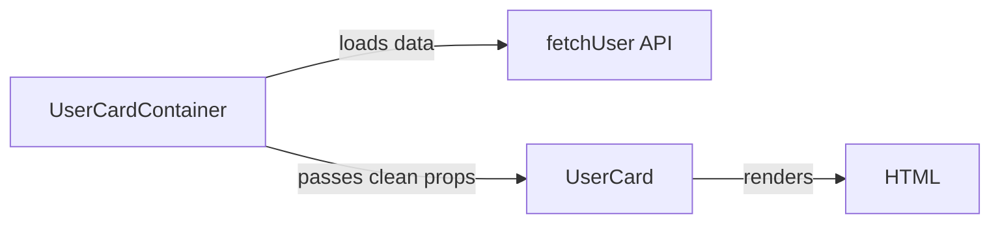
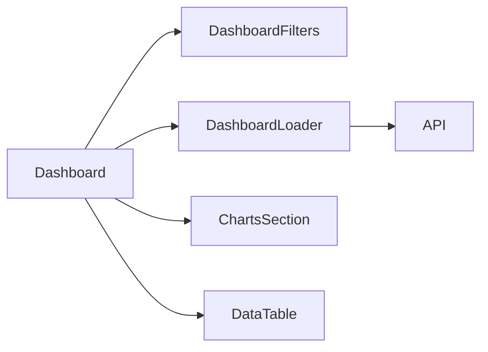

# Level 0: Component Decomposition — Detailed Guide

## Why is this important?

Imagine a restaurant kitchen. There's a cook who does everything alone: takes orders, cooks, washes dishes, handles payments. It works while there are few visitors. But when guests flood in — collapse.

In a good restaurant, there is a division: waiters take orders, cooks cook, cashiers count. Each does one thing, and does it well. That's the principle of decomposition.

In a React app, a monolithic component is that same lone cook. It works, but try adding a new feature or fixing a bug — everything falls apart.

---

## Single Responsibility Principle (SRP)

SRP (Single Responsibility Principle) — one of the five SOLID principles. For components, it goes like this:

> 📌 A component should have only one reason to change.

If a component changes when the UI changes, when the loading logic changes, and when a business rule changes — it has three reasons to change. That's a violation of SRP.

### Example: monolithic product page

```tsx
// ❌ Bad: one component does everything
function ProductPage({ productId }: { productId: string }) {
  const [product, setProduct] = useState<Product | null>(null)
  const [reviews, setReviews] = useState<Review[]>([])
  const [related, setRelated] = useState<Product[]>([])
  const [quantity, setQuantity] = useState(1)
  const [addedToCart, setAddedToCart] = useState(false)
  const [loading, setLoading] = useState(true)

  useEffect(() => {
    setLoading(true)
    Promise.all([
      fetch(`/api/products/${productId}`).then(r => r.json()),
      fetch(`/api/products/${productId}/reviews`).then(r => r.json()),
      fetch(`/api/products/${productId}/related`).then(r => r.json()),
    ]).then(([prod, revs, rel]) => {
      setProduct(prod)
      setReviews(revs)
      setRelated(rel)
      setLoading(false)
    })
  }, [productId])

  const handleAddToCart = () => {
    fetch('/api/cart', { method: 'POST', body: JSON.stringify({ productId, quantity }) })
    setAddedToCart(true)
    setTimeout(() => setAddedToCart(false), 3000)
  }

  if (loading) return <div>Loading...</div>
  if (!product) return <div>Product not found</div>

  return (
    <div>
      {/* Product card */}
      <div style={{ display: 'flex', gap: '2rem' }}>
        
        <div>
          <h1>{product.name}</h1>
          <p>{product.description}</p>
          <div style={{ fontSize: '2rem', color: '#e44' }}>
            {product.price.toLocaleString()} ₽
          </div>
          {/* Add to cart form */}
          <div>
            <input
              type="number"
              value={quantity}
              onChange={e => setQuantity(Number(e.target.value))}
              min={1}
              max={product.stock}
            />
            <button onClick={handleAddToCart} disabled={addedToCart}>
              {addedToCart ? 'Added!' : 'Add to cart'}
            </button>
          </div>
        </div>
      </div>

      {/* Reviews list */}
      <section>
        <h2>Reviews ({reviews.length})</h2>
        {reviews.map(review => (
          <div key={review.id}>
            <strong>{review.author}</strong>
            <span>{'★'.repeat(review.rating)}</span>
            <p>{review.text}</p>
          </div>
        ))}
      </section>

      {/* Related products */}
      <section>
        <h2>Related products</h2>
        <div style={{ display: 'flex', gap: '1rem' }}>
          {related.map(p => (
            <div key={p.id}>
              
              <p>{p.name}</p>
              <p>{p.price.toLocaleString()} ₽</p>
            </div>
          ))}
        </div>
      </section>
    </div>
  )
}
```

What's wrong with this code? Many problems:

1. **Hard to read** — to find cart logic, you have to read through 80 lines
2. **Impossible to reuse** — want to show `ReviewsList` on another page? You'll have to duplicate
3. **Hard to test** — to test the "Add to cart" button, you need to mock three APIs
4. **Frequent git conflicts** — everyone edits the same file

### Proper decomposition

```tsx
// ✅ Good: each component — its own responsibility

// Product card component — UI only
function ProductCard({ product }: { product: Product }) {
  return (
    <div style={{ display: 'flex', gap: '2rem' }}>
      
      <div>
        <h1>{product.name}</h1>
        <p>{product.description}</p>
        <div style={{ fontSize: '2rem', color: '#e44' }}>
          {product.price.toLocaleString()} ₽
        </div>
      </div>
    </div>
  )
}

// Cart form component — add logic only
function AddToCartForm({ productId, stock }: { productId: string; stock: number }) {
  const [quantity, setQuantity] = useState(1)
  const [added, setAdded] = useState(false)

  const handleAdd = () => {
    fetch('/api/cart', { method: 'POST', body: JSON.stringify({ productId, quantity }) })
    setAdded(true)
    setTimeout(() => setAdded(false), 3000)
  }

  return (
    <div>
      <input type="number" value={quantity} onChange={e => setQuantity(Number(e.target.value))} min={1} max={stock} />
      <button onClick={handleAdd} disabled={added}>
        {added ? 'Added!' : 'Add to cart'}
      </button>
    </div>
  )
}

// Reviews list component
function ReviewsList({ reviews }: { reviews: Review[] }) {
  return (
    <section>
      <h2>Reviews ({reviews.length})</h2>
      {reviews.map(review => (
        <div key={review.id}>
          <strong>{review.author}</strong>
          <span>{'★'.repeat(review.rating)}</span>
          <p>{review.text}</p>
        </div>
      ))}
    </section>
  )
}

// Orchestrator — coordination only
function ProductPage({ productId }: { productId: string }) {
  const [product, setProduct] = useState<Product | null>(null)
  const [reviews, setReviews] = useState<Review[]>([])
  const [related, setRelated] = useState<Product[]>([])
  const [loading, setLoading] = useState(true)

  useEffect(() => {
    // loading data...
  }, [productId])

  if (loading) return <div>Loading...</div>
  if (!product) return <div>Product not found</div>

  return (
    <div>
      <ProductCard product={product} />
      <AddToCartForm productId={productId} stock={product.stock} />
      <ReviewsList reviews={reviews} />
      <RelatedProducts products={related} />
    </div>
  )
}
```

Now each component can be read, tested, and reused independently.

---

## Smart vs Dumb components

This separation was introduced by Dan Abramov in 2015. The idea: some components **know about data**, others **only display**.

### Dumb (Presentational) components

Like a shop window — beautifully displays what it's given. Doesn't know where the product came from or what the wholesale cost is.

```tsx
// ✅ Dumb component: receives everything through props, knows nothing about the server
interface UserCardProps {
  name: string
  avatar: string
  role: string
  isOnline: boolean
}

function UserCard({ name, avatar, role, isOnline }: UserCardProps) {
  return (
    <div style={{ padding: '1rem', border: '1px solid #eee', borderRadius: '8px' }}>
      <div style={{ position: 'relative', display: 'inline-block' }}>
        
        {isOnline && (
          <span style={{
            position: 'absolute', bottom: 0, right: 0,
            width: 12, height: 12, background: '#4caf50',
            borderRadius: '50%', border: '2px solid white'
          }} />
        )}
      </div>
      <h3>{name}</h3>
      <p style={{ color: '#666' }}>{role}</p>
    </div>
  )
}
```

**Signs of a Dumb component:**
- Receives data via props
- Returns JSX
- Can have local UI-state (dropdown open/closed)
- Easily tested: give it the right props — check the output

### Smart (Container) components

Like a warehouse with a database. Knows where everything is, but doesn't show itself to customers.

```tsx
// ✅ Smart component: knows where to get data, but delegates rendering
function UserCardContainer({ userId }: { userId: string }) {
  const [user, setUser] = useState<User | null>(null)
  const [loading, setLoading] = useState(true)
  const [error, setError] = useState<string | null>(null)

  useEffect(() => {
    setLoading(true)
    fetchUser(userId)
      .then(setUser)
      .catch(err => setError(err.message))
      .finally(() => setLoading(false))
  }, [userId])

  if (loading) return <Spinner />
  if (error) return <ErrorMessage message={error} />
  if (!user) return null

  return (
    <UserCard
      name={user.name}
      avatar={user.avatarUrl}
      role={user.role}
      isOnline={user.lastSeen > Date.now() - 5 * 60 * 1000}
    />
  )
}
```

**Signs of a Smart component:**
- Works with API, Redux, Context
- Transforms data before passing it down
- Renders little or nothing itself
- Harder to test (need to mock dependencies)

### When is this separation useful?



Imagine: you're writing a test for `UserCard`. You don't need to mock the API — just pass an object with data. That's the main benefit of the separation.

---

## When to split?

There's no universal answer, but there are guidelines:

### Size

```
Component > 150 lines of JSX → 🚨 think about decomposition
Component > 300 lines → 🔥 definitely needs splitting
```

But this isn't a hard rule. A 200-line component with one complex layout might be fine. An 80-line component with three different zones of responsibility — a candidate for splitting.

### Reusability

If you're writing similar code for the second time — stop. Extract a component.

```tsx
// ❌ Duplication in two places
function OrderCard() {
  return (
    <div style={{ padding: '1rem', background: '#f5f5f5', borderRadius: '8px', border: '1px solid #ddd' }}>
      ...
    </div>
  )
}

function ProductCard() {
  return (
    <div style={{ padding: '1rem', background: '#f5f5f5', borderRadius: '8px', border: '1px solid #ddd' }}>
      ...
    </div>
  )
}

// ✅ Extract Card as a base component
function Card({ children }: { children: React.ReactNode }) {
  return (
    <div style={{ padding: '1rem', background: '#f5f5f5', borderRadius: '8px', border: '1px solid #ddd' }}>
      {children}
    </div>
  )
}
```

### Testability

If a test requires you to mock 5 dependencies — the component does too much. Extract the parts that have no or minimal external dependencies.

### Readability

Simple test: can a new developer understand what the component does in 30 seconds? If not — break it up.

---

## Dashboard decomposition by responsibilities

A Dashboard is a typical candidate for decomposition. It usually includes:



```tsx
// Filters component — its own responsibility
function DashboardFilters({ filters, onChange }: FilterProps) {
  return (
    <div style={{ display: 'flex', gap: '1rem' }}>
      <select value={filters.period} onChange={e => onChange({ ...filters, period: e.target.value })}>
        <option value="day">Day</option>
        <option value="week">Week</option>
        <option value="month">Month</option>
      </select>
      <input
        type="text"
        placeholder="Search..."
        value={filters.search}
        onChange={e => onChange({ ...filters, search: e.target.value })}
      />
    </div>
  )
}

// Loading component with state handling
function DashboardLoader({ filters, children }: LoaderProps) {
  const [data, setData] = useState<DashboardData | null>(null)
  const [loading, setLoading] = useState(false)

  useEffect(() => {
    setLoading(true)
    fetchDashboardData(filters)
      .then(setData)
      .finally(() => setLoading(false))
  }, [filters])

  if (loading) return <Spinner />
  if (!data) return null

  return <>{children(data)}</>
}

// Main component — orchestration only
function Dashboard() {
  const [filters, setFilters] = useState({ period: 'week', search: '' })

  return (
    <div>
      <DashboardFilters filters={filters} onChange={setFilters} />
      <DashboardLoader filters={filters}>
        {(data) => (
          <>
            <ChartsSection data={data.charts} />
            <DataTable rows={data.rows} />
          </>
        )}
      </DashboardLoader>
    </div>
  )
}
```

---

## Antipatterns

### 1. Excessive decomposition

```tsx
// ❌ Too fine-grained — no point
function UserName({ name }: { name: string }) {
  return <span>{name}</span>
}

function UserAge({ age }: { age: number }) {
  return <span>{age} years</span>
}

// This is just text, no separate component needed
```

### 2. Passing entire state down

```tsx
// ❌ Bad: passing the whole object
function ProfileView({ user, setUser, loading, error, refetch }: Everything) {
  // component knows too much about the parent
}

// ✅ Pass only what's needed
function ProfileView({ name, avatar, email }: ProfileViewProps) {
  // minimal interface
}
```

### 3. Prop drilling through 5 levels

```tsx
// ❌ userId is passed through 5 components without being used
<Page userId={userId}>
  <Layout userId={userId}>
    <Sidebar userId={userId}>
      <Menu userId={userId}>
        <UserAvatar userId={userId} />
      </Menu>
    </Sidebar>
  </Layout>
</Page>

// ✅ Use Context or pass ready-made data
```

---

## Best practices

1. **Start with a monolith** — don't decompose in advance until you see patterns
2. **Names reflect responsibility** — `UserProfileContainer` vs `UserProfile` clearly signals intent
3. **One file — one component** — for medium-sized components
4. **Props — public API** — design them as you would a library interface
5. **Dumb components in `components/`, Smart — in `containers/` or near the page**

---

## Summary

Decomposition is not about "small components". It's about **proper responsibility boundaries**. Each component should be understandable on its own, independently testable, and easily replaceable.

A good indicator: if you can describe what a component does in one simple sentence without the word "and" — you're on the right track.
