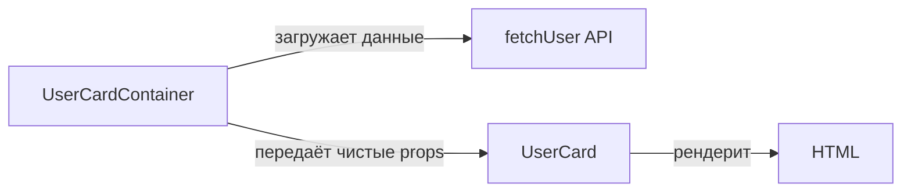
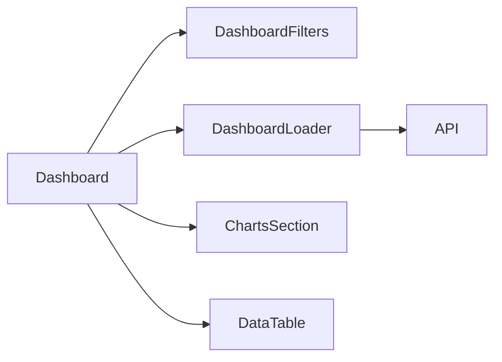

# Level 0: Декомпозиция компонентов — Подробное руководство

## Почему это важно?

Представьте кухню ресторана. Есть повар, который один делает всё: принимает заказ, готовит, моет посуду, рассчитывает гостей. Это работает, пока посетителей мало. Но при наплыве гостей — коллапс.

В хорошем ресторане есть разделение: официанты принимают заказы, повара готовят, кассиры считают. Каждый делает одно, делает хорошо. Это и есть принцип декомпозиции.

В React-приложении монолитный компонент — это тот же повар-одиночка. Он работает, но стоит добавить новую функцию или исправить баг — всё рассыпается.

---

## Принцип единственной ответственности (SRP)

SRP (Single Responsibility Principle) — один из пяти принципов SOLID. Для компонентов он звучит так:

> 📌 Компонент должен иметь одну причину для изменения.

Если компонент меняется и когда меняется UI, и когда меняется логика загрузки, и когда меняется бизнес-правило — у него три причины для изменения. Это нарушение SRP.

### Пример: монолитная страница товара

```tsx
// ❌ Плохо: один компонент делает всё
function ProductPage({ productId }: { productId: string }) {
  const [product, setProduct] = useState<Product | null>(null)
  const [reviews, setReviews] = useState<Review[]>([])
  const [related, setRelated] = useState<Product[]>([])
  const [quantity, setQuantity] = useState(1)
  const [addedToCart, setAddedToCart] = useState(false)
  const [loading, setLoading] = useState(true)

  useEffect(() => {
    setLoading(true)
    Promise.all([
      fetch(`/api/products/${productId}`).then(r => r.json()),
      fetch(`/api/products/${productId}/reviews`).then(r => r.json()),
      fetch(`/api/products/${productId}/related`).then(r => r.json()),
    ]).then(([prod, revs, rel]) => {
      setProduct(prod)
      setReviews(revs)
      setRelated(rel)
      setLoading(false)
    })
  }, [productId])

  const handleAddToCart = () => {
    fetch('/api/cart', { method: 'POST', body: JSON.stringify({ productId, quantity }) })
    setAddedToCart(true)
    setTimeout(() => setAddedToCart(false), 3000)
  }

  if (loading) return <div>Загрузка...</div>
  if (!product) return <div>Товар не найден</div>

  return (
    <div>
      {/* Карточка товара */}
      <div style={{ display: 'flex', gap: '2rem' }}>
        
        <div>
          <h1>{product.name}</h1>
          <p>{product.description}</p>
          <div style={{ fontSize: '2rem', color: '#e44' }}>
            {product.price.toLocaleString()} ₽
          </div>
          {/* Форма добавления в корзину */}
          <div>
            <input
              type="number"
              value={quantity}
              onChange={e => setQuantity(Number(e.target.value))}
              min={1}
              max={product.stock}
            />
            <button onClick={handleAddToCart} disabled={addedToCart}>
              {addedToCart ? 'Добавлено!' : 'В корзину'}
            </button>
          </div>
        </div>
      </div>

      {/* Список отзывов */}
      <section>
        <h2>Отзывы ({reviews.length})</h2>
        {reviews.map(review => (
          <div key={review.id}>
            <strong>{review.author}</strong>
            <span>{'★'.repeat(review.rating)}</span>
            <p>{review.text}</p>
          </div>
        ))}
      </section>

      {/* Похожие товары */}
      <section>
        <h2>Похожие товары</h2>
        <div style={{ display: 'flex', gap: '1rem' }}>
          {related.map(p => (
            <div key={p.id}>
              
              <p>{p.name}</p>
              <p>{p.price.toLocaleString()} ₽</p>
            </div>
          ))}
        </div>
      </section>
    </div>
  )
}
```

Что не так с этим кодом? Множество проблем:

1. **Сложно читать** — чтобы найти логику корзины, надо прочитать 80 строк
2. **Невозможно переиспользовать** — хотите показать `ReviewsList` на другой странице? Придётся дублировать
3. **Сложно тестировать** — чтобы проверить кнопку "В корзину", нужно мокать три API
4. **Частые конфликты в git** — все правят один файл

### Правильная декомпозиция

```tsx
// ✅ Хорошо: каждый компонент — своя ответственность

// Компонент карточки товара — только UI
function ProductCard({ product }: { product: Product }) {
  return (
    <div style={{ display: 'flex', gap: '2rem' }}>
      
      <div>
        <h1>{product.name}</h1>
        <p>{product.description}</p>
        <div style={{ fontSize: '2rem', color: '#e44' }}>
          {product.price.toLocaleString()} ₽
        </div>
      </div>
    </div>
  )
}

// Компонент формы корзины — только логика добавления
function AddToCartForm({ productId, stock }: { productId: string; stock: number }) {
  const [quantity, setQuantity] = useState(1)
  const [added, setAdded] = useState(false)

  const handleAdd = () => {
    fetch('/api/cart', { method: 'POST', body: JSON.stringify({ productId, quantity }) })
    setAdded(true)
    setTimeout(() => setAdded(false), 3000)
  }

  return (
    <div>
      <input type="number" value={quantity} onChange={e => setQuantity(Number(e.target.value))} min={1} max={stock} />
      <button onClick={handleAdd} disabled={added}>
        {added ? 'Добавлено!' : 'В корзину'}
      </button>
    </div>
  )
}

// Компонент списка отзывов
function ReviewsList({ reviews }: { reviews: Review[] }) {
  return (
    <section>
      <h2>Отзывы ({reviews.length})</h2>
      {reviews.map(review => (
        <div key={review.id}>
          <strong>{review.author}</strong>
          <span>{'★'.repeat(review.rating)}</span>
          <p>{review.text}</p>
        </div>
      ))}
    </section>
  )
}

// Оркестратор — только координация
function ProductPage({ productId }: { productId: string }) {
  const [product, setProduct] = useState<Product | null>(null)
  const [reviews, setReviews] = useState<Review[]>([])
  const [related, setRelated] = useState<Product[]>([])
  const [loading, setLoading] = useState(true)

  useEffect(() => {
    // загрузка данных...
  }, [productId])

  if (loading) return <div>Загрузка...</div>
  if (!product) return <div>Товар не найден</div>

  return (
    <div>
      <ProductCard product={product} />
      <AddToCartForm productId={productId} stock={product.stock} />
      <ReviewsList reviews={reviews} />
      <RelatedProducts products={related} />
    </div>
  )
}
```

Теперь каждый компонент можно читать, тестировать и переиспользовать независимо.

---

## Smart vs Dumb компоненты

Это разделение ввёл Дэн Абрамов в 2015 году. Суть: одни компоненты **знают о данных**, другие **только показывают**.

### Dumb (Presentational) компоненты

Как витрина магазина — красиво показывает, что ей дали. Не знает, откуда товар и сколько он стоит в закупке.

```tsx
// ✅ Dumb компонент: получает всё через props, ничего не знает о сервере
interface UserCardProps {
  name: string
  avatar: string
  role: string
  isOnline: boolean
}

function UserCard({ name, avatar, role, isOnline }: UserCardProps) {
  return (
    <div style={{ padding: '1rem', border: '1px solid #eee', borderRadius: '8px' }}>
      <div style={{ position: 'relative', display: 'inline-block' }}>
        
        {isOnline && (
          <span style={{
            position: 'absolute', bottom: 0, right: 0,
            width: 12, height: 12, background: '#4caf50',
            borderRadius: '50%', border: '2px solid white'
          }} />
        )}
      </div>
      <h3>{name}</h3>
      <p style={{ color: '#666' }}>{role}</p>
    </div>
  )
}
```

**Признаки Dumb компонента:**
- Принимает данные через props
- Возвращает JSX
- Может иметь локальный UI-state (открыт/закрыт дропдаун)
- Легко тестируется: дай нужные props — проверь вывод

### Smart (Container) компоненты

Как склад с базой данных. Знает, где что лежит, но сам не показывается покупателям.

```tsx
// ✅ Smart компонент: знает откуда брать данные, но делегирует отображение
function UserCardContainer({ userId }: { userId: string }) {
  const [user, setUser] = useState<User | null>(null)
  const [loading, setLoading] = useState(true)
  const [error, setError] = useState<string | null>(null)

  useEffect(() => {
    setLoading(true)
    fetchUser(userId)
      .then(setUser)
      .catch(err => setError(err.message))
      .finally(() => setLoading(false))
  }, [userId])

  if (loading) return <Spinner />
  if (error) return <ErrorMessage message={error} />
  if (!user) return null

  return (
    <UserCard
      name={user.name}
      avatar={user.avatarUrl}
      role={user.role}
      isOnline={user.lastSeen > Date.now() - 5 * 60 * 1000}
    />
  )
}
```

**Признаки Smart компонента:**
- Работает с API, Redux, Context
- Трансформирует данные перед передачей вниз
- Сам ничего или почти ничего не рендерит
- Сложнее тестировать (нужно мокать зависимости)

### Когда это разделение полезно?



Представьте: вы пишете тест для `UserCard`. Вам не нужно мокать API — просто передайте объект с данными. Это и есть главный профит разделения.

---

## Когда разбивать?

Универсального ответа нет, но есть ориентиры:

### Размер

```
Компонент > 150 строк JSX → 🚨 подумай о декомпозиции
Компонент > 300 строк → 🔥 точно надо разбивать
```

Но это не жёсткое правило. Компонент на 200 строк с одним сложным layout может быть нормальным. Компонент на 80 строк с тремя разными зонами ответственности — кандидат на разбивку.

### Переиспользование

Если вы пишете схожий код второй раз — стоп. Выделите компонент.

```tsx
// ❌ Дублирование в двух местах
function OrderCard() {
  return (
    <div style={{ padding: '1rem', background: '#f5f5f5', borderRadius: '8px', border: '1px solid #ddd' }}>
      ...
    </div>
  )
}

function ProductCard() {
  return (
    <div style={{ padding: '1rem', background: '#f5f5f5', borderRadius: '8px', border: '1px solid #ddd' }}>
      ...
    </div>
  )
}

// ✅ Выделите Card как базовый компонент
function Card({ children }: { children: React.ReactNode }) {
  return (
    <div style={{ padding: '1rem', background: '#f5f5f5', borderRadius: '8px', border: '1px solid #ddd' }}>
      {children}
    </div>
  )
}
```

### Тестируемость

Если для теста вам нужно мокать 5 зависимостей — компонент делает слишком много. Выделите части, у которых внешних зависимостей нет или минимум.

### Читаемость

Тест простой: может ли новый разработчик за 30 секунд понять, что делает компонент? Если нет — разбивайте.

---

## Декомпозиция Dashboard по ответственностям

Дашборд — типичный кандидат на декомпозицию. Он обычно включает:



```tsx
// Компонент фильтров — своя ответственность
function DashboardFilters({ filters, onChange }: FilterProps) {
  return (
    <div style={{ display: 'flex', gap: '1rem' }}>
      <select value={filters.period} onChange={e => onChange({ ...filters, period: e.target.value })}>
        <option value="day">День</option>
        <option value="week">Неделя</option>
        <option value="month">Месяц</option>
      </select>
      <input
        type="text"
        placeholder="Поиск..."
        value={filters.search}
        onChange={e => onChange({ ...filters, search: e.target.value })}
      />
    </div>
  )
}

// Компонент загрузки с обработкой состояний
function DashboardLoader({ filters, children }: LoaderProps) {
  const [data, setData] = useState<DashboardData | null>(null)
  const [loading, setLoading] = useState(false)

  useEffect(() => {
    setLoading(true)
    fetchDashboardData(filters)
      .then(setData)
      .finally(() => setLoading(false))
  }, [filters])

  if (loading) return <Spinner />
  if (!data) return null

  return <>{children(data)}</>
}

// Главный компонент — только оркестрация
function Dashboard() {
  const [filters, setFilters] = useState({ period: 'week', search: '' })

  return (
    <div>
      <DashboardFilters filters={filters} onChange={setFilters} />
      <DashboardLoader filters={filters}>
        {(data) => (
          <>
            <ChartsSection data={data.charts} />
            <DataTable rows={data.rows} />
          </>
        )}
      </DashboardLoader>
    </div>
  )
}
```

---

## Антипаттерны

### 1. Избыточная декомпозиция

```tsx
// ❌ Слишком мелко — нет смысла
function UserName({ name }: { name: string }) {
  return <span>{name}</span>
}

function UserAge({ age }: { age: number }) {
  return <span>{age} лет</span>
}

// Это просто текст, не нужен отдельный компонент
```

### 2. Передача всего state вниз

```tsx
// ❌ Плохо: передаём весь объект
function ProfileView({ user, setUser, loading, error, refetch }: Everything) {
  // компонент знает слишком много о родителе
}

// ✅ Передаём только нужное
function ProfileView({ name, avatar, email }: ProfileViewProps) {
  // минималистичный интерфейс
}
```

### 3. Prop drilling через 5 уровней

```tsx
// ❌ userId прокидывается через 5 компонентов без использования
<Page userId={userId}>
  <Layout userId={userId}>
    <Sidebar userId={userId}>
      <Menu userId={userId}>
        <UserAvatar userId={userId} />
      </Menu>
    </Sidebar>
  </Layout>
</Page>

// ✅ Используйте Context или передайте готовые данные
```

---

## Лучшие практики

1. **Начинайте с монолита** — не декомпозируйте заранее, пока не увидите паттерны
2. **Имена отражают ответственность** — `UserProfileContainer` vs `UserProfile` понятно сигнализирует
3. **Один файл — один компонент** — для компонентов среднего размера
4. **Props — публичный API** — проектируйте их так, как проектируете интерфейс библиотеки
5. **Dumb компоненты в `components/`, Smart — в `containers/` или рядом со страницей**

---

## Итог

Декомпозиция — это не про "маленькие компоненты". Это про **правильные границы ответственности**. Каждый компонент должен быть понятен сам по себе, независимо тестируем и легко заменяем.

Хороший индикатор: если вы можете описать, что делает компонент, одним простым предложением без союза "и" — вы на правильном пути.
