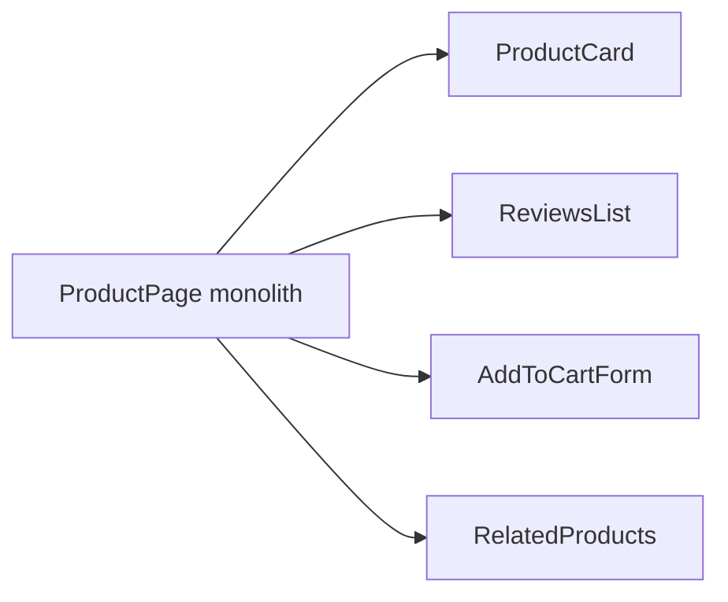

# Level 0: Component Decomposition

## Why break components apart?

A monolithic component of 300 lines is like a Swiss army knife: it does everything, but is convenient for nothing. Decomposition is the art of splitting a large component into small ones, each of which does one thing well.

## Single Responsibility Principle (SRP)

**Rule:** each component is responsible for one thing.

```tsx
// ❌ Monolith — does everything at once
function ProductPage() {
  const [product, setProduct] = useState(null)
  const [reviews, setReviews] = useState([])
  const [cart, setCart] = useState([])
  // 200 lines of JSX with product, reviews, form...
}

// ✅ Decomposition — each component knows its place
function ProductPage() {
  return (
    <div>
      <ProductCard product={product} />
      <ReviewsList reviews={reviews} />
      <AddToCartForm onAdd={handleAdd} />
      <RelatedProducts ids={product.relatedIds} />
    </div>
  )
}
```

## Smart vs Dumb components

| | Smart (Container) | Dumb (Presentational) |
|---|---|---|
| **Data** | Loads, stores state | Receives via props |
| **Logic** | Has it | Minimal or none |
| **Tests** | Harder | Easy |
| **Reusability** | Rarely | Often |

```tsx
// Smart — knows where to get data
function UserProfileContainer() {
  const [user, setUser] = useState<User | null>(null)
  useEffect(() => { fetchUser().then(setUser) }, [])
  if (!user) return <Spinner />
  return <UserProfileView user={user} />
}

// Dumb — just displays
function UserProfileView({ user }: { user: User }) {
  return <div>{user.name}</div>
}
```

## When to split?

- Component has grown beyond 100-150 lines
- Part of the component is needed elsewhere
- Hard to understand "what's going on here" at first glance
- You want to test logic separately from UI

## Mermaid: monolith → tree



## Common mistakes

- ⚠️ Splitting too fine: a `<UserName>` component for a single line of text
- ⚠️ Mixing data loading logic and rendering in the same component
- ⚠️ Passing the entire state object down instead of the needed props
