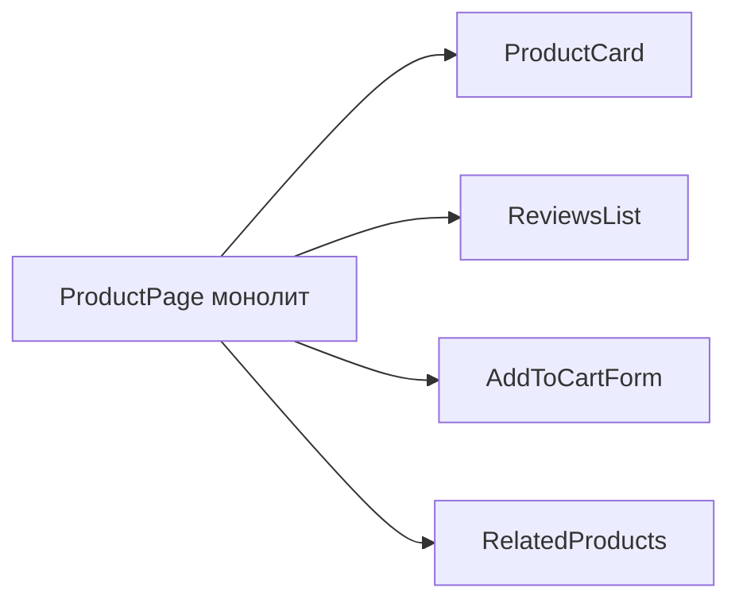

# Level 0: Декомпозиция компонентов

## Зачем разбивать компоненты?

Монолитный компонент на 300 строк — это как швейцарский нож: умеет всё, но удобен ни для чего. Декомпозиция — это искусство разбить большой компонент на маленькие, каждый из которых делает одно дело хорошо.

## Принцип единственной ответственности (SRP)

**Правило:** каждый компонент отвечает за одну вещь.

```tsx
// ❌ Монолит — делает всё сразу
function ProductPage() {
  const [product, setProduct] = useState(null)
  const [reviews, setReviews] = useState([])
  const [cart, setCart] = useState([])
  // 200 строк JSX с товаром, отзывами, формой...
}

// ✅ Декомпозиция — каждый компонент знает своё место
function ProductPage() {
  return (
    <div>
      <ProductCard product={product} />
      <ReviewsList reviews={reviews} />
      <AddToCartForm onAdd={handleAdd} />
      <RelatedProducts ids={product.relatedIds} />
    </div>
  )
}
```

## Smart vs Dumb компоненты

| | Smart (Container) | Dumb (Presentational) |
|---|---|---|
| **Данные** | Загружает, хранит state | Получает через props |
| **Логика** | Есть | Минимум или нет |
| **Тесты** | Сложнее | Легко |
| **Переиспользование** | Редко | Часто |

```tsx
// Smart — знает откуда брать данные
function UserProfileContainer() {
  const [user, setUser] = useState<User | null>(null)
  useEffect(() => { fetchUser().then(setUser) }, [])
  if (!user) return <Spinner />
  return <UserProfileView user={user} />
}

// Dumb — просто отображает
function UserProfileView({ user }: { user: User }) {
  return <div>{user.name}</div>
}
```

## Когда разбивать?

- Компонент стал длиннее 100-150 строк
- Часть компонента нужна в другом месте
- Сложно понять "что здесь происходит" с первого взгляда
- Хочется протестировать логику отдельно от UI

## Mermaid: монолит → дерево



## Типичные ошибки

- ⚠️ Дробить слишком мелко: компонент `<UserName>` для одной строки текста
- ⚠️ Смешивать логику загрузки данных и отображение в одном компоненте
- ⚠️ Передавать весь объект state вниз вместо нужных props
